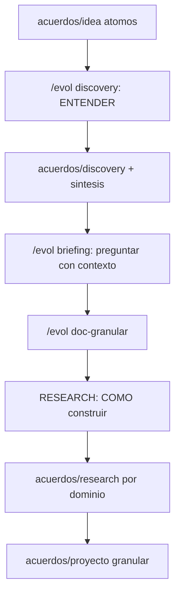

# /evol discovery — Research pre-briefing (entender la idea)

> Discovery es el PRIMER research del pipeline, distinto del research post-briefing.
> Discovery responde "que es esto, que hacen estos proyectos de referencia, como funcionan".
> El research (post-briefing, en doc-granular) responde "como construyo este dominio tecnico".
> El agente debe ENTENDER la idea antes de hacer el briefing. Sin atajos.

## 0. Pre-flight

1. Verificar que `acuerdos/idea/INDEX.md` existe (idea decantada por `/evol idea`).
2. Si falta: ABORT -> ejecutar `/evol idea` primero.
3. Leer `acuerdos/memoria/MEMORY.md` + lecciones (Art. 3).

## 1. INVESTIGAR CADA ATOMO DE IDEA

El agente lee `acuerdos/idea/INDEX.json` (ahorro de tokens) y, por cada atomo, despliega
investigacion. Reusa el pipeline worker-auditor de doc-granular (researcher -> fact-check ->
writer), en paralelo across atomos.

Por cada atomo `acuerdos/idea/<tema>.md`:

### PASO 1 — INVESTIGA (specialized-researcher)

```
Tarea: investigar el tema "<tema>" para ENTENDER que es y que aporta.
Contexto: acuerdos/idea/<tema>.md (preguntas a responder)
Fuentes: el link/URL del atomo + busqueda web del tema/proyecto
Output: acuerdos/discovery/<tema>/investigacion.md
  - Que es exactamente (definicion, proposito)
  - Como funciona (arquitectura, mecanismo)
  - Que aporta al proyecto (por que el usuario lo incluyo)
  - Riesgos, limitaciones, compatibilidad con el stack
  - Alternativas si las hay
  - Referencias (docs oficiales, repos, RFCs)
```

### PASO 2 — VALIDA CLAIMS (fact-check)

`/evol fact-check` sobre la investigacion. Claims FALSOS/ENGANOSOS se excluyen.
Output: `acuerdos/discovery/<tema>/investigacion-validada.md`

### PASO 3 — ESCRIBE (engineering-technical-writer)

Redactar `acuerdos/discovery/<tema>/investigacion.md` final con DOC_STANDARD (Mermaid si
hay arquitectura, tablas, 0 emojis). Generar `.json` sidecar con evol-doc-sync.

> **Regla de fuentes (DOC_STANDARD 1.7) — OBLIGATORIA:** todo claim producto de investigacion
> web lleva el link de su fuente, inline `[texto](https://url)` o en seccion **Fuentes** al pie.
> El sidecar captura las URLs en `fuentes[]`. El auditor RECHAZA un `investigacion.md` con
> claims sin fuente. Fuente con veredicto FALSO/ENGANOSO de `/evol fact-check` no se incorpora.

## 2. SINTESIS — entender la idea completa

Una vez investigados TODOS los atomos, generar `acuerdos/discovery/INDEX.md`:

```markdown
# INDEX — Discovery (entendimiento de la idea)

> Que entendio el agente de la solicitud completa, tras investigar cada tema.

## Resumen de la idea
<Que es el proyecto, sintetizado tras investigar todos los temas>

## Temas investigados

| Tema | Que es | Que aporta | Decision tecnica sugerida |
|------|--------|-----------|---------------------------|
| auth-oauth | OAuth 2.0 | autenticacion estandar | usar libreria X |
| proyecto-X | referencia de arquitectura | patron de plugins | adoptar patron Y |

## Decisiones tecnicas que sugiere el material
<Lo que la investigacion sugiere para el briefing — stack, patrones, integraciones>

## Preguntas abiertas para el briefing
<Lo que aun debe decidir el usuario en el briefing, con contexto ya investigado>
```

Generar `acuerdos/discovery/INDEX.json` con evol-doc-sync.

## 3. ORQUESTACION

```python
# evol-orchestrate.py parallel_then_sync
{
  "pattern": "parallel_then_sync",
  "parallel_tasks": [
    # Un grupo investiga por cada atomo de idea
    {"atom": "auth-oauth", "pipeline": ["researcher", "fact-check", "writer"]},
    {"atom": "proyecto-X", "pipeline": ["researcher", "fact-check", "writer"]}
  ],
  "sync_task": {"agent": "product-manager", "task": "sintesis INDEX.md de la idea entendida"}
}
```

## 4. GATE DE CIERRE

```
[ ] Cada atomo de idea tiene acuerdos/discovery/<tema>/investigacion.md
[ ] Cada investigacion paso fact-check
[ ] Cada doc tiene su .json sidecar
[ ] acuerdos/discovery/INDEX.md con sintesis + decisiones sugeridas + preguntas abiertas
[ ] El agente ENTIENDE la idea (sintesis completa)
```

Verificar:
```bash
python3 scripts/evol-discipline-check.py folder --kind generic --path acuerdos/discovery
```

## 5. POST — RECIEN AHORA el briefing

Con la idea entendida, el siguiente paso es preguntar CON contexto:

```
/evol briefing
```

El briefing lee `acuerdos/discovery/INDEX.md` y hace las 16 dimensiones con el contexto ya
investigado — las preguntas son mas precisas y el usuario decide informado.

---

## Flujo (discovery vs research)



Discovery (pre-briefing) = entender la idea. Research (post-briefing, en doc-granular) =
investigar como construir cada dominio. Dos research distintos, dos carpetas, dos momentos.

## Agentes

| Agente | Rol |
|--------|-----|
| `specialized-researcher` | Investiga cada atomo de idea |
| `fact-check` | Valida claims de la investigacion |
| `engineering-technical-writer` | Redacta la investigacion |
| `product-manager` | Sintetiza el entendimiento de la idea |
