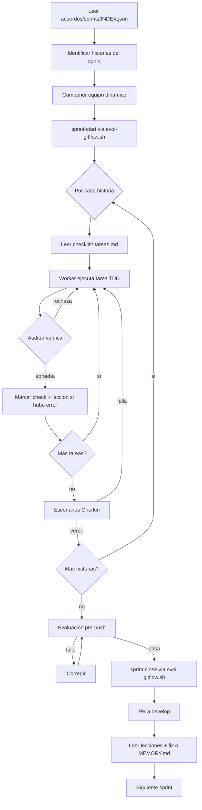

# /evol sprint — Ciclo completo de sprint

> **Patron worker → auditor:** Cada historia tiene equipo de implementacion (workers)
> + auditor permanente. El auditor marca checks, rechaza implementaciones incompletas
> e itera hasta cerrar. Errores → acuerdos/lecciones/sprint-NN.md automaticamente.

## 0. Pre-flight

1. Verificar que `acuerdos/sprints/INDEX.json` existe (fallback: acuerdos/sprint.md) (generado por `/evol historias`).
2. Si `--sprint=NN` no se pasa: tomar el primer sprint sin branch en git.
3. Verificar que sprint anterior esta mergeado en develop:
   ```bash
   bash scripts/evol-gitflow.sh sprint-start --sprint=NN --title=<titulo>
   ```
4. Leer `acuerdos/memoria/MEMORY.md` + `acuerdos/memoria/sprint-NN.md` anterior.

---

## 1. LECTURA DE LA HISTORIA

Por cada historia del sprint, leer:
- `acuerdos/historia-usuario-N/propuesta.md`
- `acuerdos/historia-usuario-N/requisitos-escenarios.md`
- `acuerdos/historia-usuario-N/escenario-tecnico.md`
- `acuerdos/historia-usuario-N/checklist-tareas.md`

---

## 2. COMPOSICION DEL EQUIPO DINAMICO

El agente analiza `escenario-tecnico.md` e identifica componentes:

| Componente detectado | Agente worker |
|---|---|
| Frontend / UI | `engineering-frontend-developer` |
| Backend / API | `engineering-backend-developer` |
| Base de datos | `engineering-database-architect` |
| Autenticacion | `engineering-security-engineer` |
| Infraestructura | `engineering-devops-engineer` |
| Integraciones externas | `engineering-api-designer` |
| Tests BDD | `testing-workflow-optimizer` |

**Fijos siempre:**
- `engineering-code-reviewer` — auditor permanente (NUNCA implementa)
- `engineering-qa-engineer` — evaluador pre-push

Registrar equipo en `acuerdos/memoria/sprint-NN.md`.

---

## 3. EJECUCION DEL CHECKLIST (TDD — tests primero)

**Orden estricto por tarea:**
1. Tests primero (Rojo)
2. Implementacion minima (Verde)
3. Refactor manteniendo verde

**Ciclo por tarea:**
```
Worker ejecuta tarea → Auditor verifica → Aprobada? → marcar [x]
                                         → Rechaza? → Worker corrige (max 3x)
```

Si el auditor encuentra error: registrar en `acuerdos/lecciones/sprint-NN.md`:

```markdown
### [CATEGORIA] Titulo — YYYY-MM-DD
**Contexto:** Historia HU-N, tarea X del checklist.
**Problema:** Que fallo.
**Causa raiz:** Por que el worker erro.
**Leccion:** Regla para evitar en proximas historias.
**Aplica a:** Ambito.
```

---

## 4. VERIFICACION DE ESCENARIOS GHERKIN

Ejecutar todos los escenarios de `requisitos-escenarios.md`.
Si algun escenario falla: corregir implementacion (no el test). Re-ejecutar hasta verde.

---

## 5. EVALUACION PRE-PUSH (engineering-qa-engineer)

```bash
python3 -m pytest -q                    # tests Python
bats tests/*.bats 2>/dev/null || true   # tests bash
python3 scripts/evol-shield.py audit --ci   # 0 CRITICAL obligatorio
bash scripts/evol-gitflow.sh pre-push   # gitignore + gitleaks
```

Si cualquier check falla: BLOQUEAR push. Worker corrige. Re-evaluar.

Reporte en `acuerdos/memoria/sprint-NN.md`:

```markdown
## Evaluacion Pre-Push

| Check | Resultado |
|-------|-----------|
| Tests | N passed |
| Shield | 0 CRITICAL |
| .gitignore | limpio |
| Timestamp | YYYY-MM-DD HH:MM UTC |
```

### 5.5 Evaluacion de desempeno de subagentes (ANTES del gitflow)

Antes de cerrar con GitFlow, evaluar el DESEMPENO de cada subagente del sprint. Detecta
trabajo incompleto, alucinaciones no capturadas, entregables de baja calidad. BLOQUEA el
gitflow si el score es bajo.

```bash
python3 scripts/evol-eval.py run subagent-performance
```

Rubrica por subagente (tareas completadas, audit pass-rate, iteraciones de rework desde
acuerdos/lecciones/sprint-NN.md). Escribir tabla en acuerdos/memoria/sprint-NN.md.

GATE: si score bajo umbral, o audit pass-rate < 70%, o tareas sin completar -> BLOQUEAR
gitflow. El sprint NO cierra hasta desempeno aceptable.

---

## 6. GITFLOW — CIERRE DEL SPRINT (solo si 5.5 paso)

```bash
bash scripts/evol-gitflow.sh sprint-close --sprint=NN
```

Gate de fase:
```bash
python3 scripts/evol-gate.py approve --phase build
```

---

## 7. POST-SPRINT — LECTURA DE LECCIONES

1. Leer `acuerdos/lecciones/sprint-NN.md`
2. Por cada leccion:
   - BUG: proponer fix como HT en proximo sprint
   - PROCESO: actualizar `acuerdos/memoria/MEMORY.md`
   - HERRAMIENTAS: proponer nueva skill en `skills/<name>/SKILL.md`
3. Preparar siguiente sprint:
   ```bash
   git checkout develop && git pull
   bash scripts/evol-gitflow.sh sprint-start --sprint=NN+1 --title=<titulo>
   ```

---

## 8. DIAGRAMA DEL CICLO



---

## Agentes del ciclo

| Agente | Rol | Permanente |
|--------|-----|-----------|
| Orquestador | Coordina el ciclo | Si |
| Workers especializados | Implementan segun componente | Por sprint |
| `engineering-code-reviewer` | Auditor — verifica checks | Si |
| `engineering-qa-engineer` | Evaluador pre-push | Si |
