# /fact-check — Verificación de claims

> **Estandar de documentacion:** Todo artefacto que produzca este workflow cumple
> [`docs/DOC_STANDARD.md`](../../docs/DOC_STANDARD.md): sin emojis, diagramas Mermaid
> obligatorios, tablas para datos estructurados, secciones mínimas y trazabilidad bidireccional.

## Propósito

Verificar claims externos (benchmarks, documentación de terceros, artículos técnicos,
propuestas, advisories de seguridad) antes de incorporarlos como verdad en el proyecto.

**Principio:** Una fuente no verificada es un riesgo de deuda técnica cognitiva. Especialmente
crítico cuando el claim afecta decisiones arquitectónicas, de seguridad o de producto.

## Cuándo invocar

- Antes de citar un benchmark externo en SPEC/PLAN
- Al evaluar un advisory de seguridad o CVE
- Cuando `/research` descubre fuentes que requieren validación
- Al comparar claims contradictorios entre dos fuentes
- Cuando se integra documentación de terceros al proyecto

## Modos de operación

| Modo | Input | Cuándo usar |
|------|-------|------------|
| `full` | Texto / URL / imagen | Verificación completa, 11 pasos |
| `compare` | Fuente A vs Fuente B | Comparación de dos fuentes contradictorias |
| `quick` | Pregunta sí/no | Verificación rápida de claim simple |
| `prebunk` | Topic query | Mapa de narrativas falsas activas sobre un tema |

```bash
# Activación explícita de modo
/fact-check --mode=quick "Node.js 20 es más rápido que Bun?"
/fact-check --mode=compare [URL-A] [URL-B]
/fact-check --mode=prebunk "React vs Signals performance"
/fact-check [texto/URL]   # default: full
```

## Procedimiento

### 0. Pre-flight
- Identifica el claim y el modo apropiado.
- Si el claim afecta una decisión de seguridad: escalar a `evol-sec`.
- Registra en `memoria.md` si el resultado afecta una decisión documentada.

### 1. Pipeline completo (modo `full`)

Aplicar `skill/evol-fact-check` — pipeline de 11 pasos:

```mermaid
graph LR
    A[Claim] --> B[1. Descomposición]
    B --> C[2. SIFT sources]
    C --> D[3. Lateral Reading]
    D --> E[4. Origin trace]
    E --> F[5. Red flags]
    F --> G[6. Veredicto + MFS]
    G --> H[7. Confianza]
    H --> I[8. Razonamiento]
    I --> J[9. Contrafactual]
    J --> K[10. Educativo]
    K --> L[11. Report]
```



**Tipos de claim** (descomposición inicial):
- `F` Factual | `O` Opinión | `P` Predicción | `U` Unverifiable | `I` Implicación | `S` Estadística

**Escala de veredicto:**
`CONFIRMADO` → `MAYORMENTE VERDADERO` → `MIXTO` → `NO VERIFICADO` → `ENGAÑOSO` → `FALSO`

**MFS Score:** `(CFS × 0.50) + (MTS × 0.30) + (SCD × 0.20)` donde 0-3 = bajo, 7-10 = crítico.

### 2. Modo `quick` (4 pasos)

Para claims simples con tiempo limitado:
1. Identificar 1 claim verificable.
2. Buscar fuente Tier 1-3 que confirme o refute.
3. Asignar veredicto.
4. Output: 3 líneas (claim / veredicto / fuente).

### 3. Modo `compare`

```markdown
## Comparación de fuentes
| Criterio | Fuente A | Fuente B |
|----------|---------|---------|
| Tier | X | Y |
| Afirma | ... | ... |
| Evidencia | ... | ... |
| Conclusión | ... | ... |
**Fuente más confiable:** A/B — por qué
```

### 4. Output — Fact-Check Report

```markdown
# Fact-Check Report — <claim resumido>
**Fecha:** <ISO date> | **Veredicto:** <VEREDICTO> | **MFS:** <score>/10

## Claim analizado
<claim literal>

## Fuentes consultadas
| Fuente | Tier | CRAAP Score | Dice |

## Red flags detectados
<código> — <descripción>

## Razonamiento
<cadena lógica paso a paso>

## Contrafactual
<qué necesitaría ser verdad para que el claim sea correcto>

## Educativo
<cómo reconocer esta técnica / cómo verificar este tipo de claim>

## Confianza en el veredicto: <Alta/Media/Baja>
<factores que aumentan/disminuyen la confianza>
```

## Integración con otros workflows

- **Invocado desde `/research`** para validar fuentes externas antes de proponer.
- **Invocado desde `/cross-validate`** para confrontar claims entre artefactos del proyecto.
- **Invocado desde `/security-audit`** para verificar CVEs y security advisories.
- **Invocado desde `/analisis-impacto`** cuando hay decisiones basadas en benchmarks externos.
- **Invoca `/adr-new`** si el resultado invalida una decisión arquitectónica existente.

## Agentes delegados

| Agente | Rol |
|--------|-----|
| `evol-researcher` | Investigación de fuentes y lateral reading |
| `evol-qa` | Verificación de claims sobre comportamiento de modelos AI |
| `evol-doc` | Validación de afirmaciones en documentación técnica |
| `evol-sec` | Claims de seguridad, CVEs, advisories (escalado automático) |

## POST-FLIGHT
- Si veredicto es FALSO/ENGAÑOSO y el claim estaba en un artefacto del proyecto: marcar para corrección.
- Si MFS > 7: escalar y registrar en `lecciones.md` como fuente no confiable.
- Registrar resultado en `memoria.md` si afecta decisión documentada.
