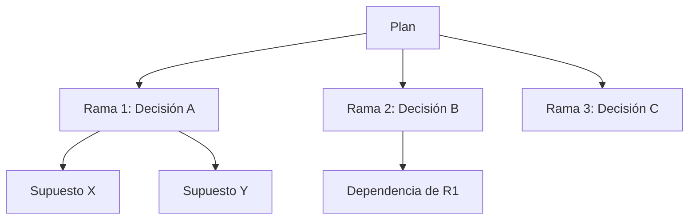

# /grill-me — Interrogatorio técnico implacable

> **Estandar de documentacion:** Todo artefacto que produzca este workflow cumple
> [`docs/DOC_STANDARD.md`](../../docs/DOC_STANDARD.md): sin emojis, diagramas Mermaid
> obligatorios, tablas para datos estructurados, secciones mínimas y trazabilidad bidireccional.

## Propósito

Someter cualquier plan, diseño o decisión técnica a interrogatorio sistemático
hasta que no queden supuestos sin validar ni dependencias sin resolver.

**Principio:** Un plan no interrogado es un riesgo oculto. "Ambigüedad Cero" (Art. 1) aplicado
no solo a artefactos escritos sino al razonamiento detrás de decisiones.

**Diferencia con `/clarify`:** `/clarify` detecta ambigüedad en artefactos existentes.
`/grill-me` interroga activamente el razonamiento, explorando ramas del árbol de decisiones
que no están escritas en ningún documento.

## Cuándo invocar

- Pre-gate de cualquier fase: antes de comprometer recursos en una dirección
- Post-`/brainstorm`: para converger una idea explorada sin decidir
- Pre-ADR: antes de firmar una decisión arquitectónica
- Pre-Sprint: antes de comprometer al equipo con un plan de implementación
- Cuando el orquestador detecta que un plan tiene supuestos implícitos no declarados

## Procedimiento

### 0. Pre-flight
- Carga contexto: `memoria.md`, artefacto objetivo (SPEC/PLAN/ADR), codebase si hay referencias de código.
- Registra inicio en `memoria.md` (Art. 4 Constitución).

### 1. Mapeo del árbol
Identifica las ramas principales de decisión del plan (máx 5 por nivel).
Detecta dependencias entre ramas: ¿qué debe resolverse primero?



### 2. Interrogatorio sistemático

Aplicar `skill/evol-grill-me`:
- **Una pregunta a la vez.** Nunca bundle.
- **Recomendar respuesta** antes de esperar la del usuario.
- **Explorar codebase** si la respuesta puede derivarse de él.
- **No aceptar "depende"** sin especificar de qué depende exactamente.

Formato de cada pregunta:
```
[Rama: <nombre>]
Pregunta: <pregunta específica y accionable>
Mi respuesta recomendada: <respuesta con razonamiento breve>
Tu respuesta:
```

Áreas cubierta obligatoriamente:

| Área | Preguntas clave |
|------|----------------|
| Supuestos | ¿Qué asumimos que es verdad? ¿Qué pasa si es falso? |
| Dependencias | ¿Qué debe existir antes de que esto funcione? |
| Casos borde | ¿Qué pasa con X=0, concurrencia, fallo parcial? |
| Escalabilidad | ¿Funciona con 10x la carga? ¿Y con 0.1x? |
| Reversibilidad | ¿Qué tan difícil es deshacer esta decisión? |
| Alternativas | ¿Por qué esta opción y no Y o Z? |
| Métricas | ¿Cómo sabemos que funcionó? |

### 3. Síntesis (al agotar el árbol)

Producir resumen con:
- Supuestos validados (lista)
- Supuestos aún en riesgo (lista)
- Camino crítico de dependencias
- Decisiones tomadas durante el interrogatorio

### 4. Output opcional

Si el usuario lo solicita, generar `GRILL_REPORT.md`:

```markdown
# Grill Report — <plan/decisión>
**Fecha:** <ISO date> | **Ramas exploradas:** N | **Supuestos validados:** N

## Plan interrogado
<resumen del plan original>

## Árbol de decisiones explorado
<mermaid diagram>

## Supuestos validados
- [x] <supuesto> — Validado por: <razón>

## Riesgos residuales
- [ ] <supuesto sin validar> — Mitigación propuesta: <X>

## Decisiones tomadas
| Rama | Decisión | Razonamiento |
```

## Integración con otros workflows

- **Invocado desde `/clarify`** cuando detecta plan sin stress-test previo.
- **Invocado desde `/brainstorm`** al cerrar sesión divergente (convergencia).
- **Invocado desde `/project-architecture-gsd`** en fase de diseño.
- **Invocado desde `/plan-fases`** antes de aprobación HMAC del plan.
- **Invoca `/adr-new`** si el interrogatorio produce una decisión arquitectónica nueva.

## Agentes delegados

| Agente | Rol |
|--------|-----|
| `evol-researcher` | Interroga supuestos de investigación y fuentes externas |
| `evol-pm` | Stress-test de features y prioridades de producto |
| `evol-architect` | Valida decisiones arquitectónicas y de diseño técnico |

## POST-FLIGHT
- Registra resultado (supuestos validados, riesgos) en `memoria.md`.
- Si se generó GRILL_REPORT.md, indexar con MemPalace.
- **Si se interrogó un PLAN.md (Fase 3):** ejecutar `evol-gate grill-done` para
  registrar que el plan fue interrogado. Esto **libera el gate del plan** — sin este
  marker, `evol-gate approve --phase plan` queda BLOQUEADO (enforced). El marker
  guarda el SHA-256 del PLAN.md; si el plan se edita después, hay que re-interrogar.

## Enforcement (gate del plan)

El gate de Fase 3 es **enforced**: `evol-gate approve --phase plan` y cualquier
`transition` que toque `plan` fallan (exit 1) si no existe `.evol/.grill-done-plan`
con el SHA del PLAN.md actual. Un plan no interrogado NO se firma.

- Liberar el gate: `evol-gate grill-done` (lo hace este workflow al completar).
- Override explícito (no recomendado): `EVOL_SKIP_GRILL=1 evol-gate approve --phase plan`.
- Si PLAN.md cambia tras el grill: el SHA deja de coincidir → re-correr `/evol grill-me`.
