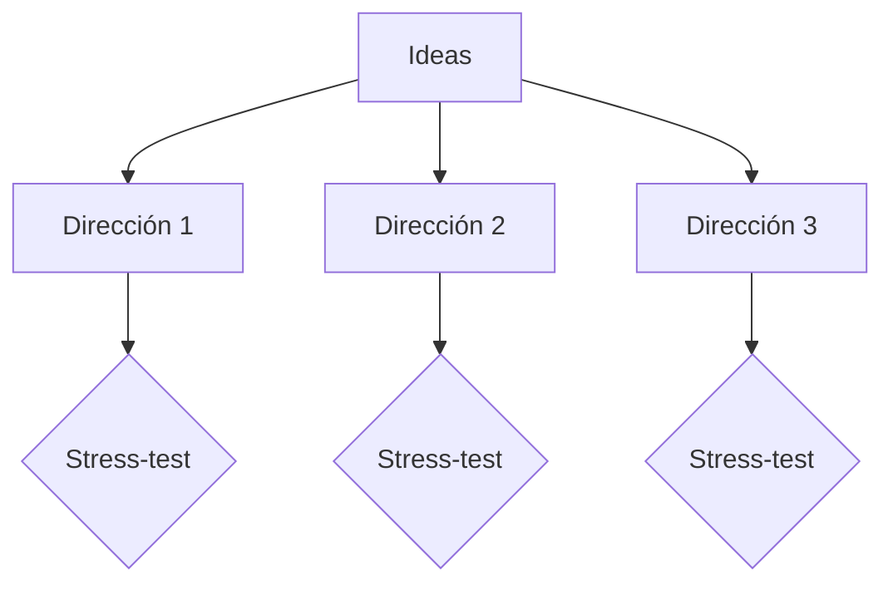

# /idea-refine — Refinar ideas brutas

> **Estandar de documentacion:** Todo artefacto que produzca este workflow cumple
> [`docs/DOC_STANDARD.md`](../../docs/DOC_STANDARD.md): sin emojis, diagramas Mermaid
> obligatorios, tablas para datos estructurados, secciones mínimas y trazabilidad bidireccional.

## Propósito

Cerrar el loop de `/brainstorm`. Donde brainstorm genera sin filtrar,
`/idea-refine` converge hacia una dirección accionable haciendo los trade-offs
explícitos antes de invertir en spec.

**Principio:** La lista "No Hacemos" es tan valiosa como la dirección elegida.
Trade-offs implícitos son deuda cognitiva que se paga con retrabajo.

## Cuándo invocar

- Post-`/brainstorm`: cuando ya hay ideas exploradas y necesitas converger
- Post-`/ux-discovery`: cuando tienes problema validado pero idea aún vaga
- Pre-`/fase-requisitos`: para clarificar scope antes de entrar a spec completa
- Cuando el equipo tiene "una idea" pero no consenso sobre qué significa exactamente

## Procedimiento

### 0. Pre-flight
- Carga `memoria.md` y `lecciones.md`.
- Si existe `BRAINSTORM_<ts>.md`: cargarlo como input (ideas ya exploradas).
- Si existe `DISCOVERY.md`: cargarlo como contexto del problema.
- Si hay codebase relevante: explorar con Glob/Grep/Read antes de preguntar.

### 1. Fase 1 — Entender y Expandir (Divergente)

**1.1 Reformulación HMW**
```
"¿Cómo podríamos [acción] para [persona] de manera que [resultado]?"
```

**1.2 Preguntas de enfoque** (máx 5, una a la vez):
1. ¿Para quién específicamente es esto?
2. ¿Qué es éxito concreto y medible?
3. ¿Cuáles son las restricciones no negociables?
4. ¿Qué se ha intentado? ¿Por qué no funcionó?
5. ¿Por qué ahora?

**1.3 Variaciones con 7 lentes** (5-8 ideas consideradas):

| Lente | Pregunta |
|-------|---------|
| Inversión | ¿Qué pasa si hacemos lo opuesto? |
| Sin restricciones | Sin límites técnicos/presupuesto, ¿cómo sería? |
| Cambio de audiencia | ¿Y si es para un usuario completamente diferente? |
| Combinación | ¿Con qué otra herramienta/concepto se combina? |
| Simplificación | ¿Cuál es la versión más simple que funciona? |
| 10x | ¿Cómo sería 10x más impactante? |
| Experto | ¿Cómo lo haría el mejor experto en este dominio? |

### 2. Fase 2 — Evaluar y Converger

**2.1 Clustering**
Agrupar variaciones en 2-3 direcciones distintas. Cada dirección debe ser genuinamente diferente.



**2.2 Stress-test por dirección**

| Criterio | Pregunta |
|----------|---------|
| Valor usuario | ¿Painkiller o vitamina? ¿Cuánto dolor alivia realmente? |
| Factibilidad | ¿Costo técnico y de recursos? ¿Qué dependencias existen? |
| Diferenciación | ¿Genuinamente diferente o variación de algo ya existente? |

**2.3 Supuestos ocultos** (obligatorio para dirección favorita):
- ¿Qué estamos apostando que es verdad?
- ¿Qué podría matar esto?
- ¿Qué estamos eligiendo ignorar conscientemente?

### 3. Fase 3 — Afilar y Entregar

Producir **one-pager** en formato fijo:

```markdown
# Idea Refinement — <título>
**Fecha:** <ISO date> | **Estado:** DRAFT

## Problema
<HMW statement + 1 párrafo de contexto del problema>

## Dirección recomendada
<qué hacemos y por qué esta dirección sobre las otras>

## Supuestos a validar
- [ ] <supuesto 1> — Método: <cómo validar>
- [ ] <supuesto 2> — Método: <cómo validar>
- [ ] <supuesto 3> — Método: <cómo validar>

## MVP scope
<mínimo que valida la hipótesis central>

## No hacemos (y por qué)
| Qué | Por qué no |
|-----|-----------|
| <feature tentador> | <trade-off explícito> |
| <otra cosa> | <razón honesta, no vaga> |

## Próximos pasos
1. <acción concreta: validar supuesto X con método Y>
2. <acción concreta: quién hace qué>
```

### 4. Almacenamiento

Ofrecer guardar en `docs/ideas/<idea-slug>.md`.
Si el usuario aprueba: escribir archivo + indexar con MemPalace.

## Integración con otros workflows

- **Invocado desde `/brainstorm`** al cerrar sesión divergente.
- **Invocado desde `/ux-discovery`** como paso de convergencia post-discovery.
- **Invocado desde `/fase-requisitos`** cuando features tienen scope ambiguo.
- **Invoca `/clarify`** si al refinar se detectan ambigüedades críticas (Art. 1).
- **Invoca `/grill-me`** si la dirección recomendada necesita stress-test profundo.
- **Alimenta `/project-architecture-gsd`** con one-pager como input de spec.

## Agentes delegados

| Agente | Rol |
|--------|-----|
| `evol-pm` | Refina features y prioridades, stress-test de valor usuario |
| `evol-ux` | Procesa feedback de usuarios en ideas refinadas |
| `evol-architect` | Evalúa factibilidad técnica de cada dirección |

## POST-FLIGHT
- Si se guardó one-pager: indexar en MemPalace y anotar en `memoria.md`.
- Si se descartaron direcciones con razones sólidas: anotar en `lecciones.md`.
