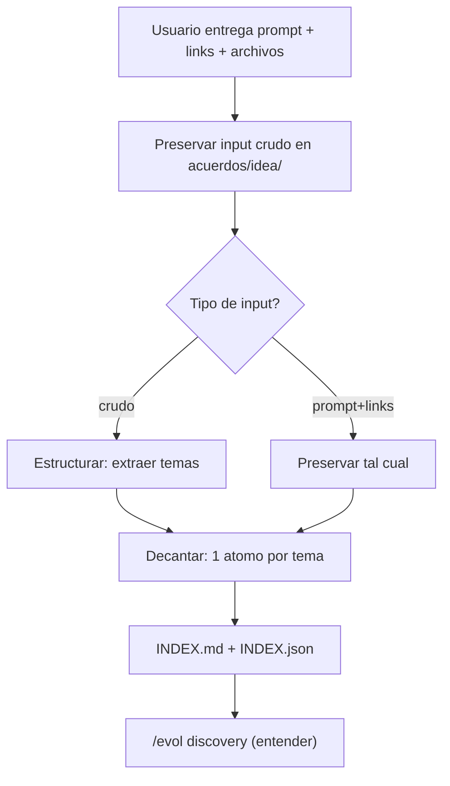

# /evol idea — Decantado de la idea en artefactos atomicos

> El input del usuario (prompt + links + archivos) es el puntapie del pipeline. El agente
> NO inventa: cita la solicitud, preserva lo entregado, y decanta en atomos por tema. Un
> atomo por cada cosa que haya que investigar en discovery.

## 0. Pre-flight

1. Verificar que `/evol setup-repo` se ejecuto (repo configurado).
2. Asegurar que `acuerdos/idea/` existe (evol-init lo crea).

## 1. RECIBIR Y PRESERVAR EL INPUT

El agente recibe lo que el usuario entrego: prompt, links, archivos adjuntos.

- **Guardar el input crudo tal cual** en `acuerdos/idea/`. Si el usuario entrego un archivo,
  copiarlo sin reescribir (ej: `acuerdos/idea/solicitud-original.md`).
- **Citar la solicitud del usuario** textualmente — siempre se arranca citando lo que pidio.

## 2. DECANTADO ADAPTATIVO

El agente detecta el tipo de input y actua en consecuencia:

| Input del usuario | Accion del agente |
|-------------------|-------------------|
| Idea cruda (sin estructura) | Estructura: extrae temas, proyectos, mejoras implicitas |
| Prompt + links ya estructurados | Preserva tal cual; NO reescribe ni inventa un idea.md artificial |
| Archivo de especificacion | Lo guarda + extrae los temas a investigar |

**Regla:** el agente nunca genera un `idea.md` monolitico forzado. Si el usuario ya dio el
prompt y los links, esos SON la idea — el agente solo los organiza en atomos.

## 3. DECANTAR EN ATOMOS

Por cada tema, proyecto, libreria, link o mejora mencionado en la solicitud, generar un
atomo `acuerdos/idea/<tema-slug>.md`:

```markdown
# <Tema>

> Atomo de idea. Que es y por que se incluye. NO mezcla con otros temas.

## Que es
<Descripcion del tema/proyecto/mejora segun la solicitud>

## Fuente
<Link/URL entregado por el usuario, o "extraido de la solicitud">

## Por que se incluye
<Que aporta al proyecto segun lo que pidio el usuario>

## Preguntas a responder en discovery
- <Que debe entender el agente sobre esto antes del briefing>
- <Riesgos, compatibilidad, como funciona>

## Artefacto esperado
acuerdos/discovery/<tema-slug>/investigacion.md
```

**1 atomo por tema.** Si la solicitud menciona 5 proyectos de referencia, son 5 atomos. Sin
mezclar (atomicidad). Cada atomo apunta al artefacto de discovery que lo investigara.

## 4. INDICE

Generar `acuerdos/idea/INDEX.md` + `INDEX.json` (sidecar, ahorro de tokens):

```markdown
# INDEX — Idea decantada

> Solicitud del usuario decantada en N atomos. Cada uno dispara una investigacion en discovery.

| Atomo | Tema | Fuente | Artefacto discovery |
|-------|------|--------|---------------------|
| auth-oauth | OAuth 2.0 | link entregado | discovery/auth-oauth/ |
| proyecto-X | Proyecto de referencia X | github.com/... | discovery/proyecto-X/ |
```

Generar el JSON con `evol-doc-sync.py sync-folder acuerdos/idea`.

## 5. GATE DE CIERRE

```
[ ] Input crudo del usuario preservado en acuerdos/idea/
[ ] Solicitud citada textualmente
[ ] 1 atomo por tema/proyecto/link (sin mezclar)
[ ] INDEX.md + INDEX.json generados
[ ] Cada atomo apunta a su artefacto de discovery
```

## 6. POST — siguiente paso

Con la idea decantada, el siguiente paso es ENTENDERLA:

```
/evol discovery
```

Discovery investiga cada atomo de idea para que el agente entienda la solicitud ANTES de
hacer el briefing.

---

## Flujo



## Agentes

| Agente | Rol |
|--------|-----|
| Orquestador | Decanta la idea en atomos |
| `product-manager` | Identifica temas/proyectos implicitos en idea cruda |
