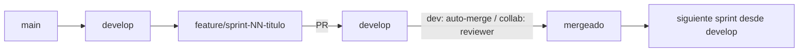

# /evol setup-repo — Configuracion inicial del repositorio

> El paso 0 del pipeline. ANTES del briefing. El agente pregunta UNA cosa a la vez,
> espera respuesta, nunca asume. Configura GitFlow segun las respuestas.

## 0. Pre-flight

1. Verificar que estamos en un repositorio git (`git rev-parse --git-dir`). Si no,
   ejecutar `evol-init.sh` primero o `git init`.

## 1. PREGUNTA A — Ubicacion del repositorio

El agente pregunta (una a la vez):

> Para el repositorio del proyecto, cual prefieres?
> 1. Tengo un repositorio existente (dame la URL)
> 2. Crear uno nuevo en GitHub de forma autonoma (requiere gh CLI autenticado)
> 3. Solo local — sin remoto por ahora

Segun la respuesta:

| Respuesta | Accion |
|-----------|--------|
| 1. Existente | Pedir URL. Correr `evol-gitflow.sh setup --mode=<X> --remote=<URL>` |
| 2. Crear nube | Pedir nombre (default: dir actual) + visibilidad (default private). Correr `evol-gitflow.sh setup --mode=<X> --create --name=<N> --visibility=<private\|public>` |
| 3. Local | Correr `evol-gitflow.sh setup --mode=<X> --local` |

Para crear en nube: el agente confirma con el usuario el nombre y la visibilidad ANTES
de ejecutar `gh repo create` (crea un repo real en su cuenta). Default private para no
exponer codigo accidentalmente (ADR-0003).

## 2. PREGUNTA B — Modo de trabajo

> El desarrollo es solo tu (dev-solo) o colaborativo (equipo)?
> 1. Dev-solo: PRs se auto-aceptan para mantener trazabilidad del codigo
> 2. Colaborativo: cada PR requiere autorizacion de un miembro del equipo

| Respuesta | mode | Comportamiento |
|-----------|------|----------------|
| 1. Dev-solo | `dev` | PR auto-merge via gh cli. Branch feature/fix desde develop, push a develop, PR auto-aceptada |
| 2. Colaborativo | `collab` | PR creada pero requiere 1 reviewer. CODEOWNERS si hay roles |

## 3. EJECUCION

Con A y B resueltos, correr el comando completo. Ejemplo:

```bash
# Crear en nube, dev-solo, privado
bash scripts/evol-gitflow.sh setup --mode=dev --create --name=mi-proyecto --visibility=private

# Existente, colaborativo
bash scripts/evol-gitflow.sh setup --mode=collab --remote=https://github.com/org/repo

# Solo local, dev-solo
bash scripts/evol-gitflow.sh setup --mode=dev --local
```

Esto crea: branches main + develop, configura el remoto (o marca local), guarda el modo
en `.evol/gitflow.mode` y el remote-mode en `.evol/gitflow.remote`, y asegura los patrones
Evol-DD en `.gitignore`.

## 4. FLUJO GITFLOW RESULTANTE



Cada sprint = 1 branch nueva. Antes del siguiente sprint, sprint-start verifica que la
PR anterior este mergeada a develop. En local-only no hay push ni PR (todo local).

## 5. DOCUMENTAR HERRAMIENTAS DE SEGURIDAD (antes de instalar nada)

Tras configurar el repo, documentar TODO el arsenal de seguridad en el README ANTES de
que el usuario instale nada. Asi sabe que se usara y que debe instalar para cobertura
completa:

```bash
python3 scripts/evol-security-inventory.py readme --write README.md
```

Esto añade/actualiza la seccion "## Herramientas de Seguridad" con: nativas (sin instalar),
externas (estado instalado/faltante + comando de instalacion), y el mapeo
componente -> herramientas. El usuario decide que externas instalar.

## 6. POST — continuar al briefing

Configurado el repo y documentadas las herramientas, el siguiente paso es:

```
/evol briefing
```

El briefing arranca con `acuerdos/idea/idea.md` (el puntapie con prompt de investigacion).

---

## Comandos

| Comando | Efecto |
|---------|--------|
| `evol-gitflow.sh setup --mode=dev --create --name=N` | Crea repo nube + dev-solo |
| `evol-gitflow.sh setup --mode=collab --remote=URL` | Conecta existente + colaborativo |
| `evol-gitflow.sh setup --mode=dev --local` | Solo local + dev-solo |
| `evol-gitflow.sh status` | Estado actual (modo, branch, gitignore) |
