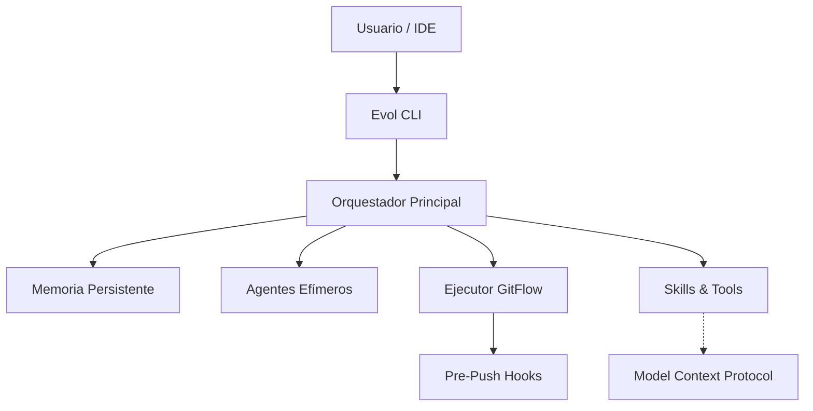

<div align="center">
  <h1>Evol-DD</h1>
  <p><b>El framework de desarrollo agéntico que aprende con cada proyecto que construye.</b></p>

  <p>
    
    
    
    
  </p>
</div>

<br/>

Evol-DD elimina los servidores permanentes, reemplazándolos con memoria nativa, lecciones evolutivas, y skills que escalan automáticamente en tus IDEs favoritos. A diferencia de los frameworks tradicionales, Evol-DD **no olvida** su contexto anterior y se ejecuta de forma completamente local usando el Model Context Protocol (MCP).

---

## ❖ Por qué Evol-DD

La mayoría de frameworks de IA tienen más de 180 agentes permanentes en disco, dependen de infraestructura compleja y repiten los mismos errores proyecto tras proyecto.

<table>
  <thead>
    <tr>
      <th>Problema Común</th>
      <th>Solución Evol-DD</th>
    </tr>
  </thead>
  <tbody>
    <tr>
      <td>► Agentes infinitos y pesados</td>
      <td><b>16 agentes core</b> + efímeros bajo demanda (crea, usa, destruye).</td>
    </tr>
    <tr>
      <td>► Amnesia entre sesiones</td>
      <td><b>Memoria Nativa</b> con journals diarios (<code>AGENT_MEMORY.md</code>).</td>
    </tr>
    <tr>
      <td>► Errores repetitivos</td>
      <td><b>Motor de Lecciones</b> con ciclo de mejora continua en cada Sprint.</td>
    </tr>
    <tr>
      <td>► Extensibilidad limitada</td>
      <td><b>Loop iterativo</b> de creación de skills portables a 7 IDEs.</td>
    </tr>
  </tbody>
</table>

---

## ❖ El Ecosistema "Aha! Moments"

### 1. Memoria que Persiste
El agente recuerda lo que hiciste la semana pasada, sin necesidad de repetir contexto. La memoria vive en tu propio repositorio, transparente y editable.

```bash
# Buscar en el historial de sesiones pasadas:
python3 scripts/evol-memory.py search "decision sobre base de datos"
```

### 2. Lecciones que se Acumulan
Cada error se convierte en regla. Cada regla evita que tú o el agente vuelvan a cometer la misma falla técnica.

```bash
# Registrar una lección tras resolver un bug de seguridad
python3 scripts/evol-lessons.py add \
  --titulo "Gate key comprometida afecta proyectos" \
  --categoria SEGURIDAD \
  --leccion "Gate key debe ser por proyecto"

# Consultar antes de decidir:
python3 scripts/evol-lessons.py search "seguridad autenticacion"
```

### 3. Agentes Precisos y Efímeros
¿Necesitas revisar un contrato SaaS? Crea el agente, úsalo, y retíralo. El conocimiento queda en la Memoria Persistente y el agente se archiva criptográficamente.

```bash
# Crear agente especializado
python3 scripts/evol-agent-lifecycle.py create \
  --name "legal-saas-reviewer" \
  --task "Revisar contratos SaaS con cliente enterprise" \
  --expires-after 7

# Retirarlo al finalizar
python3 scripts/evol-agent-lifecycle.py retire "legal-saas-reviewer"
```

### 4. Skills que Crecen Contigo
Una skill creada hoy estará disponible inmediatamente en Claude Code, Cursor, Windsurf, OpenCode, Antigravity, VSCode Copilot y Codex.

```bash
# Portar tus skills a los 7 IDEs con un solo comando
bash scripts/evol-adapt.sh all --dest=. --trigger=evol
```

---

## ❖ Instalación Rápida

Requiere **Python 3.10+** y `pipx`.

```bash
# 1. Instalación global (disponible en todos los IDEs automáticamente)
pipx install evol-dd && evol

# 2. Iniciar un proyecto con el perfil "core"
evol init /path/to/project --profile core

# 3. Diagnóstico de tu entorno
evol doctor
```

---

## ❖ Arquitectura C4



---

## ❖ Documentación y Ecosistema (FAQ)

<details>
<summary><b>► ¿En qué IDEs está disponible y cómo lo invoco?</b></summary>
<br>
<ul>
  <li><b>Claude Code / OpenCode:</b> <code>/evol</code> en el chat.</li>
  <li><b>Cursor:</b> <code>@evol</code> mention.</li>
  <li><b>Windsurf:</b> <code>/evol</code> slash nativo.</li>
  <li><b>Antigravity / Codex:</b> Como skill de sistema.</li>
  <li><b>VSCode Copilot:</b> Vía tasks globales <code>Ctrl+Shift+P</code> -> <b>Run Task</b>.</li>
</ul>
</details>

<details>
<summary><b>► ¿Cómo actualizo el framework?</b></summary>
<br>
Ejecuta <code>pipx upgrade evol-dd && evol</code>. Esto actualizará el CLI e instalará las nuevas skills y componentes en todos tus IDEs.
</details>

<details>
<summary><b>► Documentación Completa</b></summary>
<br>
<ul>
  <li><a href="docs/constitucion.md">Constitución de Evol-DD</a> - Reglas fundamentales</li>
  <li><a href="AGENTS.md">Lista de Agentes</a> - Los 16 agentes core</li>
  <li><a href="docs/arquitectura/ARQUITECTURA.md">Arquitectura C4</a> - Diseño técnico</li>
  <li><a href="docs/guias/ONBOARDING.md">Onboarding</a> - Guía detallada</li>
</ul>
</details>

---

## ❖ Contribución y Comunidad
Las contribuciones son clave para la evolución de este marco. Al hacer un PR, asegúrate de utilizar nuestro GitFlow nativo. Nuestro `pre-push` se encargará de verificar leaks de seguridad y el cumplimiento estricto del estándar de documentación Top 100.

## ❖ Licencia
Distribuido bajo la Licencia MIT. Ver el archivo [LICENSE](LICENSE) para más detalles.
