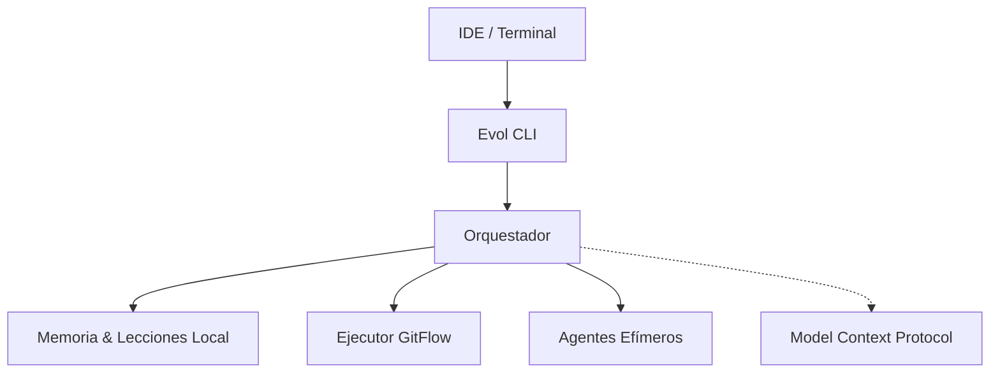

<div align="center">
  <h1>Evol-DD</h1>
  <p><b>El framework de desarrollo agéntico que aprende con cada proyecto que construye.</b></p>
  
  <p>
    
    
    
    
  </p>
</div>

<br/>

Evol-DD elimina los servidores permanentes mediante **Model Context Protocol (MCP)** y memoria local. Está diseñado para equipos que necesitan agentes que recuerden el contexto entre sesiones, conviertan errores en lecciones arquitectónicas y corran nativamente dentro del IDE sin depender de plataformas cerradas.

---

## ❖ Por qué Evol-DD

La mayoría de frameworks de IA tienen más de 180 agentes permanentes en disco, dependen de infraestructura compleja y repiten los mismos errores proyecto tras proyecto.

<table>
  <thead>
    <tr>
      <th>Problema Común</th>
      <th>Solución Evol-DD</th>
    </tr>
  </thead>
  <tbody>
    <tr>
      <td>► Agentes infinitos y pesados</td>
      <td><b>16 Core</b> + Agentes Efímeros bajo demanda.</td>
    </tr>
    <tr>
      <td>► Amnesia de sesión a sesión</td>
      <td><b>Memoria Nativa</b> serializada en <code>AGENT_MEMORY.md</code>.</td>
    </tr>
    <tr>
      <td>► Mismos errores recurrentes</td>
      <td><b>Motor de Lecciones</b> integrado al flujo CI/CD.</td>
    </tr>
    <tr>
      <td>► Cerrado a una plataforma</td>
      <td><b>100% Portable</b> (Cursor, Windsurf, Claude Code, Copilot).</td>
    </tr>
  </tbody>
</table>

---

## ❖ Ecosistema Core

### 1. Memory Architecture v2.0
Multi-layer memory system with verbatim storage, hybrid retrieval, and temporal validity.

```bash
# Index memories with verbatim storage
python3 scripts/evol-memory.py index --add "decisión arquitectónica sobre la BD"

# Hybrid search (vector + BM25 + graph)
python3 scripts/evol-memory.py search "decisión arquitectónica sobre la BD"

# Verify memory integrity
python3 scripts/evol-memory.py edms-verify

# Check for contradictions
python3 scripts/evol-compliance.py check-contradictions
```

**Features:**
- Verbatim storage (append-only, SHA-256 dedup)
- Hybrid retrieval (BM25 + vector + graph, RRF fusion)
- Temporal validity windows (valid_from/valid_to)
- Evidence contracts for all results
- Reflection, dreaming, and forgetting engines
- Zero external dependencies (stdlib-only core)

### 2. Motor de Lecciones
Automatiza que el agente nunca repita el mismo error técnico.

```bash
python3 scripts/evol-lessons.py add --categoria SEGURIDAD --leccion "Gate key aislada por proyecto"
```

### 3. Agentes Efímeros Criptográficos
Levanta un especialista para un ticket y retíralo (hash SHA-256) cuando acabe.

```bash
python3 scripts/evol-agent-lifecycle.py create --name "auditor-sec" --expires-after 1
```

---

## ❖ Instalación y Desinstalación

Requiere **Python 3.10+** y `pipx`.

### Instalación Rápida
```bash
# 1. Instalación Global (disponible en todos los IDEs vía pipx)
pipx install evol-dd && evol

# 2. Inicializar tu repositorio
evol init . --profile core
```

### Desinstalación
Si deseas retirar Evol-DD de tu sistema y de tus IDEs:
```bash
# Elimina el paquete global
pipx uninstall evol-dd

# Eliminar skills e integraciones locales de tus IDEs
rm -rf ~/.claude/commands/evol*
rm -rf ~/.gemini/skills/evol*
```
*(Nota: Tus datos de memoria y lecciones en los repositorios locales no se borran, ya que pertenecen a tu código fuente).*

---

## ❖ Code Graph Indexer

Evol-DD includes a **Tree-sitter-based code graph indexer** for impact analysis, process tracing, and incremental git-based updates.

```bash
# Full project index
python3 scripts/evol_code_indexer.py index

# Impact analysis
python3 scripts/evol_code_indexer.py impact MemoryStore --depth=3

# Process tracing
python3 scripts/evol_code_indexer.py trace session_start

# Stats
python3 scripts/evol_code_indexer.py stats
```

**Features:**
- Tree-sitter mandatory parsing (Python, JavaScript, TypeScript)
- Incremental indexing via git diff
- Blast radius computation for safe refactoring
- Separate LadybugDB instance (`evol_dd_codigo.lbug`)

---

## ❖ Arquitectura del Sistema (Mermaid)



---

## ❖ Documentación y Ecosistema (FAQ)

<details>
<summary><b>► Compatibilidad de IDEs</b></summary>
<br>
Soporte "Zero-Config" vía comando <code>/evol</code> para:
<ul>
  <li>Claude Code</li>
  <li>OpenCode</li>
  <li>Cursor</li>
  <li>Windsurf</li>
  <li>Antigravity</li>
  <li>VSCode Copilot (vía Tasks)</li>
</ul>
</details>

<details>
<summary><b>► Documentación Completa y Gobernanza</b></summary>
<br>
<ul>
  <li><a href="docs/constitucion.md">Constitución Evol-DD</a></li>
  <li><a href="AGENTS.md">Manifest de Agentes</a></li>
  <li><a href="docs/arquitectura/ARQUITECTURA.md">C4 Model</a></li>
  <li><a href="docs/disciplinas/INDEX.md">Índice de Disciplinas</a></li>
</ul>
</details>

---

## ❖ Licencia
MIT. Ver el archivo [LICENSE](LICENSE) para más detalles.
