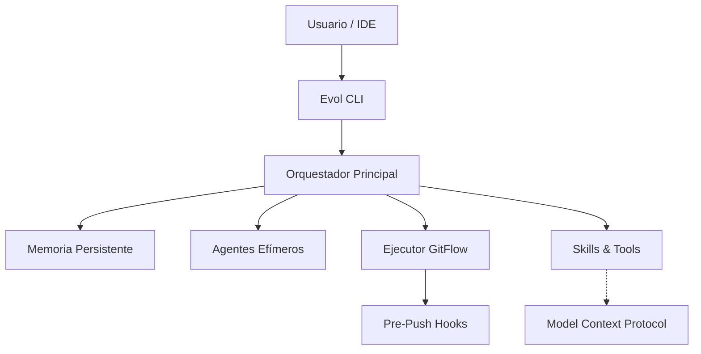

<h1 align="center">Evol-DD</h1>

<p align="center">
  
  
  
  
</p>

El framework de desarrollo agéntico que aprende con cada proyecto que construye. Evol-DD elimina los servidores permanentes, reemplazándolos con memoria nativa, lecciones evolutivas, y skills que escalan automáticamente en 7 IDEs.

## Tabla de Contenidos
- [Características Principales](#características-principales)
- [Instalación y Quick Start](#instalación-y-quick-start)
- [Arquitectura](#arquitectura)
- [Documentación Completa](#documentación-completa)
- [Preguntas Frecuentes (FAQ)](#preguntas-frecuentes-faq)
- [Contribución](#contribución)
- [Licencia](#licencia)

## Características Principales
- **MCP Nativo:** Integración oficial de Model Context Protocol para extensibilidad infinita.
- **Memoria que Persiste:** El agente recuerda el contexto entre sesiones sin depender de servidores.
- **Lecciones Evolutivas:** Motor integrado que convierte errores en reglas persistentes.
- **Agentes Efímeros:** Crea especialistas bajo demanda que se archivan criptográficamente.
- **Multi-IDE Global:** Soporte nativo para Claude Code, OpenCode, Cursor, Windsurf, Antigravity, Codex y VSCode Copilot.
- **GitFlow Automatizado:** Gestión rigurosa de sprints y branches (`setup`, `sprint-start`, `pre-push`, `sprint-close`).

## Instalación y Quick Start

**Prerequisitos:** Python 3.10+ y `pipx` (recomendado).

```bash
# Instalación global (disponible en todos los IDEs automáticamente)
pipx install evol-dd && evol

# Iniciar un proyecto con el perfil "core"
evol init /path/to/project --profile core

# Diagnóstico de tu entorno
evol doctor
```

## Arquitectura



## Documentación Completa

- [Constitución de Evol-DD](docs/constitucion.md) - Reglas fundamentales
- [Agentes Disponibles](AGENTS.md) - Lista de agentes core
- [Arquitectura C4](docs/arquitectura/ARQUITECTURA.md) - Diseño completo
- [Onboarding](docs/guias/ONBOARDING.md) - Guía detallada

## Preguntas Frecuentes (FAQ)

<details>
<summary>¿Cómo actualizo Evol-DD a la versión más reciente?</summary>
<br>
Simplemente ejecuta <code>pipx upgrade evol-dd && evol</code>. Esto actualizará el binario e instalará las nuevas skills en todos tus IDEs.
</details>

<details>
<summary>¿Qué pasa si mi IDE no soporta slash commands globales?</summary>
<br>
Algunos IDEs como VSCode Copilot no lo soportan. Para ellos, instalamos <code>tasks.json</code> globales accesibles vía <code>Ctrl+Shift+P</code> -> <b>Run Task</b>.
</details>

<details>
<summary>¿Dónde se guardan los datos de memoria?</summary>
<br>
Se guardan localmente en tu repositorio en formato Markdown (<code>memoria.md</code>, <code>lecciones.md</code>) para garantizar transparencia total.
</details>

## Contribución
Las contribuciones son bienvenidas. Asegúrate de respetar el GitFlow y revisar nuestra guía de Contribución. Al hacer push hacia develop, nuestro `pre-push` validará que no haya leaks y que la documentación cumpla el estándar Top 100.

## Licencia
Distribuido bajo la Licencia MIT. Ver el archivo [LICENSE](LICENSE) para más detalles.
