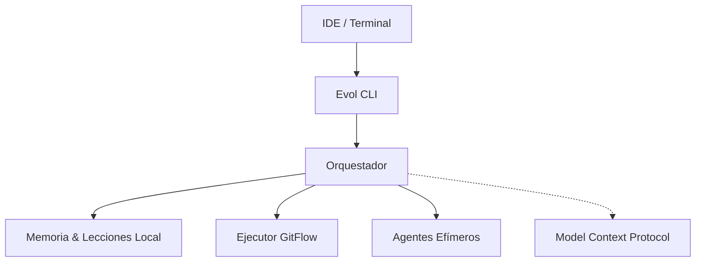

<div align="center">
  <picture>
    <source media="(prefers-color-scheme: dark)" srcset="https://raw.githubusercontent.com/abhisheknaiidu/awesome-github-profile-readme/master/assets/placeholder-dark.png">
    
  </picture>
  
  <h1>Evol-DD</h1>
  <p><b>Desarrollo agéntico local, persistente y extensivo en 7 IDEs.</b></p>
  
  <p>
    
    
    
  </p>
</div>

<br/>

Evol-DD elimina los servidores permanentes mediante **Model Context Protocol (MCP)** y **memoria local**. Está diseñado para equipos que necesitan agentes que recuerden el contexto entre sesiones, conviertan errores en lecciones arquitectónicas y corran nativamente dentro del IDE sin depender de plataformas cerradas.

---

## ❖ Por qué Evol-DD (Arquitectura vs Tradicional)

<table>
  <thead>
    <tr>
      <th>Enfoque Tradicional</th>
      <th>Evol-DD (2026 Standard)</th>
    </tr>
  </thead>
  <tbody>
    <tr>
      <td>► 180+ Agentes pesados y fijos</td>
      <td><b>16 Core</b> + Agentes Efímeros bajo demanda.</td>
    </tr>
    <tr>
      <td>► Amnesia de sesión a sesión</td>
      <td><b>Memoria Nativa</b> serializada en <code>AGENT_MEMORY.md</code>.</td>
    </tr>
    <tr>
      <td>► Mismos errores recurrentes</td>
      <td><b>Motor de Lecciones</b> integrado al flujo CI/CD.</td>
    </tr>
    <tr>
      <td>► Cerrado a una plataforma</td>
      <td><b>100% Portable</b> (Cursor, Windsurf, Claude Code, Copilot).</td>
    </tr>
  </tbody>
</table>

---

## ❖ Core Features (AI-Friendly Snippets)

### 1. Memoria Local Persistente
Busca decisiones pasadas y contexto sin tokens adicionales en el LLM.

```bash
python3 scripts/evol-memory.py search "decisión arquitectónica sobre la BD"
```

### 2. Motor de Lecciones
Automatiza que el agente nunca repita el mismo error técnico.

```bash
python3 scripts/evol-lessons.py add --categoria SEGURIDAD --leccion "Gate key aislada por proyecto"
```

### 3. Agentes Efímeros Criptográficos
Levanta un especialista para un ticket y retíralo (hash SHA-256) cuando acabe.

```bash
python3 scripts/evol-agent-lifecycle.py create --name "auditor-sec" --expires-after 1
```

---

## ❖ Quick Start & Instalación

```bash
# 1. Instalación Global (disponible en todos los IDEs vía pipx)
pipx install evol-dd && evol

# 2. Inicializar tu repositorio
evol init . --profile core
```

---

## ❖ Arquitectura del Sistema (Mermaid)



---

## ❖ Ecosistema y Configuración

<details>
<summary><b>► Compatibilidad de IDEs</b></summary>
<br>
Soporte "Zero-Config" vía comando <code>/evol</code> para:
<ul>
  <li>Claude Code</li>
  <li>OpenCode</li>
  <li>Cursor</li>
  <li>Windsurf</li>
  <li>Antigravity</li>
  <li>VSCode Copilot (vía Tasks)</li>
</ul>
</details>

<details>
<summary><b>► Documentación Completa y Gobernanza</b></summary>
<br>
<ul>
  <li><a href="docs/constitucion.md">Constitución Evol-DD</a></li>
  <li><a href="AGENTS.md">Manifest de Agentes</a></li>
  <li><a href="docs/arquitectura/ARQUITECTURA.md">C4 Model</a></li>
</ul>
</details>

<div align="center">
  <br/>
  <p><i>Distribuido bajo la Licencia MIT. Respeta el GitFlow al contribuir.</i></p>
</div>
