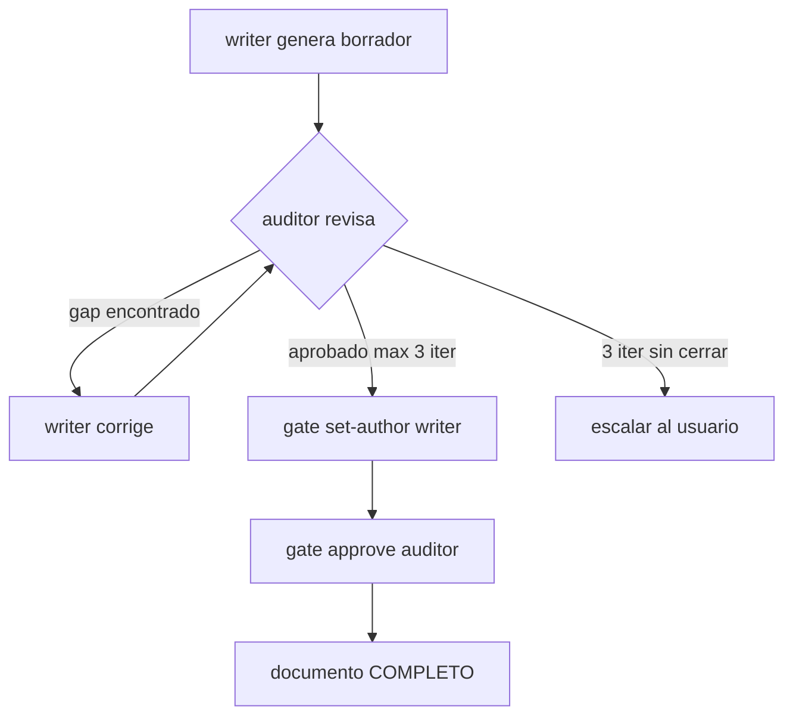

# Estandar de Documentacion X-DD

> Ley unica de formato y granularidad para todo artefacto de documentacion generado por
> cualquier agente o workflow de X-DD. Referenciada por la Constitucion (Art. 9). Si un
> workflow, agente o template entra en conflicto con este documento, este documento gana.

**Version:** 2.0.0
**Estado:** ACTIVO
**Aplica a:** todos los workflows y agentes que emiten artefactos `.md`, `.yaml`, `.feature`.

---

## 1. Principios inquebrantables

### 1.1 Cero iconografia

Prohibicion absoluta de emojis, iconos o simbolos no textuales en artefactos finales.
Densidad de emoji exigida: 0%. Solo se admiten simbolos ASCII con valor tecnico o
matematico (operadores, flechas en diagramas ASCII, notacion). Esta regla no admite
excepciones.

Verificacion:

```bash
grep -rP '[\x{1F000}-\x{1FAFF}\x{2600}-\x{27BF}\x{FE00}-\x{FE0F}]' docs/ \
  && echo "FALLO: emojis detectados" || echo "OK"
```

### 1.2 Diagramas Mermaid obligatorios

Todo artefacto que describa estructura, flujo, estado o relaciones DEBE incluir al menos
un diagrama Mermaid. ASCII solo cuando Mermaid es imposible en el contexto de consumo.

| Artefacto | Diagrama minimo obligatorio |
|---|---|
| ARQUITECTURA.md | C4 Contexto + C4 Contenedor (`C4Context`, `C4Container`) |
| DOMAIN.md | Diagrama de clases (`classDiagram`) + Context Map (`flowchart`) |
| THREATS.md | Flujo de datos con fronteras de confianza (`flowchart`) |
| GATE.md | FSM de estados del pipeline (`stateDiagram-v2`) |
| Ciclos de vida | Estado por entidad (`stateDiagram-v2`) |
| Despliegue | Despliegue (`flowchart` o `C4Deployment`) |
| Workflows | Flujo de pasos del workflow (`flowchart TD`) |

**Criterio de rechazo:** documento sin bloque ` ```mermaid ` es INCOMPLETO sin excepcion.

### 1.3 Tablas para datos estructurados

Toda lista con mas de un atributo se representa como tabla. Obligatorio para: requisitos,
casos de prueba, matrices de trazabilidad, controles de seguridad, inventarios PII,
metricas, parametros de configuracion, comparaciones de opciones.

**Criterio de rechazo:** lista de bullets con dos o mas atributos por item = INCOMPLETO.

### 1.4 Gherkin completo

Cada criterio de aceptacion tiene su bloque Gherkin. Minimo por historia/feature:

- 1 escenario happy path
- >=2 escenarios de error (inputs invalidos, estados inconsistentes)
- >=1 caso borde (limites, concurrencia, degradacion)

Vocabulario exclusivamente del DOMAIN.md (Ubiquitous Language).

**Criterio de rechazo:** criterio de aceptacion en prosa sin bloque Gherkin = INCOMPLETO.

### 1.5 Profundidad minima cuantitativa

Umbrales minimos por tipo de documento (lineas de contenido, excluyendo encabezados):

| Tipo | Minimo lineas | Minimo secciones H2 | Minimo secciones H3 |
|---|---|---|---|
| ARQUITECTURA.md | 300 | 6 | 12 |
| DOMAIN.md | 250 | 5 | 10 |
| THREATS.md | 200 | 5 | N amenazas >= N componentes criticos |
| FUNCIONALES.md | 150 | 3 | 1 por requisito |
| NO_FUNCIONALES.md | 100 | 3 | 1 por NFR |
| GATE.md | 150 | 5 | 10 |
| constitucion.md | 200 | 9 articulos | 2 por articulo |
| PLAN_QA.md | 200 | 5 | 8 |
| ONBOARDING.md | 200 | 5 | 10 |
| Guias operativas | 100 | 3 | 5 |

**Criterio de rechazo:** documento por debajo del umbral = INSUFICIENTE. No pasa gate QA.

Prohibido entregar una seccion como una sola lista de bullets sin desarrollo. Cada
seccion principal necesita al menos un parrafo de contexto antes de cualquier lista.
Si una seccion no aplica, declarar explicitamente "No aplica" con justificacion.

### 1.6 Trazabilidad bidireccional

Cada requisito referencia sus casos de prueba. Cada caso de prueba referencia su
requisito. Cada feature referencia su entidad de dominio. Cada amenaza referencia
activo y control.

Formato de identificadores:

| Tipo | Formato | Ejemplo |
|---|---|---|
| Requisito funcional | `REQ-NNN` | REQ-001 |
| Requisito no funcional | `NFR-NNN` | NFR-003 |
| Feature | `FEAT-NNN` | FEAT-007 |
| Amenaza | `THR-NNN` | THR-012 |
| Caso de prueba | `TC-NNN` | TC-045 |
| Requisito de seguridad | `SEC-REQ-NNN` | SEC-REQ-002 |
| Historia de usuario | `HU-NNN` | HU-003 |

**Criterio de rechazo:** referencia cruzada en prosa sin ID normalizado = PARCIAL.
Referencia que no resuelve en ambas direcciones = INCOMPLETO.

---

## 2. Secciones minimas por artefacto

Un artefacto con menos secciones se considera incompleto y no pasa el gate de QA.
El auditor (engineering-code-reviewer) rechaza y el writer itera hasta cerrar.

### 2.1 ARQUITECTURA.md

1. Vision general del sistema (contexto, problema que resuelve, stakeholders)
2. Diagrama C4 Contexto (Mermaid `C4Context`)
3. Diagrama C4 Contenedor (Mermaid `C4Container`)
4. Diagrama C4 Componente de los contenedores criticos (Mermaid `C4Component`)
5. Decisiones arquitectonicas clave (tabla: ADR-NNN, decision, estado, consecuencias)
6. Atributos de calidad y como se satisfacen (tabla: atributo, escenario, tacticas)
7. Riesgos arquitectonicos activos (tabla: riesgo, probabilidad, impacto, mitigacion)
8. Restricciones tecnicas y de negocio (tabla)

### 2.2 DOMAIN.md

1. Ubiquitous Language (tabla: termino, definicion, sinonimos prohibidos, contexto)
2. Bounded Contexts (diagrama Mermaid `flowchart`)
3. Context Map con tipo de relacion (ACL, Shared Kernel, Conformist, etc.)
4. Agregados (tabla: aggregate root, invariantes, entidades, value objects, repositorio)
5. Domain Events (tabla: evento, emisor, consumidores, payload, efecto de negocio)
6. Diagrama de clases del dominio (Mermaid `classDiagram`)
7. Glosario de errores de dominio

### 2.3 THREATS.md

1. Activos y actores adversarios (tabla: activo, criticalidad, actor, motivacion)
2. Diagrama de flujo de datos con fronteras de confianza (Mermaid `flowchart`)
3. Analisis STRIDE completo (tabla: THR-NNN, categoria STRIDE, componente, vector, prob, impacto, riesgo, control)
4. Amenazas criticas sin control = bloqueante (ninguna amenaza CRITICA sin control documentado)
5. Requisitos de seguridad derivados (SEC-REQ-NNN copiados a SPEC.md)
6. Verificacion: cada agregado del DOMAIN.md tiene >=1 amenaza analizada

### 2.4 GATE.md

1. Vision general del gate (proposito, que firma, que valida)
2. FSM del pipeline (Mermaid `stateDiagram-v2`): estados, transiciones, guards
3. Protocolo de firma HMAC (payload canonico, algoritmo, verificacion)
4. Comandos CLI (tabla: comando, argumentos, efecto, salida esperada)
5. Escape hatches y overrides (tabla: variable, efecto, cuando usar, riesgo)
6. Threat model del gate (replay, key rotation, log corruption, timing attacks)
7. Recovery procedures (log corrupto, key perdida, firma invalida)
8. Ejemplos de payload valido e invalido

### 2.5 constitucion.md

1. Preambulo (mision del framework, a quien aplica, jerarquia de normas)
2. Diagrama del pipeline gated (Mermaid `flowchart TD`)
3. Por cada articulo (9 total): titulo, texto normativo, criterio de cumplimiento, consecuencia de incumplimiento
4. Glosario de terminos constitucionales
5. Procedimiento de enmienda

### 2.6 FUNCIONALES.md / NO_FUNCIONALES.md

- Funcionales: tabla (REQ-NNN, historia de usuario, criterio de aceptacion, prioridad, estado, TC vinculados)
- No funcionales: tabla (NFR-NNN, categoria, metrica medible, umbral cuantitativo, prioridad, metodo de verificacion)
- Diagrama de dependencias entre requisitos (Mermaid `flowchart`)

### 2.7 Artefactos QA

- PLAN_QA.md: estrategia por capa + tabla de cobertura objetivo + diagrama de piramide de tests
- CASOS_GHERKIN.md: todos los Feature/Scenario por feature, con positivos Y negativos
- MATRIZ_TRAZABILIDAD.md: tabla REQ -> TC -> tipo -> resultado -> cobertura
- CASOS_BORDE.md: tabla (TC-NNN, escenario, precondicion, entrada, resultado esperado, prioridad)
- CHECKLIST_RELEASE.md: Definition of Done con criterios de salida verificables y comandos exactos

### 2.8 Artefactos de seguridad y privacidad

- PRIVACY.md: inventario PII (tabla), bases legales GDPR, retencion, transferencias, brechas
- SECURITY_CONTROLS.md: tabla (SC-NNN, control, estado, evidencia, riesgo residual)

---

## 3. Definition of Done por documento

Un documento esta COMPLETO cuando cumple todos:

1. Contiene todas las secciones minimas de la seccion 2 para su tipo.
2. Tiene cero emojis (verificado con grep, seccion 1.1).
3. Supera el umbral cuantitativo de lineas para su tipo (seccion 1.5).
4. Incluye los diagramas Mermaid obligatorios (seccion 1.2).
5. Usa tablas para todo dato estructurado (seccion 1.3).
6. Cada criterio de aceptacion tiene bloque Gherkin cuando aplica (seccion 1.4).
7. Cada identificador trazable resuelve en ambas direcciones (seccion 1.6).
8. Ninguna seccion es un bullet de alto nivel sin parrafo de contexto (seccion 1.5).
9. El auditor (engineering-code-reviewer != writer) aprobo el documento.

---

## 4. Verificacion automatizada (gate Tier 1)

```bash
# 1. Cero emojis
grep -rP '[\x{1F000}-\x{1FAFF}\x{2600}-\x{27BF}\x{FE00}-\x{FE0F}]' docs/ \
  && echo "FALLO: emojis" || echo "OK emojis"

# 2. Mermaid en docs estructurales obligatorios
for f in docs/arquitectura/ARQUITECTURA.md docs/arquitectura/DOMAIN.md \
          docs/GATE.md docs/constitucion.md; do
  grep -q '```mermaid' "$f" || echo "FALLO: sin Mermaid en $f"
done

# 3. Umbral de lineas (ejemplo ARQUITECTURA.md >= 300)
wc -l docs/arquitectura/ARQUITECTURA.md | awk '{if ($1 < 300) print "FALLO: ARQUITECTURA.md solo " $1 " lineas"}'

# 4. IDs trazables resuelven en ambas direcciones
# REQ-NNN en FUNCIONALES.md debe aparecer en CASOS_GHERKIN.md o PLAN_QA.md
grep -oP 'REQ-\d+' docs/requisitos/FUNCIONALES.md | sort -u > /tmp/req_ids.txt
while read id; do
  grep -rq "$id" docs/qa/ || echo "FALLO: $id sin caso de prueba"
done < /tmp/req_ids.txt
```

---

## 5. Aplicabilidad

Este estandar es referenciado por:

- El agente `engineering-technical-writer` (reglas hard-coded en su prompt).
- El agente `engineering-code-reviewer` como checklist de auditoria.
- Todos los workflows en `.agent/workflows/` que emiten artefactos.
- Todos los templates en `templates/`.
- El gate de QA (`/qa-review`) como criterio Tier 1.
- `xdd-discipline-check.py` como validacion automatizada por fase.

Cualquier agente o workflow nuevo que emita documentacion debe declarar conformidad con
este estandar en su seccion de output.

---

## 6. Protocolo worker-auditor para documentacion

Todo documento generado por un agente sigue este pipeline antes de ser aceptado:



Reglas del auditor:

- El auditor NO es quien escribio el documento.
- El auditor verifica contra el checklist de la seccion 3.
- Cada gap encontrado se registra en `acuerdos/lecciones/sprint-NN.md`.
- Si el documento no supera el umbral de lineas: rechaza sin leer el contenido.
- Si faltan Mermaid obligatorios: rechaza sin leer el contenido.
- Si hay emojis: rechaza sin leer el contenido.
## 7. Par JSON/MD para ahorro de tokens

Todo documento atomico tiene un sidecar `.json` derivado, generado por `evol-doc-sync.py`.

### Contrato

- El `.md` es la **fuente de verdad** — calidad completa, todas las secciones, sin recortes.
- El `.json` es la **estructura maxima de ahorro de tokens** — indice compacto que un
  agente lee para mapear que existe y donde, sin cargar el MD completo.
- El JSON se genera automaticamente desde el MD (nunca se escribe a mano).
- Si el MD cambia, el JSON se regenera (deteccion de drift via checksum).

### Estructura del sidecar

```json
{
  "doc": "esquemas.md",
  "dominio": "db",
  "subdominio": "esquemas",
  "resumen": "Una linea: que cubre y que NO cubre",
  "secciones": ["vision-general", "schemas", "trazabilidad"],
  "entidades": ["usuarios", "proyectos"],
  "trazabilidad": {"origen": ["stack.md"], "relacionados": ["db/relaciones.md"]},
  "tokens_md": 2480,
  "tokens_json": 290,
  "lineas": 180,
  "checksum_md": "a1b2c3d4",
  "actualizado": "ISO-8601"
}
```

Por carpeta, un `INDEX.json` agrega los sidecars. Por raiz de proyecto, un `INDEX.json`
maestro agrega los dominios.

### Regla de consumo (OBLIGATORIA para agentes)

Antes de cargar documentos MD, el agente DEBE leer el `INDEX.json` correspondiente para
decidir que MDs necesita. Cargar todos los MD "por si acaso" viola el estandar.

Flujo:
1. Leer `acuerdos/proyecto/INDEX.json` (maestro, ~3-5k tokens) → mapa de dominios.
2. Leer `<dominio>/INDEX.json` del dominio relevante → lista de subdominios.
3. Cargar SOLO los `.md` de los subdominios que se van a implementar.

Ahorro tipico: ~95% en navegacion (cargar INDEX vs todos los docs).

### Comandos

```bash
evol-doc-sync.py sync --doc <path.md>      # genera/actualiza un sidecar
evol-doc-sync.py sync-folder <carpeta>     # carpeta + INDEX.json
evol-doc-sync.py sync-all <raiz>           # arbol completo + INDEX maestro
evol-doc-sync.py verify <carpeta>          # detecta drift (MD sin re-sync)
```

El verificador `evol-discipline-check.py check_json_sidecar` rechaza docs sin sidecar
o con drift como parte del gate de atomicidad.
