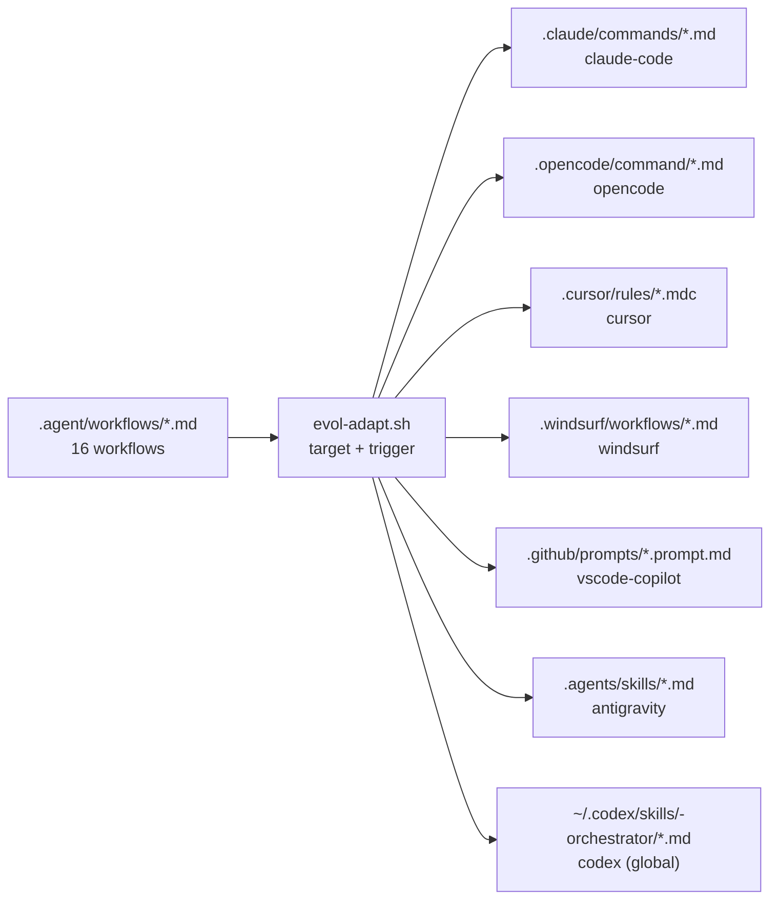

# IDE Setup — Evol-DD

Guia de configuracion del adaptador `evol-adapt.sh` para los 7 IDEs soportados. El adaptador copia los workflows de `.agent/workflows/` al directorio nativo de cada IDE, con soporte MCP integrado externas.

## Tabla resumen

| IDE | Mecanismo | Directorio destino | Archivos generados | Trigger |
|---|---|---|---|---|
| claude-code | Slash commands nativos | `.claude/commands/` | `<workflow>.md` por cada workflow | `/<trigger>` |
| opencode | Comandos Markdown + AGENTS.md | `.opencode/command/` + `.opencode/AGENTS.md` | `<workflow>.md` + copia de AGENTS.md | `/<trigger>` |
| cursor | Rules MDC (@-mention) | `.cursor/rules/` | `<workflow>.mdc` por cada workflow | `@<trigger>` |
| windsurf | Workflows Windsurf | `.windsurf/workflows/` | `<workflow>.md` por cada workflow | Panel Workflows |
| vscode-copilot | Prompt files | `.github/prompts/` | `<workflow>.prompt.md` por cada workflow | `#<nombre>.prompt.md` |
| antigravity | Skills directory | `.agents/skills/` | `<workflow>.md` por cada workflow | Segun configuracion del IDE |
| codex | Directorio global de skills | `~/.codex/skills/<trigger>-orchestrator/` | `<workflow>.md` por cada workflow (global) | `/<trigger>` |

---

## Prerequisitos

```bash
# Python 3.10+ y bash. Con MCP Nativo.
python3 --version   # >= 3.10
bash --version

# Verificar que los workflows esten presentes
ls .agent/workflows/*.md | wc -l   # debe retornar >= 1
```

El script usa la variable de entorno `EVOL_TRIGGER` (default: `evol`) para nombrar archivos y directorios. Se puede sobreescribir con `--trigger=<nombre>`.

```bash
# Uso basico
bash scripts/evol-adapt.sh <ide> [--trigger=<trigger>] [--dry-run]

# Generar para todos los IDEs
bash scripts/evol-adapt.sh all
```

---

## Verificación MCP

Al ejecutar `all`, el script verifica automaticamente que se integren correctamente los `mcpServers`, `mcp.json` o `evol-mcp-server`:

```bash
bash scripts/evol-adapt.sh all
# Al final muestra:
# [all] Generation complete. Integración-MCP check:
# OK: 0 MCP references found
```

---

## claude-code

### Que genera

`evol-adapt.sh` copia cada archivo `<workflow>.md` de `.agent/workflows/` hacia `.claude/commands/<workflow>.md`. Claude Code registra automaticamente cualquier `.md` en `.claude/commands/` como slash command nativo.

```
.claude/
  commands/
    architect-workflow.md
    builder-workflow.md
    qa-workflow.md
    sec-workflow.md
    devops-workflow.md
    domain-workflow.md
    doc-workflow.md
    ux-workflow.md
    data-workflow.md
    reviewer-workflow.md
    orchestrator-workflow.md
    pm-workflow.md
    release-workflow.md
    analyst-workflow.md
    agent-factory-workflow.md
    researcher-workflow.md
```

### Como invocar

En el chat de Claude Code, escribe el slash command correspondiente al workflow:

```
/evol
/architect-workflow
/builder-workflow
/qa-workflow
```

### Verificacion

```bash
bash scripts/evol-adapt.sh claude-code
ls .claude/commands/
# Debe listar los *.md de workflows
```

Dentro de Claude Code, escribe `/` y verifica que los workflows aparezcan en el autocompletado.

---

## opencode

### Que genera

`evol-adapt.sh` copia los workflows a `.opencode/command/` y adicionalmente copia `AGENTS.md` del raiz del proyecto a `.opencode/AGENTS.md` si el archivo existe.

```
.opencode/
  command/
    architect-workflow.md
    builder-workflow.md
    ...
  AGENTS.md
```

### Como invocar

En opencode, los comandos del directorio `.opencode/command/` se invocan con slash:

```
/architect-workflow
/builder-workflow
```

`AGENTS.md` actua como contexto de sistema para opencode, describiendo los agentes disponibles y sus responsabilidades.

### Verificacion

```bash
bash scripts/evol-adapt.sh opencode
ls .opencode/command/
cat .opencode/AGENTS.md
```

---

## cursor

### Que genera

`evol-adapt.sh` genera archivos `.mdc` en `.cursor/rules/`. El formato MDC es el nativo de Cursor para reglas y contexto de agente.

```
.cursor/
  rules/
    architect-workflow.mdc
    builder-workflow.mdc
    qa-workflow.mdc
    ...
```

### Como invocar

Cursor no tiene slash commands nativos de la misma forma que Claude Code. El mecanismo es la mencion con `@`:

```
@architect-workflow
@builder-workflow
```

En el chat de Cursor Agent, escribir `@` y seleccionar el workflow del listado desplegable.

### Verificacion

```bash
bash scripts/evol-adapt.sh cursor
ls .cursor/rules/
# Debe listar los *.mdc
```

Abrir Cursor, abrir el chat de Agent, escribir `@` y verificar que aparezcan las reglas generadas.

---

## windsurf

### Que genera

`evol-adapt.sh` genera los workflows en `.windsurf/workflows/` como archivos Markdown estandar.

```
.windsurf/
  workflows/
    architect-workflow.md
    builder-workflow.md
    ...
```

### Como invocar

En Windsurf, acceder al panel de Workflows (lateral derecho o paleta de comandos). Los workflows de `.windsurf/workflows/` aparecen listados y se ejecutan desde ahi.

### Verificacion

```bash
bash scripts/evol-adapt.sh windsurf
ls .windsurf/workflows/
```

Abrir Windsurf y verificar que el panel de Workflows muestre los archivos generados.

---

## vscode-copilot

### Que genera

`evol-adapt.sh` genera prompt files en `.github/prompts/` con la extension `.prompt.md`, que es el formato reconocido por GitHub Copilot en VS Code.

```
.github/
  prompts/
    architect-workflow.prompt.md
    builder-workflow.prompt.md
    qa-workflow.prompt.md
    ...
```

### Como invocar

En VS Code con la extension GitHub Copilot instalada, referenciar el prompt en el chat:

```
#architect-workflow.prompt.md
#builder-workflow.prompt.md
```

O usar el selector de contexto (`@workspace` > `Attach context` > seleccionar prompt file).

### Verificacion

```bash
bash scripts/evol-adapt.sh vscode-copilot
ls .github/prompts/
```

Abrir VS Code, abrir el chat de Copilot, escribir `#` y verificar que aparezcan los `.prompt.md`.

---

## antigravity

### Que genera

`evol-adapt.sh` copia los workflows a `.agents/skills/` (directorio plural, segun especificacion de antigravity).

```
.agents/
  skills/
    architect-workflow.md
    builder-workflow.md
    ...
```

### Como invocar

La invocacion depende de la configuracion especifica del IDE antigravity instalado. En general, los skills del directorio `.agents/skills/` se cargan automaticamente y se invocan segun el mecanismo nativo del runtime.

### Verificacion

```bash
bash scripts/evol-adapt.sh antigravity
ls .agents/skills/
```

---

## codex

### Que genera

A diferencia de los demas IDEs, codex genera en un directorio **global del sistema**, no en el proyecto local. La ruta destino es `~/.codex/skills/<trigger>-orchestrator/`.

Con el trigger por defecto:

```
~/.codex/
  skills/
    evol-orchestrator/
      architect-workflow.md
      builder-workflow.md
      ...
```

Con un trigger personalizado `--trigger=miproyecto`:

```
~/.codex/skills/miproyecto-orchestrator/
```

El script verifica que la ruta de destino este dentro de `~/.codex` para prevenir path traversal.

### Como invocar

En codex CLI:

```
/evol
```

O segun como codex registre los skills globales del directorio `~/.codex/skills/`.

### Verificacion

```bash
bash scripts/evol-adapt.sh codex
ls ~/.codex/skills/evol-orchestrator/
```

---

## Personalizacion del trigger

El trigger por defecto es `evol`. Se puede cambiar de dos formas:

```bash
# Por variable de entorno (persiste en la sesion)
export EVOL_TRIGGER=miproyecto
bash scripts/evol-adapt.sh all

# Por argumento de linea de comandos (una sola ejecucion)
bash scripts/evol-adapt.sh all --trigger=miproyecto
```

El trigger afecta principalmente al directorio de codex (`~/.codex/skills/<trigger>-orchestrator/`). Para claude-code y opencode, los archivos se nombran segun el workflow, no segun el trigger.

Restricciones del trigger (validadas por el script):

- Solo caracteres alfanumericos, guiones y guiones bajos (`[A-Za-z0-9_-]+`)
- No puede contener `..` ni `/` (proteccion contra path traversal)

---

## Dry run

Antes de generar archivos, se puede verificar que se detectan los workflows correctamente:

```bash
bash scripts/evol-adapt.sh all --dry-run
# Salida:
# [dry-run] Would generate for: all
#   Workflows: 16
```

---

## Diagrama de flujo del adaptador


