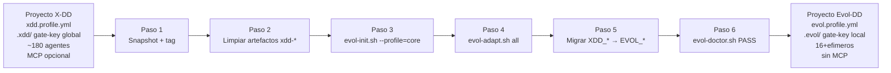

# Retrofit Guide — Migracion de X-DD a Evol-DD

Esta guia cubre la migracion de un proyecto existente de X-DD a Evol-DD. La migracion no es una actualizacion del mismo sistema: Evol-DD es un framework independiente con un modelo de agentes, naming, estructura de estado y politicas distintas.

## Por que migrar

| Dimension | X-DD | Evol-DD |
|---|---|---|
| Dependencia de MCP | Si, varios servidores MCP | Sin MCP. CLI-first, stdlib-first |
| Agentes permanentes | ~180 en registry global | 16 core + efimeros por ciclo de vida |
| GitFlow | Opcional, trunk-based por defecto | GitFlow como comportamiento por defecto |
| Memoria nativa | ReMe (Apache-2.0) como opt-in | Motor nativo en `scripts/evol-memory.py` |
| Agentes efimeros | No hay soporte formal | `evol-agent-lifecycle.py` con ciclo completo (crear, retirar, archivar) |
| Gate key scope | Global en `~/.xdd/` | Por proyecto en `.evol/` |
| Trigger | `/xdd` | `/evol` |
| Stack | Python + Bash + Node (MCP) | Python + Bash, sin Node requerido |

---

## Tabla de equivalencias de scripts

| Script X-DD | Script Evol-DD | Diferencias relevantes |
|---|---|---|
| `xdd-init.sh` | `evol-init.sh` | Perfiles: minimal/core/developer/security/research/full/lean/custom. Escribe `evol.profile.yml` en lugar de `xdd.profile.yml` |
| `xdd-doctor.sh` | `evol-doctor.sh` | Verifica artefactos `evol.*` en lugar de `xdd.*`. Chequea `EVOL_GITNEXUS` en lugar de `XDD_GITNEXUS`. Salida `--json` compatible |
| `xdd-adapt.sh` | `evol-adapt.sh` | Sin cambios funcionales. Variable `EVOL_TRIGGER` reemplaza `XDD_TRIGGER`. Sin `mcp.json` en ningun IDE |
| `xdd-gate.py` | `evol-gate.py` | Gate key almacenada en `.evol/.gate-key` (per-proyecto) en lugar de `~/.xdd/gate-key` (global). HMAC-SHA256 compatible |
| `xdd-state.py` | `evol-state.py` | State dir `.evol/` en lugar de `.xdd/`. SQLite en `.evol/state.db` |
| `xdd-shield.py` | `evol-shield.py` | Audit estatico del framework, reglas adaptadas a naming `evol-*` |
| `xdd-eval.py` | `evol-eval.py` | Mismos 4 grader types (structural, behavioral, output_match, pass_at_k). Path de suites: `evals/` igual |
| `xdd-memory.py` | `evol-memory.py` | Motor nativo sin ReMe como dependencia. Archivos en `memory/`, dialog en `dialog/` |
| `xdd-lessons.py` | `evol-lessons.py` | Mismo formato de lecciones. Lee/escribe `lecciones.md` |
| `xdd-orchestrate.py` | `evol-orchestrate.py` | Patrones sequential/parallel/parallel_then_sync conservados. Config `evol.config.yml` en lugar de `xdd.profile.yml` |
| `xdd-flow.py` | `evol-flow.py` | Flujos declarativos con MockProvider determinista. ExecutionTrace compatible |
| `xdd-provider.py` | `evol-provider.py` | MockProvider + AnthropicProvider. Variable `EVOL_PROVIDER` en lugar de `XDD_PROVIDER` |
| `xdd-evolve.py` (si existia) | `evol-evolve.py` | Skill evolution engine |
| `xdd-researcher.py` | `evol-researcher.py` | Agente de investigacion autonoma |
| `xdd-brand.sh` | `evol-brand.sh` | White-labeling del framework |
| `xdd-start.sh` | `evol-start.sh` | Arranca MemPalace + estado inicial de sesion |
| `xdd-global-install.sh` | `evol-global-install.sh` | Instala entrypoints globales (`evol`, `evol-gate`, etc.) |
| `generate-equipo.sh` | `generate-equipo.sh` | Mismo script. Genera `docs/equipo.md` desde registry |
| `lint-workflows.sh` | `lint-workflows.sh` | Lint frontmatter de workflows. Path `.agent/workflows/` igual |
| `validate-registry.py` | `validate-registry.py` | Valida `prompts/agents/registry.json` |
| `migrate-agents-to-registry.py` | No existe equivalente directo | Evol-DD no tiene comando de migracion masiva de agentes. Los agentes efimeros se crean via `evol-agent-lifecycle.py` |
| `xdd-pentest.sh` | No existe en v0.1 | Planificado |
| `xdd_adapters.py` | `evol-adapt.sh` | En X-DD era un modulo Python; en Evol-DD es un script Bash |
| `_xdd_common.py` | `_evol_common.py` | Helper compartido. Funciones: `get_logger`, `get_data_dir`, `mempalace_safe`, `save_json`, `load_json` |
| `bump-version.py` | `bump-version.py` | Mismo nombre. Gestiona VERSION + pyproject.toml |

---

## Tabla de variables de entorno

| Variable X-DD | Variable Evol-DD | Descripcion |
|---|---|---|
| `XDD_TRIGGER` | `EVOL_TRIGGER` | Trigger word para el adaptador de IDEs. Default: `evol` |
| `XDD_GITNEXUS` | `EVOL_GITNEXUS` | Activa GitNexus. `1` para habilitar |
| `XDD_PROVIDER` | `EVOL_PROVIDER` | Proveedor LLM: `mock`, `anthropic`, `openai` |
| `XDD_MEMORY_COMPACT_THRESHOLD` | `EVOL_MEMORY_COMPACT_THRESHOLD` | Umbral en tokens para compactacion de memoria. Default: 90000 |
| `XDD_MEMORY_COMPACT_RESERVE` | `EVOL_MEMORY_COMPACT_RESERVE` | Tokens a reservar post-compactacion. Default: 10000 |
| `XDD_MEMORY_TOOL_TTL_DAYS` | `EVOL_MEMORY_TOOL_TTL_DAYS` | TTL para resultados de herramientas en `tool_result/`. Default: 3 |
| `XDD_GATE_KEY` | No aplica | En Evol-DD la gate key es siempre per-proyecto en `.evol/.gate-key` |
| `XDD_PROFILE` | No aplica como var de entorno | El perfil se pasa como argumento a `evol-init.sh --profile=<perfil>` |

---

## Cambio de trigger

El trigger canonico cambia de `/xdd` a `/evol`. En el archivo `agent.yaml` del proyecto:

```yaml
# Antes (X-DD)
canonical_trigger: /xdd

# Despues (Evol-DD)
canonical_trigger: /evol
```

El archivo `.claude/commands/` se regenera con `evol-adapt.sh claude-code`. Los workflows de X-DD en `.claude/commands/` deben ser eliminados antes de regenerar para evitar conflictos.

---

## Cambios en registry.json

El schema del registry en Evol-DD esta ampliado para soportar el ciclo de vida de agentes efimeros. Las propiedades nuevas respecto a X-DD son:

| Propiedad nueva | Tipo | Descripcion |
|---|---|---|
| `lifecycle_status` | string | `active`, `retired`, `archived`. Solo para efimeros |
| `ephemeral` | boolean | `true` si es un agente creado por `evol-agent-lifecycle.py` |
| `created_at` | string (ISO8601) | Timestamp de creacion del agente |
| `expires_after_days` | integer | Dias hasta retiro automatico. Solo para efimeros |
| `task` | string | Descripcion de la tarea especifica del efimero |
| `prompt_sha256` | string | Hash SHA-256 del prompt para auditoria |
| `retired_at` | string (ISO8601) | Timestamp de retiro. Solo cuando `lifecycle_status: retired` |
| `archive_path` | string | Ruta de archivo en `.evol/agents/retired/`. Solo cuando archivado |

Los agentes core (16 permanentes) mantienen el schema base de X-DD. Solo los efimeros usan las propiedades adicionales.

---

## Diferencias en gate key

En X-DD, la gate key era global por usuario, almacenada en `~/.xdd/gate-key`. Esto significaba que una aprobacion de gate era valida en cualquier proyecto del mismo usuario.

En Evol-DD, la gate key es **por proyecto**, almacenada en `.evol/.gate-key` con permisos `0600`. El directorio `.evol/` tiene permisos `0700`. Esto implica:

- Aprobaciones de gate son especificas al proyecto
- Clonar un repositorio sin el `.evol/` (que esta en `.gitignore`) requiere re-inicializar el gate
- La cadena HMAC no es portable entre proyectos

Para inicializar el gate en un proyecto migrado:

```bash
python3 scripts/evol-gate.py init --approver=<nombre>
```

---

## Diferencias en adapters

En X-DD, algunos adapters de IDE incluian referencias a `mcp.json` o configuracion de servidores MCP. En Evol-DD, ningun adapter genera `mcp.json` ni referencias a MCP. El script `evol-adapt.sh all` verifica explicitamente al finalizar:

```bash
grep -rn 'mcpServers|mcp\.json|evol-mcp-server' \
    .claude/ .opencode/ .cursor/ .windsurf/ .agents/ .antigravity/ \
    --include='*.md' --include='*.mdc' --include='*.json' 2>/dev/null \
    || echo "OK: 0 MCP references found"
```

Si la migracion incluye archivos de configuracion de X-DD que referenciaban MCP, deben ser eliminados manualmente antes de ejecutar el adaptador.

---

## Pasos de migracion

### Paso 1 — Respaldar el estado actual

```bash
# En el proyecto X-DD
git add -A && git commit -m "chore: pre-migration snapshot"
git tag pre-evol-migration
```

### Paso 2 — Limpiar artefactos X-DD

Eliminar los archivos y directorios especificos de X-DD que no tienen equivalente en Evol-DD o que seran reemplazados:

```bash
rm -f xdd.profile.yml
rm -rf .xdd/
rm -f .claude/commands/xdd*.md   # si existen comandos xdd-*
rm -f .opencode/command/xdd*.md
```

`evol-doctor.sh` reportara como `MEDIUM` cualquier artefacto `xdd-*` que quede.

### Paso 3 — Instalar Evol-DD en el proyecto

Usando `evol-init.sh` desde la raiz del framework Evol-DD:

```bash
bash /ruta/a/evol-dd/scripts/evol-init.sh . --profile=core
```

Para proyectos con desarrollo activo, usar el perfil `developer`:

```bash
bash /ruta/a/evol-dd/scripts/evol-init.sh . --profile=developer
```

El comando crea `evol.profile.yml`, inicializa el gate en `.evol/`, y copia los modulos del perfil seleccionado.

### Paso 4 — Regenerar adapters de IDEs

```bash
bash scripts/evol-adapt.sh all
```

Verificar que no queden referencias a MCP en los archivos generados.

### Paso 5 — Migrar variables de entorno

Actualizar todos los scripts, CI pipelines y archivos `.env` del proyecto reemplazando `XDD_*` por `EVOL_*` segun la tabla de variables de la seccion anterior.

### Paso 6 — Ejecutar doctor y verificar

```bash
bash scripts/evol-doctor.sh
```

El doctor debe retornar `[PASS]` sin errores CRITICAL ni HIGH. Los MEDIUM por artefactos heredados son esperables en la primera ejecucion post-migracion y se resuelven limpiando los archivos reportados.

```bash
# Verificar especificamente que no quedan artefactos legacy
bash scripts/evol-doctor.sh --json | python3 -c "
import json, sys
for line in sys.stdin:
    try:
        d = json.loads(line.strip())
        if d.get('check') == 'LegacyArtifacts':
            print(d)
    except:
        pass
"
```

---

## Diagrama del proceso de migracion


