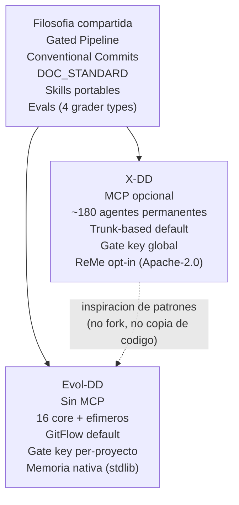

# Relacion Evol-DD / X-DD

Evol-DD no es un fork de X-DD. Es un sistema independiente construido desde cero, inspirado en los patrones conceptuales de X-DD pero con decisiones arquitectonicas distintas en areas criticas: dependencias, escala de agentes, ciclo de vida, y scope de la gate key.

---

## Por que se creo Evol-DD

X-DD resolvio un problema real: estructurar el desarrollo de software bajo un pipeline gated con multiples metodologias. Sin embargo, al crecer el sistema a ~180 agentes permanentes con configuracion MCP, surgieron fricciones operativas:

| Problema en X-DD | Magnitud |
|---|---|
| Sobrecarga de contexto con 180 agentes cargados en registry | El modelo debe procesar el catalogo completo para cada sesion, incrementando latencia y consumo de tokens |
| MCP como punto de fallo | Si el servidor MCP no esta corriendo, los agentes dependientes no funcionan; el setup local requiere Node.js, configuracion de `mcpServers` en settings.json, y troubleshooting adicional |
| Sin memoria nativa | La memoria conversacional (ReMe) era opt-in y dependia de un motor externo (Apache-2.0), no integrado en el ciclo de sesion |
| Gate key global | Una sola gate key para todos los proyectos del usuario generaba riesgo de colision y no permitia auditar por proyecto |
| Agentes efimeros sin soporte formal | Crear un agente temporal para una tarea especifica no tenia mecanismo estructurado; todo agente era permanente por construccion |

Evol-DD fue creado para resolver estos problemas sin romper la filosofia base de X-DD (pipeline gated, Conventional Commits, DOC_STANDARD, skills portables).

---

## Diferencias arquitectonicas principales

| Dimension | X-DD | Evol-DD |
|---|---|---|
| Dependencia de MCP | Opcional pero presente en varios agentes core | Sin MCP en ningun componente. Politica anti-MCP aplicada en `evol-adapt.sh all` |
| Agentes en registry | ~180 permanentes | 16 core permanentes + efimeros por ciclo de vida (`evol-agent-lifecycle.py`) |
| GitFlow | Trunk-based por defecto, GitFlow opt-in | GitFlow como comportamiento por defecto en el framework |
| Gate key scope | Global: `~/.xdd/gate-key` (compartida entre proyectos) | Per-proyecto: `.evol/.gate-key` con permisos `0600` |
| Memoria conversacional | ReMe (Apache-2.0) opt-in, sin integracion en hooks de sesion | Motor nativo en `evol-memory.py`, activado por hooks `session:start:context-load` y `stop:pattern-extraction` |
| Ciclo de vida de agentes efimeros | No hay soporte formal | `create → active → retired → archived` gestionado por `evol-agent-lifecycle.py`, con TTL configurable y SHA-256 de prompt para auditoria |
| Perfil de instalacion | Un perfil por proyecto sin jerarquia de modulos | Perfiles con herencia: minimal < core < developer/security/research < full |
| Trigger canonico | `/xdd` | `/evol` (configurable via `EVOL_TRIGGER`) |

---

## Que comparten

Evol-DD hereda los principios conceptuales de X-DD sin copiar su implementacion:

**Pipeline gated**: ambos sistemas estructuran el desarrollo en fases con gates que requieren aprobacion antes de avanzar. En Evol-DD las fases son: briefing, spec, plan, build, qa, retro. La aprobacion es por HMAC-SHA256 registrada en `.evol/.gate-log.jsonl`.

**Conventional Commits**: ambos sistemas asumen Conventional Commits como formato estandar de commits. Los hooks de git validan el formato antes de permitir el push.

**DOC_STANDARD**: el estandar de documentacion (cero emojis, Mermaid obligatorio, tablas para datos estructurados, profundidad sustantiva) es identico en ambos sistemas. Los archivos de documentacion deben cumplir el mismo estandar en Evol-DD que en X-DD.

**Skills portables**: el sistema de skills (directorio `skills/<nombre>/SKILL.md`) funciona de la misma forma en ambos sistemas. Un skill desarrollado para X-DD puede ser copiado a Evol-DD sin modificaciones si no depende de herramientas MCP.

**Artefactos versionables**: los artefactos del pipeline (memoria.md, lecciones.md, SPEC.md, PLAN.md, etc.) tienen el mismo proposito y formato en ambos sistemas.

**Evals**: el eval-harness (`evol-eval.py` / `xdd-eval.py`) usa los mismos 4 grader types (structural, behavioral, output_match, pass_at_k) y el mismo formato de `cases.jsonl` + `grader.yaml`.

---

## Que es distinto en detalle

### Sin MCP

X-DD permite y en algunos flujos asume que hay un servidor MCP activo. Evol-DD prohibe MCP en todos sus componentes. El script `evol-adapt.sh all` verifica explicitamente al finalizar que ningun archivo generado contenga `mcpServers`, `mcp.json` ni referencias a servidores evol:

```bash
grep -rn 'mcpServers|mcp\.json|evol-mcp-server' \
    .claude/ .opencode/ .cursor/ .windsurf/ .agents/ \
    --include='*.md' --include='*.mdc' --include='*.json' 2>/dev/null \
    || echo "OK: 0 MCP references found"
```

### 16 + efimeros vs ~180 permanentes

X-DD mantiene un catalogo de ~180 agentes permanentes en el registry. En Evol-DD el catalogo core tiene exactamente 16 agentes, cada uno con un workflow en `.agent/workflows/`. Los agentes adicionales son efimeros: se crean con `evol-agent-lifecycle.py create`, tienen un TTL en dias, y cuando la tarea termina se retiran a `.evol/agents/retired/` con su prompt archivado y su hash SHA-256 registrado.

### GitFlow vs trunk-based

X-DD opera trunk-based por defecto, con GitFlow como opcion. Evol-DD asume GitFlow: la rama principal de integracion es `main`, las features van en `feat/`, los fixes en `fix/`, las releases en `release/`. Los hooks de pre-commit y las validaciones de gate estan calibrados para un flujo con ramas de feature.

### Gate key scope

En X-DD, la gate key es unica por usuario y se almacena en `~/.xdd/gate-key`. Aprobar un gate en el proyecto A es tecnicamente equivalente a aprobar un gate en el proyecto B porque usan la misma clave. En Evol-DD, cada proyecto tiene su propia gate key en `.evol/.gate-key`. La cadena HMAC no es portable entre proyectos. Esto permite auditar aprobaciones por proyecto de forma independiente.

### Memoria nativa

X-DD delego la memoria conversacional a ReMe (Apache-2.0) como componente externo opt-in. Evol-DD implementa el motor de memoria en `scripts/evol-memory.py` usando Python stdlib, sin dependencias externas. El motor se activa por hooks: `session:start:context-load` carga el contexto al inicio de sesion y `stop:pattern-extraction` persiste al finalizar.

---

## Coexistencia en el mismo workspace

Evol-DD y X-DD pueden coexistir en el mismo workspace si cada proyecto esta en su propio directorio raiz. La coexistencia es posible porque:

- Los directorios de estado son distintos (`.evol/` vs `.xdd/`)
- Los perfiles son distintos (`evol.profile.yml` vs `xdd.profile.yml`)
- Los triggers son distintos (`/evol` vs `/xdd`)
- Las gate keys son por proyecto, no comparten estado

El unico punto de colision potencial es si se usa `evol-global-install.sh` en un entorno donde `xdd-global-install.sh` ya registro entrypoints con nombres similares. En ese caso, verificar que los entrypoints `evol-*` no sobreescriban comandos `xdd-*` en el PATH.

Para verificar coexistencia limpia:

```bash
which evol xdd 2>/dev/null
# Deben ser paths distintos si ambos estan instalados globalmente
```

---

## Diagrama de relacion conceptual


