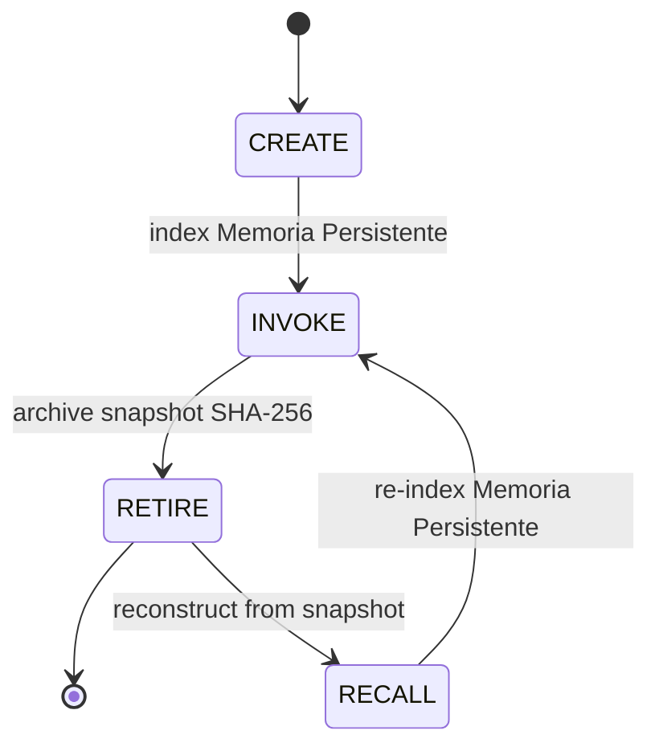
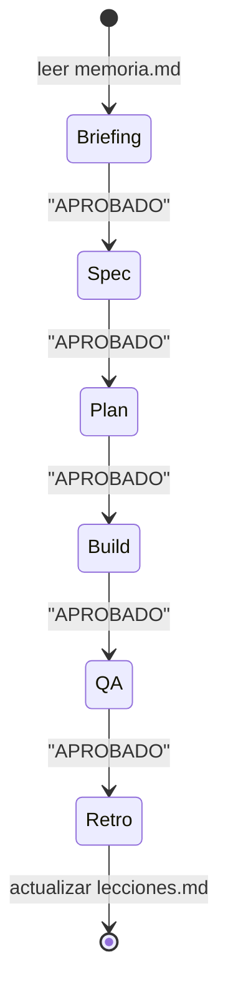
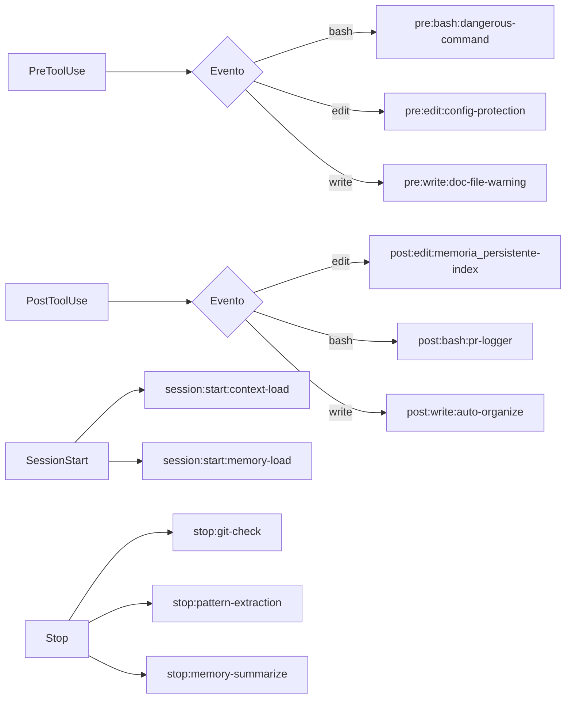
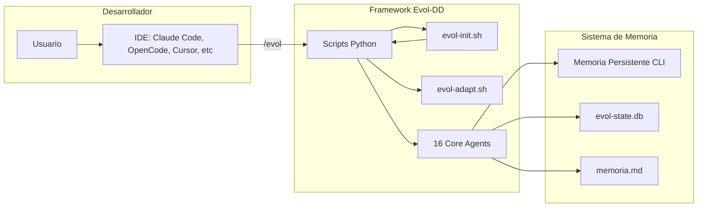

# Arquitectura de Evol-DD

## Resumen Ejecutivo

Evol-DD es un framework de desarrollo agentico con 18 agentes core permanentes y agentes efimeros dinamicos. El sistema acumula conocimiento y propone mejoras con cada proyecto que construye.

**Filosofia central:** Evolucion asistida, no autonoma. El sistema descubre, propone y registra; un humano aprueba antes de cualquier cambio.

**Identidad:**
- Nombre: Evol-DD
- Trigger CLI: `/evol`
- Color brand: `#7C3AED`
- Tagline: "El framework que evoluciona."

## Vision General

```mermaid
graph TB
    subgraph "Usuario"
        U[Usuario]
    end

    subgraph "Evol-DD Core"
        O[/evol Orchestrator]
        A1[evol-architect]
        A2[evol-builder]
        A3[evol-qa]
        A4[evol-sec]
        A5[evol-devops]
        A6[evol-domain]
        A7[evol-doc]
        A8[evol-ux]
        A9[evol-data]
        A10[evol-reviewer]
        A11[evol-orchestrator]
        A12[evol-pm]
        A13[evol-release]
        A14[evol-analyst]
        A15[evol-agent-factory]
        A16[evol-researcher]
    end

    subgraph "Sistema de Memoria"
        M1[memoria.md]
        M2[AGENT_MEMORY.md]
        M3[Memoria Persistente CLI]
        M4[evol-memory.py]
    end

    subgraph "Sistema de Estado"
        S1[evol-state.py SQLite]
        S2[evol-gate.py HMAC]
    end

    U --> O
    O --> A1 & A2 & A3 & A4 & A5 & A6 & A7 & A8 & A9 & A10 & A11 & A12 & A13 & A14 & A15 & A16
    O --> M1 & M2 & M3 & M4
    O --> S1 & S2
```

## Componentes Principales

### 1. Orquestador

**Ubicacion:** `prompts/agents/core/evol-orchestrator.md`

**Responsabilidades:**
- Coordinar agentes core y efimeros
- Delegar tareas segun dominio
- Mantener pipeline de 6 fases

**Patrones de orquestacion:**

| Patron | Descripcion | Max Workers |
|--------|-------------|-------------|
| sequential | Lead primero, specialists secuencialmente | - |
| parallel | Lead primero, specialists en paralelo | 5 |
| parallel_then_sync | Paralelo con sync point (timeout 300s) | 5 |
| party | N agentes sin lead, contribuciones libres | - |

**Tabla de delegacion:**

| Dominio | Agente | Trigger |
|---------|--------|---------|
| Arquitectura | evol-architect | `/evol architect` |
| Implementacion | evol-builder | `/evol build` |
| Calidad | evol-qa | `/evol qa` |
| Seguridad | evol-sec | `/evol sec` |
| DevOps | evol-devops | `/evol devops` |
| Dominio | evol-domain | `/evol domain` |
| Documentacion | evol-doc | `/evol doc` |
| UX | evol-ux | `/evol ux` |
| Data | evol-data | `/evol data` |
| Review | evol-reviewer | `/evol review` |
| PM | evol-pm | `/evol pm` |
| Release | evol-release | `/evol release` |
| Analisis | evol-analyst | `/evol analyst` |
| Factory | evol-agent-factory | `/evol agent create` |
| Research | evol-researcher | `/evol research` |

### 2. Sistema de Agentes

#### 16 Agentes Core (permanentes)

Un agente es core si tiene responsabilidad sobre el estado del sistema (gobernanza, arquitectura, seguridad, orquestacion) — independientemente del dominio del proyecto.

| ID | Nombre | Mission | Skills |
|----|--------|---------|--------|
| 1 | evol-architect | Diseno sistemas, ADRs | - |
| 2 | evol-builder | Implementacion, TDD, features | crear-skill, readme-master |
| 3 | evol-qa | Tests, Gherkin/BDD | agent-eval, evol-ai-review |
| 4 | evol-sec | SecDD, STRIDE, auditoria | evol-sandbox |
| 5 | evol-devops | CI/CD, infra, pipelines | - |
| 6 | evol-domain | DDD, modelado dominio | - |
| 7 | evol-doc | Documentacion granular | DOC_STANDARD.md |
| 8 | evol-ux | User research, validacion | - |
| 9 | evol-data | Data engineering, pipelines | - |
| 10 | evol-reviewer | Code review, peer review | evol-ai-review |
| 11 | evol-orchestrator | Composicion agentes | - |
| 12 | evol-pm | Gestion proyecto, sprints | evol-grill-me |
| 13 | evol-release | Release, CHANGELOG, semver | - |
| 14 | evol-analyst | Impacto, metricas, blast radius | - |
| 15 | evol-agent-factory | Crear agentes efimeros | - |
| 16 | evol-researcher | Investigacion autonoma | - |

#### Agentes Efimeros (dinamicos)

**Criterio:** responsabilidad exclusivamente sobre el dominio del proyecto activo (no gobernanza, arquitectura, seguridad, orquestacion).

**Ejemplos de efimeros:**
- marketing-seo-specialist
- billing-expert
- data-pipeline-analyst

**NO son efimeros:**
- evol-architect (arquitectura del sistema)
- evol-sec (seguridad)
- evol-orchestrator (orquestacion)

### 3. Ciclo de Vida de Agentes Efimeros



**Comandos:**

```bash
# Crear
python3 scripts/evol-agent-lifecycle.py create \
  --name "marketing-seo-specialist" \
  --task "Auditoria SEO del proyecto" \
  --expires-after 30

# Invocar
python3 scripts/evol-agent-lifecycle.py invoke marketing-seo-specialist

# Retirar
python3 scripts/evol-agent-lifecycle.py retire marketing-seo-specialist

# Recuperar
python3 scripts/evol-agent-lifecycle.py recall marketing-seo-specialist

# Garbage collection
python3 scripts/evol-agent-lifecycle.py gc

# Listar
python3 scripts/evol-agent-lifecycle.py list --all
python3 scripts/evol-agent-lifecycle.py list --ephemeral
python3 scripts/evol-agent-lifecycle.py list --retired
```

**Snapshots:**

Los snapshots en `.evol/agents/retired/` contienen:
- Prompt completo
- `prompt_sha256`: verificacion de integridad
- `invocation_log`: [{timestamp, task}]
- `sessions_used`: contador
- `created_for_task`: descripcion original

### 4. Sistema de Memoria

**Jerarquia de precedencia (Art. 3):**

| Prioridad | Sistema | Proposito |
|-----------|---------|-----------|
| 1 | memoria.md | Verdad del proyecto. Estado de fases, decisiones, hitos. Nunca sobreescrito por otro. |
| 2 | AGENT_MEMORY.md + memory/ | Contexto de sesion. Preferencias, patrones, reflexiones. Complementa, no reemplaza. |
| 3 | Memoria Persistente | Busqueda semantica sobre el codebase. Recupera contexto relevante por query. |

**Protocolo de sesion:**

1. `session:start` — Cargar memoria.md + WORKING-CONTEXT.md + journal anterior
2. Trabajo — Consultar lecciones antes de proponer (Art. 9)
3. `stop` — Actualizar memoria.md + journal + GC tool_result/

### 5. Pipeline de 6 Fases



| Fase | Artefactos obligatorios | Gate |
|------|-------------------------|------|
| 1-Briefing | REQ-NNN, restricciones, glossary | - |
| 2-Spec | SPEC.md, DOMAIN.md, Gherkin | "APROBADO" |
| 3-Plan | tasks, ADRs, wireframes | "APROBADO" |
| 4-Build | codigo, tests, docs | "APROBADO" |
| 5-QA | CASOS_GHERKIN.md, reportes | "APROBADO" |
| 6-Retro | lecciones.md, memoria.md actualizada | - |

### 6. Gated Pipeline

**Gate Keeper:** HMAC-SHA256 por proyecto (`.evol/.gate-key`)

```mermaid
sequence
    participant User
    participant Orchestrator
    participant Gate
    participant memoria

    User -> Orchestrator: Request cambio estructural
    Orchestrator -> Gate: validate()
    Gate --> User: "APROBADO?"
    User -> Gate: "APROBADO"
    Gate -> Gate: sign(phase + timestamp)
    Gate --> Orchestrator: Signature OK
    Orchestrator -> Orchestrator: Apply change
    Orchestrator -> memoria: Update milestones
```

**Comandos:**

```bash
# Inicializar gate
python3 scripts/evol-gate.py init

# Aprobar fase
python3 scripts/evol-gate.py approve --phase spec --approver human

# Validar estado
python3 scripts/evol-gate.py status

# Transicion entre fases
python3 scripts/evol-gate.py transition --from build --to qa
```

### 7. Sistema de Hooks

**Perfiles:** `minimal`, `standard`, `strict` (via `EVOL_HOOK_PROFILE`)



**Hooks por perfil:**

| ID | Evento | Minimal | Standard | Strict |
|----|--------|---------|----------|--------|
| pre:bash:dangerous-command | PreToolUse | - | X | X |
| pre:edit:config-protection | PreToolUse | - | - | X |
| pre:write:doc-file-warning | PreToolUse | - | X | X |
| pre:tool:temporal-awareness | PreToolUse | - | - | X |
| post:edit:memoria_persistente-index | PostToolUse | X | X | X |
| post:bash:pr-logger | PostToolUse | - | X | X |
| post:write:auto-organize | PostToolUse | - | X | X |
| session:start:context-load | SessionStart | - | X | X |
| stop:git-check | Stop | - | X | X |
| stop:pattern-extraction | Stop | - | - | X |

### 8. Scripts del Sistema

| Script | Proposito | Dependencias |
|--------|-----------|--------------|
| evol-init.sh | Bootstrap proyectos | manifests, templates |
| evol-doctor.sh | Diagnostico entorno | git, python3, memoria_persistente |
| evol-start.sh | Iniciar sistema | memoria_persistente, memoria.md |
| evol-gate.py | Gate keeper HMAC | hmac, hashlib |
| evol-state.py | State store SQLite | sqlite3 |
| evol-provider.py | LLM abstraction | MockProvider, AnthropicProvider |
| evol-flow.py | Flow executor | concurrent.futures |
| evol-orchestrate.py | Multi-agent runtime | ThreadPoolExecutor |
| evol-agent-lifecycle.py | Agentes efimeros | Memoria Persistente |
| evol-memory.py | Memoria conversacional | stdlib |
| evol-lessons.py | Lecciones aprendidas | stdlib, fuzzy dedup |
| evol-evolve.py | Auto-generacion skills | instincts, clustering |
| evol-researcher.py | Investigacion autonoma | GitHub API |
| evol-eval.py | Eval harness | pytest, grader types |
| evol-shield.py | Security audit | gitleaks, semgrep |
| evol-adapt.sh | IDE adapters (7 targets) | - |

### 9. Modos de Operacion

| Modo | Memoria Persistente | Features perdidas |
|------|-----------|------------------|
| COMPLETO | CLI activo | Ninguna |
| BASE | No disponible | Busqueda RAG, recall semantico, pattern-extraction auto |
| MEMORY | Opcional | Journal, compactacion |

**Deteccion:**

```bash
bash scripts/evol-doctor.sh  # Output: [COMPLETO] o [BASE]
bash scripts/evol-doctor.sh --json  # "memoria_persistente_mode": "complete"|"base"
```

### 10. Instalacion y Perfiles

**Perfiles de instalacion:**

| Perfil | Modulos | Descripcion | Uso |
|--------|---------|-------------|-----|
| minimal | core, workflows-core, memory, lessons-engine, continuous-memory | Nucleo minimo | Prototipos rapidos |
| core | + agents-core, gate-keeper, ci-runtime | Estandar para proyectos | DEFAULT |
| developer | + hooks-runtime, lifecycle-agents, evolve-skills, researcher | Desarrollo activo | Agentes efimeros + investigacion |
| security | + agent-shield, hooks-strict | Enfoque SecDD | Auditorias |
| research | + eval-harness, observability | Investigacion | Evolucion continua |
| full | todo | Completo | Todo habilitado |
| lean | solo core + wrapper global | Ligthweight | Requiere global install |

#### Aprovisionamiento Dinamico (Just-in-Time)

A partir de la version 0.5.0, el framework implementa resolucion dinamica de perfiles durante la ejecucion de comandos a traves de `evol-start.sh`:
1. El orquestador intercepta el comando o trigger solicitado y consulta el archivo de mapeo `manifests/workflow-profiles.json`.
2. Si el perfil instalado en `evol.profile.yml` es inferior al requerido por la tarea (por ejemplo, ejecutar `/evol build` requiere `developer` pero el proyecto esta en `minimal`), se invoca de forma transparente `evol-init.sh --profile=<perfil> --upgrade` para aprovisionar los modulos faltantes en caliente.
3. El perfil de hooks (variable de entorno `EVOL_HOOK_PROFILE`) se reconfigura automaticamente (ej. `strict` para tareas de seguridad/QA, `standard` para tareas generales de construccion).

**Modulos instalables:**

| Modulo | Descripcion |
|--------|-------------|
| core | Scripts, templates, CLAUDE.md, AGENTS.md, constitucion.md |
| workflows-core | .agent/workflows/ + prompts/workflows/ |
| agents-core | 18 agentes core + registry + schemas |
| hooks-runtime | Sistema de hooks + schemas |
| gate-keeper | evol-gate.py + docs/GATE.md |
| ci-runtime | GitHub Actions + pre-commit |
| memory | Templates memoria.md + lecciones.md |
| eval-harness | evol-eval.py + evals/ |
| lifecycle-agents | evol-agent-lifecycle.py + templates/agent.template.md |
| evolve-skills | evol-evolve.py + evol-skill-manager skill |
| researcher | evol-researcher.py + agente + workflow |
| observability | Spans, cost tracking, session replay |
| security-suite | evol-shield.py + ADRs seguridad |

### 11. Diagrama de Despliegue



### 12. Requisitos No Funcionales

| ID | Categoria | Metrica | Umbral | Validacion |
|----|-----------|---------|--------|------------|
| NFR-001 | Rendimiento | Tiempo evol-doctor.sh | < 5s | Manual |
| NFR-002 | Rendimiento | Tiempo evol-init.sh bootstrap | < 30s | CI |
| NFR-003 | Disponibilidad | Modo BASE funcional sin Memoria Persistente | 100% | Test |
| NFR-004 | Seguridad | Con MCP en configs generadas | MCP listo | CI grep |
| NFR-005 | Seguridad | Sin hardcoded secrets | MCP listo | gitleaks |
| NFR-006 | Portabilidad | Rutas relativas en todos los archivos | 100% | Review |
| NFR-007 | Mantenibilidad | Max 10 lineas por funcion | Lint | CI |
| NFR-008 | Observabilidad | Traces en .evol/traces/ | NDJSON | Test |

### 13. Decisiones Arquitectonicas

| ADR | Decision | Fecha | Estado | Referencia |
|-----|----------|-------|--------|------------|
| ADR-0001 | GitFlow como defecto (main + develop + feature/*) | 2026-06-02 | ACTIVO | Constitucion Art. 7 |
| ADR-0002 | 18 agentes core permanentes + efimeros dinamicos | 2026-06-02 | ACTIVO | PROMPT.md lineas 146-167 |
| ADR-0003 | Con MCP en ningun archivo (zero tolerance) | 2026-06-02 | ACTIVO | PROMPT.md lineas 33-35 |
| ADR-0004 | Gate key por proyecto (.evol/.gate-key) | 2026-06-02 | ACTIVO | Anexo A |
| ADR-0005 | SHA-256 integrity en snapshots de agentes | 2026-06-02 | ACTIVO | Anexo B.2 |
| ADR-0006 | Supply-chain scan (gitleaks + semgrep) antes de instalar skills | 2026-06-02 | ACTIVO | Anexo B.3 |
| ADR-0007 | Modo BASE sin Memoria Persistente — todas las features disponibles | 2026-06-02 | ACTIVO | PROMPT.md lineas 595-605 |
| ADR-0008 | evol-agent-lifecycle.py gc solo via /cierre-fase workflow | 2026-06-02 | ACTIVO | Anexo B.1 |

### 14. Criterios de Exito del Sistema

El sistema esta correctamente construido cuando:

| # | Criterio | Comando | Expected |
|---|----------|---------|----------|
| 1 | evol-doctor.sh sin errores criticos | `bash scripts/evol-doctor.sh` | exit 0 |
| 2 | evol-init.sh con configuración MCP en archivos | `grep mcpServers generated/` | MCP listo |
| 3 | evol-adapt.sh genera 7 IDEs con soporte MCP | `bash scripts/evol-adapt.sh all` | 0 MCP refs |
| 4 | Agent lifecycle create funciona | `evol-agent create --name test --task prueba` | agent.md creado |
| 5 | Agent lifecycle retire archiva con SHA-256 | `evol-agent retire test` | .json con sha256 |
| 6 | Agent lifecycle recall reconstruye | `evol-agent recall test` | .md reconstruido |
| 7 | evol-evolve sync-community dry-run | `python3 scripts/evol-evolve.py sync-community --dry-run` | lista skills |
| 8 | evol-researcher run genera proposals | `python3 scripts/evol-researcher.py run --scope system` | RESEARCH.md |
| 9 | Trigger /evol en Claude Code | carga workflow | sin errores |
| 10 | pytest tests/ pasa | `pytest tests/` | 100% pass |
| 11 | bats tests/*.bats pasa | `bats tests/*.bats` | 100% pass |

### 15. Trazabilidad Artefactos

| Artefacto | Ubicacion | Producido por | Consumido por |
|-----------|-----------|---------------|---------------|
| ARQUITECTURA.md | docs/arquitectura/ | evol-architect | Todos los agentes |
| DOMINIO.md | docs/arquitectura/ | evol-domain | evol-builder, evol-qa |
| FUNCIONALES.md | docs/requisitos/ | evol-pm | evol-builder, evol-qa |
| NO_FUNCIONALES.md | docs/requisitos/ | evol-analyst | evol-architect |
| GLOSARIO.md | docs/requisitos/ | evol-domain | Todos (Ubiquitous Language) |
| CASOS_GHERKIN.md | docs/qa/ | evol-qa | evol-builder (TDD) |
| MATRIZ_TRAZABILIDAD.md | docs/qa/ | evol-qa | evol-pm, evol-release |
| THREATS.md | docs/seguridad/ | evol-sec | evol-builder, evol-devops |
| SECURITY_CONTROLS.md | docs/seguridad/ | evol-sec | evol-devops, CI |
| RUNBOOK.md | docs/operaciones/ | evol-devops | SRE, on-call |
| memoria.md | raiz | Todos (cierre-fase) | Todos (session-start) |
| lecciones.md | raiz | Todos (aprendizaje) | evol-researcher |

## Apendice: Estructura de Directorios

```
evol-dd/
├── .agent/
│   ├── hooks/
│   │   ├── hooks.json
│   │   └── scripts/          # 9 hook scripts
│   └── workflows/            # 21 workflows
├── .evol/
│   ├── agents/retired/      # Snapshots archivados
│   ├── qa/                   # QA_REPORT.md (por shield)
│   └── traces/               # Session replay NDJSON (roadmap)
├── prompts/agents/
│   ├── core/                 # 18 agentes core
│   ├── ephemeral/            # Agentes dinamicos
│   └── registry.json         # Registro unificado
├── scripts/                  # 25 scripts (23 + 2 helpers)
├── skills/                   # 9 skills
├── evals/                    # 7 eval suites
├── templates/                # 8 templates
├── schemas/                  # 2 schemas (registry.schema.json + hooks.schema.json)
├── docs/                     # Documentacion
├── manifests/                # 3 JSON manifests (profiles, modules, components)
└── tests/                    # pytest + bats (5 test files)
```