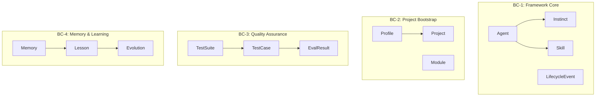
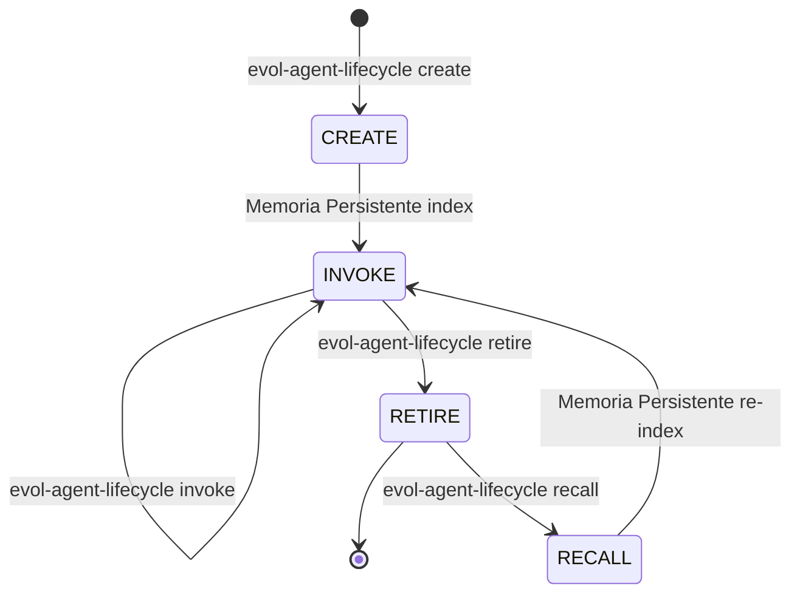
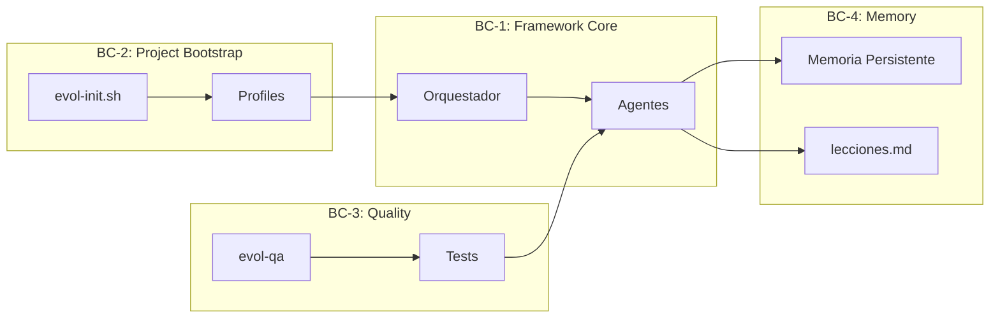

# Modelo de Dominio — Evol-DD

## Resumen

Este documento describe el modelo de dominio de Evol-DD usando DDD (Domain-Driven Design). Define bounded contexts, entidades, value objects, agregados, servicios de dominio y eventos.

## Bounded Contexts

Evol-DD se divide en 4 bounded contexts, cada uno con su propio modelo y responsabilidad.



### BC-1: Framework Core

**Proposito:** Nucleo del framework — agentes, memoria, pipeline.

**Responsabilidad:** Coordinar agentes, gestionar ciclos de vida, mantener estado del sistema.

### BC-2: Project Bootstrap

**Proposito:** Bootstrap de nuevos proyectos.

**Responsabilidad:** Instalar perfiles, resolver modulos, copiar artefactos.

### BC-3: Quality Assurance

**Proposito:** Testing y calidad.

**Responsabilidad:** Casos de prueba, evaluacion, reportes.

### BC-4: Memory & Learning

**Proposito:** Conocimiento acumulado.

**Responsabilidad:** Memorias, lecciones, evoluciones.

---

## Entidades

### Agent (BC-1)

| Atributo | Tipo | Descripcion | Invariante |
|----------|------|-------------|-----------|
| id | string | Identificador unico kebab-case | No null, unico |
| name | string | Nombre legible | No null |
| category | enum | core o ephemeral | core/ephemeral |
| prompt_file | string | Ruta al archivo .md | Null si retired |
| ephemeral | boolean | true si es efimero | - |
| expires_after_days | integer | Dias hasta expiracion | > 0 si efimero |
| created_at | ISO8601 | Fecha creacion | - |
| retired | boolean | true si retirado | - |
| retired_at | ISO8601 | Fecha retiro | Null si no retired |
| sessions_used | integer | Contador de invocaciones | >= 0 |
| recalled | boolean | true si fue recuperado | - |
| created_for_task | string | Tarea original (efimeros) | Null si core |

**Ciclo de vida:** CREATE → INVOKE → RETIRE → [RECALL]



### Instinct (BC-1)

| Atributo | Tipo | Descripcion |
|----------|------|-------------|
| id | integer | Identificador unico |
| pattern | string | Patron detectado (unique) |
| context | string | Contexto del patron |
| confidence | float | Nivel de confianza (0.0-1.0) |
| source | string | Fuente del patron |
| created_at | ISO8601 | Fecha creacion |
| last_seen | ISO8601 | Ultima vez visto |
| invalidated | boolean | true si es anti-patron |
| invalidation_reason | string | Razon de invalidacion |

### Skill (BC-1)

| Atributo | Tipo | Descripcion |
|----------|------|-------------|
| name | string | Nombre unico kebab-case |
| description | string | Descripcion de una linea |
| category | string | Categoria (context-engineering, etc) |
| triggers | array | Palabras trigger para activacion |
| created_at | ISO8601 | Fecha creacion |
| auto_generated | boolean | true si generada por evolve |

### Project (BC-2)

| Atributo | Tipo | Descripcion |
|----------|------|-------------|
| path | string | Ruta absoluta del proyecto |
| profile | string | Perfil de instalacion |
| stacks | object | Stacks configurados |
| capabilities | object | Capacidades habilitadas |

### Profile (BC-2)

| Atributo | Tipo | Descripcion |
|----------|------|-------------|
| name | string | Nombre del perfil |
| modules | array | Modulos incluidos |
| description | string | Descripcion corta |

### Module (BC-2)

| Atributo | Tipo | Descripcion |
|----------|------|-------------|
| name | string | Nombre del modulo |
| required | boolean | true si es requerido en todos |
| dependencies | array | Modulos dependientes |
| artifacts | array | Archivos a instalar |

### TestSuite (BC-3)

| Atributo | Tipo | Descripcion |
|----------|------|-------------|
| name | string | Nombre de la suite |
| cases | array | Casos de prueba |
| grader_type | enum | structural/behavioral/output_match/pass_at_k/llm_judge |
| pass_threshold | float | Umbral para pasar (0.0-1.0) |

### TestCase (BC-3)

| Atributo | Tipo | Descripcion |
|----------|------|-------------|
| id | string | Identificador unico |
| input | string | Input para el test |
| expected | string | Resultado esperado |
| metadata | object | Metadatos adicionales |

### Memory (BC-4)

| Atributo | Tipo | Descripcion |
|----------|------|-------------|
| type | enum | agent_longterm / session_journal / tool_cache |
| path | string | Ruta al archivo |
| created_at | ISO8601 | Fecha creacion |
| last_accessed | ISO8601 | Ultimo acceso |

### Lesson (BC-4)

| Atributo | Tipo | Descripcion |
|----------|------|-------------|
| id | string | Titulo unico |
| category | enum | ARQUITECTURA/SEGURIDAD/DOMINIO/TESTING/DEVOPS/PROCESO/HERRAMIENTAS |
| contexto | string | Situacion inicial |
| problema | string | Que fallo |
| causa | string | Causa raiz |
| leccion | string | Regla aprendida |
| aplica | string | Ambito de aplicacion |
| fix_aplicado | string | Fix ya implementado |
| mejoras | string | Propuestas pendientes |
| estado | enum | pendiente/en_progreso/aplicado |

---

## Value Objects

### AgentMetadata (BC-1)

| Campo | Tipo | Inmutable |
|-------|------|-----------|
| created_at | ISO8601 | Si |
| retired_at | ISO8601 | Si |
| sessions_used | integer | Si |

### InstinctConfidence (BC-1)

| Campo | Tipo | Validacion |
|-------|------|------------|
| value | float | 0.0 <= value <= 1.0 |
| source | string | No null |
| last_seen | ISO8601 | ISO8601 valido |

### SkillTrigger (BC-1)

| Campo | Tipo | Validacion |
|-------|------|------------|
| trigger | string | No null, lowercase |
| category | string | De catalogo |

### ProfileModule (BC-2)

| Campo | Tipo | Validacion |
|-------|------|------------|
| name | string | De catalogo modules |
| optional | boolean | - |

---

## Agregados

### Agent Aggregate (BC-1)

```
Agent (Aggregate Root)
  + LifecycleEvent[] (Value Objects)
```

**Reglas de consistencia:**
1. Un agent no puede ser invoked si esta retired
2. Un agent efimero expira si created_at + expires < now
3. Un agent core nunca puede ser retired

### Instinct Cluster Aggregate (BC-1)

```
Instinct (Aggregate Root)
  + Cluster[] (meta-agregado)
```

**Reglas de consistencia:**
1. confidence solo aumenta con mas apariciones
2. invalidation es permanente

---

## Servicios de Dominio

### AgentLifecycleService

| Metodo | Input | Output | Descripcion |
|--------|-------|--------|-------------|
| create | name, task, expires | Agent | Crea agente efimero |
| invoke | agent_id | void | Marca sesion |
| retire | agent_id | Snapshot | Archiva y elimina |
| recall | agent_id | Agent | Reconstruye |
| gc | void | count | Limpia vencidos |

### InstinctExtractionService

| Metodo | Input | Output | Descripcion |
|--------|-------|--------|-------------|
| extract | session_messages | Instinct[] | Detecta patrones |
| cluster | instincts[] | Cluster[] | Agrupa por similitud |
| invalidate | instinct_id, reason | void | Marca anti-patron |

### MemoryConsolidationService

| Metodo | Input | Output | Descripcion |
|--------|-------|--------|-------------|
| load | void | MemoryContext | Carga contexto |
| summarize | messages_file | void | Persiste sesion |
| compact | messages_file | void | Resume historial |
| search | query | Results[] | BM25 search |

### EvolutionService

| Metodo | Input | Output | Descripcion |
|--------|-------|--------|-------------|
| propose | cluster | Skill | Genera propuesta |
| approve | skill_id | void | Activa skill |
| invalidate | instinct_id | void | Anti-patron |
| rollback | skill_id | void | Desactiva |

---

## Eventos de Dominio

| Evento | Trigger | Acciones | BC |
|--------|---------|----------|----|
| AgentCreated | create | Index Memoria Persistente, update registry | BC-1 |
| AgentInvoked | invoke | Increment sessions_used | BC-1 |
| AgentRetired | retire | Archive snapshot, SHA-256 | BC-1 |
| AgentRecalled | recall | Reconstruct .md, re-index | BC-1 |
| InstinctExtracted | stop-hook | Save to SQLite | BC-1 |
| SkillProposed | evolve run | Record in evolutions | BC-4 |
| SkillApproved | approve | Activate skill, index | BC-4 |
| LessonAdded | lessons add | Save to lecciones.md | BC-4 |
| PhaseTransition | gate approve | Update memoria.md | BC-1 |

---

## Ubiquitous Language

| Termino | Definicion | Sinonimos | Antónimos |
|---------|-----------|-----------|-----------|
| Core Agent | Agente permanente con responsabilidad sobre estado del sistema | Agent permanente | Ephemeral Agent |
| Ephemeral Agent | Agente dinamico creado para tarea especifica | Agent temporal | Core Agent |
| Instinct | Patron detectado con confianza > threshold | Pattern, heuristic | - |
| Skill | Capacidad especializada activable por trigger | Capability, feature | - |
| Lifecycle | CREATE -> INVOKE -> RETIRE -> [RECALL] | Ciclo, vida | - |
| Gate | Checkpoint HMAC-SHA256 para cambios estructurales | Approval, checkpoint | - |
| Memoria Persistente | Sistema de busqueda semantica CLI | Semantic search | - |
| Trigger | Palabra clave para activar workflow/agent | Slash command | - |
| Snapshot | Archivo JSON archivado de agente retired | Archive, backup | - |
| Cluster | Grupo de instincts similares para propuesta | Group, bundle | - |
| Evolution | Proceso de auto-generacion de skills | Auto-improvement | - |

---

##限界上下文 Integration



**Integraciones:**
- BC-1 -> BC-4: Agentes consultan lecciones antes de proponer
- BC-2 -> BC-1: Perfil determina agentes disponibles
- BC-3 -> BC-1: Tests influencian evoluciones

---

## Repositorio

| Entidad | Persistencia |
|---------|-------------|
| Agent | registry.json (ephemeral), prompts/agents/core/ (core) |
| Instinct | SQLite evol-state.db |
| Skill | skills/<nombre>/SKILL.md |
| Snapshot | .evol/agents/retired/<name>.json |
| Lesson | lecciones.md |
| Memory | AGENT_MEMORY.md, memory/YYYY-MM-DD.md |
| Evolution | evol-state.db (evolutions table) |

---

## Factory

### AgentFactory

**Responsabilidad:** Crear agentes efimeros.

**Protocolo:**
1. Validar nombre unico
2. Leer templates/agent.template.md
3. Reemplazar placeholders
4. Guardar en prompts/agents/ephemeral/
5. Registrar en registry.json
6. Indexar Memoria Persistente

### SkillFactory

**Responsabilidad:** Generar skills desde clusters.

**Protocolo:**
1. Generar nombre desde cluster_id
2. Crear directorio skills/<nombre>/
3. Generar SKILL.md con frontmatter
4. Generar eval suite en evals/<nombre>/
5. Indexar Memoria Persistente