# Componentes — Evol-DD

Diagrama de componentes nivel C4 del sistema Evol-DD.

## Diagrama de componentes

```mermaid
graph TD
    subgraph CLI["evol CLI (src/evol_cli/)"]
        ENTRY[__init__.py\ndispatcher pip]
    end

    subgraph CORE["Core Scripts (scripts/)"]
        INIT[evol-init.sh\nBootstrap + perfiles]
        GATE[evol-gate.py\nHMAC-SHA256 chain]
        DOCTOR[evol-doctor.sh\nDiagnostico entorno]
        START[evol-start.sh\nArranca runtime]
        ADAPT[evol-adapt.sh\nConfig 7 IDEs]
        FLOW[evol-flow.py\nGate ejecutable]
        PROVIDER[evol-provider.py\nPuerto LLM hexagonal]
        COMMON[_evol_common.py\nSSoT helpers]
    end

    subgraph GROWTH["Growth Engine (scripts/)"]
        ORCH[evol-orchestrate.py\nMulti-agent runtime]
        LIFECYCLE[evol-agent-lifecycle.py\nEfimeros CRUD]
        EVOLVE[evol-evolve.py\nSkills auto-gen]
        RESEARCH[evol-researcher.py\nInvestigacion GitHub]
        EVAL[evol-eval.py\nEval-harness]
        SHIELD[evol-shield.py\nAudit estatico]
        BRAND[evol-brand.sh\nWhite-labeling]
        PROFILE[evol-profile.py\nGestion perfiles]
        UPDATE[evol-update.py\nActualizacion framework]
    end

    subgraph MEMORY["Memory System (scripts/ + filesystem)"]
        MEMSCRIPT[evol-memory.py\nMotor ReMe]
        LESSONS[evol-lessons.py\nLecciones aprendidas]
        AGENTMEM[AGENT_MEMORY.md\nMemoria long-term]
        JOURNAL[memory/YYYY-MM-DD.md\nDiarios de sesion]
        DIALOG[memory/dialog/\nHistorial mensajes]
        TOOLRES[memory/tool_result/\nResultados herramientas]
    end

    subgraph STATE["State Store"]
        STATEDB[~/.evol/state.db\nSQLite instincts]
        GATELOG[.evol/.gate-log.jsonl\nChain de aprobaciones]
        GATEKEY[.evol/.gate-key\nClave HMAC]
        STATESCRIPT[evol-state.py\nCRUD instincts]
    end

    subgraph AGENTS["Agentes Core (prompts/agents/core/)"]
        ORCHESTRATOR[evol-orchestrator\nCoordinador maestro]
        ARCHITECT[evol-architect\nArquitectura]
        BUILDER[evol-builder\nCodigo]
        QA[evol-qa\nCalidad]
        SEC[evol-sec\nSeguridad]
        RESEARCHER_AGENT[evol-researcher\nInvestigacion]
        FACTORY[evol-agent-factory\nFabrica de efimeros]
        PM[evol-pm\nGestion proyecto]
        REVIEWER[evol-reviewer\nRevision]
        DOC[evol-doc\nDocumentacion]
        DATA[evol-data\nDatos]
        UX[evol-ux\nExperiencia usuario]
        DEVOPS[evol-devops\nInfraestructura]
        ANALYST[evol-analyst\nAnalisis]
        DOMAIN[evol-domain\nDominio DDD]
        RELEASE[evol-release\nReleases]
        EPHEMERAL[prompts/agents/ephemeral/\nEfimeros generados]
    end

    subgraph SKILLS["Skills (skills/)"]
        CREAR_SKILL[crear-skill\nLoop iterativo creacion]
        CREAR_AGENTE[crear-agente\nCreacion de agentes]
        AI_REVIEW[evol-ai-review\nRevision IA]
        COMPACT[evol-compact\nCompresion tokens]
        FS_CTX[evol-fs-context\nContexto filesystem]
        SANDBOX[evol-sandbox\nAislamiento]
        SKILL_MGR[evol-skill-manager\nGestion skills]
        AGENT_EVAL[agent-eval\nEvaluacion agentes]
        TALK_COMPACT[evol-talk-compact\nComunicacion eficiente]
    end

    subgraph EXTERNAL["Externos (opcionales)"]
        ANTHROPIC[Anthropic API\nEVOL_PROVIDER=anthropic]
        MOCK[MockProvider\ndefault sin red]
        MEMPALACE[MemPalace CLI\nIndexacion semantica]
        GITNEXUS[GitNexus CLI\nCode intelligence opt-in]
        GITHUB_API[GitHub API\n60 req/h publico]
    end

    ENTRY --> CORE
    ENTRY --> GROWTH
    ENTRY --> MEMORY
    ENTRY --> SKILLS

    INIT --> COMMON
    GATE --> COMMON
    GATE --> GATEKEY
    GATE --> GATELOG
    FLOW --> GATE
    FLOW --> PROVIDER

    ORCH --> ORCHESTRATOR
    ORCH --> AGENTS
    LIFECYCLE --> FACTORY
    LIFECYCLE --> STATESCRIPT
    EVOLVE --> STATESCRIPT
    EVOLVE --> STATE
    RESEARCH --> GITHUB_API
    EVAL --> PROVIDER

    MEMSCRIPT --> AGENTMEM
    MEMSCRIPT --> JOURNAL
    MEMSCRIPT --> DIALOG
    MEMSCRIPT --> TOOLRES
    MEMSCRIPT --> PROVIDER
    LESSONS --> AGENTMEM

    STATESCRIPT --> STATEDB
    EVOLVE --> STATEDB

    PROVIDER --> ANTHROPIC
    PROVIDER --> MOCK
    MEMSCRIPT --> MEMPALACE
    RESEARCH --> MEMPALACE
    ADAPT --> GITNEXUS
```

## Tabla de componentes

| Componente | Responsabilidad | Script / Archivo | Dependencias |
|---|---|---|---|
| evol CLI dispatcher | Punto de entrada pip | `src/evol_cli/__init__.py` | scripts/ |
| evol-init.sh | Bootstrap proyecto con perfiles (minimal/core/developer/security/research/full) | `scripts/evol-init.sh` | manifests/*.json, templates/ |
| evol-gate.py | Cadena de aprobaciones HMAC-SHA256; verifica integridad de fases | `scripts/evol-gate.py` | _evol_common.py, .evol/.gate-key |
| evol-flow.py | Ejecuta flujos declarativos (seq/parallel) con provider configurable | `scripts/evol-flow.py` | evol-provider.py, evol-gate.py |
| evol-provider.py | Puerto LLM hexagonal: MockProvider determinista + AnthropicProvider lazy | `scripts/evol-provider.py` | EVOL_PROVIDER env var, Anthropic API |
| _evol_common.py | SSoT helpers: logger, rutas, JSON I/O, mempalace_safe | `scripts/_evol_common.py` | stdlib solo |
| evol-orchestrate.py | Runtime multi-agent (sequential/parallel/parallel_then_sync) | `scripts/evol-orchestrate.py` | agentes core |
| evol-agent-lifecycle.py | CRUD de agentes efimeros: create/list/retire/prune (TTL 90 dias) | `scripts/evol-agent-lifecycle.py` | registry.json, templates/agent.template.md |
| evol-evolve.py | Clusteriza instincts de state.db y genera skills auto con evals | `scripts/evol-evolve.py` | evol-state.py, skills/, evals/ |
| evol-researcher.py | Busqueda GitHub de skills/frameworks con scoring y propuestas rankeadas | `scripts/evol-researcher.py` | GitHub API, evol-provider.py |
| evol-memory.py | Motor ReMe: carga sesion (hook SessionStart), compacta y persiste (hook Stop) | `scripts/evol-memory.py` | AGENT_MEMORY.md, memory/, evol-provider.py |
| evol-lessons.py | Motor de lecciones aprendidas con deduplicacion Jaccard (threshold 0.7) | `scripts/evol-lessons.py` | lecciones.md, evol-provider.py |
| evol-state.py | CRUD SQLite para instincts y sesiones; alimenta evol-evolve.py | `scripts/evol-state.py` | ~/.evol/state.db |
| evol-eval.py | Eval-harness con 5 grader types para skills y agentes | `scripts/evol-eval.py` | evals/, evol-provider.py |
| evol-shield.py | Audit estatico del framework (AgentShield) | `scripts/evol-shield.py` | .xdd/qa/ |
| evol-adapt.sh | Genera config para 7 IDEs via DRY symlinks | `scripts/evol-adapt.sh` | .agent/workflows/, MemPalace, GitNexus |
| evol-doctor.sh | Diagnostico del entorno con salida JSON opcional | `scripts/evol-doctor.sh` | todos los componentes |
| Agentes core (16) | Roles especializados: orchestrator, architect, builder, qa, sec, etc. | `prompts/agents/core/*.md` | registry.json |
| Skills (9) | Capacidades triggereables en IDE: crear-skill, crear-agente, etc. | `skills/*/SKILL.md` | hooks, workflows |
| State DB | Almacenamiento SQLite de instincts y sesiones entre proyectos | `~/.evol/state.db` | evol-state.py |
| AGENT_MEMORY.md | Memoria long-term del agente (hechos facticos, decisiones) | `AGENT_MEMORY.md` en proyecto | evol-memory.py |
| Anthropic API | LLM provider real; activado con EVOL_PROVIDER=anthropic | externo | ANTHROPIC_API_KEY |
| MockProvider | Provider determinista; default sin red para tests y CI | `evol-provider.py` interno | stdlib solo |
| MemPalace CLI | Indexacion semantica de memoria conversacional (MIT, opt-in) | externo local | evol-start.sh |
| GitNexus CLI | Code intelligence y analisis de impacto (PolyForm NC, opt-in) | externo local | XDD_GITNEXUS=1 |
| GitHub API | Busqueda de repositorios para evol-researcher (60 req/h sin token) | externo remoto | GITHUB_TOKEN opcional |
