# Despliegue — Evol-DD

Diagrama de despliegue del sistema Evol-DD mostrando nodos, artefactos y flujos de datos.

## Diagrama de despliegue

```mermaid
graph TD
    subgraph USER["Maquina del usuario"]
        subgraph RUNTIME["Python 3.10+ / Bash 5+ / git"]
            CLI_PIP[evol CLI\npip install evol-dd]
            SCRIPTS[scripts/evol-*.sh\nscripts/evol-*.py]
            GIT_BIN[git\ncontrol de versiones]
        end

        subgraph PROJECT["Proyecto del usuario (./)"]
            EVOL_DIR[.evol/\n.gate-key · .gate-log.jsonl]
            PROMPTS[prompts/\nagents/ · ephemeral/]
            AGENT_DIR[.agent/\nworkflows/ · hooks/]
            SKILLS_DIR[skills/\nSKILL.md por skill]
            TEMPLATES_DIR[templates/\nplantillas Markdown]
            MANIFESTS_DIR[manifests/\ninstall-profiles.json\ninstall-modules.json]
            MEM_FILES[AGENT_MEMORY.md\nmemoria.md · lecciones.md]
            MEM_DIR[memory/\nYYYY-MM-DD.md journals\ndialog/ · tool_result/]
            EVALS_DIR[evals/\ncases.jsonl · grader.yaml]
        end

        subgraph GLOBAL["Estado global del usuario (~/.evol/)"]
            STATE_DB[~/.evol/state.db\nSQLite instincts]
            GATE_KEY[~/.evol/.gate-key\nclave HMAC-SHA256]
        end

        subgraph OPTIONAL_LOCAL["Herramientas opcionales locales"]
            MEMPALACE[MemPalace CLI\nMIT · indexacion semantica]
            GITNEXUS[GitNexus CLI\nPolyForm NC · opt-in EVOL_GITNEXUS=1]
        end
    end

    subgraph GITHUB["GitHub (remoto)"]
        REPO[Repositorio del proyecto\ngit remote origin]
        GH_API[GitHub API\nresearcher 60 req/h publico\n5000 req/h con GITHUB_TOKEN]
    end

    subgraph LLM["LLM Provider (opcional)"]
        MOCK[MockProvider\ndefault · determinista · sin red]
        ANTHROPIC[Anthropic API\nEVOL_PROVIDER=anthropic\nANTHROPIC_API_KEY requerida]
    end

    CLI_PIP -->|invoca| SCRIPTS
    SCRIPTS -->|lee / escribe| PROJECT
    SCRIPTS -->|lee / escribe| GLOBAL
    GIT_BIN -->|push / pull| REPO

    SCRIPTS -->|genera config IDEs via evol-adapt.sh| AGENT_DIR
    SCRIPTS -->|evol-researcher.py queries| GH_API
    SCRIPTS -->|evol-provider.py routing| MOCK
    SCRIPTS -->|evol-provider.py routing| ANTHROPIC

    SCRIPTS -.->|opt-in evol-start.sh| MEMPALACE
    SCRIPTS -.->|opt-in EVOL_GITNEXUS=1| GITNEXUS

    MEMPALACE -->|indexa| MEM_DIR
    GITNEXUS -->|analiza| PROJECT

    MEM_FILES -->|cargado en SessionStart| SCRIPTS
    STATE_DB -->|instincts leidos por evol-evolve.py| SCRIPTS
    GATE_KEY -->|firma HMAC leida por evol-gate.py| SCRIPTS
```

## Tabla de nodos y artefactos

| Nodo | Componente | Protocolo / Mecanismo | Notas |
|---|---|---|---|
| Maquina del usuario | evol CLI (pip) | ejecucion local | Requiere Python 3.10+, Bash 5+, git |
| Maquina del usuario | scripts/evol-*.py | subprocess / stdlib | Sin dependencias externas en modo default |
| Proyecto del usuario | .evol/ | filesystem local | Permisos 0700; gate-key en 0600 |
| Proyecto del usuario | prompts/agents/ | Markdown + registry.json | 16 core + ephemeral generados |
| Proyecto del usuario | skills/ | SKILL.md + hooks + workflows | 9 skills; portables a 7 IDEs via evol-adapt.sh |
| Proyecto del usuario | memory/ | archivos .md por fecha | Journals diarios; TTL configurable via EVOL_MEMORY_TOOL_TTL_DAYS |
| Estado global | ~/.evol/state.db | SQLite3 | Instincts compartidos entre proyectos |
| Estado global | ~/.evol/.gate-key | archivo binario 32 bytes | Clave HMAC unica por instalacion |
| GitHub (remoto) | Repositorio | git over HTTPS/SSH | Trazabilidad de artefactos versionados |
| GitHub (remoto) | GitHub API | HTTPS REST v3 | evol-researcher.py; 60 req/h sin token |
| LLM Provider | MockProvider | en proceso | Default; determinista; sin red; apto para CI |
| LLM Provider | Anthropic API | HTTPS | Activar con EVOL_PROVIDER=anthropic; requiere ANTHROPIC_API_KEY |
| MemPalace CLI | indexacion semantica | CLI local | Licencia MIT; activar con evol-start.sh |
| GitNexus CLI | code intelligence | CLI local | Licencia PolyForm NC; activar con EVOL_GITNEXUS=1; solo proyectos no-comerciales |
