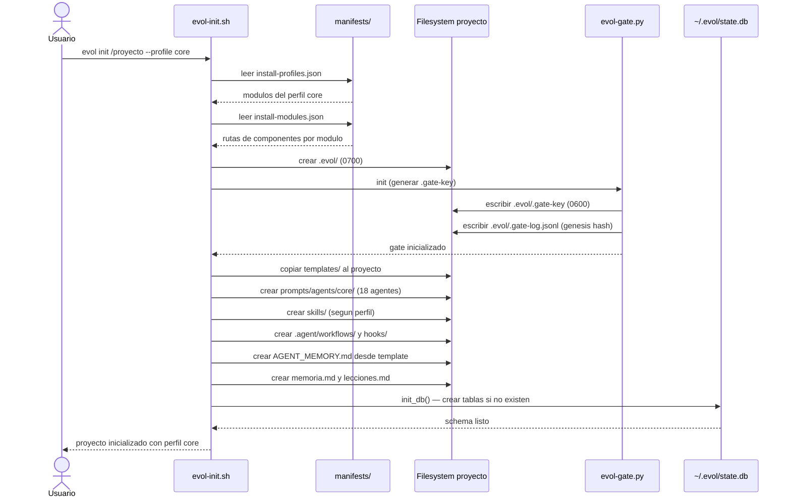
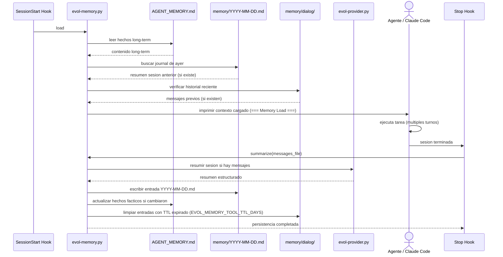
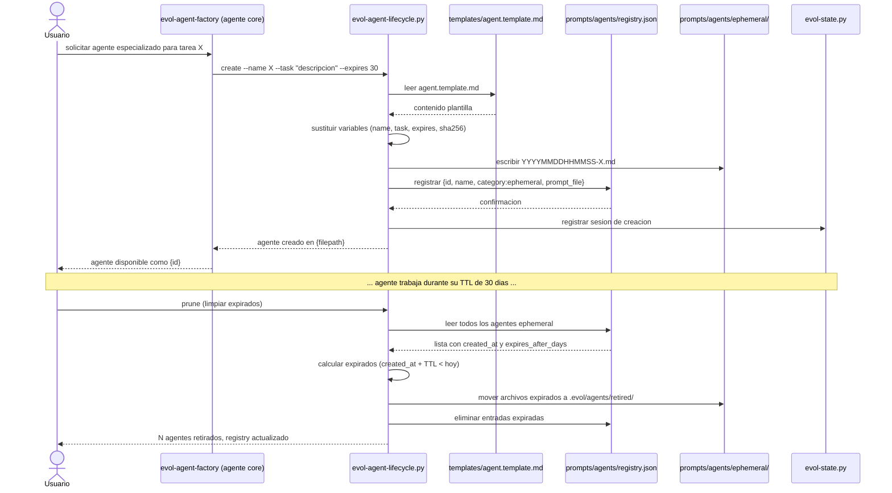
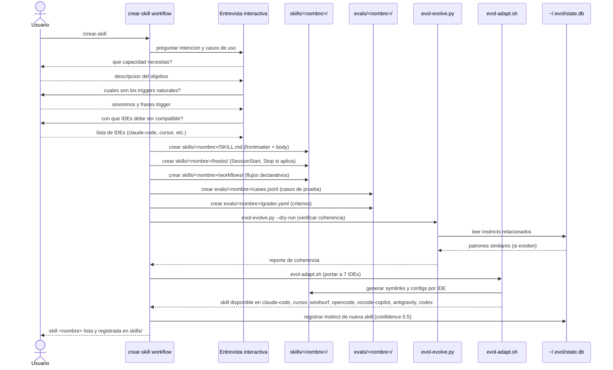

# Flujo de datos — Evol-DD

Diagramas de secuencia para los cuatro flujos principales del sistema.

## Flujo 1: Bootstrap de proyecto nuevo

## Flujo 2: Sesion de trabajo con memoria activa

## Flujo 3: Ciclo de vida de agente efimero

## Flujo 4: Creacion de skill nueva (/crear-skill)

