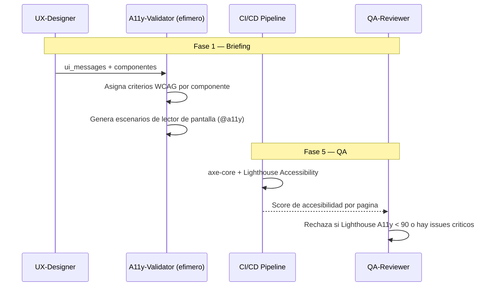

# A11yDD — Accessibility-Driven Development

**Version:** 1.0 | **Fecha:** 2026-06-05 | **Gobernanza:** Constitucion X-DD v1.5

---

## Indice

1. [Que es A11yDD en X-DD](#1-que-es-a11ydd-en-x-dd)
2. [Cuando aplicar](#2-cuando-aplicar)
3. [Artefactos de entrada y salida](#3-artefactos-de-entrada-y-salida)
4. [A11yDD en el pipeline](#4-a11ydd-en-el-pipeline)
5. [Integracion con otras disciplinas](#5-integracion-con-otras-disciplinas)
6. [Criterios de exito](#6-criterios-de-exito)
7. [Definition of Done A11yDD](#7-definition-of-done-a11ydd)
8. [Agentes involucrados](#8-agentes-involucrados)
9. [Fuentes](#9-fuentes)

---

## 1. Que es A11yDD en X-DD

Accessibility-Driven Development es la disciplina donde los criterios WCAG 2.1/2.2 (nivel AA)
se tratan como criterios de aceptacion obligatorios, no como un retrofit posterior. La
accesibilidad es un requisito funcional verificable desde el diseno.

En X-DD, A11yDD opera entre la Fase 1 (Briefing) y la Fase 5 (QA), mapeada al workflow
`/evol a11y-audit`. Produce `a11y/wcag_criteria.json` (criterios por componente) y
`a11y/screen_reader_tests/*.feature` (escenarios de lector de pantalla).

El principio de A11yDD en X-DD: un componente sin criterios WCAG asignados no esta terminado.
La accesibilidad se verifica automaticamente (axe-core, Lighthouse) y manualmente en flujos
criticos; no se asume.

> **executor (registro):** [a11y-audit.md](../../.agent/workflows/a11y-audit.md) — mapeada al
> workflow existente `/evol a11y-audit`. **Activacion por profile:** se inyecta cuando
> `evol.profile.yml` declara `a11ydd` en `methodologies:`.

---

## 2. Cuando aplicar

| Perfil | Aplica | Motivo |
|--------|:------:|--------|
| Sitio web publico | SI | Estandar de accesibilidad esperado |
| Sistema gubernamental / sector publico | SI | Requisito legal de accesibilidad |
| Producto con base de usuarios amplia | SI | Inclusion como requisito de producto |
| Tool interna de uso restringido | WARN | Evaluar segun la audiencia |
| API/servicio sin UI | NO | Sin interfaz que hacer accesible |

---

## 3. Artefactos de entrada y salida

| Direccion | Artefacto | Descripcion |
|-----------|-----------|-------------|
| Entrada | `ux/ui_messages/*.md` | Componentes y mensajes de UI (desde UXDD) |
| Salida | `a11y/wcag_criteria.json` | Criterios WCAG asignados por componente |
| Salida | `a11y/screen_reader_tests/*.feature` | Escenarios de navegacion con lector de pantalla |

---

## 4. A11yDD en el pipeline

### A11yDD por fase

| Fase | Actividad A11yDD | Estado esperado |
|------|------------------|-----------------|
| Fase 1 — Briefing | Asignar criterios WCAG por componente | Criterios definidos |
| Fase 4 — Build | Implementar accesibilidad; inyectar axe-core en tests | Tests a11y en el CI |
| Fase 5 — QA | Lighthouse + axe-core + revision manual de flujos clave | Lighthouse A11y > 90, 0 criticos |

---

## 5. Integracion con otras disciplinas

| Disciplina | Relacion |
|------------|----------|
| [UXDD](./UXDD.md) | Los componentes UX reciben sus criterios WCAG |
| [BDD](./BDD.md) | Escenarios etiquetados `@a11y` para lectores de pantalla |
| [TDD](./TDD.md) | Tests automaticos de accesibilidad con axe-core |
| [DebtBudgetDD](./DebtBudgetDD.md) | Los issues `#a11y` pendientes son deuda contabilizada |

---

## 6. Criterios de exito

- Las paginas pasan Lighthouse Accessibility > 90.
- No hay issues `#a11y` criticos pendientes.
- Todo componente interactivo tiene criterios WCAG 2.1 AA asignados.
- Los flujos criticos pasan revision manual con lector de pantalla.

---

## 7. Definition of Done A11yDD

| Criterio | Verificacion |
|----------|-------------|
| Criterios WCAG por componente | `test -f a11y/wcag_criteria.json` |
| Tests de lector de pantalla | `ls a11y/screen_reader_tests/*.feature` |
| Lighthouse A11y > 90 | Reporte Lighthouse en CI |
| 0 issues axe-core criticos | Reporte axe-core en CI |

---

## 8. Agentes involucrados

| Agente | Rol en A11yDD |
|--------|---------------|
| `UX` | Aporta los componentes y flujos a hacer accesibles |
| `A11y-Validator` (efimero) | Asigna criterios WCAG y genera tests de lector de pantalla |
| `Builder` | Implementa accesibilidad e integra axe-core |
| `QA-Reviewer` | Ejecuta Lighthouse/axe-core y la revision manual en Fase 5 |
| `Reviewer` | Audita la cobertura de criterios WCAG |

---

## 9. Fuentes

Respaldo bibliografico de la disciplina (verificadas via `/evol fact-check`).

| Tipo | Fuente | Aporte |
|------|--------|--------|
| Estandar | [WCAG 2.2 — W3C Recommendation](https://www.w3.org/TR/WCAG22/) | Estandar oficial de pautas de accesibilidad |
| Quick reference | [How to Meet WCAG — W3C](https://www.w3.org/WAI/WCAG22/quickref/) | Referencia operativa de criterios de exito |
| Herramienta | [axe-core — Deque](https://github.com/dequelabs/axe-core) | Motor de testing automatico de accesibilidad |
| Comunidad | [The A11Y Project](https://github.com/a11yproject/a11yproject.com) | Recursos y patrones de accesibilidad |

> **Mantenido por:** UX + QA-Reviewer
> **Gobernado por:** Constitucion X-DD v1.5, Art. 2
> **Ver tambien:** [UXDD.md](./UXDD.md) | [BDD.md](./BDD.md) | [INDEX.md](./INDEX.md)
