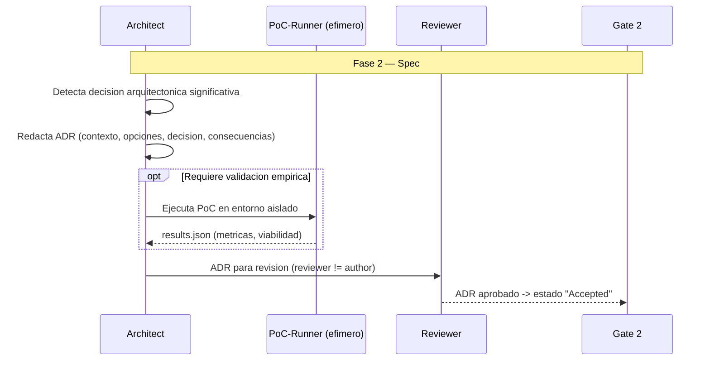

# ADD — Architecture-Driven Development

**Version:** 1.0 | **Fecha:** 2026-06-05 | **Gobernanza:** Constitucion X-DD v1.5

---

## Indice

1. [Que es ADD en X-DD](#1-que-es-add-en-x-dd)
2. [Cuando aplicar](#2-cuando-aplicar)
3. [Artefactos de entrada y salida](#3-artefactos-de-entrada-y-salida)
4. [ADD en el pipeline](#4-add-en-el-pipeline)
5. [Integracion con otras disciplinas](#5-integracion-con-otras-disciplinas)
6. [Criterios de exito](#6-criterios-de-exito)
7. [Definition of Done ADD](#7-definition-of-done-add)
8. [Agentes involucrados](#8-agentes-involucrados)
9. [Fuentes](#9-fuentes)

---

## 1. Que es ADD en X-DD

Architecture-Driven Development es la disciplina donde las decisiones arquitectonicas se
documentan como Architecture Decision Records (ADR) y se validan con pruebas de concepto
(PoC) antes de escribir codigo funcional. Cada decision significativa (eleccion de stack,
patron de comunicacion, estrategia de persistencia) queda registrada con su contexto,
opciones consideradas, decision y consecuencias.

En X-DD, ADD opera en la Fase 2 (Spec). Produce ADRs numerados en `docs/adr/NNNN-*.md`
(formato Nygard) mediante el workflow `/evol adr-new`. Una decision arquitectonica tomada
sin ADR es una decision no trazable: no se puede auditar por que se eligio ni que se
descarto.

El principio de ADD en X-DD: ninguna decision arquitectonica significativa se ejecuta sin
ADR aprobado. El ADR precede al codigo; si la decision requiere validacion empirica, el
PoC se corre en entorno aislado y su resultado se adjunta al ADR.

> **executor (registro):** [adr-new.md](../../.agent/workflows/adr-new.md) — mapeada al
> workflow existente `/evol adr-new`. **Activacion por profile:** se inyecta cuando
> `evol.profile.yml` declara `add` en `methodologies:`.

---

## 2. Cuando aplicar

| Perfil | Aplica | Motivo |
|--------|:------:|--------|
| Sistema distribuido / microservicios | SI | Decisiones de topologia con alto impacto |
| Arquitectura event-driven | SI | Patrones de mensajeria que conviene registrar |
| Tecnologia compleja / nueva en el equipo | SI | El PoC valida antes de comprometerse |
| Script/tool simple | NO | Sin decisiones arquitectonicas significativas |

---

## 3. Artefactos de entrada y salida

| Direccion | Artefacto | Descripcion |
|-----------|-----------|-------------|
| Entrada | `docs/specs/SPEC.md` | Requisitos y restricciones que motivan decisiones |
| Salida | `docs/adr/NNNN-*.md` | ADR numerado en formato Nygard (contexto/decision/consecuencias) |
| Salida | `docs/adr/NNNN-poc/results.json` | Resultados del PoC que respalda la decision (si aplica) |

---

## 4. ADD en el pipeline

### ADD por fase

| Fase | Actividad ADD | Estado esperado |
|------|---------------|-----------------|
| Fase 2 — Spec | Redactar ADRs de decisiones significativas; correr PoCs | ADRs en estado Accepted |
| Fase 3 — Plan | El plan referencia los ADRs que condicionan tareas | Trazabilidad ADR -> tarea |
| Fase 4 — Build | El codigo respeta las decisiones de los ADRs aceptados | Sin desviaciones no documentadas |
| Fase 6 — Retro | Revisar ADRs superados; marcar Superseded si aplica | Estado de ADRs al dia |

---

## 5. Integracion con otras disciplinas

| Disciplina | Relacion |
|------------|----------|
| [SDD](./SDD.md) | Las restricciones de SPEC.md motivan las decisiones del ADR |
| [DDD](./DDD.md) | Los bounded contexts informan decisiones de modularizacion |
| [EDA](./EDA.md) | La eleccion de arquitectura event-driven se registra como ADR |
| [IODD](./IODD.md) | Las decisiones de infraestructura se materializan en IaC |

---

## 6. Criterios de exito

- Cada decision arquitectonica significativa tiene un ADR revisado y aprobado.
- Los ADRs siguen el formato Nygard (contexto, decision, estado, consecuencias).
- Las decisiones que requieren validacion empirica tienen PoC con resultados adjuntos.
- El codigo no contradice ningun ADR en estado Accepted.

---

## 7. Definition of Done ADD

| Criterio | Verificacion |
|----------|-------------|
| ADR numerado por decision significativa | `ls docs/adr/*.md` |
| Formato Nygard completo | Revision estructural del ADR |
| Estado declarado (Proposed/Accepted/Superseded) | Campo de estado presente |
| PoC adjunto si la decision lo requiere | `test -f docs/adr/NNNN-poc/results.json` |

---

## 8. Agentes involucrados

| Agente | Rol en ADD |
|--------|------------|
| `Architect` | Redacta los ADRs y lidera el analisis de opciones |
| `PoC-Runner` (efimero) | Ejecuta pruebas de concepto en entorno aislado |
| `Reviewer` | Audita el ADR antes de aprobarlo (reviewer != author) |
| `Builder` | Implementa respetando las decisiones de los ADRs aceptados |
| `Orchestrator` | Coordina la produccion de ADRs en Fase 2 |

---

## 9. Fuentes

Respaldo bibliografico de la disciplina (verificadas via `/evol fact-check`).

| Tipo | Fuente | Aporte |
|------|--------|--------|
| Origen del concepto | [Documenting Architecture Decisions — Michael Nygard](https://cognitect.com/blog/2011/11/15/documenting-architecture-decisions) | Articulo que introduce el formato ADR (Nygard) |
| Referencia | [Architecture Decision Record — Martin Fowler](https://martinfowler.com/bliki/ArchitectureDecisionRecord.html) | Definicion y mejores practicas de ADRs |
| Guia | [Master ADRs — AWS Architecture Blog](https://aws.amazon.com/blogs/architecture/master-architecture-decision-records-adrs-best-practices-for-effective-decision-making/) | Recomendaciones de AWS para decisiones efectivas |
| Herramienta | [adr-tools](https://github.com/npryce/adr-tools) | CLI Git-native para gestionar ADRs |

> **Mantenido por:** Architect + Reviewer
> **Gobernado por:** Constitucion X-DD v1.5, Art. 2
> **Ver tambien:** [SDD.md](./SDD.md) | [DDD.md](./DDD.md) | [EDA.md](./EDA.md) | [INDEX.md](./INDEX.md)
