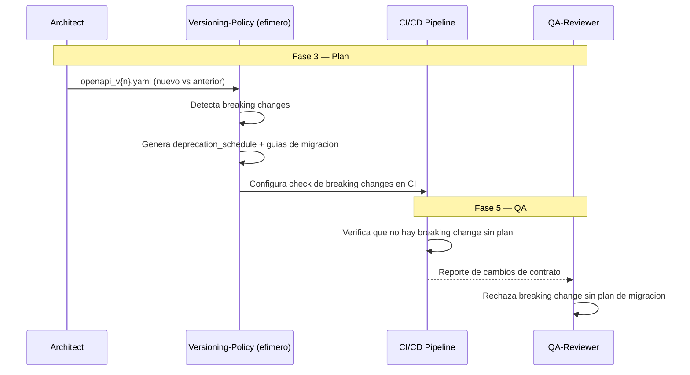

# APIVDD — API Versioning-Driven Development

**Version:** 1.0 | **Fecha:** 2026-06-05 | **Gobernanza:** Constitucion X-DD v1.5

---

## Indice

1. [Que es APIVDD en X-DD](#1-que-es-apivdd-en-x-dd)
2. [Cuando aplicar](#2-cuando-aplicar)
3. [Artefactos de entrada y salida](#3-artefactos-de-entrada-y-salida)
4. [APIVDD en el pipeline](#4-apivdd-en-el-pipeline)
5. [Integracion con otras disciplinas](#5-integracion-con-otras-disciplinas)
6. [Criterios de exito](#6-criterios-de-exito)
7. [Definition of Done APIVDD](#7-definition-of-done-apivdd)
8. [Agentes involucrados](#8-agentes-involucrados)
9. [Fuentes](#9-fuentes)

---

## 1. Que es APIVDD en X-DD

API Versioning-Driven Development es la disciplina donde las estrategias de versionado y las
politicas de deprecacion se definen antes de implementar cambios en una API. El versionado no
es una reaccion a un breaking change accidental, es una politica planificada.

En X-DD, APIVDD opera en la Fase 3 (Plan) sobre el contrato OpenAPI. Se ejecuta mediante una
skill nueva (`/evol api-versioning`). Produce `api_versions/deprecation_schedule.json` y
`api_versions/breaking_changes/*.md` con su plan de migracion.

El principio de APIVDD en X-DD: todo breaking change tiene un plan de migracion documentado y
una fecha de deprecacion comunicada antes de ejecutarse. Romper a un consumidor sin previo
aviso es una falla de proceso, no un accidente.

> **executor (registro):** skill nueva [`api-versioning`](../../.agent/workflows/api-versioning.md)
> (gap, sin cobertura previa). **Activacion por profile:** se inyecta cuando `evol.profile.yml`
> declara `apivdd` en `methodologies:`.

---

## 2. Cuando aplicar

| Perfil | Aplica | Motivo |
|--------|:------:|--------|
| API publica con multiples versiones | SI | Conviven versiones; se planifica la transicion |
| API consumida por equipos externos | SI | Los consumidores requieren preaviso |
| Producto de larga vida (long-term) | SI | La evolucion del contrato es continua |
| API interna efimera / prototipo | NO | Sin consumidores que proteger |

---

## 3. Artefactos de entrada y salida

| Direccion | Artefacto | Descripcion |
|-----------|-----------|-------------|
| Entrada | `api/openapi_v{n}.yaml` | Contratos versionados de la API |
| Salida | `api_versions/deprecation_schedule.json` | Calendario de deprecacion por version |
| Salida | `api_versions/breaking_changes/*.md` | Breaking changes + plan de migracion |

---

## 4. APIVDD en el pipeline

### APIVDD por fase

| Fase | Actividad APIVDD | Estado esperado |
|------|------------------|-----------------|
| Fase 3 — Plan | Definir estrategia de versionado + calendario de deprecacion | Politica documentada |
| Fase 4 — Build | Implementar versiones conviviendo + headers de deprecacion | Versiones coexistiendo |
| Fase 5 — QA | Verificar que ningun breaking change carece de plan | 0 breaking changes sin plan |

---

## 5. Integracion con otras disciplinas

| Disciplina | Relacion |
|------------|----------|
| [ODD_API](./ODD_API.md) | El versionado opera sobre el contrato OpenAPI |
| [CCDD](./CCDD.md) | Los contratos de consumidor detectan breaking changes |
| [DeprecationDD](./DeprecationDD.md) | El calendario alimenta la politica de sunset |
| [SDD](./SDD.md) | El cambio de version traza a REQ-NNN |

---

## 6. Criterios de exito

- Plan de migracion documentado para cada breaking change.
- Calendario de deprecacion comunicado antes de retirar una version.
- El pipeline detecta breaking changes automaticamente.
- Las versiones deprecadas emiten headers `Sunset` / `Deprecation`.

---

## 7. Definition of Done APIVDD

| Criterio | Verificacion |
|----------|-------------|
| `deprecation_schedule.json` definido | `test -f api_versions/deprecation_schedule.json` |
| Plan de migracion por breaking change | `ls api_versions/breaking_changes/*.md` |
| Check de breaking changes en CI | Reporte de diff de contrato |
| Headers de deprecacion | Verificacion en la respuesta de la API |

---

## 8. Agentes involucrados

| Agente | Rol en APIVDD |
|--------|---------------|
| `Architect` | Define la estrategia de versionado |
| `Versioning-Policy` (efimero) | Detecta breaking changes y genera calendario + guias |
| `Builder` | Implementa la coexistencia de versiones y headers |
| `QA-Reviewer` | Verifica que ningun breaking change carece de plan |
| `Release` | Comunica el calendario de deprecacion a los consumidores |

---

## 9. Fuentes

Respaldo bibliografico de la disciplina (verificadas via `/evol fact-check`).

| Tipo | Fuente | Aporte |
|------|--------|--------|
| Versionado semantico | [Semantic Versioning 2.0.0](https://semver.org/) | Reglas de MAJOR.MINOR.PATCH para breaking changes |
| Estrategias | [API Versioning Strategies — API7](https://api7.ai/blog/api-versioning-strategies) | Politicas y versionado de APIs |
| Sunset header | [RFC 8594 — The Sunset HTTP Header Field](https://www.rfc-editor.org/rfc/rfc8594) | Estandar para anunciar deprecacion de recursos |
| Best practices | [Modern API Design Best Practices — Xano](https://www.xano.com/blog/modern-api-design-best-practices) | Estrategias de evolucion de API |

> **Mantenido por:** Architect + Release
> **Gobernado por:** Constitucion X-DD v1.5, Art. 2
> **Ver tambien:** [ODD_API.md](./ODD_API.md) | [CCDD.md](./CCDD.md) | [DeprecationDD.md](./DeprecationDD.md) | [INDEX.md](./INDEX.md)
