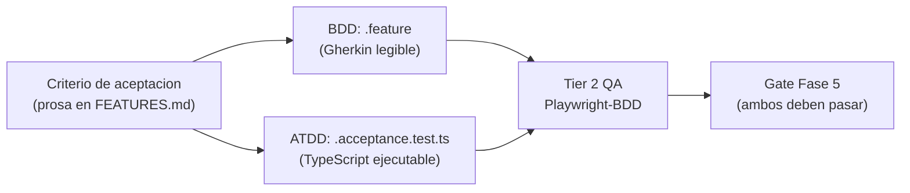
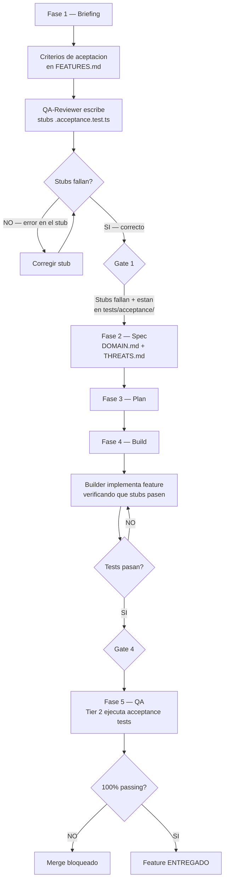

# ATDD — Acceptance Test-Driven Development

**Version:** 1.0 | **Fecha:** 2026-06-04 | **Gobernanza:** Constitucion X-DD v1.5

---

## Indice

1. [Que es ATDD en X-DD](#1-que-es-atdd-en-x-dd)
2. [Diferencia entre ATDD y BDD](#2-diferencia-entre-atdd-y-bdd)
3. [Stubs de acceptance tests que fallan por diseno](#3-stubs-de-acceptance-tests-que-fallan-por-diseno)
4. [ATDD en el pipeline](#4-atdd-en-el-pipeline)
5. [Bloqueo de CI y criterio de merge](#5-bloqueo-de-ci-y-criterio-de-merge)
6. [Artefactos ATDD](#6-artefactos-atdd)
7. [Definition of Done ATDD](#7-definition-of-done-atdd)
8. [Agentes involucrados](#8-agentes-involucrados)

---

## 1. Que es ATDD en X-DD

Acceptance Test-Driven Development es la disciplina que convierte los criterios de
aceptacion del solicitante en tests automatizados que deben fallar antes de que exista
implementacion, y que deben pasar antes de que el feature se marque como entregado.

En X-DD, ATDD complementa a BDD: mientras BDD describe el comportamiento en Gherkin
para comunicacion con el negocio, ATDD produce tests de aceptacion en codigo TypeScript
que se ejecutan en el CI y bloquean el merge si fallan.

El principio central de ATDD es que la aceptacion del cliente no es una opinion: es una
verificacion automatizada. Un criterio de aceptacion sin test de aceptacion automatizado
es una promesa no verificable.

La secuencia ATDD es:
1. El `QA-Reviewer` o `Architect` escribe stubs de acceptance tests en Fase 1.
2. Los stubs fallan inmediatamente porque no hay implementacion (esto es correcto).
3. El `Builder` implementa el feature en Fase 4.
4. Los acceptance tests deben pasar al final de Fase 4.
5. En Fase 5, el Tier 2 ejecuta los acceptance tests como parte del gate de QA.

---

## 2. Diferencia entre ATDD y BDD

Aunque ATDD y BDD comparten el objetivo de verificar el comportamiento del sistema desde
la perspectiva del usuario, difieren en formato, audiencia y mecanismo de ejecucion.

| Dimension | BDD | ATDD |
|-----------|-----|------|
| Formato | Archivos .feature Gherkin (lenguaje natural) | Tests TypeScript en `tests/acceptance/` |
| Audiencia | Negocio + tecnico (legible por todos) | Tecnico (el negocio no lo lee directamente) |
| Ejecutor | Playwright-BDD / Cucumber | Vitest / Jest / Playwright test |
| Cuando se escribe | Fase 1 (skeleton) | Fase 1 (stub que falla) |
| Granularidad | Feature completo | Criterio de aceptacion individual |
| Relacion | El .feature es la especificacion legible | El .acceptance.test.ts es la verificacion tecnica |

En X-DD, ambas disciplinas coexisten y se complementan. Un FEAT-NNN tiene un archivo
.feature (BDD) Y uno o mas archivos .acceptance.test.ts (ATDD). Esto proporciona
doble verificacion: semantica (Gherkin) y programatica (TypeScript).



---

## 3. Stubs de acceptance tests que fallan por diseno

Los stubs son acceptance tests completos en estructura pero sin implementacion del
sistema bajo prueba. Se escriben en Fase 1, inmediatamente despues de que los criterios
de aceptacion estan definidos.

Un stub ATDD bien escrito:
- Tiene el nombre completo del test y el criterio de aceptacion que verifica.
- Configura el estado inicial del sistema.
- Ejecuta la accion del usuario.
- Verifica el resultado esperado.
- Falla con un mensaje claro que explica que la implementacion no existe todavia.

### Ejemplo de stub ATDD

```typescript
// tests/acceptance/feat-001-exportar-pdf.acceptance.test.ts
// ATDD Stub — FEAT-001: Exportar reporte PDF del periodo de facturacion
// Estado: FAILING BY DESIGN — implementacion pendiente en Fase 4
// REQ: REQ-001 (SPEC.md)

import { test, expect } from '@playwright/test';
import { loginAs } from '../helpers/auth';
import { crearPeriodoConClientes } from '../helpers/billing';

test.describe('FEAT-001: Exportar reporte PDF de periodo de facturacion', () => {

  test('REQ-001 — Operador autenticado puede exportar PDF de periodo vigente', async ({ page }) => {
    // Arrange
    await loginAs(page, 'operador-admin');
    await crearPeriodoConClientes('2026-05', 3);

    // Act
    await page.goto('/reportes');
    await page.click('[data-testid="exportar-pdf-2026-05"]');
    const [download] = await Promise.all([
      page.waitForEvent('download'),
      page.click('[data-testid="confirmar-exportar"]'),
    ]);

    // Assert
    expect(download.suggestedFilename()).toMatch(/reporte-2026-05\.pdf/);
    // TODO: verificar contenido del PDF cuando el endpoint exista
    // Esta linea falla hasta que la Fase 4 implemente GET /reportes/:mes/pdf
    expect(await download.path()).toBeTruthy();
  });

  test('REQ-001-ERR1 — Sistema rechaza exportacion de periodo sin datos', async ({ page }) => {
    await loginAs(page, 'operador-admin');
    // Periodo sin clientes — debe retornar 404 con mensaje especifico
    await page.goto('/reportes');
    const response = await page.request.get('/api/reportes/2026-03/pdf');
    expect(response.status()).toBe(404);
    const body = await response.json();
    expect(body.error).toBe('No hay datos para el periodo seleccionado');
  });

});
```

El comentario "FAILING BY DESIGN" es obligatorio en todos los stubs ATDD de Fase 1.
Documenta que el fallo es esperado, no un bug del test.

---

## 4. ATDD en el pipeline



### ATDD por fase

| Fase | Actividad ATDD | Estado esperado de los tests |
|------|---------------|------------------------------|
| Fase 1 — Briefing | Escribir stubs de acceptance tests | FAILING BY DESIGN (correcto) |
| Fase 4 — Build | Implementar feature hasta que los stubs pasen | Progresivamente pasando |
| Fase 5 — QA | Ejecutar suite completa en Tier 2 | 100% passing (bloquea si no) |

---

## 5. Bloqueo de CI y criterio de merge

Los acceptance tests de ATDD son obligatorios en el Tier 2 del pipeline de CI/CD. Si
algun acceptance test falla en Fase 5, el merge al branch principal esta bloqueado hasta
que se corrija.

### Configuracion del pipeline CI para ATDD

```yaml
# .github/workflows/qa-tier2.yml (ejemplo)
jobs:
  acceptance-tests:
    name: "ATDD — Acceptance Tests"
    runs-on: ubuntu-latest
    steps:
      - name: Run acceptance tests
        run: npx playwright test tests/acceptance/
        # El exit code no-cero bloquea el merge automaticamente
      - name: Upload results
        uses: actions/upload-artifact@v3
        with:
          name: acceptance-results
          path: tests/results/acceptance-*.json
```

### Criterio de merge para ATDD

| Condicion | Merge permitido |
|-----------|----------------|
| 0 acceptance tests failing | SI |
| >= 1 acceptance test failing | NO — merge bloqueado |
| Tests skipped con `@wip` | SI — pero registrado en lecciones.md |
| Nuevo feature sin stubs ATDD | NO — gate de Fase 1 no se abre |

La unica excepcion al bloqueo es el tag `@wip`, que permite omitir un escenario
temporalmente. El uso de `@wip` en mas del 10% de los tests se reporta como deuda tecnica.

---

## 6. Artefactos ATDD

| Artefacto | Ubicacion | Producido por | Consumido por |
|-----------|-----------|--------------|---------------|
| Stubs de acceptance tests | `tests/acceptance/<nombre-feature>.acceptance.test.ts` | QA-Reviewer (Fase 1) | CI/CD Tier 2 (Fase 5) |
| Helpers de test | `tests/helpers/` | Builder (Fase 4) | Acceptance tests |
| Reporte JSON de resultados | `tests/results/acceptance-results.json` | CI/CD | Gate Fase 5 |
| Reporte HTML | `tests/results/acceptance-report.html` | CI/CD | QA-Reviewer, Stakeholders |

### Convencion de nombres

| Tipo de archivo | Convencion | Ejemplo |
|-----------------|-----------|---------|
| Acceptance test | `feat-NNN-[nombre-kebab].acceptance.test.ts` | `feat-001-exportar-pdf.acceptance.test.ts` |
| Helper de autenticacion | `tests/helpers/auth.ts` | — |
| Helper de datos de prueba | `tests/helpers/[dominio].ts` | `tests/helpers/billing.ts` |
| Fixture | `tests/fixtures/[nombre].json` | `tests/fixtures/periodo-facturacion.json` |

---

## 7. Definition of Done ATDD

| Criterio | Verificacion |
|----------|-------------|
| Al menos 1 stub por criterio de aceptacion en FEATURES.md | Conteo de tests vs criterios |
| Stubs fallan en Fase 1 (sin implementacion) | `npx playwright test tests/acceptance/` retorna non-zero |
| Todos los acceptance tests pasan en Fase 5 | `npx playwright test tests/acceptance/` retorna 0 |
| Reporte JSON generado en `tests/results/` | `test -f tests/results/acceptance-results.json` |
| Ningun test usa `@wip` sin entrada en lecciones.md | Revision de tags en archivos |
| Cada test referencia su REQ-NNN correspondiente | Comentario en el archivo de test |

---

## 8. Agentes involucrados

| Agente | Rol en ATDD |
|--------|-----------|
| `QA-Reviewer` | Escribe los stubs de acceptance tests en Fase 1; ejecuta la suite en Fase 5 |
| `Architect` | Define los criterios de aceptacion tecnicos que se convierten en stubs |
| `Builder` | Implementa el feature hasta que los stubs pasen; crea los helpers necesarios |
| `Orchestrator` | Coordina el ciclo de feedback entre stubs y implementacion |
| `Reviewer` | Audita la cobertura de acceptance tests contra los criterios de FEATURES.md |

---

> **Mantenido por:** QA-Reviewer + Architect
> **Gobernado por:** Constitucion X-DD v1.5, Art. 2 y Art. 8
> **Ver tambien:** [BDD.md](./BDD.md) | [TDD.md](./TDD.md) | [INDEX.md](./INDEX.md)
