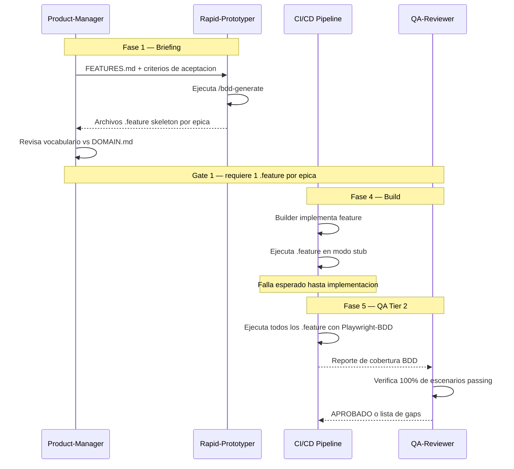

# BDD — Behavior-Driven Development

**Version:** 1.0 | **Fecha:** 2026-06-04 | **Gobernanza:** Constitucion X-DD v1.5

---

## Indice

1. [Que es BDD en X-DD](#1-que-es-bdd-en-x-dd)
2. [Formato Gherkin](#2-formato-gherkin)
3. [Estructura de tres tiers de escenarios](#3-estructura-de-tres-tiers-de-escenarios)
4. [BDD en el pipeline](#4-bdd-en-el-pipeline)
5. [Integracion con Playwright y Cucumber](#5-integracion-con-playwright-y-cucumber)
6. [Artefactos BDD](#6-artefactos-bdd)
7. [Definition of Done BDD](#7-definition-of-done-bdd)
8. [Agentes involucrados](#8-agentes-involucrados)

---

## 1. Que es BDD en X-DD

Behavior-Driven Development es la disciplina que convierte los criterios de aceptacion
del negocio en especificaciones ejecutables. En BDD, la especificacion del comportamiento
del sistema se escribe en un lenguaje legible por el negocio (Gherkin) y se ejecuta como
suite de tests en el CI.

En X-DD, BDD opera en dos momentos: durante la Fase 1 (Briefing) donde los archivos
.feature se crean como contratos ejecutables entre el negocio y el equipo tecnico, y
durante la Fase 5 (QA) donde esos archivos se ejecutan en el Tier 2 y deben pasar al 100%.

El principio de BDD en X-DD es que un criterio de aceptacion en prosa sin archivo .feature
correspondiente no es un criterio de aceptacion: es una intencion no verificable. El DOC_STANDARD
v2.0 exige que todo criterio de aceptacion tenga su bloque Gherkin.

BDD usa el vocabulario del DOMAIN.md. Un escenario Gherkin que usa terminos no definidos
en el Ubiquitous Language es semanticamente incorrecto y debe corregirse.

---

## 2. Formato Gherkin

Gherkin es el lenguaje de dominio especifico de BDD. Usa palabras clave en ingles o
espanol para describir el comportamiento del sistema desde la perspectiva del usuario.

### Estructura de un archivo .feature

```gherkin
Feature: [Nombre del feature en formato FDD]
  Como [rol del usuario]
  Quiero [accion que desea realizar]
  Para [valor o beneficio que obtiene]

  Background:
    Given [precondicion comun a todos los escenarios]

  Scenario: [Happy path — flujo esperado sin errores]
    Given [estado inicial del sistema]
    When  [accion del usuario]
    Then  [resultado observable esperado]
    And   [resultado adicional si aplica]

  Scenario: [Error — input invalido o estado inconsistente]
    Given [estado inicial]
    When  [accion con input invalido]
    Then  [mensaje de error especifico]
    And   [estado del sistema no cambia]

  Scenario Outline: [Escenario parametrizado para multiples casos]
    Given [estado con <variable>]
    When  [accion con <input>]
    Then  [resultado <esperado>]

    Examples:
      | variable | input | esperado |
      | caso1    | val1  | res1     |
      | caso2    | val2  | res2     |
```

### Reglas de escritura Gherkin en X-DD

| Regla | Correcto | Incorrecto |
|-------|---------|------------|
| Usar Ubiquitous Language | `Given un Periodo de Facturacion vigente` | `Given un mes activo` |
| Describir comportamiento, no implementacion | `Then el sistema envia una notificacion` | `Then se ejecuta sendEmail()` |
| Una accion por paso When | `When el operador solicita el reporte` | `When el operador hace click y espera` |
| Resultados verificables en Then | `Then el PDF contiene el total de 1.500 USD` | `Then el reporte funciona` |
| Sin logica de UI en pasos | `When el operador exporta el reporte` | `When el operador hace click en el boton azul` |

---

## 3. Estructura de tres tiers de escenarios

El DOC_STANDARD v2.0 exige una estructura minima de tres tiers de escenarios por feature.
Esta estructura garantiza que los tests BDD cubran no solo el flujo feliz sino tambien
los casos de error y borde que son fuente frecuente de bugs en produccion.

### Tier 1 — Happy Path (minimo 1 por feature)

Describe el flujo correcto cuando todos los inputs son validos y el sistema esta en el
estado esperado. Es el escenario que los usuarios viven la mayoria del tiempo.

```gherkin
Scenario: Exportar reporte PDF de un periodo vigente
  Given el operador esta autenticado con rol "administrador"
  And existe un Periodo de Facturacion del "2026-05-01" al "2026-05-31" con 3 clientes
  When el operador solicita exportar el reporte del periodo "2026-05"
  Then el sistema genera un PDF con los totales de los 3 clientes
  And el PDF incluye la fecha de generacion "2026-06-04"
  And el PDF incluye la firma digital del sistema
```

### Tier 2 — Escenarios de error (minimo 2 por feature)

Describen el comportamiento del sistema cuando los inputs son invalidos, el estado es
inconsistente, o las precondiciones no se cumplen.

```gherkin
Scenario: Rechazar exportacion de periodo sin datos
  Given el operador esta autenticado con rol "administrador"
  And no existen clientes en el Periodo de Facturacion "2026-03"
  When el operador solicita exportar el reporte del periodo "2026-03"
  Then el sistema muestra el error "No hay datos para el periodo seleccionado"
  And no se genera ningun archivo PDF

Scenario: Rechazar exportacion sin autenticacion
  Given el operador no esta autenticado
  When el operador solicita exportar el reporte del periodo "2026-05"
  Then el sistema devuelve el codigo de error 401
  And el sistema registra el intento de acceso no autorizado
```

### Tier 3 — Casos borde (minimo 1 por feature)

Describen el comportamiento del sistema en condiciones limite: valores maximos y minimos,
concurrencia, degradacion de dependencias externas, o transiciones de estado inusuales.

```gherkin
Scenario: Exportar reporte con exactamente 1 cliente
  Given el operador esta autenticado con rol "administrador"
  And existe exactamente 1 cliente en el Periodo de Facturacion "2026-05"
  When el operador solicita exportar el reporte del periodo "2026-05"
  Then el sistema genera un PDF con los datos del unico cliente
  And el PDF no incluye tablas de totalizacion por grupo

Scenario: Solicitud concurrente del mismo reporte
  Given dos operadores solicitan el reporte "2026-05" simultaneamente
  When ambas solicitudes se procesan al mismo tiempo
  Then ambos reciben un PDF identico y correcto
  And el sistema no genera archivos duplicados o corruptos
```

---

## 4. BDD en el pipeline



### BDD por fase

| Fase | Actividad BDD | Estado esperado |
|------|--------------|-----------------|
| Fase 1 — Briefing | Crear archivos .feature skeleton por epica | Archivos existen, escenarios escritos, steps sin implementar |
| Fase 2 — Spec | Revisar que el vocabulario Gherkin usa Ubiquitous Language del DOMAIN.md | Sin terminos fuera del glosario |
| Fase 4 — Build | Implementar step definitions; ejecutar .feature en modo incremental | Escenarios pasando progresivamente |
| Fase 5 — QA | Ejecutar suite completa de .feature en CI; Tier 2 los valida | 100% de escenarios passing |

---

## 5. Integracion con Playwright y Cucumber

Los archivos .feature en X-DD se ejecutan con Playwright-BDD (Cucumber sobre Playwright).
La estructura de directorios es:

```
tests/
  features/
    feature-001-exportar-pdf.feature
    feature-002-revocar-acceso.feature
    feature-NNN-[nombre-kebab].feature
  steps/
    feature-001-steps.ts
    feature-002-steps.ts
```

### Comandos de ejecucion

| Comando | Proposito |
|---------|-----------|
| `npx playwright test --grep @bdd` | Ejecuta todos los tests BDD |
| `npx playwright test tests/features/feature-001*` | Ejecuta un feature especifico |
| `npx cucumber-js --dry-run` | Verifica que todos los steps tienen implementacion |
| `npx playwright test --reporter=html` | Genera reporte HTML de resultados |

### Convenciones de etiquetado

Los escenarios pueden etiquetarse para ejecucion selectiva:

| Tag | Uso |
|-----|-----|
| `@bdd` | Todos los escenarios BDD (obligatorio) |
| `@happy-path` | Escenarios de Tier 1 |
| `@error` | Escenarios de Tier 2 |
| `@edge` | Escenarios de Tier 3 (casos borde) |
| `@wip` | Escenarios en desarrollo activo (excluidos del gate) |
| `@smoke` | Subset critico para pruebas rapidas en deploy |

---

## 6. Artefactos BDD

| Artefacto | Ubicacion | Producido por | Consumido por |
|-----------|-----------|--------------|---------------|
| Archivos .feature | `tests/features/feature-NNN-*.feature` | Rapid-Prototyper (Fase 1) | CI/CD Tier 2 (Fase 5) |
| Step definitions | `tests/steps/feature-NNN-steps.ts` | Builder (Fase 4) | Playwright-BDD runner |
| Reporte BDD HTML | `tests/results/bdd-report.html` | CI/CD | QA-Reviewer |
| Reporte BDD JSON | `tests/results/bdd-results.json` | CI/CD | Gate de Fase 5 |

### Reglas de integridad de artefactos

- Todo FEAT-NNN en FEATURES.md tiene al menos un archivo .feature en `tests/features/`.
- Todo escenario en un .feature tiene su step definition implementada antes del gate de Fase 5.
- Ningun .feature usa terminos fuera del Ubiquitous Language de DOMAIN.md.
- El reporte JSON de BDD es parte del payload del gate de Fase 5.

---

## 7. Definition of Done BDD

| Criterio | Verificacion |
|----------|-------------|
| Al menos 1 .feature por epica en FEATURES.md | `ls tests/features/*.feature \| wc -l` |
| Cada .feature tiene minimo 1 happy path + 2 errores + 1 borde | Revision estructural del archivo |
| Vocabulario Gherkin alineado con DOMAIN.md | Revision cruzada terminos vs glosario |
| 100% de escenarios passing en Fase 5 | Reporte BDD JSON con 0 failing |
| Reporte HTML generado y archivado en `tests/results/` | `test -f tests/results/bdd-report.html` |
| Tags @bdd presentes en todos los escenarios | `grep -c '@bdd' tests/features/*.feature` |

---

## 8. Agentes involucrados

| Agente | Rol en BDD |
|--------|-----------|
| `Rapid-Prototyper` | Convierte criterios de aceptacion en archivos .feature Gherkin durante Fase 1 |
| `Product-Manager` | Valida que los escenarios representen correctamente el negocio |
| `Architect` | Verifica que el vocabulario Gherkin usa el Ubiquitous Language de DOMAIN.md |
| `Builder` | Implementa las step definitions durante Fase 4 |
| `QA-Reviewer` | Ejecuta la suite completa y verifica 100% passing en Fase 5 |
| `Reviewer` | Audita la cobertura de escenarios (happy+error+borde) |

---

## 9. Fuentes

Respaldo bibliografico de la disciplina (verificadas via `/evol fact-check`).

| Tipo | Fuente | Aporte |
|------|--------|--------|
| Origen canonico | [Introducing BDD — Dan North (2006)](https://dannorth.net/introducing-bdd/) | Articulo fundacional donde Dan North acuna el termino BDD a partir de su experiencia con TDD |
| Lenguaje | [Gherkin Reference — Cucumber](https://cucumber.io/docs/gherkin/reference/) | Especificacion oficial del lenguaje Gherkin (Given-When-Then, Scenario Outline, tags) |
| Herramienta | [Cucumber Documentation](https://cucumber.io/docs/) | Framework de referencia para ejecutar especificaciones BDD como tests |
| Practica | [BDD — Agile Alliance Glossary](https://www.agilealliance.org/glossary/bdd/) | Definicion consensuada de la practica en la comunidad agile |

> **Mantenido por:** Rapid-Prototyper + QA-Reviewer
> **Gobernado por:** Constitucion X-DD v1.5, Art. 2
> **Ver tambien:** [ATDD.md](./ATDD.md) | [FDD.md](./FDD.md) | [INDEX.md](./INDEX.md)
