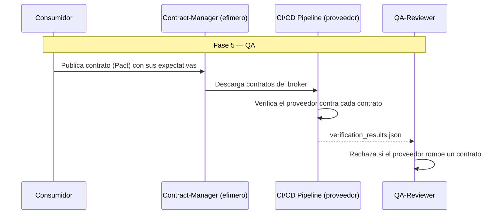

# CCDD — Consumer-Driven Contract Development

**Version:** 1.0 | **Fecha:** 2026-06-05 | **Gobernanza:** Constitucion Evol-DD v1.5

---

## Indice

1. [Que es CCDD en Evol-DD](#1-que-es-ccdd-en-evol-dd)
2. [Cuando aplicar](#2-cuando-aplicar)
3. [Artefactos de entrada y salida](#3-artefactos-de-entrada-y-salida)
4. [CCDD en el pipeline](#4-ccdd-en-el-pipeline)
5. [Integracion con otras disciplinas](#5-integracion-con-otras-disciplinas)
6. [Criterios de exito](#6-criterios-de-exito)
7. [Definition of Done CCDD](#7-definition-of-done-ccdd)
8. [Agentes involucrados](#8-agentes-involucrados)
9. [Fuentes](#9-fuentes)

---

## 1. Que es CCDD en Evol-DD

Consumer-Driven Contract Development es la disciplina donde los contratos de API son definidos
por los consumidores y el proveedor debe verificar que los cumple. El contrato refleja lo que
los consumidores realmente usan, no lo que el proveedor cree exponer.

En Evol-DD, CCDD opera en la Fase 5 (QA), mapeada al workflow `/evol contract-test`. Produce
`contracts/consumer_*.json` (expectativas de cada consumidor, estilo Pact) y
`contracts/verification_results.json`.

El principio de CCDD en Evol-DD: el pipeline del proveedor falla si rompe algun contrato de
consumidor. El proveedor no decide unilateralmente que puede cambiar; los contratos de los
consumidores son la red que detecta rupturas antes del deploy.

> **executor (registro):** [contract-test.md](../../.agent/workflows/contract-test.md) — mapeada
> al workflow existente `/evol contract-test`. **Activacion por profile:** se inyecta cuando
> `evol.profile.yml` declara `ccdd` en `methodologies:`.

---

## 2. Cuando aplicar

| Perfil | Aplica | Motivo |
|--------|:------:|--------|
| Multiples equipos consumiendo una API | SI | Los contratos coordinan proveedor/consumidor |
| Microservicios interdependientes | SI | La ruptura de contrato se detecta en CI |
| API publica con consumidores conocidos | SI | Los contratos protegen la compatibilidad |
| API sin consumidores externos | NO | Sin contratos de consumidor que verificar |

---

## 3. Artefactos de entrada y salida

| Direccion | Artefacto | Descripcion |
|-----------|-----------|-------------|
| Entrada | `api/openapi.yaml` | Contrato del proveedor (desde ODD_API) |
| Salida | `contracts/consumer_*.json` | Expectativas de cada consumidor (Pact) |
| Salida | `contracts/verification_results.json` | Resultado de verificacion del proveedor |

---

## 4. CCDD en el pipeline

### CCDD por fase

| Fase | Actividad CCDD | Estado esperado |
|------|----------------|-----------------|
| Fase 2 — Spec | Los consumidores declaran sus expectativas | Contratos de consumidor publicados |
| Fase 5 — QA | El proveedor verifica todos los contratos | 100% contratos verificados |
| Fase 6 — Retro | Revisar contratos rotos historicos | Compatibilidad documentada |

---

## 5. Integracion con otras disciplinas

| Disciplina | Relacion |
|------------|----------|
| [ODD_API](./ODD_API.md) | El contrato del proveedor es el OpenAPI |
| [BDD](./BDD.md) | Los escenarios de consumidor se convierten en contratos |
| [APIVDD](./APIVDD.md) | Los contratos detectan breaking changes a versionar |
| [SDD](./SDD.md) | Las expectativas trazan a REQ-NNN del consumidor |

---

## 6. Criterios de exito

- El pipeline del proveedor falla si rompe algun contrato de consumidor.
- Cada consumidor tiene su contrato publicado en el broker.
- La verificacion del proveedor es parte del gate de Fase 5.
- Los contratos reflejan el uso real, no la superficie completa de la API.

---

## 7. Definition of Done CCDD

| Criterio | Verificacion |
|----------|-------------|
| Contrato por consumidor | `ls contracts/consumer_*.json` |
| Verificacion del proveedor | `test -f contracts/verification_results.json` |
| 100% contratos verificados | Reporte de verificacion en verde |
| Verificacion en el gate de Fase 5 | Payload del gate incluye el resultado |

---

## 8. Agentes involucrados

| Agente | Rol en CCDD |
|--------|-------------|
| `Architect` | Coordina el contrato entre proveedor y consumidores |
| `Contract-Manager` (efimero) | Descarga contratos Pact y configura la verificacion |
| `Builder` | Ajusta el proveedor para cumplir los contratos |
| `QA-Reviewer` | Verifica los contratos en Fase 5 |
| `Reviewer` | Audita que ningun contrato quede sin verificar |

---

## 9. Fuentes

Respaldo bibliografico de la disciplina (verificadas via `/evol fact-check`).

| Tipo | Fuente | Aporte |
|------|--------|--------|
| Origen del concepto | [Consumer-Driven Contracts — Martin Fowler](https://martinfowler.com/articles/consumerDrivenContracts.html) | Articulo fundacional del patron CDC de contratos |
| Especificacion | [Pact — Consumer Testing](https://docs.pact.io/consumer) | Especificacion de interacciones con Pact |
| CI/CD | [Pact — CI/CD Setup Guide](https://docs.pact.io/ci_cd) | Integracion en pipelines de entrega continua |
| Herramienta | [Pact Foundation](https://github.com/pact-foundation) | Herramientas para contract testing |

> **Mantenido por:** Architect + QA-Reviewer
> **Gobernado por:** Constitucion Evol-DD v1.5, Art. 2
> **Ver tambien:** [ODD_API.md](./ODD_API.md) | [APIVDD.md](./APIVDD.md) | [BDD.md](./BDD.md) | [INDEX.md](./INDEX.md)
