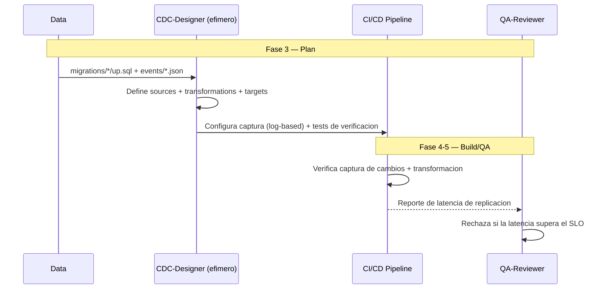

# CDCDD — Change Data Capture-Driven Development

**Version:** 1.0 | **Fecha:** 2026-06-05 | **Gobernanza:** Constitucion X-DD v1.5

---

## Indice

1. [Que es CDCDD en X-DD](#1-que-es-cdcdd-en-x-dd)
2. [Cuando aplicar](#2-cuando-aplicar)
3. [Artefactos de entrada y salida](#3-artefactos-de-entrada-y-salida)
4. [CDCDD en el pipeline](#4-cdcdd-en-el-pipeline)
5. [Integracion con otras disciplinas](#5-integracion-con-otras-disciplinas)
6. [Criterios de exito](#6-criterios-de-exito)
7. [Definition of Done CDCDD](#7-definition-of-done-cdcdd)
8. [Agentes involucrados](#8-agentes-involucrados)
9. [Fuentes](#9-fuentes)

---

## 1. Que es CDCDD en X-DD

Change Data Capture-Driven Development es la disciplina donde los cambios en la base de datos
fuente se capturan como eventos, especificando las transformaciones y los destinos antes de
implementar el pipeline de replicacion. CDC convierte el log de cambios de la BD en un stream
de eventos consumible.

En X-DD, CDCDD opera en la Fase 3 (Plan) como extension del workflow `/evol data-pipeline`.
Produce `cdc/sources/*.json` (tablas/columnas a capturar), `cdc/transformations/*.sql` y
`cdc/targets/*.json` (destinos de replicacion).

El principio de CDCDD en X-DD: la replicacion de datos se disena, no se improvisa con cron
jobs. La latencia de replicacion se mantiene dentro del SLO declarado, y cada transformacion
es trazable de la fuente al destino.

> **executor (registro):** extension de [data-pipeline.md](../../.agent/workflows/data-pipeline.md).
> **Activacion por profile:** se inyecta cuando `evol.profile.yml` declara `cdcdd` en
> `methodologies:`.

---

## 2. Cuando aplicar

| Perfil | Aplica | Motivo |
|--------|:------:|--------|
| Data warehouse / data lake | SI | Ingesta incremental de cambios |
| Replicacion entre sistemas | SI | Sincronizacion sin polling completo |
| Arquitectura event-driven con BD | SI | El cambio de BD se vuelve evento |
| App monolitica sin replicacion | NO | Sin necesidad de capturar cambios |

---

## 3. Artefactos de entrada y salida

| Direccion | Artefacto | Descripcion |
|-----------|-----------|-------------|
| Entrada | `migrations/*/up.sql` | Esquema fuente del que se capturan cambios |
| Entrada | `events/*.json` | Eventos de dominio relacionados |
| Salida | `cdc/sources/*.json` | Tablas/columnas a capturar + modo (log-based) |
| Salida | `cdc/transformations/*.sql` | Transformaciones fuente -> destino |
| Salida | `cdc/targets/*.json` | Destinos de replicacion + SLO de latencia |

---

## 4. CDCDD en el pipeline

### CDCDD por fase

| Fase | Actividad CDCDD | Estado esperado |
|------|-----------------|-----------------|
| Fase 3 — Plan | Definir sources, transformaciones y targets | Pipeline CDC especificado |
| Fase 4 — Build | Configurar la captura log-based + transformaciones | Captura funcional |
| Fase 5 — QA | Verificar latencia dentro del SLO | Latencia conforme al SLO |

---

## 5. Integracion con otras disciplinas

| Disciplina | Relacion |
|------------|----------|
| [MDD](./MDD.md) | La activacion CDC se define junto a la migracion |
| [EDA](./EDA.md) | Los cambios capturados se emiten con los schemas de EDA |
| [ESDD](./ESDD.md) | CDC puede alimentar o derivar del event store |
| [SLO/SLA](./SLODRIVEN.md) | La latencia de replicacion es un SLO monitoreado |

---

## 6. Criterios de exito

- La latencia de replicacion se mantiene dentro del SLO declarado.
- Cada transformacion es trazable de la fuente al destino.
- La captura es log-based (no polling) cuando la BD lo soporta.
- Existen tests que verifican la fidelidad de la replicacion.

---

## 7. Definition of Done CDCDD

| Criterio | Verificacion |
|----------|-------------|
| `sources` + `transformations` + `targets` definidos | `ls cdc/` |
| SLO de latencia declarado | Revision de `cdc/targets/*.json` |
| Tests de fidelidad de replicacion | Suite CDC en verde |
| Captura log-based donde aplica | Revision de configuracion |

---

## 8. Agentes involucrados

| Agente | Rol en CDCDD |
|--------|--------------|
| `Data` | Disena el pipeline CDC (sources, transformaciones, targets) |
| `CDC-Designer` (efimero) | Genera la configuracion de captura y los tests |
| `Architect` | Valida la coherencia con la arquitectura de datos |
| `Builder` | Implementa la captura y las transformaciones |
| `QA-Reviewer` | Verifica la latencia y fidelidad en Fase 5 |

---

## 9. Fuentes

Respaldo bibliografico de la disciplina (verificadas via `/evol fact-check`).

| Tipo | Fuente | Aporte |
|------|--------|--------|
| Concepto | [Change Data Capture — Martin Kleppmann (Confluent)](https://www.confluent.io/blog/how-change-data-capture-works-patterns-solutions-implementation/) | Patrones y mecanica de CDC log-based |
| Guia | [Building Real-Time CDC Pipelines — DevX](https://www.devx.com/guides/how-to-build-real-time-change-data-capture-pipelines/) | Patrones y arquitecturas de pipelines CDC |
| Guia completa | [CDC Complete Guide — RisingWave](https://risingwave.com/blog/cdc-stream-processing-the-complete-guide-2026/) | Procesamiento de flujos CDC |
| Herramienta | [Debezium](https://github.com/debezium/debezium) | Plataforma open-source de referencia para CDC |

> **Mantenido por:** Data + Architect
> **Gobernado por:** Constitucion X-DD v1.5, Art. 2
> **Ver tambien:** [MDD.md](./MDD.md) | [EDA.md](./EDA.md) | [SLODRIVEN.md](./SLODRIVEN.md) | [INDEX.md](./INDEX.md)
