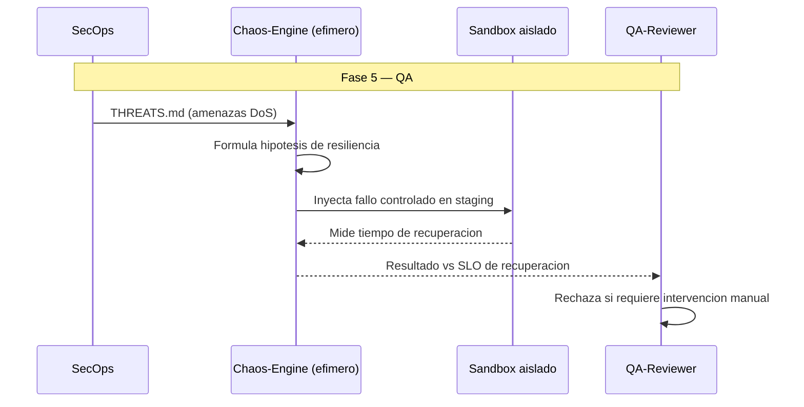

# CHAOS — Chaos / Resiliency-Driven Development

**Version:** 1.0 | **Fecha:** 2026-06-05 | **Gobernanza:** Constitucion Evol-DD v1.5

---

## Indice

1. [Que es Chaos-Driven en Evol-DD](#1-que-es-chaos-driven-en-evol-dd)
2. [Cuando aplicar](#2-cuando-aplicar)
3. [Artefactos de entrada y salida](#3-artefactos-de-entrada-y-salida)
4. [Chaos en el pipeline](#4-chaos-en-el-pipeline)
5. [Integracion con otras disciplinas](#5-integracion-con-otras-disciplinas)
6. [Criterios de exito](#6-criterios-de-exito)
7. [Definition of Done Chaos](#7-definition-of-done-chaos)
8. [Agentes involucrados](#8-agentes-involucrados)
9. [Fuentes](#9-fuentes)

---

## 1. Que es Chaos-Driven en Evol-DD

Chaos / Resiliency-Driven Development es la disciplina donde los fallos de infraestructura se
introducen de forma controlada para validar que el sistema se recupera automaticamente. La
resiliencia no se asume: se prueba inyectando fallos en condiciones gobernadas.

En Evol-DD, Chaos opera en la Fase 5 (QA) como extension del workflow `/evol dr-drill` (con el
sandbox aislado de `evol-sandbox`). Consume `docs/specs/THREATS.md` (amenazas de tipo DoS) y
produce `chaos/experiments/*/fault_injection.json` y `chaos/hypothesis/*.md`.

El principio de Chaos en Evol-DD: la recuperacion automatica se valida con experimentos, no con
fe. Cada experimento parte de una hipotesis ("el sistema se recupera en < N min ante el fallo
X") y se ejecuta en staging aislado; un sistema que solo se prueba en el camino feliz fallara
en el primer incidente real.

> **executor (registro):** extension de [dr-drill.md](../../.agent/workflows/dr-drill.md) +
> sandbox aislado ([evol-sandbox](../../skills/evol-sandbox)). **Activacion por profile:** se
> inyecta cuando `evol.profile.yml` declara `chaos` en `methodologies:`.

---

## 2. Cuando aplicar

| Perfil | Aplica | Motivo |
|--------|:------:|--------|
| Sistema de alta disponibilidad (99.99%) | SI | La resiliencia es un requisito duro |
| Microservicios con dependencias externas | SI | El fallo de una dependencia debe tolerarse |
| Batch critico con recuperacion | SI | La recuperacion sin intervencion es clave |
| App simple sin requisitos de HA | NO | El costo de chaos no se justifica |

---

## 3. Artefactos de entrada y salida

| Direccion | Artefacto | Descripcion |
|-----------|-----------|-------------|
| Entrada | `docs/specs/THREATS.md` (STRIDE DoS) | Amenazas de disponibilidad que motivan experimentos |
| Salida | `chaos/hypothesis/*.md` | Hipotesis de resiliencia (estado estable, fallo, recuperacion) |
| Salida | `chaos/experiments/*/fault_injection.json` | Definicion del experimento de inyeccion de fallo |

---

## 4. Chaos en el pipeline

### Chaos por fase

| Fase | Actividad Chaos | Estado esperado |
|------|-----------------|-----------------|
| Fase 2 — Spec | Identificar amenazas de disponibilidad (STRIDE DoS) | Amenazas catalogadas |
| Fase 5 — QA | Ejecutar experimentos en sandbox aislado | Recuperacion automatica verificada |
| Fase 6 — Retro | Registrar hallazgos y mejorar la resiliencia | Lecciones de resiliencia |

---

## 5. Integracion con otras disciplinas

| Disciplina | Relacion |
|------------|----------|
| [Threat-Driven](./THREAT-DRIVEN.md) | Las amenazas DoS de STRIDE alimentan los experimentos |
| [ODD_Obs](./ODD_OBS.md) | Los experimentos se observan con las metricas de observabilidad |
| [SLO/SLA](./SLODRIVEN.md) | El tiempo de recuperacion se compara con el SLO |
| [Pipeline-Driven](./PIPELINE-DRIVEN.md) | El rollback automatico es un mecanismo de resiliencia |

---

## 6. Criterios de exito

- Recuperacion sin intervencion manual ante el fallo inyectado.
- El tiempo de recuperacion esta dentro del SLO declarado.
- Cada experimento parte de una hipotesis explicita.
- Los experimentos corren en sandbox aislado, nunca en produccion sin control.

---

## 7. Definition of Done Chaos

| Criterio | Verificacion |
|----------|-------------|
| Hipotesis por experimento | `ls chaos/hypothesis/*.md` |
| `fault_injection.json` definido | `ls chaos/experiments/*/fault_injection.json` |
| Recuperacion automatica | Resultado del experimento |
| Tiempo de recuperacion dentro del SLO | Comparacion con `sla/slo_documents` |

---

## 8. Agentes involucrados

| Agente | Rol en Chaos |
|--------|--------------|
| `SecOps` | Identifica las amenazas de disponibilidad a experimentar |
| `Chaos-Engine` (efimero) | Formula hipotesis e inyecta fallos en sandbox |
| `DevOps` | Provee el entorno de staging aislado |
| `QA-Reviewer` | Verifica la recuperacion automatica en Fase 5 |
| `Analyst` | Analiza el blast radius del fallo inyectado |

---

## 9. Fuentes

Respaldo bibliografico de la disciplina (verificadas via `/evol fact-check`).

| Tipo | Fuente | Aporte |
|------|--------|--------|
| Principios | [Principles of Chaos Engineering](https://principlesofchaos.org/) | Definicion canonica (hipotesis, estado estable, blast radius) |
| Fundamentos | [Chaos Engineering Overview — Microsoft](https://learn.microsoft.com/en-us/azure/chaos-studio/chaos-engineering-overview) | Fundamentos y experimentacion controlada |
| Practica | [Chaos Engineering with Python — BPB](https://bpbonline.com/products/chaos-engineering-with-python) | Tecnicas practicas con Python |
| Herramienta | [Chaos Mesh](https://github.com/chaos-mesh/chaos-mesh) | Plataforma de chaos engineering cloud-native |

> **Mantenido por:** SecOps + DevOps
> **Gobernado por:** Constitucion Evol-DD v1.5, Art. 2
> **Ver tambien:** [THREAT-DRIVEN.md](./THREAT-DRIVEN.md) | [ODD_OBS.md](./ODD_OBS.md) | [SLODRIVEN.md](./SLODRIVEN.md) | [INDEX.md](./INDEX.md)
