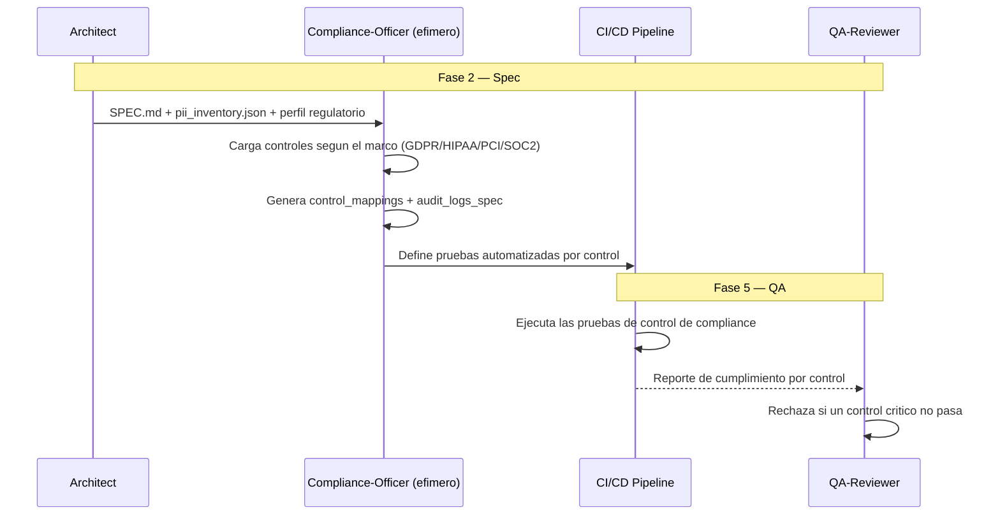

# COMPLIANCE — Compliance-Driven Development

**Version:** 1.0 | **Fecha:** 2026-06-05 | **Gobernanza:** Constitucion X-DD v1.5

---

## Indice

1. [Que es Compliance-Driven en X-DD](#1-que-es-compliance-driven-en-x-dd)
2. [Cuando aplicar](#2-cuando-aplicar)
3. [Artefactos de entrada y salida](#3-artefactos-de-entrada-y-salida)
4. [Compliance en el pipeline](#4-compliance-en-el-pipeline)
5. [Integracion con otras disciplinas](#5-integracion-con-otras-disciplinas)
6. [Criterios de exito](#6-criterios-de-exito)
7. [Definition of Done Compliance](#7-definition-of-done-compliance)
8. [Agentes involucrados](#8-agentes-involucrados)
9. [Fuentes](#9-fuentes)

---

## 1. Que es Compliance-Driven en X-DD

Compliance-Driven Development es la disciplina donde las regulaciones (GDPR, HIPAA, PCI-DSS,
SOC 2) se tratan como restricciones de diseno desde la fase de especificacion, no como una
auditoria sorpresa al final. Cada control de compliance se traduce en una prueba automatizada.

En X-DD, Compliance opera en la Fase 2 (Spec) como extension del workflow `/evol privacy-review`.
Produce `compliance/control_mappings.json` (mapeo control regulatorio -> implementacion) y
`compliance/audit_logs_spec.json` (que se audita y como).

El principio de Compliance en X-DD: cada control regulatorio aplicable tiene una prueba que
lo verifica. Un control "implementado" sin prueba automatizada es una afirmacion no
verificable que no sobrevive a una auditoria real.

> **executor (registro):** extension de [privacy-review.md](../../.agent/workflows/privacy-review.md)
> (cobertura parcial: privacy cubre PII; compliance amplia a marcos regulatorios). **Activacion
> por profile:** se inyecta cuando `evol.profile.yml` declara `compliance` en `methodologies:`.

---

## 2. Cuando aplicar

| Perfil | Aplica | Motivo |
|--------|:------:|--------|
| Sistema con datos personales (GDPR/CCPA) | SI | Controles de privacidad obligatorios |
| Sistema sanitario (HIPAA) | SI | Controles de datos de salud |
| Sistema de pagos (PCI-DSS) | SI | Controles sobre datos de tarjetas |
| SaaS B2B que requiere SOC 2 | SI | Controles de seguridad auditables |
| Tool interna sin datos regulados | NO | Sin marco regulatorio aplicable |

---

## 3. Artefactos de entrada y salida

| Direccion | Artefacto | Descripcion |
|-----------|-----------|-------------|
| Entrada | `docs/specs/SPEC.md` | Funcionalidad sujeta a regulacion |
| Entrada | `privacy/pii_inventory.json` | Inventario PII (desde PrivacyDD) |
| Salida | `compliance/control_mappings.json` | Mapeo control regulatorio -> implementacion -> prueba |
| Salida | `compliance/audit_logs_spec.json` | Especificacion de logs de auditoria requeridos |

---

## 4. Compliance en el pipeline

### Compliance por fase

| Fase | Actividad Compliance | Estado esperado |
|------|----------------------|-----------------|
| Fase 2 — Spec | Cargar controles del marco; mapear a implementacion | Mapeo control -> prueba completo |
| Fase 4 — Build | Implementar controles + logs de auditoria | Codigo conforme a los mapeos |
| Fase 5 — QA | Ejecutar pruebas de control automatizadas | 100% controles criticos pasando |
| Fase 6 — Retro | Revisar cambios regulatorios; actualizar mapeos | Mapeos al dia |

---

## 5. Integracion con otras disciplinas

| Disciplina | Relacion |
|------------|----------|
| [PrivacyDD](./PrivacyDD.md) | El inventario PII es input directo de los controles |
| [SDD](./SDD.md) | Las restricciones regulatorias se vuelven REQ-NNN |
| [SecDD](./SecDD.md) | Los controles de seguridad alimentan SOC 2 / PCI |
| [ODD_Obs](./ODD_OBS.md) | Los audit logs requieren observabilidad estructurada |

---

## 6. Criterios de exito

- Cada control de compliance aplicable tiene una prueba automatizada.
- Existe mapeo explicito control regulatorio -> implementacion -> prueba.
- Los audit logs cubren todos los eventos requeridos por el marco.
- El pipeline falla si un control critico no se cumple.

---

## 7. Definition of Done Compliance

| Criterio | Verificacion |
|----------|-------------|
| `control_mappings.json` completo | `test -f compliance/control_mappings.json` |
| Prueba por control | Revision del mapeo control -> prueba |
| Spec de audit logs | `test -f compliance/audit_logs_spec.json` |
| Controles criticos pasando | Reporte de compliance en verde |

---

## 8. Agentes involucrados

| Agente | Rol en Compliance |
|--------|-------------------|
| `Architect` | Identifica el marco regulatorio aplicable al sistema |
| `Compliance-Officer` (efimero) | Carga controles, genera mapeos y define pruebas |
| `SecOps` | Conecta controles de seguridad con SOC 2 / PCI |
| `Builder` | Implementa controles y audit logs |
| `QA-Reviewer` | Ejecuta las pruebas de control en Fase 5 |

---

## 9. Fuentes

Respaldo bibliografico de la disciplina (verificadas via `/evol fact-check`).

| Tipo | Fuente | Aporte |
|------|--------|--------|
| GDPR | [GDPR — Texto oficial (gdpr-info.eu)](https://gdpr-info.eu/) | Articulos del reglamento europeo de proteccion de datos |
| SOC 2 | [SOC 2 — AICPA Trust Services Criteria](https://www.aicpa-cima.com/topic/audit-assurance/audit-and-assurance-greater-than-soc-2) | Criterios de confianza para auditoria SOC 2 |
| PCI-DSS | [PCI DSS — PCI Security Standards Council](https://www.pcisecuritystandards.org/) | Estandar de seguridad de datos de tarjetas |
| Guia dev | [Developer-First Compliance — Appwrite](https://appwrite.io/blog/post/developer-first-thinking-about-compliance-requirements) | Decisiones de arquitectura orientadas a compliance |

> **Mantenido por:** SecOps + Architect
> **Gobernado por:** Constitucion X-DD v1.5, Art. 2
> **Ver tambien:** [PrivacyDD.md](./PrivacyDD.md) | [SecDD.md](./SecDD.md) | [INDEX.md](./INDEX.md)
