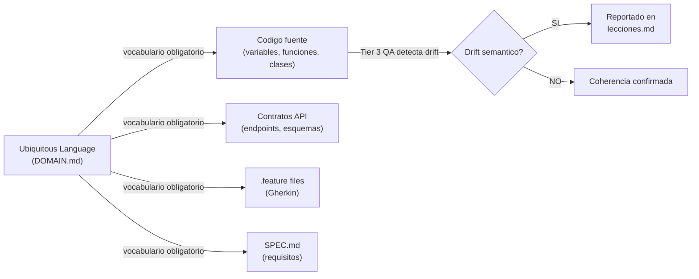
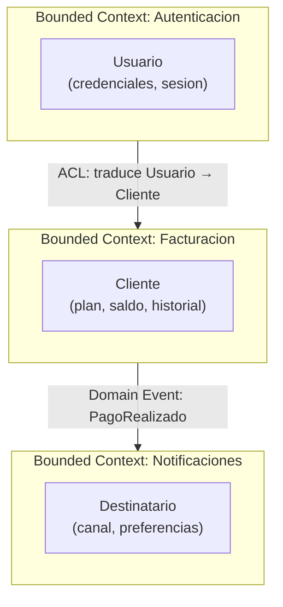
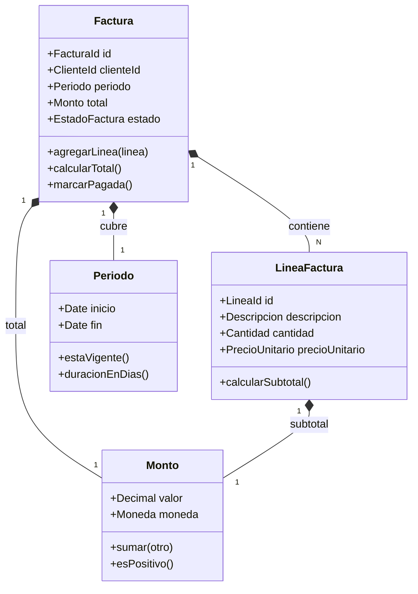
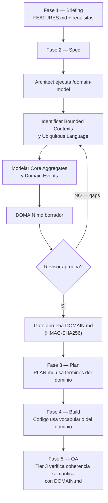

# DDD — Domain-Driven Design

**Version:** 1.0 | **Fecha:** 2026-06-04 | **Gobernanza:** Constitucion X-DD v1.5

---

## Indice

1. [Que es DDD en X-DD](#1-que-es-ddd-en-x-dd)
2. [Ubiquitous Language](#2-ubiquitous-language)
3. [Bounded Contexts](#3-bounded-contexts)
4. [Context Map](#4-context-map)
5. [Core Aggregates](#5-core-aggregates)
6. [Domain Events](#6-domain-events)
7. [Artefacto DOMAIN.md](#7-artefacto-domainmd)
8. [DDD en el pipeline](#8-ddd-en-el-pipeline)
9. [Agentes involucrados](#9-agentes-involucrados)

---

## 1. Que es DDD en X-DD

Domain-Driven Design es la disciplina que alinea el modelo de software con el modelo de
negocio mediante un lenguaje compartido, limites explicitos entre subdominios y la
identificacion de los conceptos centrales del sistema.

En X-DD, DDD se activa durante la Fase 2 (Spec) para que el modelo de dominio este
documentado y aprobado antes de que comience el diseno tecnico detallado. El artefacto
central es `docs/specs/DOMAIN.md`.

DDD en X-DD no prescribe arquitectura hexagonal ni Event Sourcing. Prescribe tres cosas
concretas y verificables: un glosario de terminos con vocabulario obligatorio, un mapa de
bounded contexts con sus relaciones, y un catalogo de aggregates con sus domain events.

La regla critica de DDD en X-DD es que el Ubiquitous Language definido en DOMAIN.md es
vocabulario obligatorio para nombres de variables, funciones, clases y endpoints. Un metodo
llamado `calculateBillingPeriod` cuando el dominio define `computeCycleTotals` es drift
semantico. El Tier 3 del QA detecta y reporta este drift.

---

## 2. Ubiquitous Language

El Ubiquitous Language es el glosario de terminos del negocio que el equipo tecnico y el
equipo de negocio usan con exactamente el mismo significado. Elimina la ambiguedad que
surge cuando distintos stakeholders usan palabras diferentes para el mismo concepto, o
la misma palabra para conceptos distintos.

El glosario vive en la seccion `## Ubiquitous Language` de DOMAIN.md y usa el formato
de tabla obligatorio:

| Termino | Definicion precisa | Sinonimos prohibidos | Contexto |
|---------|--------------------|---------------------|---------|
| Periodo de Facturacion | Intervalo de tiempo (inicio-fin) por el que se calcula el cargo al cliente | "mes", "ciclo", "billing month" | Facturacion |
| Revocacion | Acto de retirar el acceso de un usuario sin eliminar su historial | "eliminar usuario", "borrar cuenta" | Seguridad |

Los sinonimos prohibidos son igual de importantes que los terminos. Si el equipo usa
"billing month" en el codigo pero el dominio define "Periodo de Facturacion", eso es
drift semantico y se reporta en lecciones.md.



---

## 3. Bounded Contexts

Un Bounded Context es el limite explicito dentro del cual un modelo de dominio particular
es valido. El mismo termino puede significar cosas diferentes en distintos bounded contexts.

Por ejemplo, "Usuario" en el bounded context de Autenticacion tiene atributos como
`credenciales`, `sesion_activa` y `intentos_fallidos`. En el bounded context de
Facturacion, "Cliente" —que puede ser la misma persona— tiene atributos como
`plan_contratado`, `saldo` y `historial_pagos`. Son modelos distintos con nombres distintos
porque sirven propositos distintos.

### Identificacion de bounded contexts

Para identificar los bounded contexts de un sistema:

1. Listar todos los sustantivos del negocio y sus atributos en distintos departamentos.
2. Buscar donde el mismo termino tiene definiciones diferentes: ahi hay una frontera.
3. Identificar equipos o departamentos con vocabulario propio: cada uno suele tener un bounded context.
4. Verificar que cada bounded context tiene un Aggregate Root que lo representa.

### Diagrama de bounded contexts



---

## 4. Context Map

El Context Map documenta las relaciones entre bounded contexts. No basta con saber que
existen dos bounded contexts; hay que documentar como se comunican y quien tiene el poder
en la relacion.

### Tipos de relacion entre contexts

| Tipo | Descripcion | Cuando usar |
|------|-------------|------------|
| Shared Kernel | Ambos contexts comparten un subconjunto del modelo | Equipos que pueden coordinar cambios sincronizados |
| Customer-Supplier | Un context (supplier) provee servicios al otro (customer) | Dependencia clara de direccion |
| Conformist | El downstream adopta el modelo del upstream sin negociacion | Sistemas externos o APIs de terceros |
| Anti-Corruption Layer (ACL) | El downstream traduce el modelo del upstream a su propio modelo | Cuando los modelos son incompatibles o el upstream es externo |
| Published Language | El upstream publica un lenguaje canonico que todos consumen | APIs publicas, eventos de dominio compartidos |
| Separate Ways | Los contexts no se integran; cada uno resuelve el problema por separado | Cuando el costo de integracion supera el beneficio |

El Context Map se representa en DOMAIN.md como un diagrama Mermaid que muestra los
bounded contexts como nodos y las relaciones como aristas etiquetadas con el tipo.

---

## 5. Core Aggregates

Un Aggregate es un cluster de objetos de dominio (entidades y value objects) que se
tratan como una unidad para la persistencia y la aplicacion de invariantes. El Aggregate
Root es la unica puerta de entrada al aggregate.

### Reglas de aggregates en X-DD

- Toda modificacion al aggregate pasa por el Aggregate Root.
- Los aggregates no se referencian mutuamente por objeto sino por ID.
- Las invariantes de negocio se aplican dentro del aggregate, nunca fuera.
- Un repository maneja exactamente un tipo de Aggregate Root.

### Formato de tabla de aggregates en DOMAIN.md

| Aggregate Root | Invariantes | Entidades | Value Objects | Repository |
|----------------|-------------|-----------|---------------|-----------|
| `Factura` | El total nunca puede ser negativo; el estado no puede retroceder de PAGADA | `LineaFactura`, `PeriodoCargo` | `Monto`, `Moneda`, `Periodo` | `FacturaRepository` |
| `CuentaUsuario` | Una cuenta suspendida no puede iniciar sesion | `Sesion`, `Credencial` | `Email`, `HashedPassword` | `CuentaRepository` |

### Diagrama de clases del dominio



---

## 6. Domain Events

Los Domain Events son hechos del negocio que ya ocurrieron y que son relevantes para
otros bounded contexts o para el registro historico del sistema. Se nombran en pasado
porque representan algo que sucedio, no una instruccion.

### Reglas de domain events en X-DD

- Los domain events se nombran en pasado: `FacturaEmitida`, `UsuarioSuspendido`, `PagoRealizado`.
- El emisor del evento no conoce a sus consumidores.
- Los consumers del evento no modifican el aggregate emisor directamente.
- Cada evento tiene un payload inmutable que contiene toda la informacion necesaria para
  que el consumer actue sin consultar al emisor.

### Tabla de domain events

| Evento | Emisor (Aggregate) | Consumidores | Payload | Efecto de negocio |
|--------|-------------------|-------------|---------|------------------|
| `FacturaEmitida` | `Factura` | `Notificaciones`, `Contabilidad` | `{facturaId, clienteId, total, periodo}` | Notifica al cliente y registra el cargo contable |
| `UsuarioSuspendido` | `CuentaUsuario` | `Facturacion`, `Notificaciones` | `{cuentaId, razon, timestamp}` | Pausa cobros pendientes y notifica al administrador |
| `PagoRealizado` | `Factura` | `CuentaUsuario`, `Notificaciones` | `{facturaId, monto, metodo, timestamp}` | Actualiza saldo del cliente y confirma al pagador |

---

## 7. Artefacto DOMAIN.md

`DOMAIN.md` reside en `docs/specs/DOMAIN.md` y es producido por el agente `Architect`
usando el workflow `/domain-model` durante la Fase 2.

### Estructura obligatoria de DOMAIN.md

```markdown
## Ubiquitous Language
Tabla: termino, definicion, sinonimos prohibidos, contexto

## Bounded Contexts
Descripcion narrativa + diagrama Mermaid flowchart

## Context Map
Diagrama Mermaid con tipos de relacion documentados

## Core Aggregates
Tabla: aggregate root, invariantes, entidades, value objects, repositorio
Diagrama Mermaid classDiagram

## Domain Events
Tabla: evento, emisor, consumidores, payload, efecto de negocio

## Glosario de errores de dominio
Tabla: codigo de error, descripcion, contexto, accion esperada del sistema
```

El DOMAIN.md debe superar los umbrales del DOC_STANDARD v2.0:
- Minimo 250 lineas de contenido
- Al menos 1 diagrama classDiagram + 1 diagrama flowchart para el Context Map
- Sin emojis

---

## 8. DDD en el pipeline

DDD entra exclusivamente en la Fase 2, pero su impacto se extiende a todas las fases
siguientes a traves del vocabulario y las reglas de dominio que establece.



### Regla de drift semantico

El Tier 3 del QA (LLM-Judge) verifica que el codigo fuente usa el vocabulario definido
en DOMAIN.md. Si un simbolo del codigo diverge del Ubiquitous Language sin justificacion
documentada, se reporta como drift semantico y bloquea el merge.

---

## 9. Agentes involucrados

| Agente | Rol en DDD |
|--------|-----------|
| `Architect` | Produce DOMAIN.md; lidera el analisis de bounded contexts y aggregates |
| `Domain-Expert` | Aporta el conocimiento del negocio para el Ubiquitous Language |
| `Reviewer` | Audita DOMAIN.md contra DOC_STANDARD (reviewer != author) |
| `QA-Reviewer` | En Tier 3, verifica coherencia semantica del codigo con DOMAIN.md |
| `SecOps` | Consume DOMAIN.md como input para el Threat Modeling en Fase 2 |
| `Builder` | Consume el Ubiquitous Language de DOMAIN.md durante Build |

---

## 10. Fuentes

Respaldo bibliografico de la disciplina (verificadas via `/evol fact-check`).

| Tipo | Fuente | Aporte |
|------|--------|--------|
| Origen canonico | [Domain-Driven Design — Eric Evans (2003)](https://www.domainlanguage.com/ddd/) | Libro fundacional ("Blue Book") que define Ubiquitous Language, Bounded Context, Aggregates |
| Referencia | [DDD Reference — Eric Evans (PDF)](https://www.domainlanguage.com/wp-content/uploads/2016/05/DDD_Reference_2015-03.pdf) | Compendio oficial de definiciones y patrones DDD |
| Patrones tacticos | [Implementing Domain-Driven Design — Vaughn Vernon](https://www.oreilly.com/library/view/implementing-domain-driven-design/9780133039900/) | Aplicacion practica de aggregates, repositories y domain events |

> **Mantenido por:** Architect + Domain-Expert
> **Gobernado por:** Constitucion X-DD v1.5, Art. 2
> **Ver tambien:** [SDD.md](./SDD.md) | [THREAT-DRIVEN.md](./THREAT-DRIVEN.md) | [INDEX.md](./INDEX.md)
