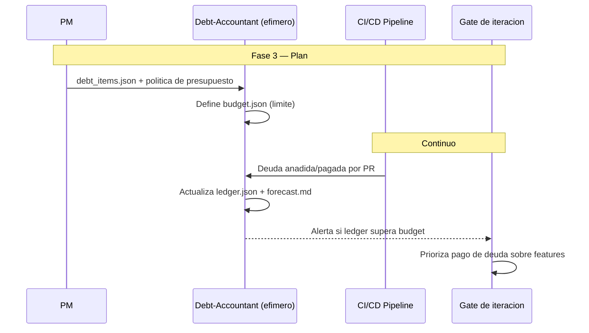

# DebtBudgetDD — Technical Debt Budgeting

**Version:** 1.0 | **Fecha:** 2026-06-05 | **Gobernanza:** Constitucion Evol-DD v1.5

---

## Indice

1. [Que es DebtBudgetDD en Evol-DD](#1-que-es-debtbudgetdd-en-evol-dd)
2. [Cuando aplicar](#2-cuando-aplicar)
3. [Artefactos de entrada y salida](#3-artefactos-de-entrada-y-salida)
4. [DebtBudgetDD en el pipeline](#4-debtbudgetdd-en-el-pipeline)
5. [Integracion con otras disciplinas](#5-integracion-con-otras-disciplinas)
6. [Criterios de exito](#6-criterios-de-exito)
7. [Definition of Done DebtBudgetDD](#7-definition-of-done-debtbudgetdd)
8. [Agentes involucrados](#8-agentes-involucrados)
9. [Fuentes](#9-fuentes)

---

## 1. Que es DebtBudgetDD en Evol-DD

Technical Debt Budgeting es la disciplina donde se asigna un presupuesto explicito de deuda
tecnica (por ejemplo, 20% del tiempo) y se mide la deuda generada y pagada en cada iteracion.
La deuda deja de ser invisible: se contabiliza como un ledger con limite.

En Evol-DD, DebtBudgetDD opera en la Fase 3 (Plan) y de forma continua. Se ejecuta mediante una
skill nueva (`/evol debt-budget`). Produce `debt/budget.json` (limite), `debt/ledger.json`
(deuda anadida/pagada) y `debt/forecast.md` (proyeccion).

El principio de DebtBudgetDD en Evol-DD: la deuda tecnica tiene un presupuesto que no se puede
exceder. Si el ledger supera el limite, el pipeline alerta y prioriza el pago de deuda sobre
nuevas features. Lo que no se mide, se acumula hasta paralizar.

> **executor (registro):** skill nueva [`debt-budget`](../../.agent/workflows/debt-budget.md)
> (gap, sin cobertura previa). **Activacion por profile:** se inyecta cuando `evol.profile.yml`
> declara `debtbudgetdd` en `methodologies:`.

---

## 2. Cuando aplicar

| Perfil | Aplica | Motivo |
|--------|:------:|--------|
| Proyecto a largo plazo | SI | La deuda se controla a lo largo del tiempo |
| Sistema en mantenimiento / evolucion | SI | El presupuesto evita la parálisis |
| Codebase legacy con deuda acumulada | SI | El ledger hace visible lo oculto |
| Prototipo desechable | NO | La deuda no importa si el codigo muere pronto |

---

## 3. Artefactos de entrada y salida

| Direccion | Artefacto | Descripcion |
|-----------|-----------|-------------|
| Entrada | `debt/debt_items.json` | Items de deuda detectados (linters, revisiones) |
| Salida | `debt/budget.json` | Limite de deuda permitido por iteracion/total |
| Salida | `debt/ledger.json` | Deuda anadida y pagada por iteracion |
| Salida | `debt/forecast.md` | Proyeccion de deuda y plan de pago |

---

## 4. DebtBudgetDD en el pipeline

### DebtBudgetDD por fase

| Fase | Actividad DebtBudgetDD | Estado esperado |
|------|------------------------|-----------------|
| Fase 3 — Plan | Definir presupuesto de deuda + ledger inicial | Budget declarado |
| Fase 4 — Build | Registrar deuda anadida/pagada por PR | Ledger actualizado |
| Fase 6 — Retro | Revisar forecast; ajustar presupuesto | Deuda dentro del limite |

---

## 5. Integracion con otras disciplinas

| Disciplina | Relacion |
|------------|----------|
| [RDD](./RDD.md) | El refactoring paga deuda registrada en el ledger |
| [DeprecationDD](./DeprecationDD.md) | El codigo deprecado vivo es deuda contabilizada |
| [A11yDD](./A11yDD.md) | Los issues `#a11y` pendientes entran al ledger |
| [TDD](./TDD.md) | La falta de cobertura es una forma de deuda medida |

---

## 6. Criterios de exito

- El presupuesto de deuda nunca supera el limite definido sin alerta.
- La deuda anadida y pagada se registra por iteracion en el ledger.
- Existe forecast con plan de pago de la deuda.
- Cuando se excede el limite, el pipeline prioriza pago sobre features.

---

## 7. Definition of Done DebtBudgetDD

| Criterio | Verificacion |
|----------|-------------|
| `budget.json` con limite definido | `test -f debt/budget.json` |
| `ledger.json` actualizado por iteracion | Revision del ledger |
| `forecast.md` con plan de pago | `test -f debt/forecast.md` |
| Alerta cuando se excede el limite | Reporte del pipeline |

---

## 8. Agentes involucrados

| Agente | Rol en DebtBudgetDD |
|--------|---------------------|
| `PM` | Define la politica de presupuesto de deuda |
| `Debt-Accountant` (efimero) | Calcula deuda anadida/pagada y actualiza el ledger |
| `Analyst` | Analiza el impacto de la deuda en el blast radius |
| `Maintainer` | Ejecuta el pago de deuda priorizado |
| `Reviewer` | Verifica que los PRs declaran su impacto en deuda |

---

## 9. Fuentes

Respaldo bibliografico de la disciplina (verificadas via `/evol fact-check`).

| Tipo | Fuente | Aporte |
|------|--------|--------|
| Origen del concepto | [TechnicalDebt — Martin Fowler](https://martinfowler.com/bliki/TechnicalDebt.html) | Metafora de la deuda tecnica y su cuadrante |
| Estrategia | [How to Pay Off Technical Debt — Profit.co](https://www.profit.co/blog/task-management/how-to-pay-off-technical-debt-strategies-and-best-practices/) | Estrategias y presupuesto por sprint |
| Gobierno | [The CIO's Playbook for Tech Debt — TechTarget](https://www.techtarget.com/searchcio/tip/The-CIOs-playbook-for-reducing-tech-debt) | Auditoria, medicion y gobierno |
| Herramienta | [code-compass](https://github.com/agoda-com/code-compass-js) | Estimacion de deuda tecnica |

> **Mantenido por:** PM + Maintainer
> **Gobernado por:** Constitucion Evol-DD v1.5, Art. 2
> **Ver tambien:** [RDD.md](./RDD.md) | [DeprecationDD.md](./DeprecationDD.md) | [INDEX.md](./INDEX.md)
