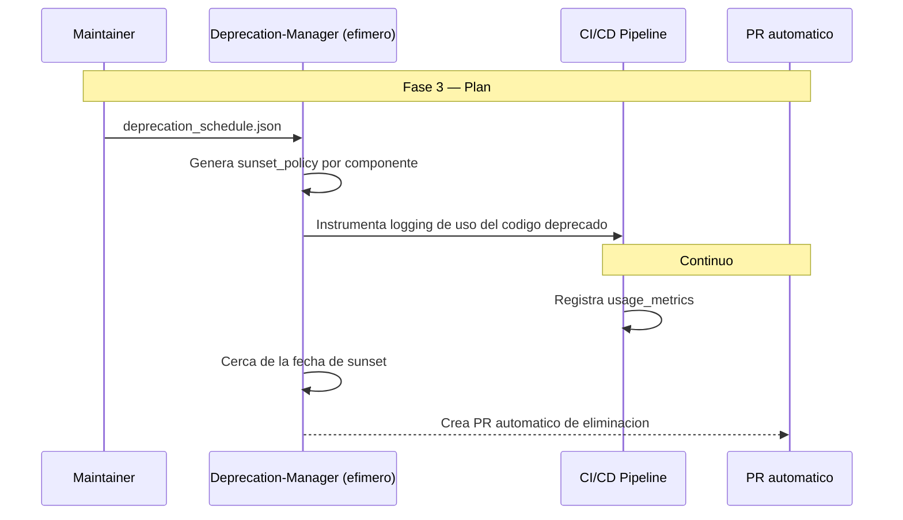

# DeprecationDD — Deprecation-Driven Development

**Version:** 1.0 | **Fecha:** 2026-06-05 | **Gobernanza:** Constitucion Evol-DD v1.5

---

## Indice

1. [Que es DeprecationDD en Evol-DD](#1-que-es-deprecationdd-en-evol-dd)
2. [Cuando aplicar](#2-cuando-aplicar)
3. [Artefactos de entrada y salida](#3-artefactos-de-entrada-y-salida)
4. [DeprecationDD en el pipeline](#4-deprecationdd-en-el-pipeline)
5. [Integracion con otras disciplinas](#5-integracion-con-otras-disciplinas)
6. [Criterios de exito](#6-criterios-de-exito)
7. [Definition of Done DeprecationDD](#7-definition-of-done-deprecationdd)
8. [Agentes involucrados](#8-agentes-involucrados)
9. [Fuentes](#9-fuentes)

---

## 1. Que es DeprecationDD en Evol-DD

Deprecation-Driven Development es la disciplina donde el codigo obsoleto tiene una politica de
sunset automatica: se marca como deprecado, se registra su uso, y tras una fecha tope se
elimina. La deprecacion es un proceso gestionado, no un comentario `// TODO: remove` que vive
para siempre.

En Evol-DD, DeprecationDD opera en la Fase 3 (Plan) como extension del workflow
`/evol dependency-update`. Produce `deprecations/*/sunset_policy.json` y
`deprecations/logs/usage_metrics.json` (uso del codigo deprecado).

El principio de DeprecationDD en Evol-DD: lo deprecado tiene fecha de muerte. Si un componente se
marca obsoleto, se registra su uso y se elimina en la fecha de sunset; codigo deprecado que
nadie retira es deuda tecnica disfrazada de cortesia.

> **executor (registro):** extension de [dependency-update.md](../../.agent/workflows/dependency-update.md).
> **Activacion por profile:** se inyecta cuando `evol.profile.yml` declara `deprecationdd` en
> `methodologies:`.

---

## 2. Cuando aplicar

| Perfil | Aplica | Motivo |
|--------|:------:|--------|
| Libreria consumida por muchos equipos | SI | El sunset coordinado evita rupturas |
| API publica con versiones deprecadas | SI | El codigo viejo debe retirarse a tiempo |
| Microservicios con interfaces compartidas | SI | Componentes reutilizados con vida limitada |
| Proyecto efimero / prototipo | NO | Sin codigo que sostener a largo plazo |

---

## 3. Artefactos de entrada y salida

| Direccion | Artefacto | Descripcion |
|-----------|-----------|-------------|
| Entrada | `api_versions/deprecation_schedule.json` | Calendario de deprecacion (desde APIVDD) |
| Salida | `deprecations/*/sunset_policy.json` | Politica de sunset (fecha tope, reemplazo) |
| Salida | `deprecations/logs/usage_metrics.json` | Metricas de uso del codigo deprecado |

---

## 4. DeprecationDD en el pipeline

### DeprecationDD por fase

| Fase | Actividad DeprecationDD | Estado esperado |
|------|-------------------------|-----------------|
| Fase 3 — Plan | Definir politicas de sunset + instrumentar uso | Politicas con fecha tope |
| Fase 4 — Build | Marcar codigo deprecado + headers/warnings | Deprecaciones senalizadas |
| Fase 6 — Retro | Revisar metricas de uso; crear PRs de eliminacion | Sunset ejecutado a tiempo |

---

## 5. Integracion con otras disciplinas

| Disciplina | Relacion |
|------------|----------|
| [APIVDD](./APIVDD.md) | El calendario de deprecacion alimenta el sunset |
| [DebtBudgetDD](./DebtBudgetDD.md) | El codigo deprecado vivo es deuda contabilizada |
| [RDD](./RDD.md) | El refactoring elimina lo deprecado de forma segura |
| [ODD_Obs](./ODD_OBS.md) | Las metricas de uso requieren observabilidad |

---

## 6. Criterios de exito

- No hay llamadas a codigo obsoleto despues de la fecha de sunset.
- Todo codigo deprecado tiene politica con fecha tope y reemplazo.
- El uso del codigo deprecado se mide (usage_metrics).
- Cerca del sunset se generan PRs de eliminacion automaticos.

---

## 7. Definition of Done DeprecationDD

| Criterio | Verificacion |
|----------|-------------|
| `sunset_policy.json` por componente deprecado | `ls deprecations/*/sunset_policy.json` |
| Metricas de uso instrumentadas | `test -f deprecations/logs/usage_metrics.json` |
| Fecha tope + reemplazo declarados | Revision de la politica |
| PR de eliminacion cerca del sunset | Historial de PRs automaticos |

---

## 8. Agentes involucrados

| Agente | Rol en DeprecationDD |
|--------|----------------------|
| `Maintainer` | Define las politicas de sunset y supervisa el calendario |
| `Deprecation-Manager` (efimero) | Genera politicas, instrumenta uso y crea PRs de eliminacion |
| `Release` | Comunica las deprecaciones a los consumidores |
| `Builder` | Marca el codigo deprecado y aplica los reemplazos |
| `Reviewer` | Audita que el codigo deprecado se retire en fecha |

---

## 9. Fuentes

Respaldo bibliografico de la disciplina (verificadas via `/evol fact-check`).

| Tipo | Fuente | Aporte |
|------|--------|--------|
| Estandar | [RFC 8594 — The Sunset HTTP Header Field](https://www.rfc-editor.org/rfc/rfc8594) | Senalizacion estandar de deprecacion |
| Guia | [API Deprecation Guide — Cleverence](https://www.cleverence.com/articles/tech-articles/how-and-when-to-deprecate-apis-timelines-versioning-sunset-headers-and-migrations/) | Plazos, cabeceras y migracion |
| Politica | [Deprecation Policy & Sunset Headers — API Commons](https://apicommons.org/deprecation-policy.html) | Senales predecibles para consumidores |
| Libreria | [Doctrine Deprecations](https://github.com/doctrine/deprecations) | Libreria ligera para manejo de deprecaciones |

> **Mantenido por:** Maintainer + Release
> **Gobernado por:** Constitucion Evol-DD v1.5, Art. 2
> **Ver tambien:** [APIVDD.md](./APIVDD.md) | [DebtBudgetDD.md](./DebtBudgetDD.md) | [RDD.md](./RDD.md) | [INDEX.md](./INDEX.md)
