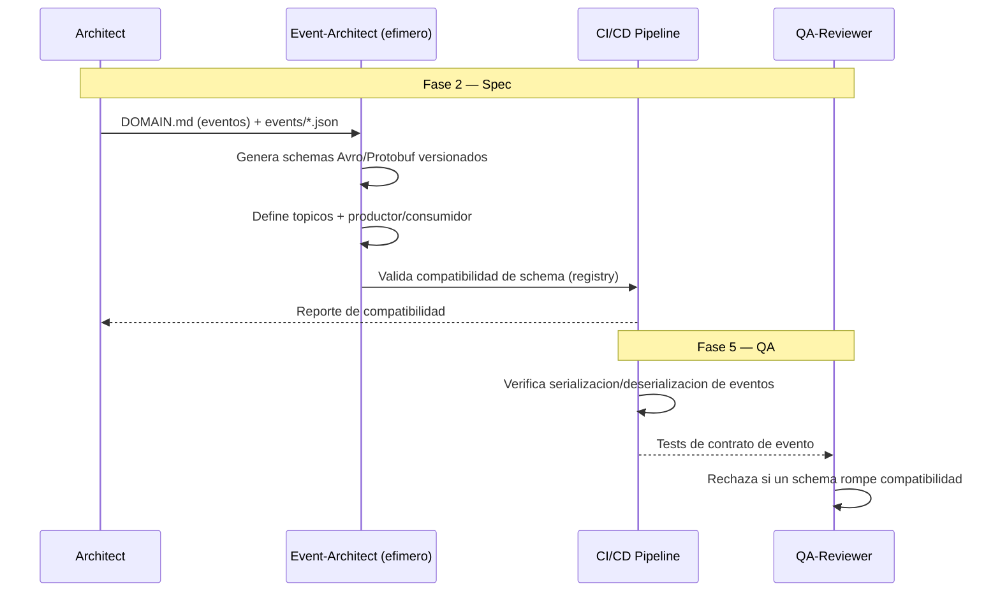

# EDA — Event-Driven Architecture (como disciplina)

**Version:** 1.0 | **Fecha:** 2026-06-05 | **Gobernanza:** Constitucion X-DD v1.5

---

## Indice

1. [Que es EDA en X-DD](#1-que-es-eda-en-x-dd)
2. [Cuando aplicar](#2-cuando-aplicar)
3. [Artefactos de entrada y salida](#3-artefactos-de-entrada-y-salida)
4. [EDA en el pipeline](#4-eda-en-el-pipeline)
5. [Integracion con otras disciplinas](#5-integracion-con-otras-disciplinas)
6. [Criterios de exito](#6-criterios-de-exito)
7. [Definition of Done EDA](#7-definition-of-done-eda)
8. [Agentes involucrados](#8-agentes-involucrados)
9. [Fuentes](#9-fuentes)

---

## 1. Que es EDA en X-DD

Event-Driven Architecture como disciplina trata los eventos de dominio como contratos de
primera clase: se definen esquemas, topicos y la relacion productor/consumidor antes de
escribir la logica de negocio. El evento no es un efecto secundario del codigo, es un
artefacto disenado y versionado.

En X-DD, EDA opera en la Fase 2 (Spec) sobre el modelo de dominio. Deriva `eda/schemas/*.avsc`,
`eda/topics/*.json` y `eda/producers/*.json` desde los eventos identificados en `DOMAIN.md`.
Se ejecuta como extension del workflow `/evol data-pipeline`.

El principio de EDA en X-DD: todo evento tiene schema evolutivo (Avro/Protobuf) con politica
de compatibilidad declarada. Un evento sin schema versionado es un acoplamiento oculto entre
servicios que rompera en produccion al cambiar.

> **executor (registro):** extension de [data-pipeline.md](../../.agent/workflows/data-pipeline.md)
> (+ `analytics-instrument` para el schema de eventos). **Activacion por profile:** se inyecta
> cuando `evol.profile.yml` declara `eda` en `methodologies:`.

---

## 2. Cuando aplicar

| Perfil | Aplica | Motivo |
|--------|:------:|--------|
| Comunicacion asincrona entre servicios | SI | Los eventos son el contrato de integracion |
| Microservicios desacoplados | SI | El bus de eventos reduce acoplamiento |
| Replicacion / propagacion de cambios | SI | Eventos como mecanismo de propagacion |
| Monolito sincrono simple | NO | Sin necesidad de mensajeria asincrona |

---

## 3. Artefactos de entrada y salida

| Direccion | Artefacto | Descripcion |
|-----------|-----------|-------------|
| Entrada | `docs/specs/DOMAIN.md` | Eventos de dominio identificados |
| Entrada | `events/*.json` | Catalogo de eventos del proyecto |
| Salida | `eda/schemas/*.avsc` | Schemas Avro/Protobuf versionados por evento |
| Salida | `eda/topics/*.json` | Definicion de topicos (particion, retencion) |
| Salida | `eda/producers/*.json` | Mapeo productor -> evento -> consumidores |

---

## 4. EDA en el pipeline

### EDA por fase

| Fase | Actividad EDA | Estado esperado |
|------|---------------|-----------------|
| Fase 2 — Spec | Disenar schemas, topicos y productores/consumidores | Schemas versionados, compatibles |
| Fase 3 — Plan | Tareas por productor/consumidor de cada evento | Trazabilidad evento -> tarea |
| Fase 4 — Build | Implementar serializacion conforme al schema | Codigo conforme al schema |
| Fase 5 — QA | Tests de contrato de evento; compatibilidad | 0 rupturas de compatibilidad |

---

## 5. Integracion con otras disciplinas

| Disciplina | Relacion |
|------------|----------|
| [DDD](./DDD.md) | Los eventos de dominio salen del modelo DDD |
| [ESDD](./ESDD.md) | Event sourcing usa estos eventos como fuente de verdad |
| [CDCDD](./CDCDD.md) | CDC emite eventos de cambio con estos schemas |
| [ADD](./ADD.md) | La eleccion de arquitectura event-driven se registra como ADR |

---

## 6. Criterios de exito

- Todos los eventos tienen schema evolutivo (Avro o Protobuf).
- Cada schema declara su politica de compatibilidad (backward/forward/full).
- Existe mapeo explicito productor -> evento -> consumidores.
- El pipeline falla si un cambio de schema rompe compatibilidad declarada.

---

## 7. Definition of Done EDA

| Criterio | Verificacion |
|----------|-------------|
| Schema por evento | `ls eda/schemas/*.avsc` |
| Topicos definidos | `ls eda/topics/*.json` |
| Mapeo productor/consumidor | Revision de `eda/producers/*.json` |
| Compatibilidad verificada | Reporte del schema registry |

---

## 8. Agentes involucrados

| Agente | Rol en EDA |
|--------|------------|
| `Architect` | Define la topologia de eventos desde DOMAIN.md |
| `Event-Architect` (efimero) | Genera schemas, topicos y codigo de serializacion |
| `Data` | Conecta los eventos con el pipeline de datos |
| `Builder` | Implementa productores y consumidores conforme al schema |
| `QA-Reviewer` | Ejecuta tests de contrato de evento en Fase 5 |

---

## 9. Fuentes

Respaldo bibliografico de la disciplina (verificadas via `/evol fact-check`).

| Tipo | Fuente | Aporte |
|------|--------|--------|
| Definicion | [Event-Driven Architecture — AWS](https://aws.amazon.com/event-driven-architecture/) | Fundamentos de productor/consumidor y desacoplamiento |
| Patrones | [Enterprise Integration Patterns — Hohpe & Woolf](https://www.enterpriseintegrationpatterns.com/) | Catalogo canonico de patrones de mensajeria |
| Guia | [Tools and Best Practices for EDA — Tyk](https://tyk.io/blog/tools-and-best-practices-for-building-event-driven-architectures/) | Nombrado consistente y semantica de mensajes |
| EDA + DDD | [Navigating Complexity in EDA with DDD — David Boyne](https://github.com/boyney123/navigating-complexity-in-eda-with-ddd) | Recursos para combinar EDA con DDD |

> **Mantenido por:** Architect + Data
> **Gobernado por:** Constitucion X-DD v1.5, Art. 2
> **Ver tambien:** [DDD.md](./DDD.md) | [ESDD.md](./ESDD.md) | [CDCDD.md](./CDCDD.md) | [INDEX.md](./INDEX.md)
