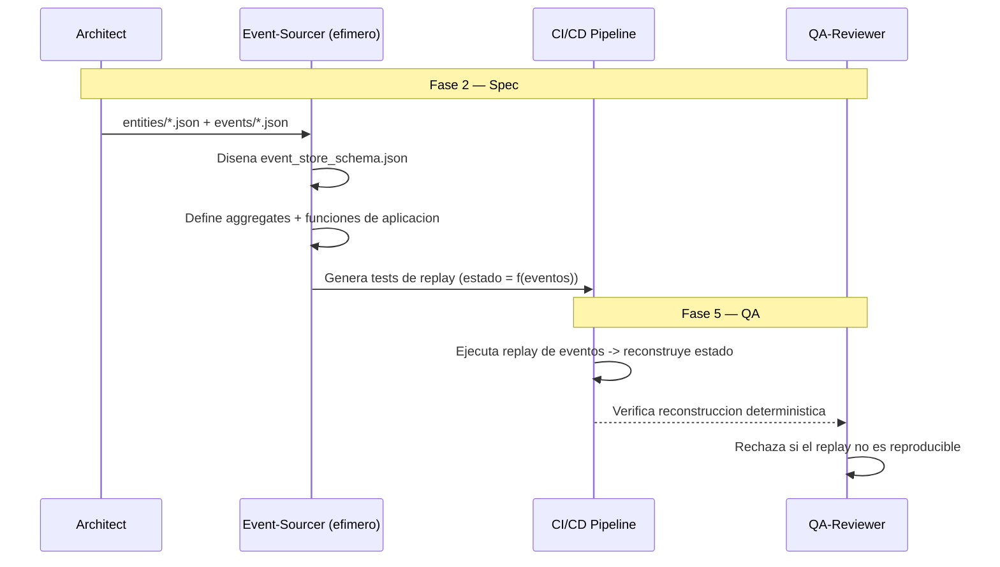

# ESDD — Event Sourcing-Driven Development

**Version:** 1.0 | **Fecha:** 2026-06-05 | **Gobernanza:** Constitucion X-DD v1.5

---

## Indice

1. [Que es ESDD en X-DD](#1-que-es-esdd-en-x-dd)
2. [Cuando aplicar](#2-cuando-aplicar)
3. [Artefactos de entrada y salida](#3-artefactos-de-entrada-y-salida)
4. [ESDD en el pipeline](#4-esdd-en-el-pipeline)
5. [Integracion con otras disciplinas](#5-integracion-con-otras-disciplinas)
6. [Criterios de exito](#6-criterios-de-exito)
7. [Definition of Done ESDD](#7-definition-of-done-esdd)
8. [Agentes involucrados](#8-agentes-involucrados)
9. [Fuentes](#9-fuentes)

---

## 1. Que es ESDD en X-DD

Event Sourcing-Driven Development es la disciplina donde el estado actual de una entidad se
deriva de la reproduccion de una secuencia de eventos inmutables, en lugar de almacenarse
como un unico registro mutable. El event store es la fuente de verdad; las proyecciones de
lectura se reconstruyen a partir de los eventos.

En X-DD, ESDD opera en la Fase 2 (Spec). Disena `eventsourcing/event_store_schema.json` y la
logica de aplicacion de eventos por aggregate. Se ejecuta mediante una skill nueva
(`/evol event-sourcing`), porque no existe workflow previo que lo cubra.

El principio de ESDD en X-DD: si el negocio requiere auditoria completa o reconstruccion del
estado en cualquier punto del tiempo, el estado no se muta, se deriva. Cada cambio es un
evento inmutable, y la entidad es la suma de su historia.

> **executor (registro):** skill nueva [`event-sourcing`](../../.agent/workflows/event-sourcing.md)
> (gap, sin cobertura previa). **Activacion por profile:** se inyecta cuando `evol.profile.yml`
> declara `esdd` en `methodologies:`.

---

## 2. Cuando aplicar

| Perfil | Aplica | Motivo |
|--------|:------:|--------|
| Sistema con auditoria completa de cambios | SI | El log de eventos es la auditoria |
| Necesidad de reconstruir estado historico | SI | Replay de eventos a cualquier punto |
| Dominio con reglas temporales complejas | SI | La historia es parte del modelo |
| CRUD simple sin requisitos de auditoria | NO | Event sourcing anade complejidad innecesaria |

---

## 3. Artefactos de entrada y salida

| Direccion | Artefacto | Descripcion |
|-----------|-----------|-------------|
| Entrada | `entities/*.json` | Entidades del dominio candidatas a event sourcing |
| Entrada | `events/*.json` | Catalogo de eventos de dominio |
| Salida | `eventsourcing/event_store_schema.json` | Esquema del event store (stream, version, payload) |
| Salida | `eventsourcing/aggregates/*.md` | Logica de aplicacion de eventos + tests de replay por aggregate |

---

## 4. ESDD en el pipeline

### ESDD por fase

| Fase | Actividad ESDD | Estado esperado |
|------|----------------|-----------------|
| Fase 2 — Spec | Disenar event store + aggregates + reglas de aplicacion | Esquema y aggregates definidos |
| Fase 4 — Build | Implementar el event store y las proyecciones | Codigo conforme al esquema |
| Fase 5 — QA | Tests de replay: estado deterministico desde eventos | Reconstruccion reproducible |
| Fase 6 — Retro | Revisar snapshots y politicas de compactacion | Performance de replay aceptable |

---

## 5. Integracion con otras disciplinas

| Disciplina | Relacion |
|------------|----------|
| [DDD](./DDD.md) | Los aggregates de event sourcing son los aggregates DDD |
| [EDA](./EDA.md) | Los eventos persistidos usan los schemas de EDA |
| [CDCDD](./CDCDD.md) | CDC puede alimentar o derivar del event store |
| [PrivacyDD](./PrivacyDD.md) | El derecho al olvido requiere estrategia (crypto-shredding) sobre eventos inmutables |

---

## 6. Criterios de exito

- Es posible reconstruir el estado de cualquier entidad en cualquier punto del tiempo.
- El replay de eventos es deterministico y reproducible.
- Existe estrategia de snapshots/compactacion para performance.
- Se documenta como se cumple el derecho al olvido sobre eventos inmutables.

---

## 7. Definition of Done ESDD

| Criterio | Verificacion |
|----------|-------------|
| `event_store_schema.json` definido | `test -f eventsourcing/event_store_schema.json` |
| Aggregates con funcion de aplicacion | `ls eventsourcing/aggregates/*.md` |
| Tests de replay reproducibles | Suite de replay en verde |
| Estrategia de privacidad documentada | Seccion en el aggregate o PRIVACY.md |

---

## 8. Agentes involucrados

| Agente | Rol en ESDD |
|--------|-------------|
| `Architect` | Decide que entidades aplican event sourcing |
| `Event-Sourcer` (efimero) | Disena el event store, aggregates y tests de replay |
| `Domain` | Aporta las reglas de negocio que gobiernan la aplicacion de eventos |
| `Builder` | Implementa el event store y las proyecciones |
| `QA-Reviewer` | Verifica reconstruccion deterministica en Fase 5 |

---

## 9. Fuentes

Respaldo bibliografico de la disciplina (verificadas via `/evol fact-check`).

| Tipo | Fuente | Aporte |
|------|--------|--------|
| Origen del patron | [Event Sourcing — Martin Fowler](https://martinfowler.com/eaaDev/EventSourcing.html) | Definicion canonica del patron event sourcing |
| Guia practica | [Getting Started with Event Sourcing — AxonIQ](https://axoniq.io/resources/getting-started-with-event-sourcing) | Whitepaper de implementacion |
| Implementacion | [Building Event-Driven Applications — EventSourcingDB](https://docs.eventsourcingdb.io/guide/) | Principios y estrategias de implementacion |
| Libreria | [eventsourcing (Python)](https://github.com/pyeventsourcing/eventsourcing) | Libreria completa de event sourcing |

> **Mantenido por:** Architect + Domain
> **Gobernado por:** Constitucion X-DD v1.5, Art. 2
> **Ver tambien:** [DDD.md](./DDD.md) | [EDA.md](./EDA.md) | [CDCDD.md](./CDCDD.md) | [INDEX.md](./INDEX.md)
