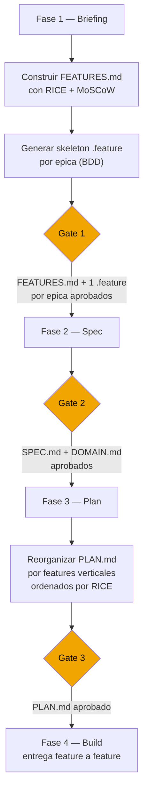

# FDD — Feature-Driven Development

**Version:** 1.0 | **Fecha:** 2026-06-04 | **Gobernanza:** Constitucion X-DD v1.5

---

## Indice

1. [Que es FDD](#1-que-es-fdd)
2. [Catalogo de features: FEATURES.md](#2-catalogo-de-features-featuresmd)
3. [FDD en el pipeline](#3-fdd-en-el-pipeline)
4. [Formato FEAT-NNN](#4-formato-feat-nnn)
5. [Priorizacion: RICE y MoSCoW](#5-priorizacion-rice-y-moscow)
6. [Plan por features verticales](#6-plan-por-features-verticales)
7. [Definition of Done FDD](#7-definition-of-done-fdd)
8. [Agentes involucrados](#8-agentes-involucrados)

---

## 1. Que es FDD

Feature-Driven Development es la disciplina que organiza el trabajo alrededor de features
completos y entregables al usuario, en lugar de capas tecnicas (base de datos, API, UI).
Un feature es una funcion de negocio que tiene valor independiente para un usuario o sistema
consumidor.

En X-DD, FDD opera en dos momentos del pipeline: durante la Fase 1 (Briefing) donde se
construye el catalogo de features, y durante la Fase 3 (Plan) donde el PLAN.md se organiza
por features verticales priorizados por valor, no por componentes tecnicos.

El principio central de FDD es que el equipo entrega valor observable en cada iteracion.
Un feature incompleto —por ejemplo, la tabla de base de datos sin el endpoint ni la UI—
no tiene valor entregable. FDD obliga a que cada unidad de trabajo sea un feature vertical
completo: desde la persistencia hasta la interfaz.

---

## 2. Catalogo de features: FEATURES.md

El artefacto central de FDD es `docs/features/FEATURES.md`. Este archivo es el inventario
completo y priorizado de funcionalidades que el sistema debe proveer.

El catalogo se construye durante la Fase 1 usando el workflow `/feature-catalog` con el
agente `Product-Manager`. Cada entrada del catalogo sigue el formato de tres partes:
`[accion] [resultado] [objeto]`.

Ejemplos de features bien formulados:

- "Generar reporte PDF del periodo de facturacion para un cliente"
- "Revocar el acceso de un usuario manteniendo su historial de actividad"
- "Enviar notificacion de alerta cuando el saldo de cuenta cae por debajo del umbral"

Un feature mal formulado ("Hacer CRUD de usuarios") describe una capa tecnica, no una
funcion de negocio, y debe ser rechazado durante la revision del catalogo.

### Estructura minima de FEATURES.md

```markdown
# Catalogo de Features — [Nombre del Proyecto]

## Epica: [Nombre]

| FEAT-NNN | Nombre | Descripcion | MoSCoW | RICE Score | Estimacion | Criterios de aceptacion |
|----------|--------|-------------|--------|-----------|------------|------------------------|
| FEAT-001 | ... | ... | Must | 48 | 2d | ... |
```

---

## 3. FDD en el pipeline

FDD interviene en dos fases del pipeline X-DD. En la Fase 1 produce el catalogo; en la
Fase 3 reorganiza el PLAN.md alrededor de ese catalogo.



### Artefactos FDD por fase

| Fase | Actividad FDD | Artefacto |
|------|--------------|-----------|
| Fase 1 — Briefing | Construir catalogo de features con RICE/MoSCoW | `docs/features/FEATURES.md` |
| Fase 1 — Briefing | Generar skeleton de archivos .feature por epica | `tests/features/feature-NNN-*.feature` |
| Fase 3 — Plan | Reorganizar PLAN.md por features verticales | `docs/plans/PLAN.md` |
| Fase 4 — Build | Construir feature completo (persistencia + logica + UI + tests) | `src/` + `tests/` |
| Fase 5 — QA | Verificar que el .feature del feature pasa al 100% | Reporte de cobertura BDD |

---

## 4. Formato FEAT-NNN

Cada feature en FEATURES.md usa el identificador `FEAT-NNN` donde NNN es un numero
secuencial de tres digitos con ceros iniciales (FEAT-001, FEAT-002, ...).

### Estructura completa de un FEAT-NNN

| Campo | Descripcion | Ejemplo |
|-------|-------------|---------|
| `FEAT-NNN` | Identificador unico | `FEAT-007` |
| Nombre | Nombre corto del feature | "Exportar reporte mensual PDF" |
| Descripcion | Formato `[accion] [resultado] [objeto]` | "Generar y descargar PDF del periodo de facturacion para el operador" |
| Epica | Agrupacion logica de features relacionados | "Facturacion" |
| MoSCoW | Prioridad de negocio | Must / Should / Could / Won't |
| RICE Score | Puntuacion cuantitativa de prioridad | 48 |
| Estimacion | Dias de esfuerzo del equipo | 2d |
| Criterios de aceptacion | Lista de condiciones que el feature debe cumplir | Ver SPEC.md REQ-007 |
| TC vinculados | Casos de prueba asociados | TC-021, TC-022 |
| .feature file | Archivo Gherkin correspondiente | `tests/features/feature-007-exportar-pdf.feature` |

### Reglas de integridad del catalogo

- No puede existir un archivo `.feature` sin entrada en FEATURES.md.
- No puede existir un FEAT-NNN en PLAN.md sin entrada en FEATURES.md.
- Si un feature se elimina del alcance, el FEAT-NNN se marca `Won't` con justificacion.
  Los IDs no se reutilizan.

---

## 5. Priorizacion: RICE y MoSCoW

FDD combina dos frameworks de priorizacion complementarios. MoSCoW establece la
obligatoriedad de negocio; RICE establece el orden de ejecucion dentro de cada categoria.

### MoSCoW

| Categoria | Significado | Condicion |
|-----------|-------------|-----------|
| Must | El producto no puede lanzarse sin esta funcionalidad | Fallo de negocio si no esta |
| Should | Alta prioridad pero no bloquea el lanzamiento | Se incluye en el sprint principal |
| Could | Deseable si el tiempo lo permite | Se incluye si sobra capacidad |
| Won't | Fuera del alcance de esta iteracion | Documentado explicitamente para evitar scope creep |

### RICE Score

RICE = (Reach * Impact * Confidence) / Effort

| Variable | Definicion | Escala |
|----------|------------|--------|
| Reach | Cuantos usuarios afecta en el periodo de medicion | Numero de usuarios por periodo |
| Impact | Cual es el impacto en el objetivo de negocio | 3=masivo, 2=alto, 1=medio, 0.5=bajo, 0.25=minimo |
| Confidence | Que tan seguros estamos de las estimaciones | 100%=alto, 80%=medio, 50%=bajo |
| Effort | Cuantas personas-semana requiere | Personas-semana |

Un feature con RICE alto y categoria Must tiene la maxima prioridad. El PLAN.md ordena
los features de mayor a menor RICE dentro de cada sprint.

---

## 6. Plan por features verticales

La diferencia central que FDD introduce en la Fase 3 es la reorganizacion del PLAN.md.
Sin FDD, los planes se organizan por capas tecnicas. Con FDD, se organizan por features
completos y verticales.

### Estructura sin FDD (por capas — prohibido)

```
Tarea 1: Diseno de base de datos
Tarea 2: Migraciones ORM
Tarea 3: Endpoints CRUD
Tarea 4: Componentes UI
Tarea 5: Tests unitarios
Tarea 6: Tests E2E
```

### Estructura con FDD (por features verticales — obligatorio)

```
FEAT-001: Exportar reporte mensual PDF — RICE: 48, Must, 2d
  1.1 Tabla facturas + modelo ORM           [1h]
  1.2 Servicio de calculo de totales (TDD)  [2h]
  1.3 Endpoint GET /reportes/:mes/pdf       [1h]
  1.4 Componente UI "Exportar PDF"          [2h]
  1.5 Test unitario del servicio (TDD)      [1h]
  1.6 Test E2E del flujo completo (BDD)     [1h]
  DoD: tests/features/feature-001-*.feature pasa al 100%

FEAT-002: Revocar acceso de usuario — RICE: 36, Must, 1d
  ...
```

El beneficio de esta estructura es que el equipo puede entregar valor observable al final
de cada feature, sin esperar a que todas las capas tecnicas esten terminadas.

---

## 7. Definition of Done FDD

Un proyecto cumple con FDD cuando:

| Criterio | Verificacion |
|----------|-------------|
| FEATURES.md existe en `docs/features/FEATURES.md` | `test -f docs/features/FEATURES.md` |
| Cada feature tiene FEAT-NNN unico | Sin IDs duplicados en el archivo |
| Cada feature tiene prioridad MoSCoW y RICE Score | Columnas presentes en la tabla |
| Al menos 1 archivo .feature por epica en `tests/features/` | `ls tests/features/*.feature` |
| PLAN.md organizado por features verticales, no por capas | Revision estructural |
| Cada feature en PLAN.md traza a FEAT-NNN en FEATURES.md | Verificacion cruzada |
| El .feature del feature pasa al 100% en Fase 5 | Reporte BDD en CI |
| Features eliminados marcados Won't con justificacion | Sin eliminaciones sin registro |

---

## 8. Agentes involucrados

| Agente | Rol en FDD |
|--------|-----------|
| `Product-Manager` | Elicita features del solicitante, construye FEATURES.md con RICE/MoSCoW |
| `Project-Manager` | Organiza PLAN.md por features verticales y gestiona la estimacion |
| `Orchestrator` | Coordina la entrega feature a feature durante Build |
| `Rapid-Prototyper` | Genera los skeleton de archivos .feature en Fase 1 |
| `Builder` | Construye cada feature de forma vertical y completa |
| `QA-Reviewer` | Verifica que el .feature del feature pasa al 100% en Fase 5 |

---

> **Mantenido por:** Product-Manager + Project-Manager
> **Gobernado por:** Constitucion X-DD v1.5, Art. 2
> **Ver tambien:** [SDD.md](./SDD.md) | [BDD.md](./BDD.md) | [INDEX.md](./INDEX.md)
