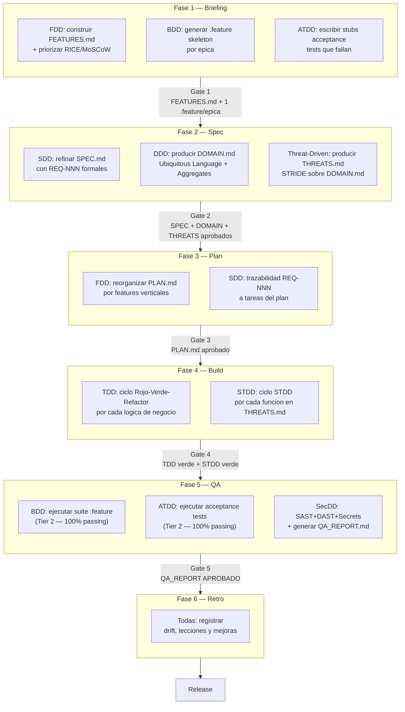
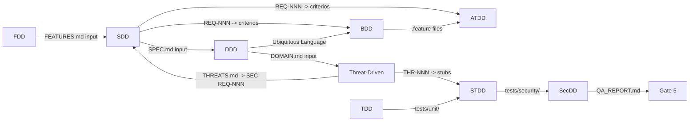

# Disciplinas X-DD — Indice Maestro

**Version:** 1.0 | **Fecha:** 2026-06-04 | **Gobernanza:** Constitucion X-DD v1.5

---

## Introduccion

Este indice centraliza las nueve disciplinas de desarrollo que X-DD integra sobre su
pipeline gated de 6 fases. Cada disciplina ocupa un documento atomico en este directorio.
La Guia de Integracion (`../X-DD_Integration_Guide.md`) proporciona el contexto de
composicion y los arboles de decision para seleccionar que disciplinas aplican en cada
proyecto.

El principio de atomicidad: un documento cubre exactamente un dominio tecnico. La
mezcla de dominios en un documento unico viola el DOC_STANDARD v2.0 y genera
documentacion ambigua que no sirve como referencia de implementacion.

---

## Tabla de disciplinas

| Disciplina | Archivo | Fase principal | Artefacto clave | Gate asociado |
|------------|---------|---------------|-----------------|---------------|
| SDD — Spec-Driven Development | [SDD.md](./SDD.md) | Todas (transversal) | `docs/specs/SPEC.md` | Todos los gates |
| FDD — Feature-Driven Development | [FDD.md](./FDD.md) | Fase 1 + Fase 3 | `docs/features/FEATURES.md` | Gate 1 + Gate 3 |
| DDD — Domain-Driven Design | [DDD.md](./DDD.md) | Fase 2 | `docs/specs/DOMAIN.md` | Gate 2 |
| BDD — Behavior-Driven Development | [BDD.md](./BDD.md) | Fase 1 + Fase 5 | `tests/features/*.feature` | Gate 1 + Gate 5 |
| ATDD — Acceptance Test-Driven Development | [ATDD.md](./ATDD.md) | Fase 1 + Fase 5 | `tests/acceptance/*.acceptance.test.ts` | Gate 1 + Gate 5 |
| TDD — Test-Driven Development | [TDD.md](./TDD.md) | Fase 4 | `tests/unit/*.test.ts` | Gate 4 |
| STDD — Security-Test-Driven Development | [STDD.md](./STDD.md) | Fase 4 | `tests/security/**/*.security.test.ts` | Gate 4 |
| SecDD — Security-Driven Development | [SecDD.md](./SecDD.md) | Fase 5 | `.evol/qa/QA_REPORT.md` | Gate 5 |
| Threat-Driven Development | [THREAT-DRIVEN.md](./THREAT-DRIVEN.md) | Fase 2 | `docs/specs/THREATS.md` | Gate 2 |

---

## Diagrama del pipeline con disciplinas

El siguiente diagrama muestra donde entra cada disciplina en el pipeline de 6 fases de
X-DD. Las disciplinas son capas que se embeben en las fases existentes; no crean nuevas
fases ni cambian el numero de gates.

---

## Relaciones entre disciplinas

Las disciplinas no son independientes: se alimentan mutuamente de artefactos y
comparten vocabulario. Entender estas dependencias evita el trabajo duplicado y el
drift entre artefactos.

### Tabla de dependencias

| Disciplina | Depende de | Produce para |
|------------|-----------|-------------|
| SDD | FDD (FEATURES.md) | Todas (SPEC.md) |
| FDD | Ninguna | SDD (FEATURES.md), BDD (.feature skeletons) |
| DDD | SDD (SPEC.md borrador) | Threat-Driven (DOMAIN.md), BDD (vocabulario) |
| Threat-Driven | DDD (DOMAIN.md) | SDD (SEC-REQ-NNN), STDD (stubs) |
| BDD | FDD, DDD (vocabulario) | ATDD (cobertura semantica), QA Tier 2 |
| ATDD | SDD (REQ-NNN), BDD (.feature) | QA Tier 2 |
| TDD | SDD (REQ-NNN) | STDD (ciclo base) |
| STDD | TDD, Threat-Driven (THR-NNN) | SecDD (security tests) |
| SecDD | Todas (codigo final) | Gate 5 (QA_REPORT.md) |

---

## Seleccion de disciplinas por perfil de proyecto

No todos los proyectos requieren las 9 disciplinas. Esta tabla sirve como guia rapida.
Para la logica completa de seleccion, ver la seccion 6 de `../X-DD_Integration_Guide.md`.

| Perfil | FDD | DDD | SDD | ATDD | BDD | TDD | Threat | STDD | SecDD |
|--------|:---:|:---:|:---:|:----:|:---:|:---:|:------:|:----:|:-----:|
| Modulo nuevo con logica compleja | SI | SI | SI | SI | SI | SI | SI | SI | SI |
| Feature con usuario definido | SI | WARN | SI | SI | SI | SI | WARN | SI | SI |
| Tool interna / script | SI | NO | SI | NO | NO | SI | NO | NO | WARN |
| Bugfix mayor a 20 lineas | NO | NO | SI | NO | NO | SI | NO | WARN | NO |
| Refactoring de dominio | NO | SI | SI | NO | NO | SI | NO | NO | WARN |
| Integracion con sistema externo | SI | WARN | SI | SI | SI | SI | SI | SI | SI |

> WARN = Opcional segun complejidad; evaluar con el arbol de decision.

---

## Archivos de referencia

| Archivo | Proposito |
|---------|-----------|
| [SDD.md](./SDD.md) | Spec-Driven Development — SPEC.md, gates, trazabilidad |
| [FDD.md](./FDD.md) | Feature-Driven Development — FEATURES.md, RICE/MoSCoW |
| [DDD.md](./DDD.md) | Domain-Driven Design — DOMAIN.md, aggregates, ubiquitous language |
| [BDD.md](./BDD.md) | Behavior-Driven Development — .feature files, Gherkin, Playwright |
| [ATDD.md](./ATDD.md) | Acceptance TDD — stubs acceptance tests, bloqueo CI |
| [TDD.md](./TDD.md) | Test-Driven Development — ciclo Rojo-Verde-Refactor, Art. 8 |
| [STDD.md](./STDD.md) | Security TDD — ciclo STDD, STRIDE a stubs |
| [SecDD.md](./SecDD.md) | Security-Driven Development — SAST/DAST/Secrets, QA_REPORT.md |
| [THREAT-DRIVEN.md](./THREAT-DRIVEN.md) | Threat-Driven Development — STRIDE, THREATS.md, THR-NNN |
| [../X-DD_Integration_Guide.md](../X-DD_Integration_Guide.md) | Guia de integracion — composicion, arboles de decision |
| [../DOC_STANDARD.md](../DOC_STANDARD.md) | Estandar de documentacion X-DD v2.0 |

---

> **Mantenido por:** Architect + Orchestrator
> **Gobernado por:** Constitucion X-DD v1.5
> **Actualizar cuando:** se agregue una nueva disciplina o cambie el pipeline
