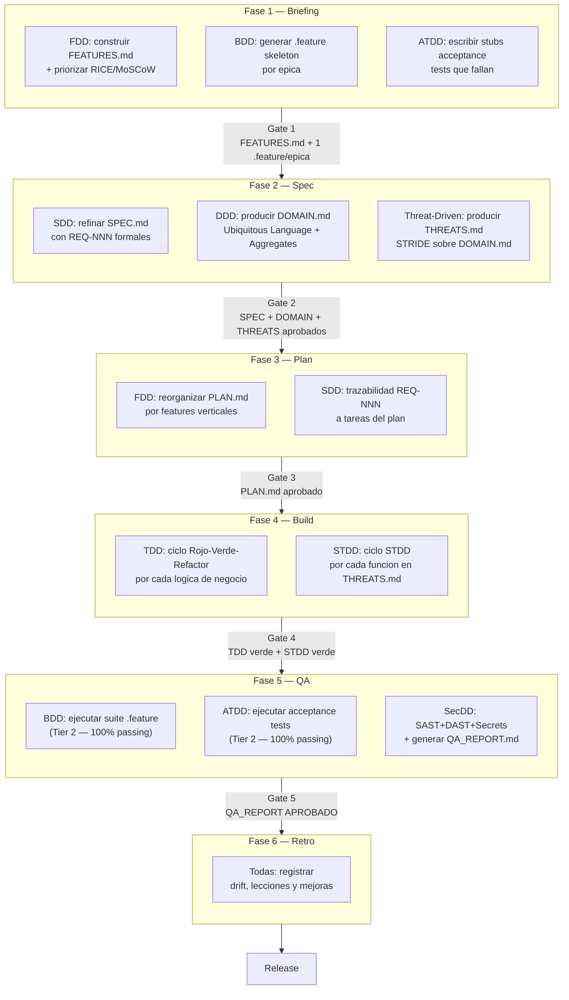
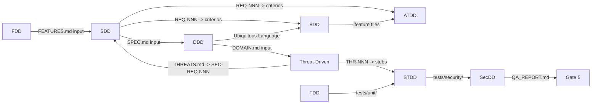

# Disciplinas X-DD — Indice Maestro

**Version:** 1.0 | **Fecha:** 2026-06-04 | **Gobernanza:** Constitucion X-DD v1.5

---

## Introduccion

Este indice centraliza las **31 disciplinas** de desarrollo que X-DD integra sobre su
pipeline gated de 6 fases: las **9 base** (declaradas en la Constitucion) y las **22
extendidas** (catalogo `ultimate-update.md`). Cada disciplina ocupa un documento atomico en
este directorio con su sidecar `.json` (que incluye `fuentes[]` — las URLs de respaldo). La
Guia de Integracion (`../X-DD_Integration_Guide.md`) proporciona el contexto de composicion y
los arboles de decision para seleccionar que disciplinas aplican en cada proyecto.

El principio de atomicidad: un documento cubre exactamente un dominio tecnico. La
mezcla de dominios en un documento unico viola el DOC_STANDARD v2.0 y genera
documentacion ambigua que no sirve como referencia de implementacion.

**Activacion por caso de uso:** no todo proyecto usa las 31. El `evol.profile.yml` declara en
su bloque `methodologies:` cuales aplican; el orquestador inyecta solo esas capas en su fase
correspondiente (ver columna `executor` de cada ficha). Las 9 base son el nucleo recomendado;
las 22 extendidas se activan segun el perfil del proyecto.

**Respaldo de fuentes (DOC_STANDARD):** cada ficha cierra con una seccion **Fuentes** con la
URL de respaldo de la disciplina. El sidecar `.json` captura esas URLs en `fuentes[]`. Una
ficha sin fuentes es INCOMPLETA — el validador la rechaza.

---

## Tabla de disciplinas base (9 — nucleo Constitucion)

| Disciplina | Archivo | Fase principal | Artefacto clave | Gate asociado |
|------------|---------|---------------|-----------------|---------------|
| SDD — Spec-Driven Development | [SDD.md](./SDD.md) | Todas (transversal) | `docs/specs/SPEC.md` | Todos los gates |
| FDD — Feature-Driven Development | [FDD.md](./FDD.md) | Fase 1 + Fase 3 | `docs/features/FEATURES.md` | Gate 1 + Gate 3 |
| DDD — Domain-Driven Design | [DDD.md](./DDD.md) | Fase 2 | `docs/specs/DOMAIN.md` | Gate 2 |
| BDD — Behavior-Driven Development | [BDD.md](./BDD.md) | Fase 1 + Fase 5 | `tests/features/*.feature` | Gate 1 + Gate 5 |
| ATDD — Acceptance Test-Driven Development | [ATDD.md](./ATDD.md) | Fase 1 + Fase 5 | `tests/acceptance/*.acceptance.test.ts` | Gate 1 + Gate 5 |
| TDD — Test-Driven Development | [TDD.md](./TDD.md) | Fase 4 | `tests/unit/*.test.ts` | Gate 4 |
| STDD — Security-Test-Driven Development | [STDD.md](./STDD.md) | Fase 4 | `tests/security/**/*.security.test.ts` | Gate 4 |
| SecDD — Security-Driven Development | [SecDD.md](./SecDD.md) | Fase 5 | `.xdd/qa/QA_REPORT.md` | Gate 5 |
| Threat-Driven Development | [THREAT-DRIVEN.md](./THREAT-DRIVEN.md) | Fase 2 | `docs/specs/THREATS.md` | Gate 2 |

---

## Tabla de disciplinas extendidas (22 — activables por profile)

| # | Disciplina | Archivo | Fase principal | executor | Forma |
|---|------------|---------|----------------|----------|-------|
| 1 | ODD_API — OpenAPI-Driven | [ODD_API.md](./ODD_API.md) | Spec | `api-contract` | mapeo |
| 2 | UXDD — UX-Driven | [UXDD.md](./UXDD.md) | Briefing | `ux-driven` | skill nueva |
| 3 | A11yDD — Accessibility-Driven | [A11yDD.md](./A11yDD.md) | Briefing + QA | `a11y-audit` | mapeo |
| 4 | RDD — Refactoring-Driven | [RDD.md](./RDD.md) | Build | `refactor-area` | mapeo |
| 5 | PDD — Performance-Driven | [PDD.md](./PDD.md) | QA | `perf-budget` + tags | mapeo + declarativa |
| 6 | Chaos — Resiliency-Driven | [CHAOS.md](./CHAOS.md) | QA | `dr-drill` + sandbox | extension |
| 7 | MDD — Migration-Driven | [MDD.md](./MDD.md) | Plan | `db-migrate` | mapeo |
| 8 | CDCDD — Change Data Capture | [CDCDD.md](./CDCDD.md) | Plan | `data-pipeline` | extension |
| 9 | ESDD — Event Sourcing-Driven | [ESDD.md](./ESDD.md) | Spec | `event-sourcing` | skill nueva |
| 10 | CCDD — Consumer-Driven Contract | [CCDD.md](./CCDD.md) | QA | `contract-test` | mapeo |
| 11 | APIVDD — API Versioning-Driven | [APIVDD.md](./APIVDD.md) | Plan | `api-versioning` | skill nueva |
| 12 | ODD_Obs — Observability-Driven | [ODD_OBS.md](./ODD_OBS.md) | QA | `observability-init` | mapeo |
| 13 | SLO/SLA-Driven | [SLODRIVEN.md](./SLODRIVEN.md) | QA | obs + perf (sub-gate) | declarativa |
| 14 | IODD — Infrastructure-as-Code | [IODD.md](./IODD.md) | Spec | `iac-driven` | skill nueva |
| 15 | Pipeline-Driven | [PIPELINE-DRIVEN.md](./PIPELINE-DRIVEN.md) | Build | `deploy-prod` + `rollback` | mapeo |
| 16 | Compliance-Driven | [COMPLIANCE.md](./COMPLIANCE.md) | Spec | `privacy-review` (ext) | extension |
| 17 | PrivacyDD — Privacy by Design | [PrivacyDD.md](./PrivacyDD.md) | Spec | `privacy-review` | mapeo |
| 18 | DebtBudgetDD — Tech Debt Budgeting | [DebtBudgetDD.md](./DebtBudgetDD.md) | Plan | `debt-budget` | skill nueva |
| 19 | DeprecationDD — Deprecation-Driven | [DeprecationDD.md](./DeprecationDD.md) | Plan | `dependency-update` (ext) | extension |
| 20 | ADD — Architecture-Driven | [ADD.md](./ADD.md) | Spec | `adr-new` | mapeo |
| 21 | EDA — Event-Driven Architecture | [EDA.md](./EDA.md) | Spec | `data-pipeline` (ext) | extension |
| 22 | UDD — Use-Case-Driven | [UDD.md](./UDD.md) | Briefing | `use-case-driven` | skill nueva |

---

## Diagrama del pipeline con disciplinas

El siguiente diagrama muestra donde entra cada disciplina en el pipeline de 6 fases de
X-DD. Las disciplinas son capas que se embeben en las fases existentes; no crean nuevas
fases ni cambian el numero de gates.

---

## Relaciones entre disciplinas

Las disciplinas no son independientes: se alimentan mutuamente de artefactos y
comparten vocabulario. Entender estas dependencias evita el trabajo duplicado y el
drift entre artefactos.

### Tabla de dependencias

| Disciplina | Depende de | Produce para |
|------------|-----------|-------------|
| SDD | FDD (FEATURES.md) | Todas (SPEC.md) |
| FDD | Ninguna | SDD (FEATURES.md), BDD (.feature skeletons) |
| DDD | SDD (SPEC.md borrador) | Threat-Driven (DOMAIN.md), BDD (vocabulario) |
| Threat-Driven | DDD (DOMAIN.md) | SDD (SEC-REQ-NNN), STDD (stubs) |
| BDD | FDD, DDD (vocabulario) | ATDD (cobertura semantica), QA Tier 2 |
| ATDD | SDD (REQ-NNN), BDD (.feature) | QA Tier 2 |
| TDD | SDD (REQ-NNN) | STDD (ciclo base) |
| STDD | TDD, Threat-Driven (THR-NNN) | SecDD (security tests) |
| SecDD | Todas (codigo final) | Gate 5 (QA_REPORT.md) |

---

## Seleccion de disciplinas por perfil de proyecto

No todos los proyectos requieren las 9 disciplinas base. Esta tabla (solo las 9 base) sirve
como guia rapida; las 22 extendidas se eligen en la subseccion siguiente. Para la logica
completa de seleccion, ver la seccion 6 de `../X-DD_Integration_Guide.md`.

| Perfil | FDD | DDD | SDD | ATDD | BDD | TDD | Threat | STDD | SecDD |
|--------|:---:|:---:|:---:|:----:|:---:|:---:|:------:|:----:|:-----:|
| Modulo nuevo con logica compleja | SI | SI | SI | SI | SI | SI | SI | SI | SI |
| Feature con usuario definido | SI | WARN | SI | SI | SI | SI | WARN | SI | SI |
| Tool interna / script | SI | NO | SI | NO | NO | SI | NO | NO | WARN |
| Bugfix mayor a 20 lineas | NO | NO | SI | NO | NO | SI | NO | WARN | NO |
| Refactoring de dominio | NO | SI | SI | NO | NO | SI | NO | NO | WARN |
| Integracion con sistema externo | SI | WARN | SI | SI | SI | SI | SI | SI | SI |

> WARN = Opcional segun complejidad; evaluar con el arbol de decision.

### Disciplinas extendidas por perfil de proyecto

Las 22 extendidas se activan en `evol.profile.yml` (`methodologies:`) segun el perfil. Guia:

| Perfil de proyecto | Disciplinas extendidas tipicas |
|--------------------|--------------------------------|
| API publica / microservicios | ODD_API, CCDD, APIVDD, ODD_Obs, SLO/SLA, EDA, Pipeline-Driven |
| Webapp / mobile con UI | UXDD, A11yDD, UDD, ODD_API |
| Sistema data-intensive | MDD, CDCDD, ESDD, EDA, ODD_Obs |
| Fintech / salud (regulado) | Compliance, PrivacyDD, SecDD, SLO/SLA |
| Alta disponibilidad / critico | Chaos, ODD_Obs, SLO/SLA, Pipeline-Driven, PDD |
| Cloud-native | IODD, Pipeline-Driven, ADD, ODD_Obs |
| Legacy / mantenimiento | RDD, DebtBudgetDD, DeprecationDD, MDD |

---

## Archivos de referencia

| Archivo | Proposito |
|---------|-----------|
| [SDD.md](./SDD.md) | Spec-Driven Development — SPEC.md, gates, trazabilidad |
| [FDD.md](./FDD.md) | Feature-Driven Development — FEATURES.md, RICE/MoSCoW |
| [DDD.md](./DDD.md) | Domain-Driven Design — DOMAIN.md, aggregates, ubiquitous language |
| [BDD.md](./BDD.md) | Behavior-Driven Development — .feature files, Gherkin, Playwright |
| [ATDD.md](./ATDD.md) | Acceptance TDD — stubs acceptance tests, bloqueo CI |
| [TDD.md](./TDD.md) | Test-Driven Development — ciclo Rojo-Verde-Refactor, Art. 8 |
| [STDD.md](./STDD.md) | Security TDD — ciclo STDD, STRIDE a stubs |
| [SecDD.md](./SecDD.md) | Security-Driven Development — SAST/DAST/Secrets, QA_REPORT.md |
| [THREAT-DRIVEN.md](./THREAT-DRIVEN.md) | Threat-Driven Development — STRIDE, THREATS.md, THR-NNN |
| [ODD_API.md](./ODD_API.md) | OpenAPI-Driven — contrato OpenAPI 3.1 spec-first |
| [UXDD.md](./UXDD.md) | UX-Driven — user journeys, mensajes, microinteracciones |
| [A11yDD.md](./A11yDD.md) | Accessibility-Driven — WCAG 2.1 AA, axe-core, Lighthouse |
| [RDD.md](./RDD.md) | Refactoring-Driven — refactoring guiado por metricas |
| [PDD.md](./PDD.md) | Performance-Driven — SLOs de latencia, pruebas de carga k6 |
| [CHAOS.md](./CHAOS.md) | Chaos/Resiliency-Driven — fault injection, recuperacion |
| [MDD.md](./MDD.md) | Migration-Driven — migraciones up/down reversibles |
| [CDCDD.md](./CDCDD.md) | Change Data Capture — replicacion como eventos |
| [ESDD.md](./ESDD.md) | Event Sourcing-Driven — event store, replay determinista |
| [CCDD.md](./CCDD.md) | Consumer-Driven Contract — contratos Pact |
| [APIVDD.md](./APIVDD.md) | API Versioning-Driven — versionado + deprecacion |
| [ODD_OBS.md](./ODD_OBS.md) | Observability-Driven — metricas, logs, trazas |
| [SLODRIVEN.md](./SLODRIVEN.md) | SLO/SLA-Driven — error budget como sub-gate |
| [IODD.md](./IODD.md) | Infrastructure-as-Code-Driven — IaC recreable |
| [PIPELINE-DRIVEN.md](./PIPELINE-DRIVEN.md) | Pipeline-Driven — stages + rollback automatico |
| [COMPLIANCE.md](./COMPLIANCE.md) | Compliance-Driven — GDPR/HIPAA/PCI/SOC2 controles |
| [PrivacyDD.md](./PrivacyDD.md) | Privacy by Design — PII, consentimiento, olvido |
| [DebtBudgetDD.md](./DebtBudgetDD.md) | Tech Debt Budgeting — ledger y presupuesto de deuda |
| [DeprecationDD.md](./DeprecationDD.md) | Deprecation-Driven — sunset automatico |
| [ADD.md](./ADD.md) | Architecture-Driven — ADRs + PoC |
| [EDA.md](./EDA.md) | Event-Driven Architecture — schemas de eventos |
| [UDD.md](./UDD.md) | Use-Case-Driven — casos de uso como unidad de diseno |
| [../X-DD_Integration_Guide.md](../X-DD_Integration_Guide.md) | Guia de integracion — composicion, arboles de decision |
| [../DOC_STANDARD.md](../DOC_STANDARD.md) | Estandar de documentacion X-DD v2.0 |

---

> **Mantenido por:** Architect + Orchestrator
> **Gobernado por:** Constitucion X-DD v1.5
> **Actualizar cuando:** se agregue una nueva disciplina o cambie el pipeline
> **Total disciplinas:** 31 (9 base + 22 extendidas)
