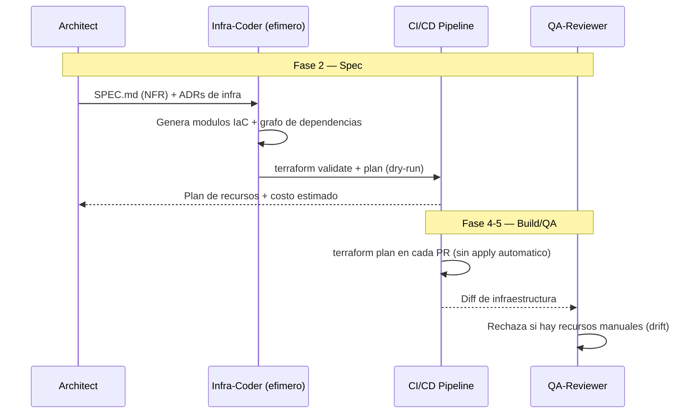

# IODD — Infrastructure-as-Code-Driven Development

**Version:** 1.0 | **Fecha:** 2026-06-05 | **Gobernanza:** Constitucion X-DD v1.5

---

## Indice

1. [Que es IODD en X-DD](#1-que-es-iodd-en-x-dd)
2. [Cuando aplicar](#2-cuando-aplicar)
3. [Artefactos de entrada y salida](#3-artefactos-de-entrada-y-salida)
4. [IODD en el pipeline](#4-iodd-en-el-pipeline)
5. [Integracion con otras disciplinas](#5-integracion-con-otras-disciplinas)
6. [Criterios de exito](#6-criterios-de-exito)
7. [Definition of Done IODD](#7-definition-of-done-iodd)
8. [Agentes involucrados](#8-agentes-involucrados)
9. [Fuentes](#9-fuentes)

---

## 1. Que es IODD en X-DD

Infrastructure-as-Code-Driven Development es la disciplina donde los recursos de
infraestructura (computo, red, almacenamiento, IAM) se especifican como codigo desde la
fase de especificacion, no se aprovisionan a mano en una consola. La infraestructura es
declarativa, versionada y recreable desde cero.

En X-DD, IODD opera en la Fase 2 (Spec) y se materializa en Build. Produce `infra/main.tf`
(o modulos equivalentes) y `infra/dependencies_graph.json` desde SPEC.md y los ADRs de
infraestructura. Se ejecuta mediante una skill nueva (`/evol iac-driven`).

El principio de IODD en X-DD: no hay recursos creados manualmente en consola. Si un recurso
existe en produccion y no esta en el codigo de infraestructura, es drift y debe corregirse.
La infraestructura se recrea desde cero de forma reproducible.

> **executor (registro):** skill nueva [`iac-driven`](../../.agent/workflows/iac-driven.md)
> (gap, sin cobertura previa). **Activacion por profile:** se inyecta cuando `evol.profile.yml`
> declara `iodd` en `methodologies:`.

---

## 2. Cuando aplicar

| Perfil | Aplica | Motivo |
|--------|:------:|--------|
| Proyecto desplegado en cloud | SI | La infra es codigo versionado y recreable |
| Infraestructura automatizada / multi-entorno | SI | Paridad dev/staging/prod via codigo |
| Microservicios con infra propia | SI | Cada servicio declara sus recursos |
| Script local sin despliegue | NO | Sin infraestructura que aprovisionar |

---

## 3. Artefactos de entrada y salida

| Direccion | Artefacto | Descripcion |
|-----------|-----------|-------------|
| Entrada | `docs/specs/SPEC.md` | Requisitos no funcionales (escalado, regiones) |
| Entrada | `docs/adr/*.md` | Decisiones de infraestructura (cloud, topologia) |
| Salida | `infra/main.tf` (+ modulos) | Recursos declarativos (Terraform u OpenTofu) |
| Salida | `infra/dependencies_graph.json` | Grafo de dependencias entre recursos |

---

## 4. IODD en el pipeline

### IODD por fase

| Fase | Actividad IODD | Estado esperado |
|------|----------------|-----------------|
| Fase 2 — Spec | Especificar recursos como codigo modular | IaC valido, plan limpio |
| Fase 3 — Plan | Tareas de aprovisionamiento por entorno | Trazabilidad recurso -> tarea |
| Fase 4 — Build | `terraform plan` en cada PR; tests de infra | Sin drift, plan reproducible |
| Fase 5 — QA | Verificar recreabilidad desde cero | Infra recreable sin pasos manuales |

---

## 5. Integracion con otras disciplinas

| Disciplina | Relacion |
|------------|----------|
| [SDD](./SDD.md) | Los NFR de SPEC.md dimensionan los recursos |
| [ADD](./ADD.md) | Las decisiones de infraestructura vienen de ADRs |
| [Pipeline-Driven](./PIPELINE-DRIVEN.md) | El deploy consume la infraestructura declarada |
| [ODD_Obs](./ODD_OBS.md) | La observabilidad se aprovisiona como parte de la infra |

---

## 6. Criterios de exito

- La infraestructura es recreable desde cero sin recursos manuales en consola.
- `terraform validate` y `terraform plan` corren limpio en CI.
- Existe grafo de dependencias entre recursos.
- No hay drift entre el estado real y el codigo de infraestructura.

---

## 7. Definition of Done IODD

| Criterio | Verificacion |
|----------|-------------|
| `infra/main.tf` (o modulos) existe | `ls infra/*.tf` |
| Codigo IaC valido | `terraform validate` |
| Grafo de dependencias | `test -f infra/dependencies_graph.json` |
| Sin drift | `terraform plan` sin cambios inesperados |

---

## 8. Agentes involucrados

| Agente | Rol en IODD |
|--------|-------------|
| `Architect` | Define los recursos necesarios desde SPEC.md + ADRs |
| `Infra-Coder` (efimero) | Genera los modulos IaC y el grafo de dependencias |
| `DevOps` | Integra el `plan` en el pipeline; gestiona los entornos |
| `Builder` | Escribe tests de infraestructura |
| `QA-Reviewer` | Verifica recreabilidad y ausencia de drift en Fase 5 |

---

## 9. Fuentes

Respaldo bibliografico de la disciplina (verificadas via `/evol fact-check`).

| Tipo | Fuente | Aporte |
|------|--------|--------|
| Concepto | [Infrastructure as Code — Martin Fowler](https://martinfowler.com/bliki/InfrastructureAsCode.html) | Definicion canonica del concepto IaC |
| Best practices | [7 Essential IaC Best Practices — Mergify](https://articles.mergify.com/7-essential-infrastructure-as-code-best-practices-for-2025) | Modularizacion y pipelines |
| Arquitectura | [IaC Architecture Strategies — Microsoft](https://learn.microsoft.com/en-us/azure/well-architected/framework/devops/design-iac) | Estilos, modularizacion y aseguramiento de calidad |
| Herramienta | [OpenTofu](https://github.com/opentofu/opentofu) | Motor IaC declarativo open-source (fork de Terraform) |

> **Mantenido por:** Architect + DevOps
> **Gobernado por:** Constitucion X-DD v1.5, Art. 2
> **Ver tambien:** [ADD.md](./ADD.md) | [PIPELINE-DRIVEN.md](./PIPELINE-DRIVEN.md) | [ODD_OBS.md](./ODD_OBS.md) | [INDEX.md](./INDEX.md)
