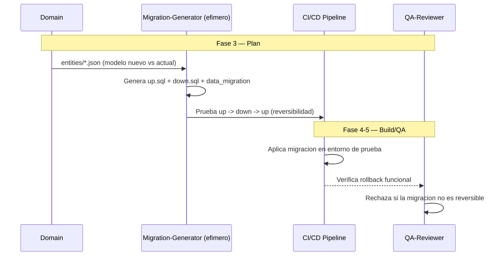

# MDD — Migration-Driven Development

**Version:** 1.0 | **Fecha:** 2026-06-05 | **Gobernanza:** Constitucion X-DD v1.5

---

## Indice

1. [Que es MDD en X-DD](#1-que-es-mdd-en-x-dd)
2. [Cuando aplicar](#2-cuando-aplicar)
3. [Artefactos de entrada y salida](#3-artefactos-de-entrada-y-salida)
4. [MDD en el pipeline](#4-mdd-en-el-pipeline)
5. [Integracion con otras disciplinas](#5-integracion-con-otras-disciplinas)
6. [Criterios de exito](#6-criterios-de-exito)
7. [Definition of Done MDD](#7-definition-of-done-mdd)
8. [Agentes involucrados](#8-agentes-involucrados)
9. [Fuentes](#9-fuentes)

---

## 1. Que es MDD en X-DD

Migration-Driven Development es la disciplina donde los cambios en el esquema de la base de
datos se especifican como migraciones versionadas, reversibles y con migracion de datos
explicita. Cada cambio de esquema es un par up/down probado, no un ALTER manual.

En X-DD, MDD opera en la Fase 3 (Plan) y se materializa en Build, mapeada al workflow
`/evol db-migrate`. Produce `migrations/*/up.sql`, `migrations/*/down.sql` y, cuando aplica,
`migrations/*/data_migration.md`.

El principio de MDD en X-DD: toda migracion tiene rollback definido y se prueba antes de
aplicar en produccion. Un cambio de esquema sin migracion reversible es un riesgo de
indisponibilidad: si falla en produccion, no hay vuelta atras automatica.

> **executor (registro):** [db-migrate.md](../../.agent/workflows/db-migrate.md) — mapeada al
> workflow existente `/evol db-migrate`. **Activacion por profile:** se inyecta cuando
> `evol.profile.yml` declara `mdd` en `methodologies:`.

---

## 2. Cuando aplicar

| Perfil | Aplica | Motivo |
|--------|:------:|--------|
| Proyecto con BD relacional en evolucion | SI | El esquema cambia y debe versionarse |
| Sistema con datos en produccion | SI | El rollback protege la disponibilidad |
| Migracion de datos entre estructuras | SI | La data migration acompana al cambio de schema |
| App sin persistencia relacional | NO | Sin esquema que migrar |

---

## 3. Artefactos de entrada y salida

| Direccion | Artefacto | Descripcion |
|-----------|-----------|-------------|
| Entrada | `entities/*.json` | Modelo de entidades (desde DDD) |
| Salida | `migrations/*/up.sql` | Migracion hacia adelante (cambio de esquema) |
| Salida | `migrations/*/down.sql` | Rollback de la migracion |
| Salida | `migrations/*/data_migration.md` | Migracion de datos cuando el cambio lo requiere |

---

## 4. MDD en el pipeline

### MDD por fase

| Fase | Actividad MDD | Estado esperado |
|------|---------------|-----------------|
| Fase 3 — Plan | Generar migraciones up/down desde el cambio de modelo | Migracion reversible definida |
| Fase 4 — Build | Aplicar migracion en entornos no productivos | Migracion aplicada y probada |
| Fase 5 — QA | Verificar rollback y migracion de datos | Reversibilidad confirmada |

---

## 5. Integracion con otras disciplinas

| Disciplina | Relacion |
|------------|----------|
| [DDD](./DDD.md) | Los cambios en entidades se traducen a DDL |
| [CDCDD](./CDCDD.md) | La activacion CDC se define junto a la migracion |
| [TDD](./TDD.md) | Tests verifican el comportamiento tras la migracion |
| [Pipeline-Driven](./PIPELINE-DRIVEN.md) | El deploy orquesta cuando aplicar la migracion |

---

## 6. Criterios de exito

- Toda migracion tiene rollback (`down.sql`) definido.
- El rollback se prueba antes de aplicar en produccion.
- Las migraciones de datos preservan integridad (sin perdida).
- Las migraciones son idempotentes o protegidas contra re-ejecucion.

---

## 7. Definition of Done MDD

| Criterio | Verificacion |
|----------|-------------|
| `up.sql` + `down.sql` por migracion | `ls migrations/*/` |
| Reversibilidad probada | Test up -> down -> up en verde |
| Data migration cuando aplica | `test -f migrations/*/data_migration.md` |
| Sin perdida de datos | Verificacion de integridad post-migracion |

---

## 8. Agentes involucrados

| Agente | Rol en MDD |
|--------|------------|
| `Domain` | Aporta el modelo de entidades que motiva la migracion |
| `Migration-Generator` (efimero) | Genera up/down y la migracion de datos |
| `Data` | Valida la integridad de la migracion de datos |
| `Builder` | Aplica y prueba las migraciones |
| `QA-Reviewer` | Verifica reversibilidad en Fase 5 |

---

## 9. Fuentes

Respaldo bibliografico de la disciplina (verificadas via `/evol fact-check`).

| Tipo | Fuente | Aporte |
|------|--------|--------|
| Concepto | [Evolutionary Database Design — Martin Fowler](https://martinfowler.com/articles/evodb.html) | Migraciones versionadas como practica canonica |
| Comparativa | [Declarative vs Versioned Migrations — Atlas](https://atlasgo.io/blog/2023/06/12/declarative-vs-versioned-migrations/) | Enfoques de migracion de esquema |
| Guia | [Database Migration — CloudBees](https://www.cloudbees.com/blog/database-migration-what-it-is-and-how-to-do-it) | Vision general y estrategias |
| Herramienta | [Flyway](https://github.com/flyway/flyway) | Herramienta de referencia de migraciones versionadas |

> **Mantenido por:** Domain + Data
> **Gobernado por:** Constitucion X-DD v1.5, Art. 2
> **Ver tambien:** [DDD.md](./DDD.md) | [CDCDD.md](./CDCDD.md) | [INDEX.md](./INDEX.md)
