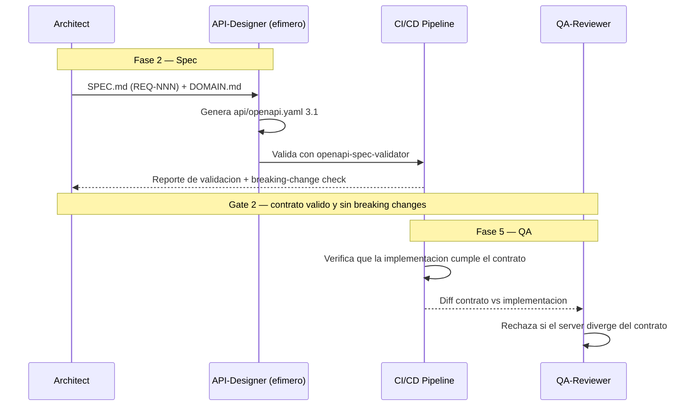

# ODD_API — OpenAPI-Driven Development

**Version:** 1.0 | **Fecha:** 2026-06-05 | **Gobernanza:** Constitucion Evol-DD v1.5

---

## Indice

1. [Que es ODD_API en Evol-DD](#1-que-es-odd_api-en-evol-dd)
2. [Cuando aplicar](#2-cuando-aplicar)
3. [Artefactos de entrada y salida](#3-artefactos-de-entrada-y-salida)
4. [ODD_API en el pipeline](#4-odd_api-en-el-pipeline)
5. [Integracion con otras disciplinas](#5-integracion-con-otras-disciplinas)
6. [Criterios de exito](#6-criterios-de-exito)
7. [Definition of Done ODD_API](#7-definition-of-done-odd_api)
8. [Agentes involucrados](#8-agentes-involucrados)
9. [Fuentes](#9-fuentes)

---

## 1. Que es ODD_API en Evol-DD

OpenAPI-Driven Development es la disciplina donde el contrato de la API (especificacion
OpenAPI 3.1) es el artefacto fuente que guia implementacion, pruebas y documentacion. El
contrato se escribe y aprueba antes de codificar el servidor o el cliente: es spec-first
aplicado al limite de la API.

En Evol-DD, ODD_API opera en la Fase 2 (Spec). El contrato `api/openapi.yaml` se deriva de
los invariantes de `SPEC.md` (REQ-NNN) y del vocabulario de `DOMAIN.md`, y se valida con
`openapi-spec-validator` como sub-gate de la fase. Ningun endpoint entra al PLAN sin estar
descrito en el contrato.

El principio de ODD_API en Evol-DD: un endpoint sin contrato OpenAPI no existe para el
pipeline. El contrato es la unica fuente de verdad de la superficie de la API; el codigo
del servidor y los stubs de cliente se derivan de el, no al reves.

> **executor (registro):** [api-contract.md](../../.agent/workflows/api-contract.md) — esta
> disciplina se ejecuta mapeada al workflow existente `/evol api-contract`. **Activacion por
> profile:** se inyecta solo cuando `evol.profile.yml` declara `odd_api` en `methodologies:`.

---

## 2. Cuando aplicar

| Perfil | Aplica | Motivo |
|--------|:------:|--------|
| API REST expuesta a terceros | SI | El contrato es el limite publico versionado |
| Microservicios con contrato versionado | SI | Coordina equipos via spec compartida |
| Webapp con backend propio | WARN | Util si el front consume una API formal |
| Script/tool sin API | NO | No hay superficie de API que contratar |

---

## 3. Artefactos de entrada y salida

| Direccion | Artefacto | Descripcion |
|-----------|-----------|-------------|
| Entrada | `docs/specs/SPEC.md` (REQ-NNN) | Invariantes y requisitos que se traducen a schemas |
| Entrada | `docs/specs/DOMAIN.md` | Ubiquitous Language para nombrar recursos y campos |
| Salida | `api/openapi.yaml` | Contrato OpenAPI 3.1 con endpoints, schemas y ejemplos |
| Salida | `api/fragments/*.json` | Fragmentos reutilizables (schemas comunes) para ahorrar tokens |

---

## 4. ODD_API en el pipeline

### ODD_API por fase

| Fase | Actividad ODD_API | Estado esperado |
|------|-------------------|-----------------|
| Fase 2 — Spec | Derivar `openapi.yaml` desde REQ-NNN; validar schema | Contrato valido, sin breaking changes |
| Fase 3 — Plan | Tareas del plan referencian operaciones del contrato | Trazabilidad operacion -> tarea |
| Fase 4 — Build | Implementar endpoints contra el contrato; generar stubs | Server conforme al contrato |
| Fase 5 — QA | Verificar conformidad servidor vs contrato | 0 divergencias |

---

## 5. Integracion con otras disciplinas

| Disciplina | Relacion |
|------------|----------|
| [SDD](./SDD.md) | La spec general aporta invariantes que se traducen a schemas |
| [BDD](./BDD.md) | Los escenarios Given-When-Then referencian operaciones del contrato |
| [CCDD](./CCDD.md) | Los contratos de consumidor verifican el `openapi.yaml` del proveedor |
| [APIVDD](./APIVDD.md) | El versionado de la API se planifica sobre este contrato |

---

## 6. Criterios de exito

- Todo endpoint tiene `requestBody` y `responses` definidos.
- La especificacion pasa validacion con `openapi-spec-validator` sin errores.
- No se introducen breaking changes sin pasar por [APIVDD](./APIVDD.md).
- Cada operacion tiene al menos un ejemplo de request y response.

---

## 7. Definition of Done ODD_API

| Criterio | Verificacion |
|----------|-------------|
| `api/openapi.yaml` existe y es OpenAPI 3.1 | `head -1 api/openapi.yaml` |
| Schema valido | `openapi-spec-validator api/openapi.yaml` |
| Todo endpoint con requestBody + responses | Revision estructural del contrato |
| Sin breaking changes no planificados | Diff contra version anterior |

---

## 8. Agentes involucrados

| Agente | Rol en ODD_API |
|--------|----------------|
| `Architect` | Deriva el contrato desde SPEC.md + DOMAIN.md; valida coherencia |
| `API-Designer` (efimero) | Genera `openapi.yaml` 3.1 y los fragments reutilizables |
| `Builder` | Implementa los endpoints conforme al contrato |
| `QA-Reviewer` | Verifica conformidad servidor vs contrato en Fase 5 |
| `Reviewer` | Audita el contrato antes del gate (reviewer != author) |

---

## 9. Fuentes

Respaldo bibliografico de la disciplina (verificadas via `/evol fact-check`).

| Tipo | Fuente | Aporte |
|------|--------|--------|
| Especificacion | [OpenAPI Specification 3.1 — OpenAPI Initiative](https://spec.openapis.org/oas/latest.html) | Estandar oficial del contrato OpenAPI |
| Filosofia | [OpenAPI-Driven Development — Stoplight](https://stoplight.io/openapi/guides/openapi-driven-development) | Enfoque spec-first para el ciclo de la API |
| Guia | [Mastering the OpenAPI Workflow — Apidog](https://apidog.com/blog/openapi-workflow-best-practices/) | Mejores practicas y automatizacion del workflow |
| Herramienta | [kin-openapi](https://github.com/getkin/kin-openapi) | Toolkit para validar y manejar especificaciones OpenAPI |

> **Mantenido por:** Architect + QA-Reviewer
> **Gobernado por:** Constitucion Evol-DD v1.5, Art. 2
> **Ver tambien:** [SDD.md](./SDD.md) | [CCDD.md](./CCDD.md) | [APIVDD.md](./APIVDD.md) | [INDEX.md](./INDEX.md)
