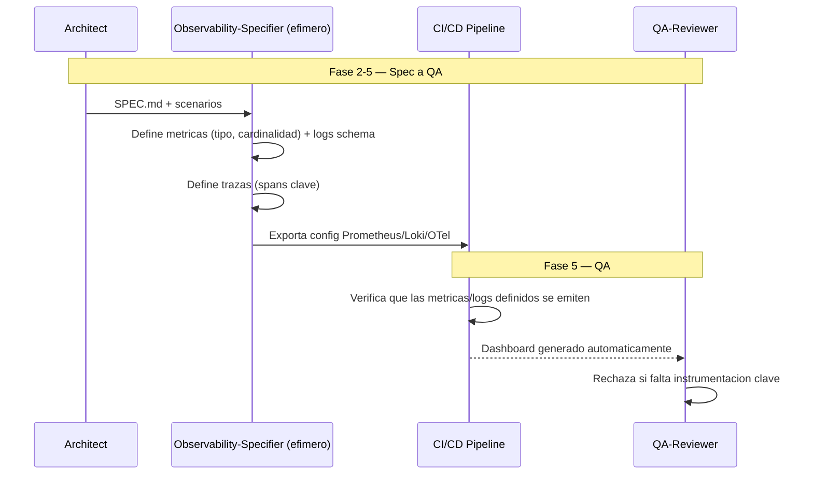

# ODD_Obs — Observability-Driven Development

**Version:** 1.0 | **Fecha:** 2026-06-05 | **Gobernanza:** Constitucion X-DD v1.5

---

## Indice

1. [Que es ODD_Obs en X-DD](#1-que-es-odd_obs-en-x-dd)
2. [Cuando aplicar](#2-cuando-aplicar)
3. [Artefactos de entrada y salida](#3-artefactos-de-entrada-y-salida)
4. [ODD_Obs en el pipeline](#4-odd_obs-en-el-pipeline)
5. [Integracion con otras disciplinas](#5-integracion-con-otras-disciplinas)
6. [Criterios de exito](#6-criterios-de-exito)
7. [Definition of Done ODD_Obs](#7-definition-of-done-odd_obs)
8. [Agentes involucrados](#8-agentes-involucrados)
9. [Fuentes](#9-fuentes)

---

## 1. Que es ODD_Obs en X-DD

Observability-Driven Development es la disciplina donde los logs, metricas y trazas se
especifican como ciudadanos de primera clase, con estructura y cardinalidad definidas antes
del codigo. La observabilidad se disena, no se anade tras el primer incidente que no se pudo
diagnosticar.

En X-DD, ODD_Obs opera en la Fase 5 (QA) y se materializa transversalmente, mapeada al
workflow `/evol observability-init`. Produce `observability/metrics/*.json` y
`observability/logs/*.schema.json`, ademas de la configuracion de dashboards.

El principio de ODD_Obs en X-DD: si un comportamiento no se puede observar en produccion, no
esta terminado. Las metricas, logs estructurados y trazas se definen junto con la feature; un
sistema que no se puede depurar remotamente es una caja negra.

> **executor (registro):** [observability-init.md](../../.agent/workflows/observability-init.md).
> **Activacion por profile:** se inyecta cuando `evol.profile.yml` declara `odd_obs` en
> `methodologies:`.

---

## 2. Cuando aplicar

| Perfil | Aplica | Motivo |
|--------|:------:|--------|
| Sistema en produccion | SI | La depuracion remota requiere observabilidad |
| Proceso batch critico | SI | El estado del batch debe ser observable |
| Microservicios | SI | Las trazas distribuidas son esenciales |
| Script local efimero | NO | Sin necesidad de observabilidad remota |

---

## 3. Artefactos de entrada y salida

| Direccion | Artefacto | Descripcion |
|-----------|-----------|-------------|
| Entrada | `docs/specs/SPEC.md` | Comportamientos a observar |
| Entrada | `tests/features/*.feature` | Escenarios que definen que medir |
| Salida | `observability/metrics/*.json` | Metricas con nombre, tipo y cardinalidad |
| Salida | `observability/logs/*.schema.json` | Esquema de logs estructurados |

---

## 4. ODD_Obs en el pipeline

### ODD_Obs por fase

| Fase | Actividad ODD_Obs | Estado esperado |
|------|-------------------|-----------------|
| Fase 2 — Spec | Definir metricas, logs schema y trazas | Especificacion de observabilidad |
| Fase 4 — Build | Instrumentar el codigo conforme al schema | Instrumentacion conforme |
| Fase 5 — QA | Verificar emision + dashboard automatico | Observabilidad funcional |

---

## 5. Integracion con otras disciplinas

| Disciplina | Relacion |
|------------|----------|
| [SLO/SLA](./SLODRIVEN.md) | Los SLOs se calculan sobre estas metricas |
| [PDD](./PDD.md) | La latencia observada alimenta las pruebas de rendimiento |
| [Chaos](./CHAOS.md) | Los experimentos de chaos se observan con estas metricas |
| [Pipeline-Driven](./PIPELINE-DRIVEN.md) | El rollback se dispara con estas metricas |

---

## 6. Criterios de exito

- El dashboard de monitoreo se genera automaticamente desde la especificacion.
- Cada metrica declara su tipo y cardinalidad (sin explosion de cardinalidad).
- Los logs son estructurados y siguen un schema versionado.
- Las trazas cubren los flujos criticos (spans clave definidos).

---

## 7. Definition of Done ODD_Obs

| Criterio | Verificacion |
|----------|-------------|
| `metrics/*.json` con tipo + cardinalidad | `ls observability/metrics/*.json` |
| `logs/*.schema.json` definido | `ls observability/logs/*.schema.json` |
| Dashboard generado | Config exportada a Prometheus/Loki/Grafana |
| Trazas en flujos criticos | Revision de spans definidos |

---

## 8. Agentes involucrados

| Agente | Rol en ODD_Obs |
|--------|----------------|
| `Architect` | Define que comportamientos observar |
| `Observability-Specifier` (efimero) | Genera metricas, logs schema y trazas |
| `DevOps` | Despliega la stack de observabilidad (OTel/Prometheus/Loki) |
| `Builder` | Instrumenta el codigo conforme al schema |
| `QA-Reviewer` | Verifica la instrumentacion en Fase 5 |

---

## 9. Fuentes

Respaldo bibliografico de la disciplina (verificadas via `/evol fact-check`).

| Tipo | Fuente | Aporte |
|------|--------|--------|
| Estandar | [OpenTelemetry — Documentation](https://opentelemetry.io/docs/) | Estandar de telemetria (metricas, logs, trazas) |
| Guia | [Developer's Guide to Observability — Dynatrace](https://www.dynatrace.com/resources/ebooks/the-developers-guide-to-observability/) | Practicas e implementacion |
| Concepto | [Observability as a Developer Superpower — Pulumi](https://www.pulumi.com/blog/observability-as-a-developer-superpower/) | Metricas accionables desde el desarrollo |
| Demo | [OpenTelemetry Astronomy Shop](https://github.com/open-telemetry/opentelemetry-demo) | Microservicios con telemetria completa |

> **Mantenido por:** Architect + DevOps
> **Gobernado por:** Constitucion X-DD v1.5, Art. 2
> **Ver tambien:** [SLODRIVEN.md](./SLODRIVEN.md) | [PDD.md](./PDD.md) | [CHAOS.md](./CHAOS.md) | [INDEX.md](./INDEX.md)
