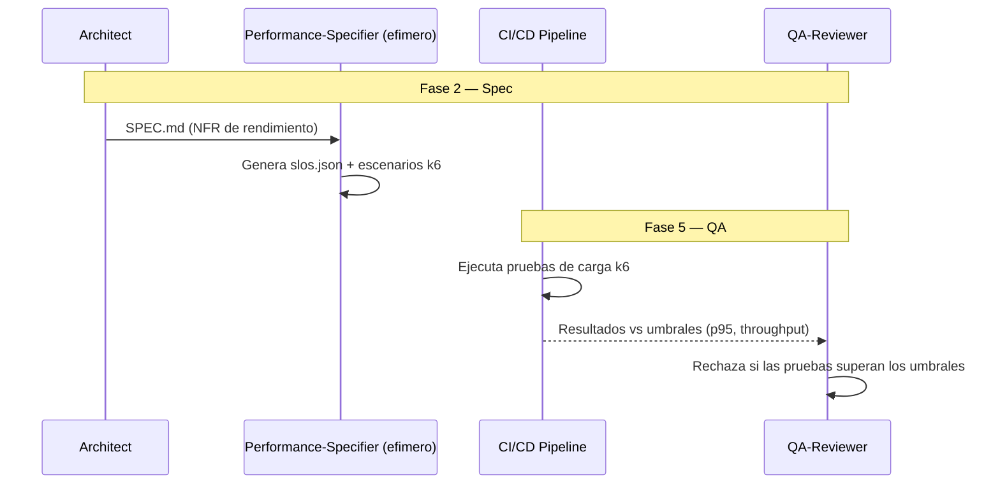

# PDD — Performance-Driven Development

**Version:** 1.0 | **Fecha:** 2026-06-05 | **Gobernanza:** Constitucion X-DD v1.5

---

## Indice

1. [Que es PDD en X-DD](#1-que-es-pdd-en-x-dd)
2. [Cuando aplicar](#2-cuando-aplicar)
3. [Artefactos de entrada y salida](#3-artefactos-de-entrada-y-salida)
4. [PDD en el pipeline](#4-pdd-en-el-pipeline)
5. [Integracion con otras disciplinas](#5-integracion-con-otras-disciplinas)
6. [Criterios de exito](#6-criterios-de-exito)
7. [Definition of Done PDD](#7-definition-of-done-pdd)
8. [Agentes involucrados](#8-agentes-involucrados)
9. [Fuentes](#9-fuentes)

---

## 1. Que es PDD en X-DD

Performance-Driven Development es la disciplina donde los objetivos de rendimiento (latencia
p95, throughput) se definen como tests que deben pasar antes de completar una feature. El
rendimiento es un criterio de aceptacion verificable, no una optimizacion posterior.

En X-DD, PDD opera en la Fase 5 (QA) y como capa declarativa transversal. Se ejecuta mapeada
al workflow `/evol perf-budget`. Produce `performance/slos/*.json` (objetivos) y
`performance/load_test_scenarios/*.md` (escenarios k6). Su parte declarativa son los tags BDD
`@performance` con umbrales.

El principio de PDD en X-DD: una feature con requisito de rendimiento no esta terminada hasta
que pasa su prueba de carga. El pipeline falla si las pruebas superan los umbrales; el
rendimiento se mide, no se asume.

> **executor (registro):** [perf-budget.md](../../.agent/workflows/perf-budget.md) + capa
> declarativa (tags `@performance`). **Activacion por profile:** se inyecta cuando
> `evol.profile.yml` declara `pdd` en `methodologies:`.

---

## 2. Cuando aplicar

| Perfil | Aplica | Motivo |
|--------|:------:|--------|
| API con latencia estricta (< 100ms) | SI | El SLO de latencia es contractual |
| Proceso batch con ventana de tiempo | SI | El throughput debe caber en la ventana |
| Sistema de alta concurrencia | SI | La carga define la viabilidad |
| App interna de bajo trafico | WARN | Evaluar segun expectativa de uso |

---

## 3. Artefactos de entrada y salida

| Direccion | Artefacto | Descripcion |
|-----------|-----------|-------------|
| Entrada | `docs/specs/SPEC.md` | Requisitos de rendimiento (NFR) |
| Salida | `performance/slos/*.json` | Objetivos de latencia/throughput por endpoint |
| Salida | `performance/load_test_scenarios/*.md` | Escenarios de carga (k6) |

---

## 4. PDD en el pipeline

### PDD por fase

| Fase | Actividad PDD | Estado esperado |
|------|---------------|-----------------|
| Fase 2 — Spec | Definir SLOs de rendimiento + escenarios de carga | Umbrales declarados |
| Fase 4 — Build | Etiquetar escenarios `@performance` | Escenarios listos en CI |
| Fase 5 — QA | Ejecutar pruebas de carga; comparar con umbrales | Dentro de los umbrales |

---

## 5. Integracion con otras disciplinas

| Disciplina | Relacion |
|------------|----------|
| [BDD](./BDD.md) | Escenarios etiquetados `@performance` con umbrales |
| [SLO/SLA](./SLODRIVEN.md) | Los SLOs de rendimiento alimentan los SLAs |
| [ODD_Obs](./ODD_OBS.md) | Las metricas de latencia vienen de la observabilidad |
| [Chaos](./CHAOS.md) | El rendimiento bajo fallo se valida con chaos |

---

## 6. Criterios de exito

- El pipeline falla si las pruebas de carga superan los umbrales.
- Cada endpoint con NFR tiene su SLO de latencia/throughput declarado.
- Los escenarios de carga son reproducibles (k6 versionado).
- La latencia p95 se mide en condiciones de carga realista.

---

## 7. Definition of Done PDD

| Criterio | Verificacion |
|----------|-------------|
| `slos/*.json` por endpoint con NFR | `ls performance/slos/*.json` |
| Escenarios de carga definidos | `ls performance/load_test_scenarios/*.md` |
| Tags `@performance` con umbrales | `grep -r '@performance' tests/` |
| Pruebas dentro de los umbrales | Reporte k6 en CI |

---

## 8. Agentes involucrados

| Agente | Rol en PDD |
|--------|------------|
| `Architect` | Define los SLOs de rendimiento desde los NFR |
| `Performance-Specifier` (efimero) | Genera `slos.json` y los escenarios k6 |
| `Builder` | Etiqueta los escenarios y optimiza el codigo |
| `QA-Reviewer` | Ejecuta las pruebas de carga en Fase 5 |
| `DevOps` | Provee el entorno de carga representativo |

---

## 9. Fuentes

Respaldo bibliografico de la disciplina (verificadas via `/evol fact-check`).

| Tipo | Fuente | Aporte |
|------|--------|--------|
| SLOs + carga | [SLOs and Performance Testing — Gatling](https://gatling.io/blog/slo-load-testing/) | Como validar el cumplimiento de SLOs con carga |
| Validacion | [SLA Performance Testing — RadView](https://www.radview.com/blog/sla-performance-testing-metrics-validation-monitoring-guide/) | Validacion y monitoreo continuo |
| Herramienta | [k6 — Grafana](https://github.com/grafana/k6) | Herramienta de pruebas de carga scriptable |
| PDD para LLM | [Performance-Driven Development — Prolego](https://github.com/prolego-team/pdd) | Metodologia PDD aplicada a sistemas LLM |

> **Mantenido por:** Architect + QA-Reviewer
> **Gobernado por:** Constitucion X-DD v1.5, Art. 2
> **Ver tambien:** [BDD.md](./BDD.md) | [SLODRIVEN.md](./SLODRIVEN.md) | [ODD_OBS.md](./ODD_OBS.md) | [INDEX.md](./INDEX.md)
