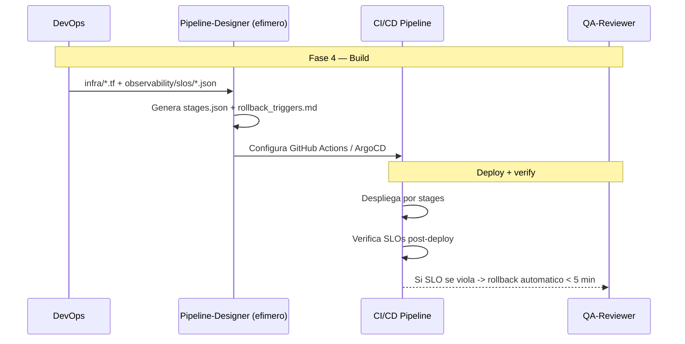

# Pipeline-Driven — Pipeline-Driven Development

**Version:** 1.0 | **Fecha:** 2026-06-05 | **Gobernanza:** Constitucion X-DD v1.5

---

## Indice

1. [Que es Pipeline-Driven en X-DD](#1-que-es-pipeline-driven-en-x-dd)
2. [Cuando aplicar](#2-cuando-aplicar)
3. [Artefactos de entrada y salida](#3-artefactos-de-entrada-y-salida)
4. [Pipeline-Driven en el pipeline](#4-pipeline-driven-en-el-pipeline)
5. [Integracion con otras disciplinas](#5-integracion-con-otras-disciplinas)
6. [Criterios de exito](#6-criterios-de-exito)
7. [Definition of Done Pipeline-Driven](#7-definition-of-done-pipeline-driven)
8. [Agentes involucrados](#8-agentes-involucrados)
9. [Fuentes](#9-fuentes)

---

## 1. Que es Pipeline-Driven en X-DD

Pipeline-Driven Development es la disciplina donde la estrategia de despliegue y los criterios
de rollback automatico se definen antes de escribir el codigo de aplicacion. El pipeline de
entrega es un artefacto disenado, con stages y triggers de rollback explicitos.

En X-DD, Pipeline-Driven opera en la Fase 4 (Build), mapeada a los workflows `/evol deploy-prod`
y `/evol rollback`. Produce `pipeline/stages.json` (etapas del despliegue) y
`pipeline/rollback_triggers.md` (condiciones de reversion automatica).

El principio de Pipeline-Driven en X-DD: todo despliegue es reversible automaticamente en
menos de 5 minutos. Si no se sabe como volver atras antes de desplegar, no se despliega; el
rollback es parte del diseno, no una reaccion al incidente.

> **executor (registro):** [deploy-prod.md](../../.agent/workflows/deploy-prod.md) +
> [rollback.md](../../.agent/workflows/rollback.md). **Activacion por profile:** se inyecta
> cuando `evol.profile.yml` declara `pipelinedriven` en `methodologies:`.

---

## 2. Cuando aplicar

| Perfil | Aplica | Motivo |
|--------|:------:|--------|
| Proyecto con despliegue automatico | SI | El pipeline gobierna la entrega |
| Entrega continua (CD) | SI | Stages y rollback como contrato de deploy |
| Servicio en produccion | SI | El rollback protege la disponibilidad |
| Libreria publicada sin deploy de servicio | WARN | Aplica al publish, no al deploy de runtime |

---

## 3. Artefactos de entrada y salida

| Direccion | Artefacto | Descripcion |
|-----------|-----------|-------------|
| Entrada | `infra/*.tf` | Infraestructura objetivo (desde IODD) |
| Entrada | `observability/slos/*.json` | SLOs que disparan el rollback |
| Salida | `pipeline/stages.json` | Etapas del despliegue (build, test, deploy, verify) |
| Salida | `pipeline/rollback_triggers.md` | Condiciones de rollback automatico |

---

## 4. Pipeline-Driven en el pipeline

### Pipeline-Driven por fase

| Fase | Actividad Pipeline-Driven | Estado esperado |
|------|---------------------------|-----------------|
| Fase 4 — Build | Definir stages + triggers de rollback | Pipeline disenado |
| Fase 5 — QA | Probar el rollback en entorno de prueba | Rollback funcional < 5 min |
| Fase 6 — Retro | Revisar deploys y rollbacks ocurridos | Lecciones de despliegue registradas |

---

## 5. Integracion con otras disciplinas

| Disciplina | Relacion |
|------------|----------|
| [IODD](./IODD.md) | El deploy consume la infraestructura declarada |
| [ODD_Obs](./ODD_OBS.md) | Las metricas post-deploy disparan el rollback |
| [SLO/SLA](./SLODRIVEN.md) | El error budget agotado bloquea el deploy |
| [TDD](./TDD.md) | Los tests son un stage previo al deploy |

---

## 6. Criterios de exito

- El despliegue es reversible automaticamente en menos de 5 minutos.
- Los triggers de rollback estan basados en SLOs medibles.
- Cada stage del pipeline tiene criterios de paso/fallo explicitos.
- El rollback se prueba antes de confiar en el en produccion.

---

## 7. Definition of Done Pipeline-Driven

| Criterio | Verificacion |
|----------|-------------|
| `stages.json` definido | `test -f pipeline/stages.json` |
| `rollback_triggers.md` con condiciones SLO | `test -f pipeline/rollback_triggers.md` |
| Rollback probado < 5 min | Drill de rollback en entorno de prueba |
| Stages con criterios paso/fallo | Revision de la configuracion CI |

---

## 8. Agentes involucrados

| Agente | Rol en Pipeline-Driven |
|--------|------------------------|
| `DevOps` | Disena el pipeline de stages y los triggers de rollback |
| `Pipeline-Designer` (efimero) | Genera `stages.json` + configuracion GitHub Actions/ArgoCD |
| `Builder` | Integra los tests como stage del pipeline |
| `QA-Reviewer` | Prueba el rollback en Fase 5 |
| `Orchestrator` | Coordina deploy y rollback con los gates |

---

## 9. Fuentes

Respaldo bibliografico de la disciplina (verificadas via `/evol fact-check`).

| Tipo | Fuente | Aporte |
|------|--------|--------|
| Concepto | [Continuous Delivery — Martin Fowler](https://martinfowler.com/bliki/ContinuousDelivery.html) | Definicion de entrega continua y deployment pipeline |
| Libro | [Continuous Delivery — Humble & Farley](https://continuousdelivery.com/) | Referencia canonica del deployment pipeline |
| Estrategias | [CI/CD for Microservices — GitLab](https://about.gitlab.com/topics/ci-cd/) | Estrategias de integracion y entrega continua |
| GitOps | [Argo CD](https://github.com/argoproj/argo-cd) | Entrega continua declarativa GitOps de referencia |

> **Mantenido por:** DevOps + Orchestrator
> **Gobernado por:** Constitucion X-DD v1.5, Art. 2
> **Ver tambien:** [IODD.md](./IODD.md) | [ODD_OBS.md](./ODD_OBS.md) | [SLODRIVEN.md](./SLODRIVEN.md) | [INDEX.md](./INDEX.md)
