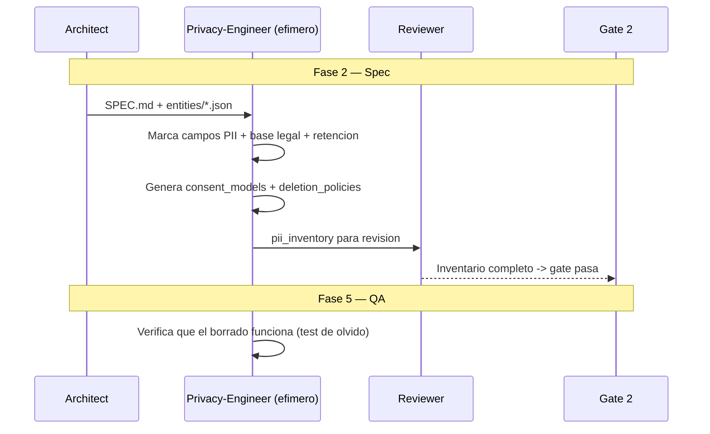

# PrivacyDD — Privacy by Design

**Version:** 1.0 | **Fecha:** 2026-06-05 | **Gobernanza:** Constitucion Evol-DD v1.5

---

## Indice

1. [Que es PrivacyDD en Evol-DD](#1-que-es-privacydd-en-evol-dd)
2. [Cuando aplicar](#2-cuando-aplicar)
3. [Artefactos de entrada y salida](#3-artefactos-de-entrada-y-salida)
4. [PrivacyDD en el pipeline](#4-privacydd-en-el-pipeline)
5. [Integracion con otras disciplinas](#5-integracion-con-otras-disciplinas)
6. [Criterios de exito](#6-criterios-de-exito)
7. [Definition of Done PrivacyDD](#7-definition-of-done-privacydd)
8. [Agentes involucrados](#8-agentes-involucrados)
9. [Fuentes](#9-fuentes)

---

## 1. Que es PrivacyDD en Evol-DD

Privacy by Design es la disciplina donde la minimizacion de datos, el consentimiento y el
derecho al olvido se disenan antes de la implementacion, no se anaden como parche tras un
incidente. La privacidad es una propiedad por defecto del sistema, no una opcion.

En Evol-DD, PrivacyDD opera en la Fase 2 (Spec) y se ejecuta mapeada al workflow
`/evol privacy-review`. Produce `privacy/pii_inventory.json` (inventario de datos personales),
`privacy/consent_models/*.json` y `privacy/deletion_policies/*.sql`.

El principio de PrivacyDD en Evol-DD: todo campo PII tiene base legal y politica de retencion
documentada desde el diseno. Un dato personal sin proposito declarado y sin politica de
borrado es una pasivo legal, no un activo.

> **executor (registro):** [privacy-review.md](../../.agent/workflows/privacy-review.md) —
> mapeada al workflow existente `/evol privacy-review`. **Activacion por profile:** se inyecta
> cuando `evol.profile.yml` declara `privacydd` en `methodologies:`.

---

## 2. Cuando aplicar

| Perfil | Aplica | Motivo |
|--------|:------:|--------|
| Aplicacion que recolecta datos personales | SI | PII requiere base legal y retencion |
| Sistema bajo GDPR / CCPA | SI | Obligacion regulatoria de privacy by design |
| Producto B2C con cuentas de usuario | SI | Consentimiento y derecho al olvido |
| Tool interna sin datos personales | NO | Sin PII que proteger |

---

## 3. Artefactos de entrada y salida

| Direccion | Artefacto | Descripcion |
|-----------|-----------|-------------|
| Entrada | `docs/specs/SPEC.md` | Funcionalidad que recolecta o procesa datos |
| Entrada | `entities/*.json` | Entidades con campos candidatos a PII |
| Salida | `privacy/pii_inventory.json` | Inventario de campos PII + base legal + retencion |
| Salida | `privacy/consent_models/*.json` | Modelos de consentimiento por proposito |
| Salida | `privacy/deletion_policies/*.sql` | Scripts de anonimizacion/borrado por entidad |

---

## 4. PrivacyDD en el pipeline

### PrivacyDD por fase

| Fase | Actividad PrivacyDD | Estado esperado |
|------|---------------------|-----------------|
| Fase 2 — Spec | Inventariar PII, base legal, consentimiento, retencion | Inventario completo |
| Fase 4 — Build | Implementar minimizacion y scripts de borrado | Codigo conforme al inventario |
| Fase 5 — QA | Test de derecho al olvido; verificar anonimizacion | Borrado verificable |
| Fase 6 — Retro | Revisar nuevos campos PII introducidos | Inventario al dia |

---

## 5. Integracion con otras disciplinas

| Disciplina | Relacion |
|------------|----------|
| [Compliance](./COMPLIANCE.md) | El inventario PII alimenta los mapeos regulatorios |
| [DDD](./DDD.md) | Las entidades del dominio exponen los campos PII |
| [ESDD](./ESDD.md) | El derecho al olvido sobre eventos inmutables requiere estrategia especial |
| [Threat-Driven](./THREAT-DRIVEN.md) | La fuga de PII es una amenaza STRIDE (Information disclosure) |

---

## 6. Criterios de exito

- Todo campo PII tiene base legal y politica de retencion documentada.
- Existe modelo de consentimiento por cada proposito de tratamiento.
- El derecho al olvido (borrado/anonimizacion) es verificable con un test.
- Se aplica minimizacion: no se recolecta dato sin proposito declarado.

---

## 7. Definition of Done PrivacyDD

| Criterio | Verificacion |
|----------|-------------|
| `pii_inventory.json` completo | `test -f privacy/pii_inventory.json` |
| Base legal por campo PII | Revision del inventario |
| Politica de borrado por entidad | `ls privacy/deletion_policies/*.sql` |
| Test de derecho al olvido | Suite de privacidad en verde |

---

## 8. Agentes involucrados

| Agente | Rol en PrivacyDD |
|--------|------------------|
| `Architect` | Identifica el flujo de datos personales en el sistema |
| `Privacy-Engineer` (efimero) | Marca PII, genera consent models y deletion policies |
| `SecOps` | Conecta privacidad con el threat model |
| `Builder` | Implementa minimizacion y scripts de borrado |
| `QA-Reviewer` | Verifica el derecho al olvido en Fase 5 |

---

## 9. Fuentes

Respaldo bibliografico de la disciplina (verificadas via `/evol fact-check`).

| Tipo | Fuente | Aporte |
|------|--------|--------|
| Principios | [Privacy by Design — 7 Foundational Principles (Cavoukian)](https://www.ipc.on.ca/wp-content/uploads/resources/7foundationalprinciples.pdf) | Los 7 principios fundacionales de Ann Cavoukian |
| Marco legal | [GDPR Art. 25 — Data protection by design and by default](https://gdpr-info.eu/art-25-gdpr/) | Obligacion legal de privacy by design en GDPR |
| Checklist | [Privacy by Design Implementation Checklist — LexisNexis](https://law.lexisnexis.com/knowledge-hub/privacy-and-data-security/checklist/privacy-by-design-pbd-implementation-checklist) | Checklist de implementacion |
| SDK | [pbd — Privacy by Design SDK](https://github.com/dsietz/pbd) | SDK para aplicar practicas de privacidad |

> **Mantenido por:** Architect + SecOps
> **Gobernado por:** Constitucion Evol-DD v1.5, Art. 2
> **Ver tambien:** [COMPLIANCE.md](./COMPLIANCE.md) | [THREAT-DRIVEN.md](./THREAT-DRIVEN.md) | [INDEX.md](./INDEX.md)
