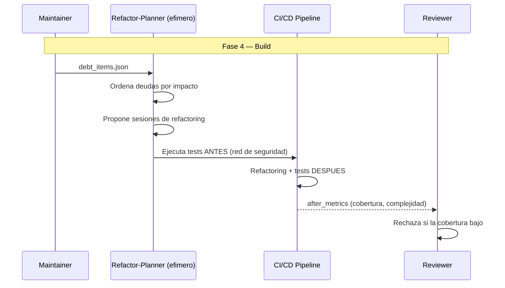

# RDD — Refactoring-Driven Development

**Version:** 1.0 | **Fecha:** 2026-06-05 | **Gobernanza:** Constitucion X-DD v1.5

---

## Indice

1. [Que es RDD en X-DD](#1-que-es-rdd-en-x-dd)
2. [Cuando aplicar](#2-cuando-aplicar)
3. [Artefactos de entrada y salida](#3-artefactos-de-entrada-y-salida)
4. [RDD en el pipeline](#4-rdd-en-el-pipeline)
5. [Integracion con otras disciplinas](#5-integracion-con-otras-disciplinas)
6. [Criterios de exito](#6-criterios-de-exito)
7. [Definition of Done RDD](#7-definition-of-done-rdd)
8. [Agentes involucrados](#8-agentes-involucrados)
9. [Fuentes](#9-fuentes)

---

## 1. Que es RDD en X-DD

Refactoring-Driven Development es la disciplina donde el refactoring se planifica guiado por
metricas de deuda tecnica y cobertura de pruebas, no por intuicion. Se refactoriza lo que las
metricas senalan como problematico, con la red de seguridad de los tests.

En X-DD, RDD opera en la Fase 4 (Build), mapeada al workflow `/evol refactor-area`. Consume
`debt/debt_items.json` y produce `refactoring/sessions/*.md` (registro de cada sesion) y
`refactoring/after_metrics.json` (metricas post-refactoring).

El principio de RDD en X-DD: no se refactoriza sin tests que protejan el comportamiento, y no
se refactoriza por gusto sino por metrica. La cobertura no baja tras un refactoring; si baja,
el refactoring se rechaza.

> **executor (registro):** [refactor-area.md](../../.agent/workflows/refactor-area.md) — mapeada
> al workflow existente `/evol refactor-area`. **Activacion por profile:** se inyecta cuando
> `evol.profile.yml` declara `rdd` en `methodologies:`.

---

## 2. Cuando aplicar

| Perfil | Aplica | Motivo |
|--------|:------:|--------|
| Proyecto legacy con deuda acumulada | SI | El refactoring guiado reduce la deuda |
| Codebase en evolucion continua | SI | El refactoring mantiene la salud del codigo |
| Modulo con alta complejidad ciclomatica | SI | Las metricas senalan el objetivo |
| Codigo nuevo greenfield | WARN | TDD ya cubre la calidad inicial |

---

## 3. Artefactos de entrada y salida

| Direccion | Artefacto | Descripcion |
|-----------|-----------|-------------|
| Entrada | `debt/debt_items.json` | Items de deuda priorizados por impacto |
| Salida | `refactoring/sessions/*.md` | Registro de cada sesion (que, por que, antes/despues) |
| Salida | `refactoring/after_metrics.json` | Metricas post-refactoring (complejidad, cobertura) |

---

## 4. RDD en el pipeline

### RDD por fase

| Fase | Actividad RDD | Estado esperado |
|------|---------------|-----------------|
| Fase 4 — Build | Planificar y ejecutar sesiones de refactoring | Cobertura estable o mayor |
| Fase 5 — QA | Verificar que las metricas mejoraron | Complejidad reducida |
| Fase 6 — Retro | Registrar la deuda pagada en el ledger | Ledger actualizado |

---

## 5. Integracion con otras disciplinas

| Disciplina | Relacion |
|------------|----------|
| [TDD](./TDD.md) | Los tests protegen el comportamiento durante el refactoring |
| [DebtBudgetDD](./DebtBudgetDD.md) | El refactoring paga deuda del ledger |
| [DeprecationDD](./DeprecationDD.md) | El refactoring elimina codigo deprecado de forma segura |
| [SDD](./SDD.md) | El comportamiento especificado no cambia con el refactoring |

---

## 6. Criterios de exito

- La cobertura de pruebas no disminuye tras el refactoring.
- La complejidad ciclomatica promedio baja (objetivo > 5% por sesion).
- Cada sesion de refactoring esta registrada (que, por que, metricas).
- El comportamiento observable no cambia (tests verdes antes y despues).

---

## 7. Definition of Done RDD

| Criterio | Verificacion |
|----------|-------------|
| Sesion registrada | `ls refactoring/sessions/*.md` |
| `after_metrics.json` generado | `test -f refactoring/after_metrics.json` |
| Cobertura estable o mayor | Comparacion before/after |
| Tests verdes pre y post | Suite completa en verde |

---

## 8. Agentes involucrados

| Agente | Rol en RDD |
|--------|------------|
| `Maintainer` | Lidera las sesiones de refactoring |
| `Refactor-Planner` (efimero) | Ordena deudas por impacto y propone sesiones |
| `Builder` | Ejecuta el refactoring con la red de tests |
| `Reviewer` | Verifica que la cobertura no bajo |
| `QA-Reviewer` | Confirma que el comportamiento no cambio |

---

## 9. Fuentes

Respaldo bibliografico de la disciplina (verificadas via `/evol fact-check`).

| Tipo | Fuente | Aporte |
|------|--------|--------|
| Origen canonico | [Refactoring — Martin Fowler](https://refactoring.com/) | Libro fundacional del catalogo de refactorings |
| Ciclo | [Red/Green/Refactor — Made Tech](https://learn.madetech.com/software-craftsmanship/red-green-refactor/) | El ciclo TDD aplicado al refactoring |
| Best practices | [10 Refactoring Best Practices — TechTarget](https://www.techtarget.com/searchsoftwarequality/tip/10-refactoring-best-practices-when-and-how-to-refactor-code) | Cuando y como refactorizar |
| Catalogo | [Refactoring Catalog — refactoring.com](https://refactoring.com/catalog/) | Catalogo de refactorings con mecanica paso a paso |

> **Mantenido por:** Maintainer + Reviewer
> **Gobernado por:** Constitucion X-DD v1.5, Art. 8
> **Ver tambien:** [TDD.md](./TDD.md) | [DebtBudgetDD.md](./DebtBudgetDD.md) | [INDEX.md](./INDEX.md)
