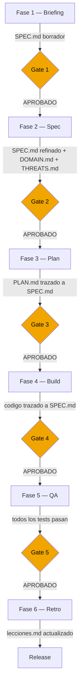
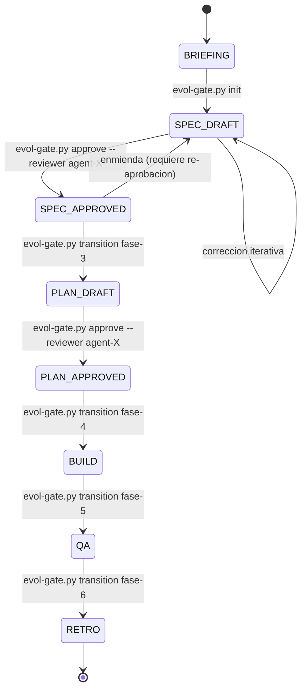

# SDD — Spec-Driven Development

**Version:** 1.0 | **Fecha:** 2026-06-04 | **Gobernanza:** Constitucion Evol-DD v1.5

---

## Indice

1. [Que es SDD](#1-que-es-sdd)
2. [Principio operativo](#2-principio-operativo)
3. [Donde entra en el pipeline](#3-donde-entra-en-el-pipeline)
4. [Artefacto principal: SPEC.md](#4-artefacto-principal-specmd)
5. [Definition of Done SDD](#5-definition-of-done-sdd)
6. [Como el gate aplica SDD](#6-como-el-gate-aplica-sdd)
7. [Relacion con otras disciplinas](#7-relacion-con-otras-disciplinas)
8. [Agentes involucrados](#8-agentes-involucrados)

---

## 1. Que es SDD

Spec-Driven Development es la disciplina que exige que toda iteracion de desarrollo comience
con una especificacion aprobada, no con codigo. El codigo es una consecuencia de la spec,
no su origen.

En Evol-DD, SDD actua como la columna vertebral del pipeline de 6 fases: ninguna fase avanza
sin un artefacto de especificacion que haya superado el gate correspondiente. Esto elimina
el drift entre lo que se pidio, lo que se disenno y lo que se construyo.

SDD no prescribe el formato del codigo ni el lenguaje de implementacion. Prescribe que el
"que" este documentado, aprobado y trazable antes del "como". La SPEC.md es el contrato
entre el solicitante y el equipo de desarrollo.

La disciplina SDD es transversal: aplica en las 6 fases del pipeline, no solo en la Fase 2.
Cada fase produce o consume un artefacto de spec, y el gate HMAC-SHA256 registra cada
transicion de estado.

---

## 2. Principio operativo

El principio maestro de SDD en Evol-DD es:

> Ninguna linea de codigo de produccion se escribe sin una especificacion aprobada que la justifique.

Este principio tiene tres consecuencias operativas:

1. El gate de Fase 2 no se abre si SPEC.md no existe o no ha sido aprobado por un revisor
   distinto al autor.
2. Cualquier modificacion al alcance del proyecto requiere una enmienda a SPEC.md antes
   de modificar el codigo fuente.
3. El drift entre SPEC.md y el codigo fuente es un defecto de proceso, no un defecto de codigo.
   Se reporta en lecciones.md y se corrige en la siguiente iteracion.

---

## 3. Donde entra en el pipeline

SDD es la unica disciplina que atraviesa el pipeline completo. Las demas disciplinas son
capas que se activan en fases especificas; SDD es la capa base que las sostiene a todas.



### Rol de SDD por fase

| Fase | Rol de SDD | Artefacto producido o consumido |
|------|-----------|--------------------------------|
| Fase 1 — Briefing | Captura requisitos del solicitante en prosa estructurada | `REQUIREMENTS.md` (input a SPEC.md) |
| Fase 2 — Spec | Convierte requisitos en especificacion tecnica aprobada | `SPEC.md` (artefacto central) |
| Fase 3 — Plan | El PLAN.md traza cada tarea a un REQ-NNN de SPEC.md | `PLAN.md` con referencias cruzadas |
| Fase 4 — Build | El codigo implementa lo que SPEC.md prescribe, nada mas | `src/` + tests trazados a REQ-NNN |
| Fase 5 — QA | La suite de tests verifica que el codigo cumpla SPEC.md | Reporte QA contra SPEC.md |
| Fase 6 — Retro | Se registra drift o mejoras para la proxima SPEC.md | `lecciones.md` actualizado |

---

## 4. Artefacto principal: SPEC.md

`SPEC.md` es el artefacto canonico de SDD. Reside en `docs/specs/SPEC.md` y contiene la
descripcion completa y aprobada de lo que el sistema debe hacer.

### Estructura minima de SPEC.md

| Seccion | Contenido |
|---------|-----------|
| Objetivo del sistema | Una oracion: que problema resuelve y para quien |
| Alcance | Que esta dentro y que esta fuera del sistema |
| Requisitos funcionales | Tabla REQ-NNN con historia de usuario y criterio de aceptacion |
| Requisitos no funcionales | Tabla NFR-NNN con metrica medible y umbral cuantitativo |
| Restricciones tecnicas | Stack, plataformas, integraciones obligatorias |
| Requisitos de seguridad | SEC-REQ-NNN derivados de THREATS.md (si aplica) |
| Glosario | Terminos del dominio alineados con DOMAIN.md |

### Reglas de SPEC.md

- Toda modificacion al SPEC.md debe pasar por gate (`evol-gate.py transition`) antes de
  que el equipo construya contra la nueva version.
- El SPEC.md aprobado se firma con HMAC-SHA256. Editar el archivo sin re-firmar invalida
  el gate de la fase.
- El revisor de SPEC.md no puede ser el mismo agente o persona que lo escribio.
- Cada REQ-NNN de SPEC.md debe tener al menos un caso de prueba asociado (TC-NNN).

### Ejemplo de requisito bien formado

```markdown
## Requisitos funcionales

| REQ-NNN | Historia de usuario | Criterio de aceptacion | Prioridad | TC vinculados |
|---------|--------------------|-----------------------|-----------|---------------|
| REQ-001 | Como operador, quiero generar un reporte PDF del periodo de facturacion para descargar los totales mensuales | El PDF contiene totales por cliente, fecha de generacion y firma digital | Alta | TC-001, TC-002 |
| REQ-002 | Como administrador, quiero revocar el acceso de un usuario sin eliminar su historial | El usuario pierde acceso en menos de 60 segundos; el historial permanece intacto | Alta | TC-003 |
```

---

## 5. Definition of Done SDD

Una iteracion cumple con SDD cuando:

| Criterio | Verificacion |
|----------|-------------|
| SPEC.md existe en `docs/specs/SPEC.md` | `test -f docs/specs/SPEC.md` |
| SPEC.md tiene todas las secciones minimas | Auditoria estructural del agente reviewer |
| SPEC.md esta firmado y aprobado por gate | `evol-gate.py status` muestra `SPEC_APPROVED` |
| Revisor != autor | Registrado en el log del gate |
| Cada REQ-NNN tiene al menos un TC-NNN | Verificacion cruzada en PLAN_QA.md |
| El codigo no implementa funcionalidad sin REQ-NNN | Revision de PR contra SPEC.md |
| Ningun REQ-NNN eliminado sin enmienda aprobada | Log de gate sin `DELETE_REQ` no aprobado |

---

## 6. Como el gate aplica SDD

El gate HMAC-SHA256 de Evol-DD implementa SDD de forma automatizada. El comando
`evol-gate.py transition` verifica que los artefactos de spec existan y esten aprobados
antes de permitir el avance de fase.



### Comandos gate relevantes para SDD

| Comando | Efecto | Prerrequisito |
|---------|--------|---------------|
| `evol-gate.py init` | Inicializa el pipeline y crea SPEC.md borrador | Ninguno |
| `evol-gate.py validate fase-2` | Verifica que SPEC.md+DOMAIN.md+THREATS.md existen y tienen estructura minima | SPEC.md en disco |
| `evol-gate.py approve --reviewer X` | Firma el artefacto con HMAC-SHA256 | reviewer != author |
| `evol-gate.py transition fase-3` | Avanza al Plan; falla si SPEC_APPROVED no esta en estado activo | SPEC_APPROVED |
| `evol-gate.py status` | Muestra estado actual del pipeline y artefactos | Siempre disponible |

---

## 7. Relacion con otras disciplinas

SDD es el sustrato sobre el que las demas disciplinas operan. Cada disciplina aporta
capas de detalle que enriquecen o se derivan de SPEC.md.

| Disciplina | Relacion con SDD |
|-----------|-----------------|
| FDD | El catalogo FEATURES.md es el input principal de SPEC.md en Fase 1 |
| DDD | El DOMAIN.md refina el vocabulario y estructura de SPEC.md en Fase 2 |
| BDD | Los archivos .feature son la forma ejecutable de los criterios de SPEC.md |
| ATDD | Los stubs de acceptance tests se generan directamente de los REQ-NNN de SPEC.md |
| TDD | Cada test unitario traza a un REQ-NNN o a un aggregate del DOMAIN.md |
| STDD | Los security tests se generan de los SEC-REQ-NNN que THREATS.md copia a SPEC.md |
| SecDD | El QA_REPORT.md verifica que los controles del SPEC.md estan implementados |
| Threat-Driven | Los controles obligatorios de THREATS.md se convierten en SEC-REQ-NNN en SPEC.md |

---

## 8. Agentes involucrados

| Agente | Rol en SDD |
|--------|-----------|
| `Orchestrator` | Coordina la produccion y aprobacion de SPEC.md a lo largo del pipeline |
| `Product-Manager` | Elicita requisitos del solicitante y redacta el borrador de SPEC.md |
| `Architect` | Refina SPEC.md con restricciones tecnicas y alinea con DOMAIN.md |
| `Reviewer` | Audita SPEC.md antes de la aprobacion gate (reviewer != author) |
| `Builder` | Consume SPEC.md durante Build; reporta cuando el codigo diverge del spec |
| `QA-Reviewer` | Verifica que la suite de tests cubra todos los REQ-NNN de SPEC.md |

---

## 9. Fuentes

Respaldo bibliografico de la disciplina. El enfoque spec-first se sustenta en las siguientes fuentes
(verificadas via `/evol fact-check`).

| Tipo | Fuente | Aporte |
|------|--------|--------|
| Origen / herramienta | [GitHub Spec Kit](https://github.com/github/spec-kit) | Toolkit de Spec-Driven Development: la especificacion como artefacto ejecutable que guia el desarrollo |
| Practica | [Spec-Driven Development with AI — GitHub Blog](https://github.blog/ai-and-ml/generative-ai/spec-driven-development-with-ai-get-started-with-a-new-open-source-toolkit/) | Articulo de referencia sobre SDD con agentes de IA |
| Estandar relacionado | [IEEE 830 — Software Requirements Specifications](https://standards.ieee.org/ieee/830/1222/) | Estandar clasico de especificacion de requisitos que fundamenta la trazabilidad REQ-NNN |

> **Mantenido por:** Architect + Orchestrator
> **Gobernado por:** Constitucion Evol-DD v1.5, Art. 2 (Flujo Gated Pipeline)
> **Ver tambien:** [FDD.md](./FDD.md) | [DDD.md](./DDD.md) | [INDEX.md](./INDEX.md)
