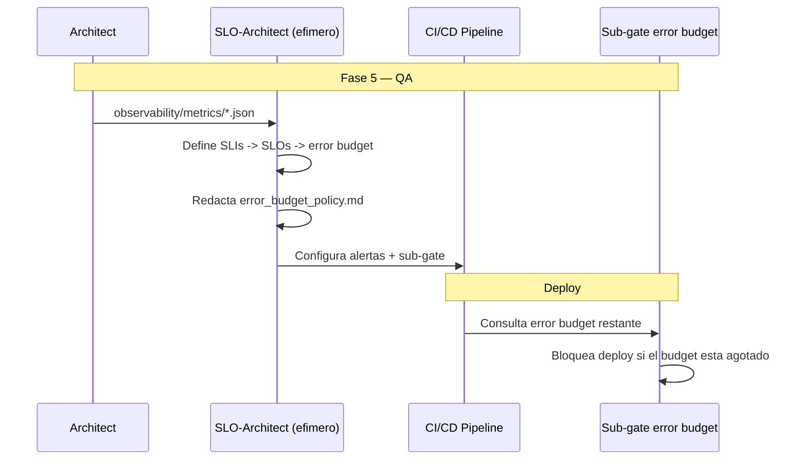

# SLO/SLA-Driven — SLO/SLA-Driven Development

**Version:** 1.0 | **Fecha:** 2026-06-05 | **Gobernanza:** Constitucion X-DD v1.5

---

## Indice

1. [Que es SLO/SLA-Driven en X-DD](#1-que-es-sloslsa-driven-en-x-dd)
2. [Cuando aplicar](#2-cuando-aplicar)
3. [Artefactos de entrada y salida](#3-artefactos-de-entrada-y-salida)
4. [SLO/SLA en el pipeline](#4-sloslsa-en-el-pipeline)
5. [Integracion con otras disciplinas](#5-integracion-con-otras-disciplinas)
6. [Criterios de exito](#6-criterios-de-exito)
7. [Definition of Done SLO/SLA](#7-definition-of-done-sloslsa)
8. [Agentes involucrados](#8-agentes-involucrados)
9. [Fuentes](#9-fuentes)

---

## 1. Que es SLO/SLA-Driven en X-DD

SLO/SLA-Driven Development es la disciplina donde los objetivos de nivel de servicio (SLO) y
los acuerdos (SLA) se definen como contratos que guian el diseno y el monitoreo. El error
budget derivado del SLO se vuelve una moneda que gobierna el ritmo de releases.

En X-DD, SLO/SLA opera en la Fase 5 (QA) como **capa declarativa** (no tiene workflow propio):
se apoya en `observability-init` para las metricas y en `perf-budget` para los umbrales, y se
materializa como un **sub-gate** de error budget. Produce `sla/slo_documents/*.json` y
`sla/error_budget_policy.md`.

El principio de SLO/SLA en X-DD: el error budget agotado bloquea los deploys. La fiabilidad es
una feature con presupuesto: si se quema el budget, se congela el lanzamiento de novedades
hasta recuperar margen.

> **executor (registro):** capa declarativa sobre [observability-init.md](../../.agent/workflows/observability-init.md)
> + [perf-budget.md](../../.agent/workflows/perf-budget.md) — sin workflow dedicado; se aplica
> como sub-gate. **Activacion por profile:** se inyecta cuando `evol.profile.yml` declara
> `slodriven` en `methodologies:`.

---

## 2. Cuando aplicar

| Perfil | Aplica | Motivo |
|--------|:------:|--------|
| Sistema con SLA contractual | SI | El acuerdo de servicio es vinculante |
| API publica con compromiso de disponibilidad | SI | El SLO guia el diseno |
| Proceso batch critico con ventana | SI | El SLO de completitud es medible |
| Prototipo sin compromiso de servicio | NO | Sin SLA que respetar |

---

## 3. Artefactos de entrada y salida

| Direccion | Artefacto | Descripcion |
|-----------|-----------|-------------|
| Entrada | `observability/metrics/*.json` | Metricas que sustentan los SLIs |
| Salida | `sla/slo_documents/*.json` | SLOs (objetivo, ventana, SLI asociado) |
| Salida | `sla/error_budget_policy.md` | Politica de error budget y consecuencias |

---

## 4. SLO/SLA en el pipeline

### SLO/SLA por fase

| Fase | Actividad SLO/SLA | Estado esperado |
|------|-------------------|-----------------|
| Fase 2 — Spec | Definir SLOs derivados de los SLAs comprometidos | SLOs declarados |
| Fase 5 — QA | Calcular error budget; configurar el sub-gate | Sub-gate operativo |
| Fase 6 — Retro | Revisar consumo de error budget | Politica aplicada |

---

## 5. Integracion con otras disciplinas

| Disciplina | Relacion |
|------------|----------|
| [ODD_Obs](./ODD_OBS.md) | Las metricas observadas sustentan los SLIs |
| [PDD](./PDD.md) | Los umbrales de rendimiento alimentan los SLOs |
| [Pipeline-Driven](./PIPELINE-DRIVEN.md) | El error budget agotado bloquea el deploy |
| [Chaos](./CHAOS.md) | Los experimentos validan el cumplimiento del SLO bajo fallo |

---

## 6. Criterios de exito

- Dashboard de SLOs en tiempo real.
- El deploy se bloquea si el error budget esta agotado.
- Cada SLO tiene un SLI medible y una ventana declarada.
- La politica de error budget define consecuencias claras.

---

## 7. Definition of Done SLO/SLA

| Criterio | Verificacion |
|----------|-------------|
| `slo_documents/*.json` definidos | `ls sla/slo_documents/*.json` |
| `error_budget_policy.md` con consecuencias | `test -f sla/error_budget_policy.md` |
| Sub-gate de error budget activo | Configuracion del pipeline |
| Dashboard de SLOs | Config exportada al backend de metricas |

---

## 8. Agentes involucrados

| Agente | Rol en SLO/SLA |
|--------|----------------|
| `Architect` | Deriva los SLOs de los SLAs comprometidos |
| `SLO-Architect` (efimero) | Define SLIs/SLOs, error budget y politica |
| `DevOps` | Configura alertas y el sub-gate de error budget |
| `Orchestrator` | Aplica el sub-gate en el flujo de deploy |
| `QA-Reviewer` | Verifica el dashboard de SLOs en Fase 5 |

---

## 9. Fuentes

Respaldo bibliografico de la disciplina (verificadas via `/evol fact-check`).

| Tipo | Fuente | Aporte |
|------|--------|--------|
| Origen canonico | [Google SRE Book — Service Level Objectives](https://sre.google/sre-book/service-level-objectives/) | Definicion canonica de SLI/SLO/SLA y error budget |
| Guia | [SLOs: A Guide — Grafana](https://grafana.com/blog/2025/02/05/slos-a-guide-to-setting-and-benefiting-from-service-level-objectives/) | Beneficios y definicion de objetivos |
| Framework | [Using SLI/SLO for Reliability — LY Corp](https://techblog.lycorp.co.jp/en/using-sli-slo-for-improving-reliability-part-1) | Framework practico para SLIs/SLOs |
| Estandar | [OpenSLO](https://github.com/OpenSLO/OpenSLO) | Lenguaje declarativo YAML para definir SLOs |

> **Mantenido por:** Architect + DevOps
> **Gobernado por:** Constitucion X-DD v1.5, Art. 2
> **Ver tambien:** [ODD_OBS.md](./ODD_OBS.md) | [PDD.md](./PDD.md) | [PIPELINE-DRIVEN.md](./PIPELINE-DRIVEN.md) | [INDEX.md](./INDEX.md)
