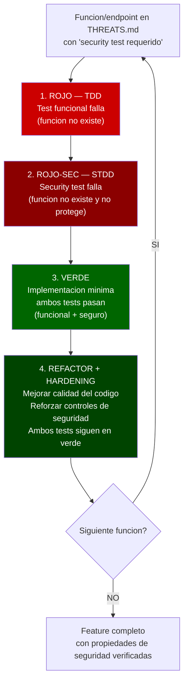
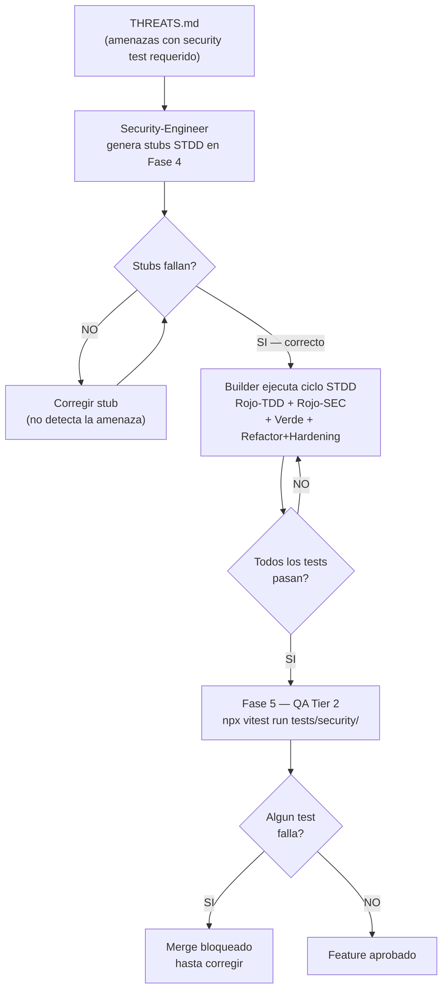

# STDD — Security-Test-Driven Development

**Version:** 1.0 | **Fecha:** 2026-06-04 | **Gobernanza:** Constitucion X-DD v1.5

---

## Indice

1. [Que es STDD en X-DD](#1-que-es-stdd-en-x-dd)
2. [El ciclo STDD extendido](#2-el-ciclo-stdd-extendido)
3. [Mapeo STRIDE a stubs de security tests](#3-mapeo-stride-a-stubs-de-security-tests)
4. [Cuando aplica STDD](#4-cuando-aplica-stdd)
5. [STDD en el pipeline](#5-stdd-en-el-pipeline)
6. [Estructura de tests de seguridad](#6-estructura-de-tests-de-seguridad)
7. [Definition of Done STDD](#7-definition-of-done-stdd)
8. [Agentes involucrados](#8-agentes-involucrados)

---

## 1. Que es STDD en X-DD

Security-Test-Driven Development es la extension de TDD al dominio de la seguridad.
Aplica el mismo principio Rojo-Verde-Refactor pero para casos de prueba que verifican
propiedades de seguridad: que el sistema resiste inyecciones, que la autorizacion funciona
correctamente, que los datos PII no se exponen, y que los controles de seguridad estan
implementados.

En X-DD, STDD extiende el ciclo de la Fase 4 (Build) con un paso adicional de seguridad.
Mientras TDD verifica el comportamiento funcional esperado, STDD verifica que el
comportamiento ante entradas adversariales es correcto.

La fuente de los tests STDD son las amenazas documentadas en THREATS.md. Por cada amenaza
marcada con "security test requerido", el agente `Security-Engineer` genera un stub de
security test antes de que el `Builder` empiece a codificar.

STDD no reemplaza a SecDD (que usa herramientas SAST/DAST). STDD produce tests
programaticos ejecutables por el mismo runner de tests unitarios (Vitest). SecDD ejecuta
herramientas externas de analisis.

---

## 2. El ciclo STDD extendido

El ciclo STDD agrega dos pasos al ciclo TDD estandar:



### Los cuatro pasos en detalle

| Paso | Estado del test | Que se hace |
|------|----------------|-------------|
| 1. ROJO | Test funcional falla | Se escribe el test TDD que describe el comportamiento correcto |
| 2. ROJO-SEC | Security test falla | Se escribe el test STDD que verifica que el comportamiento adversarial es rechazado |
| 3. VERDE | Ambos tests pasan | Se implementa el codigo minimo para que ambos pasen; la implementacion incluye los controles de seguridad |
| 4. REFACTOR + HARDENING | Ambos tests siguen en verde | Se mejora el codigo y se refuerzan los controles sin romper ningun test |

---

## 3. Mapeo STRIDE a stubs de security tests

Los stubs STDD se generan directamente desde el analisis STRIDE de THREATS.md. Por cada
categoria STRIDE con amenazas marcadas "security test requerido", se generan tests
especificos.

| Categoria STRIDE | Tipo de test STDD | Directorio | Ejemplo |
|-----------------|------------------|------------|---------|
| Spoofing (suplantacion) | Tests de autenticacion | `tests/security/auth/` | JWT expirado, token invalido, sesion robada |
| Tampering (manipulacion) | Tests de integridad | `tests/security/audit/` | Modificacion de payload firmado, tamper de logs |
| Repudiation (repudio) | Tests de audit trail | `tests/security/audit/` | Accion sin registro, log truncado |
| Information Disclosure (exposicion) | Tests de confidencialidad | `tests/security/disclosure/` | Respuesta con PII no autorizado, stack trace en prod |
| Denial of Service (denegacion) | Tests de disponibilidad | `tests/security/availability/` | Rate limiting, payload gigante, timeouts |
| Elevation of Privilege (escalada) | Tests de autorizacion | `tests/security/authz/` | RBAC bypass, IDOR, escalada horizontal |

### Estructura de directorios de security tests

```
tests/security/
  injection/        -- SQL, XSS, path traversal, command injection
  auth/             -- JWT spoofing, brute force, token expiry
  authz/            -- RBAC, IDOR, privilege escalation
  disclosure/       -- Error handling, PII exposure, stack traces
  availability/     -- Rate limiting, payload size, timeouts
  audit/            -- Audit log integridad, tamper detection
  transport/        -- TLS enforcement, security headers, CORS
```

### Ejemplo de stub STDD generado desde THR-001

```typescript
// tests/security/authz/feat-001-rbac.security.test.ts
// STDD Stub — THR-001: Escalada de privilegios en exportacion de reportes
// Estado: FAILING BY DESIGN — implementacion RBAC pendiente
// THR: THR-001 (THREATS.md) | SEC-REQ: SEC-REQ-001 (SPEC.md)

import { test, expect } from 'vitest';
import { exportarReportePDF } from '../../src/facturacion/exportar-reporte';
import { crearContextoUsuario } from '../helpers/auth';

test.describe('THR-001 — RBAC en exportacion de reportes', () => {

  test('SEC-REQ-001 — Usuario sin rol "administrador" no puede exportar reportes', async () => {
    const ctx = crearContextoUsuario({ rol: 'operador-lectura' });
    // Debe lanzar AuthorizationError, no retornar el PDF
    await expect(exportarReportePDF('2026-05', ctx)).rejects.toThrow('AuthorizationError');
  });

  test('SEC-REQ-001 — Token expirado es rechazado antes de procesar la solicitud', async () => {
    const ctx = crearContextoUsuario({ rol: 'administrador', tokenExpirado: true });
    await expect(exportarReportePDF('2026-05', ctx)).rejects.toThrow('TokenExpiredError');
  });

  test('SEC-REQ-001 — IDOR: usuario A no puede acceder a reportes del tenant B', async () => {
    const ctxTenantA = crearContextoUsuario({ rol: 'administrador', tenantId: 'tenant-a' });
    // Intento de acceder a datos del tenant-b
    await expect(exportarReportePDF('2026-05', ctxTenantA, { tenantId: 'tenant-b' }))
      .rejects.toThrow('AuthorizationError');
  });

});
```

---

## 4. Cuando aplica STDD

STDD aplica a las funciones y endpoints que tienen amenazas documentadas en THREATS.md
con "security test requerido". No se aplica a todo el codigo.

| Tipo de codigo | Aplica STDD | Razon |
|----------------|------------|-------|
| Autenticacion y manejo de tokens | SI | Alta superficie de ataque; Spoofing directo |
| Endpoints con input externo | SI | Vector de inyeccion SQL, XSS, path traversal |
| Logica de autorizacion (RBAC, IDOR) | SI | Escalada de privilegios directa |
| Funciones con datos PII | SI | Information Disclosure |
| Calculos financieros y pagos | SI | Tampering de montos, doble gasto |
| Integraciones con sistemas externos | SI | Dependencia con superficie de ataque externa |
| Scaffolding y CRUD basico sin logica sensible | NO | Sin amenazas documentadas en THREATS.md |
| Configuracion y scripts de migracion | NO | Sin superficie de ataque interactiva |
| UI puramente visual | NO | Sin logica de seguridad |
| Utilidades internas sin entrada externa | NO | Sin superficie de ataque |

La regla: si la funcion tiene una entrada THR-NNN en THREATS.md con "security test
requerido = SI", entonces STDD es obligatorio.

---

## 5. STDD en el pipeline



### Integracion con los Tiers de QA

| Tier | Que ejecuta | Herramienta | Bloquea merge |
|------|------------|-------------|---------------|
| Tier 2 | Security tests STDD | Vitest | SI |
| Tier 1 | SAST (detecta patrones en codigo estatico) | Semgrep | SI |
| Tier 2 | DAST (ataca la aplicacion en runtime) | OWASP ZAP, Nuclei | SI (en staging) |

Los security tests STDD son el unico tier que verifica propiedades de seguridad
programaticamente. Los otros tiers (SAST, DAST) son responsabilidad de SecDD.

---

## 6. Estructura de tests de seguridad

Cada archivo de security test sigue la convencion de nombres:

```
[dominio]-[amenaza].security.test.ts
```

Ejemplo: `authz-rbac-exportar-reporte.security.test.ts`

### Cabecera obligatoria en todos los security tests

```typescript
// THR: THR-NNN (THREATS.md) — descripcion de la amenaza
// SEC-REQ: SEC-REQ-NNN (SPEC.md) — requisito de seguridad derivado
// STRIDE: [categoria] — categoria STRIDE de la amenaza
// Estado: FAILING BY DESIGN / IMPLEMENTADO
// Autor: Security-Engineer | Revisor: SecOps
```

### Comandos de ejecucion

| Comando | Proposito |
|---------|-----------|
| `npx vitest run tests/security/` | Ejecuta todos los security tests |
| `npx vitest run tests/security/authz/` | Ejecuta tests de autorizacion |
| `npx vitest run tests/security/ --reporter=verbose` | Salida detallada para auditoria |

---

## 7. Definition of Done STDD

| Criterio | Verificacion |
|----------|-------------|
| Cada THR-NNN con "security test requerido = SI" tiene al menos 1 security test | Conteo cruzado THREATS.md vs `tests/security/` |
| Todos los security tests pasan en Fase 5 | `npx vitest run tests/security/` retorna 0 |
| Stubs fallan antes de implementacion (Fase 4 inicio) | Historia de git muestra test en rojo antes del codigo |
| Cada security test referencia su THR-NNN y SEC-REQ-NNN en cabecera | Revision de cabeceras |
| Security tests revisados por SecOps (reviewer != author) | Log del gate de Fase 4 |
| Sin security tests con `skip` sin entrada en lecciones.md | `grep -r 'it.skip' tests/security/` |

---

## 8. Agentes involucrados

| Agente | Rol en STDD |
|--------|-----------|
| `Security-Engineer` | Genera stubs STDD desde THREATS.md antes del ciclo de Build |
| `Builder` | Ejecuta el ciclo STDD para cada funcion marcada en THREATS.md |
| `SecOps` | Revisa los security tests; ejecuta red team manual si aplica |
| `Reviewer` | Verifica que el PR incluye security tests para todas las amenazas criticas |
| `QA-Reviewer` | Ejecuta Tier 2 de security tests en Fase 5 y verifica el resultado |

---

## 9. Fuentes

Respaldo bibliografico de la disciplina (verificadas via `/evol fact-check`).

| Tipo | Fuente | Aporte |
|------|--------|--------|
| Guia de testing | [OWASP Web Security Testing Guide (WSTG)](https://owasp.org/www-project-web-security-testing-guide/) | Catalogo canonico de pruebas de seguridad que alimentan los stubs STDD |
| Verificacion | [OWASP Application Security Verification Standard (ASVS)](https://owasp.org/www-project-application-security-verification-standard/) | Requisitos verificables que se convierten en security tests |
| Riesgos | [OWASP Top 10](https://owasp.org/www-project-top-ten/) | Vectores de riesgo prioritarios para derivar casos de prueba de seguridad |

> **Mantenido por:** Security-Engineer + SecOps
> **Gobernado por:** Constitucion X-DD v1.5, Art. 8
> **Ver tambien:** [SecDD.md](./SecDD.md) | [THREAT-DRIVEN.md](./THREAT-DRIVEN.md) | [TDD.md](./TDD.md) | [INDEX.md](./INDEX.md)
