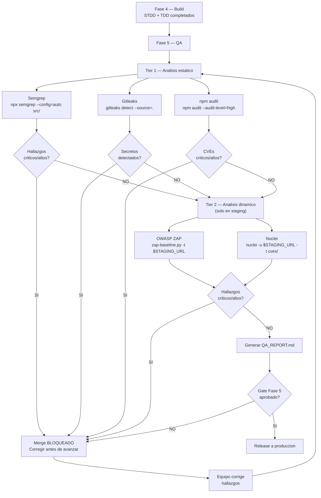

# SecDD — Security-Driven Development

**Version:** 1.0 | **Fecha:** 2026-06-04 | **Gobernanza:** Constitucion X-DD v1.5

---

## Indice

1. [Que es SecDD en X-DD](#1-que-es-secdd-en-x-dd)
2. [Herramientas: SAST, DAST y Secrets scanning](#2-herramientas-sast-dast-y-secrets-scanning)
3. [Requisitos del QA_REPORT.md](#3-requisitos-del-qa_reportmd)
4. [Controles de seguridad obligatorios](#4-controles-de-seguridad-obligatorios)
5. [SecDD en el pipeline](#5-secdd-en-el-pipeline)
6. [Arbol de decision de seguridad](#6-arbol-de-decision-de-seguridad)
7. [Definition of Done SecDD](#7-definition-of-done-secdd)
8. [Agentes involucrados](#8-agentes-involucrados)

---

## 1. Que es SecDD en X-DD

Security-Driven Development es la capa de seguridad automatizada que opera en la Fase 5
(QA). Mientras STDD verifica propiedades de seguridad mediante tests programaticos
escritos por el equipo, SecDD verifica el codigo y la aplicacion en ejecucion usando
herramientas especializadas: analisis estatico (SAST), ataques dinamicos (DAST) y
deteccion de secretos.

SecDD no reemplaza a STDD ni a Threat-Driven. Es la tercera capa de una defensa en
profundidad:

1. Threat-Driven (Fase 2): define que amenazas existen y que controles son obligatorios.
2. STDD (Fase 4): implementa los controles como codigo y los valida con security tests.
3. SecDD (Fase 5): verifica automaticamente que los controles funcionan en runtime y que
   el codigo no tiene vulnerabilidades conocidas.

SecDD es la linea de defensa que detecta lo que los tests unitarios no pueden detectar:
dependencias con CVEs conocidos, secretos hardcodeados en el repositorio, vulnerabilidades
en el codigo que los tests no cubren, y ataques dinamicos sobre la aplicacion desplegada
en staging.

---

## 2. Herramientas: SAST, DAST y Secrets scanning

SecDD usa un conjunto especifico de herramientas. Cada herramienta tiene un rol definido,
opera en un tier especifico y bloquea el merge si encuentra hallazgos criticos.

### Tabla de herramientas SecDD

| Herramienta | Tipo | Tier | Bloquea merge | Instalacion |
|-------------|------|------|---------------|-------------|
| Semgrep | SAST | Tier 1 | SI (critico/alto) | `pip install semgrep` |
| Gitleaks | Secrets | Tier 1 | SI (cualquier secreto) | `brew install gitleaks` o binario |
| npm audit / Trivy | SCA | Tier 1 | SI (critico/alto) | `npm audit` / `docker run aquasec/trivy` |
| OWASP ZAP | DAST | Tier 2 | SI (en staging) | `docker run owasp/zap2docker-stable` |
| Nuclei | DAST | Tier 2 | SI (en staging) | `go install github.com/projectdiscovery/nuclei/v2/cmd/nuclei@latest` |

### SAST — Analisis estatico de codigo

SAST (Static Application Security Testing) analiza el codigo fuente sin ejecutarlo.
Detecta patrones de vulnerabilidades conocidas: inyecciones SQL, XSS, rutas de acceso
no sanitizadas, uso de funciones peligrosas.

```bash
# Ejecucion en Tier 1
npx semgrep --config=auto src/
npx semgrep --config=p/owasp-top-ten src/
npx semgrep --config=p/jwt src/
```

### Secrets scanning — Deteccion de secretos

Detecta credenciales, tokens y secretos hardcodeados en el repositorio. Bloquea
inmediatamente cualquier hallazgo porque un secreto comprometido en el historial de
git es un incidente de seguridad aunque se "borre" despues.

```bash
# Ejecucion en Tier 1
gitleaks detect --source=. --verbose
gitleaks detect --source=. --log-opts="--all" # Escanea TODO el historial
```

### SCA — Analisis de composicion de software

SCA (Software Composition Analysis) analiza las dependencias del proyecto en busca de
versiones con CVEs conocidos.

```bash
# Ejecucion en Tier 1
npm audit --audit-level=high
# Para contenedores
docker run aquasec/trivy image [nombre-imagen]:latest
```

### DAST — Analisis dinamico (staging)

DAST (Dynamic Application Security Testing) ataca la aplicacion en ejecucion como lo
haria un atacante real. Opera solo contra entornos de staging, nunca contra produccion.

```bash
# OWASP ZAP — baseline scan
docker run -t owasp/zap2docker-stable zap-baseline.py -t $STAGING_URL

# Nuclei — templates de vulnerabilidades conocidas
nuclei -u $STAGING_URL -t cves/ -t vulnerabilities/ -t exposures/
```

---

## 3. Requisitos del QA_REPORT.md

El `QA_REPORT.md` es el artefacto principal de SecDD. Reside en `.evol/qa/QA_REPORT.md`
y contiene los resultados de todas las herramientas SecDD ejecutadas en la Fase 5.

### Estructura obligatoria de QA_REPORT.md

| Seccion | Contenido |
|---------|-----------|
| Resumen ejecutivo | Estado general: APROBADO / RECHAZADO + fecha |
| Resultados SAST | Hallazgos Semgrep por severidad; 0 criticos/altos para aprobar |
| Resultados Secrets | Resultado Gitleaks; cualquier hallazgo es bloqueante |
| Resultados SCA | CVEs en dependencias; 0 criticos/altos para aprobar |
| Resultados DAST | Hallazgos ZAP y Nuclei; 0 criticos/altos para aprobar en staging |
| Hallazgos abiertos | Tabla: ID, herramienta, severidad, descripcion, estado, owner |
| Hallazgos aceptados | Tabla: ID, razon de aceptacion, aprobado por, fecha de revision |

### Criterio de aprobacion de QA_REPORT.md

Un QA_REPORT.md se considera APROBADO cuando cumple todas las siguientes condiciones:

| Condicion | Valor aceptable |
|-----------|----------------|
| Hallazgos SAST criticos o altos | 0 |
| Secretos detectados por Gitleaks | 0 |
| CVEs criticos o altos en dependencias | 0 |
| Hallazgos DAST criticos o altos (staging) | 0 |
| Hallazgos medios sin plan de remedacion | 0 |
| Hallazgos bajos | Aceptables con documentacion |

---

## 4. Controles de seguridad obligatorios

Independientemente del perfil de riesgo del proyecto, ciertos controles son obligatorios
en todos los proyectos X-DD.

### Controles de Tier 1 — Todos los proyectos

| Control | Herramienta | Frecuencia | Bloquea |
|---------|-------------|-----------|---------|
| Analisis estatico de codigo | Semgrep | Cada PR | SI (critico/alto) |
| Deteccion de secretos | Gitleaks | Cada commit y PR | SI (cualquier hallazgo) |
| Auditoria de dependencias | npm audit | Cada PR y semanal | SI (critico/alto) |

### Controles de Tier 2 — Proyectos con datos de usuarios o pagos

| Control | Herramienta | Frecuencia | Bloquea |
|---------|-------------|-----------|---------|
| Baseline DAST | OWASP ZAP | Antes de cada release | SI (critico/alto en staging) |
| Templates de vulnerabilidades | Nuclei | Antes de cada release | SI (critico/alto en staging) |
| Security tests STDD | Vitest | Cada PR | SI (cualquier fallo) |

### Controles de Tier 3 — Proyectos criticos

| Control | Herramienta | Frecuencia | Bloquea |
|---------|-------------|-----------|---------|
| Red Team ofensivo | SecOps + /advanced-agentic-pentesting | Antes de release a produccion | Manual |
| Auditoria de contenedores | Trivy | Antes de cada deploy | SI (critico/alto) |

---

## 5. SecDD en el pipeline



---

## 6. Arbol de decision de seguridad

La profundidad de SecDD depende del perfil del proyecto. El arbol de decision determina
que herramientas son obligatorias.

```
Pregunta 1: El proyecto maneja datos de usuarios, pagos o infraestructura critica?
  |
  +-- SI --> Camino COMPLETO
  |          Tier 1: Semgrep + Gitleaks + npm audit
  |          Tier 2: OWASP ZAP + Nuclei + STDD tests
  |          Tier 3: SecOps Red Team antes de cada release a produccion
  |
  +-- NO --> Pregunta 2: El proyecto es de acceso publico (API, web app)?
               |
               +-- SI --> Camino ESTANDAR
               |          Tier 1: Semgrep + Gitleaks + npm audit
               |          Tier 2: OWASP ZAP baseline
               |
               +-- NO --> Camino MINIMO
                          Tier 1: Semgrep + Gitleaks solamente
```

---

## 7. Definition of Done SecDD

| Criterio | Verificacion |
|----------|-------------|
| Semgrep ejecutado sin hallazgos criticos/altos | `npx semgrep --config=auto src/` retorna 0 |
| Gitleaks ejecutado sin secretos detectados | `gitleaks detect --source=.` retorna 0 |
| npm audit sin CVEs criticos/altos | `npm audit --audit-level=high` retorna 0 |
| ZAP baseline ejecutado en staging (si aplica) | Log de CI muestra ejecucion exitosa |
| QA_REPORT.md generado en `.evol/qa/QA_REPORT.md` | `test -f .evol/qa/QA_REPORT.md` |
| QA_REPORT.md tiene estado APROBADO | Verificacion de contenido del archivo |
| Todos los hallazgos medios tienen plan de remedacion | Seccion "Hallazgos abiertos" en QA_REPORT.md |
| Revisor de seguridad != autor del codigo | Log del gate de Fase 5 |

---

## 8. Agentes involucrados

| Agente | Rol en SecDD |
|--------|-------------|
| `SecOps` | Ejecuta las herramientas SecDD; interpreta los hallazgos; produce QA_REPORT.md |
| `Reviewer` | Verifica que los hallazgos criticos/altos esten corregidos antes del merge |
| `Builder` | Corrige los hallazgos reportados por las herramientas SecDD |
| `QA-Reviewer` | Coordina la ejecucion del Tier 1 y Tier 2 en el pipeline de QA |
| `Orchestrator` | Integra SecDD en el gate de Fase 5; rechaza si QA_REPORT.md no esta APROBADO |

---

## 9. Fuentes

Respaldo bibliografico de la disciplina (verificadas via `/evol fact-check`).

| Tipo | Fuente | Aporte |
|------|--------|--------|
| Modelo de madurez | [OWASP SAMM — Software Assurance Maturity Model](https://owaspsamm.org/) | Marco para integrar practicas de seguridad a lo largo del SDLC |
| DevSecOps | [OWASP DevSecOps Guideline](https://owasp.org/www-project-devsecops-guideline/) | Como embeber SAST/DAST/SCA en el pipeline de CI/CD |
| Verificacion | [OWASP ASVS](https://owasp.org/www-project-application-security-verification-standard/) | Estandar de verificacion que define el "APROBADO" del QA_REPORT |

> **Mantenido por:** SecOps + QA-Reviewer
> **Gobernado por:** Constitucion X-DD v1.5, Art. 2
> **Ver tambien:** [STDD.md](./STDD.md) | [THREAT-DRIVEN.md](./THREAT-DRIVEN.md) | [INDEX.md](./INDEX.md)
