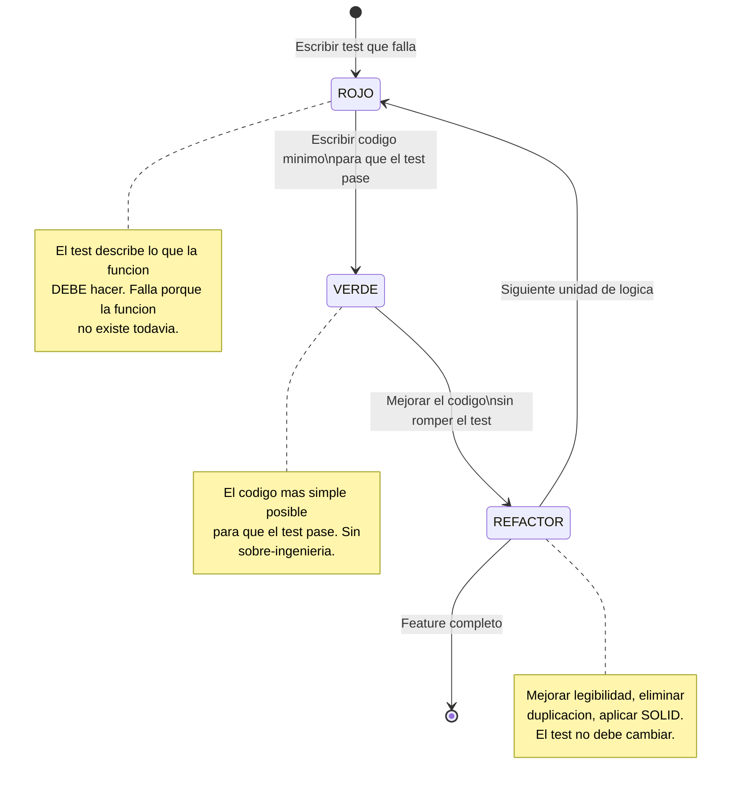
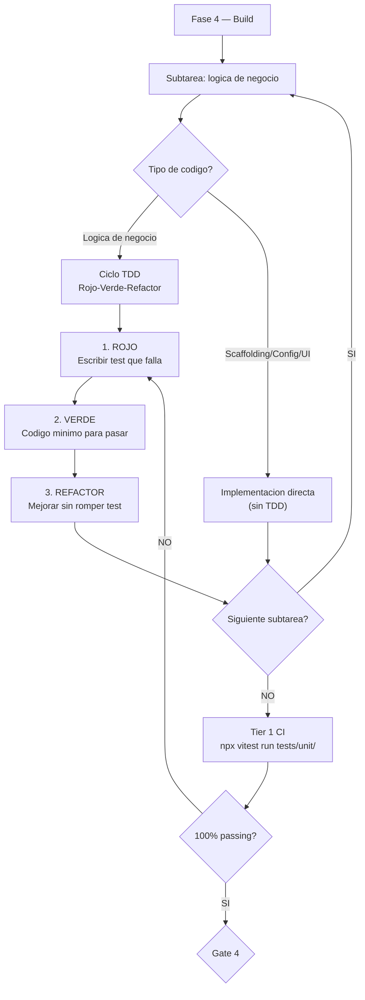

# TDD — Test-Driven Development

**Version:** 1.0 | **Fecha:** 2026-06-04 | **Gobernanza:** Constitucion X-DD v1.5

---

## Indice

1. [Que es TDD en X-DD](#1-que-es-tdd-en-x-dd)
2. [El ciclo Rojo-Verde-Refactor](#2-el-ciclo-rojo-verde-refactor)
3. [Cuando aplica TDD y cuando no](#3-cuando-aplica-tdd-y-cuando-no)
4. [TDD en el pipeline](#4-tdd-en-el-pipeline)
5. [Mandato constitucional — Art. 8](#5-mandato-constitucional--art-8)
6. [Estructura de tests unitarios](#6-estructura-de-tests-unitarios)
7. [Definition of Done TDD](#7-definition-of-done-tdd)
8. [Agentes involucrados](#8-agentes-involucrados)

---

## 1. Que es TDD en X-DD

Test-Driven Development es la disciplina que invierte el orden natural de desarrollo:
en lugar de escribir codigo y luego escribir tests para verificarlo, se escribe primero
el test que describe el comportamiento deseado, y luego el codigo minimo para que ese
test pase.

En X-DD, TDD se activa exclusivamente durante la Fase 4 (Build) y aplica a toda logica
de negocio. Es la disciplina que mas impacto operativo tiene en el flujo de trabajo del
`Builder`, porque cambia el ritmo de cada sesion de programacion.

El principio de TDD en X-DD no es "escribir mas tests". Es que el test sea la primera
especificacion ejecutable de una funcion antes de que exista. Si no puedes escribir un
test que describa el comportamiento, no tienes una especificacion suficientemente clara.

TDD en X-DD es un mandato constitucional (Art. 8) para toda logica de negocio. No es
opcional ni una recomendacion.

---

## 2. El ciclo Rojo-Verde-Refactor

El ciclo TDD tiene exactamente tres pasos que se repiten por cada unidad de logica:



### Descripcion detallada de cada paso

**Paso 1 — ROJO:** Se escribe un test que describe exactamente lo que la funcion debe
hacer. El test falla porque la funcion no existe. Si el test pasa sin implementacion,
el test esta mal escrito.

**Paso 2 — VERDE:** Se escribe el codigo mas simple posible para que el test pase. No se
escribe codigo para el futuro. No se anticipa. Solo el minimo para verde.

**Paso 3 — REFACTOR:** Se mejora la calidad del codigo: eliminar duplicacion, mejorar
nombres, aplicar principios SOLID. El test no cambia. Si el test falla durante el
refactor, se revierto y se intenta de nuevo.

### Ejemplo del ciclo para una funcion de dominio

```typescript
// PASO 1 — ROJO
// tests/unit/facturacion/calcular-total.test.ts
describe('calcularTotalPeriodo', () => {
  it('retorna la suma de los subtotales de todas las lineas', () => {
    const lineas = [
      { subtotal: 100 },
      { subtotal: 250 },
      { subtotal: 75 },
    ];
    // Esta linea falla: calcularTotalPeriodo no existe todavia
    expect(calcularTotalPeriodo(lineas)).toBe(425);
  });
});

// PASO 2 — VERDE
// src/facturacion/calcular-total.ts
export function calcularTotalPeriodo(lineas: { subtotal: number }[]): number {
  return lineas.reduce((acc, linea) => acc + linea.subtotal, 0);
}

// PASO 3 — REFACTOR
// Agregar validacion de invariante de dominio y tipo fuerte
import { LineaFactura, Monto } from '../domain/factura';

export function calcularTotalPeriodo(lineas: LineaFactura[]): Monto {
  const total = lineas.reduce((acc, linea) => acc + linea.subtotal.valor, 0);
  if (total < 0) throw new DomainError('El total del periodo no puede ser negativo');
  return new Monto(total, lineas[0]?.subtotal.moneda ?? 'USD');
}
```

---

## 3. Cuando aplica TDD y cuando no

TDD no aplica a todo el codigo. Aplicarlo a scaffolding o configuracion produce tests
fragiles y de poco valor. La regla es: TDD aplica cuando hay logica de negocio.

### Tabla de aplicabilidad

| Tipo de codigo | Aplica TDD | Razon |
|----------------|-----------|-------|
| Logica de negocio (calculos, reglas) | SI | Especificacion ejecutable del comportamiento |
| Transformaciones de datos | SI | El test documenta las transformaciones esperadas |
| Algoritmos de dominio | SI | La complejidad hace que el test sea la guia |
| Validaciones de dominio | SI | Las reglas de negocio deben ser verificables |
| Reglas de autorizacion | SI | Critico: el test documenta quien puede hacer que |
| Scaffolding (rutas basicas, modelos ORM) | NO | No hay logica; los tests serian tautologicos |
| Configuracion (env, docker-compose) | NO | No tiene comportamiento verificable por tests unitarios |
| UI puramente visual (sin logica) | NO | Los tests de componentes visuales son fragiles |
| Integraciones externas | NO | Se mockean; TDD no aplica al mock |
| Migraciones de base de datos | NO | Se verifican con tests de integracion, no unitarios |

La regla practica: si no puedes escribir el test antes del codigo, probablemente no es
logica de negocio y TDD no aplica.

---

## 4. TDD en el pipeline

TDD opera exclusivamente en la Fase 4 (Build). Su integracion con el workflow `/xdd-build`
significa que por cada subtarea de tipo "logica de negocio", el `Builder` ejecuta el ciclo
Rojo-Verde-Refactor antes de avanzar a la siguiente subtarea.



### Integracion con el gate de Fase 4

El gate de la Fase 4 verifica que los tests unitarios TDD esten en verde antes de avanzar
a la Fase 5. Este es un requisito no negociable.

| Condicion del gate | Resultado |
|-------------------|-----------|
| `tests/unit/` existe y todos los tests pasan | Gate de Fase 4 se puede abrir |
| `tests/unit/` vacio o inexistente para logica de negocio | Gate bloqueado |
| Alguna funcion de logica de negocio sin test unitario | Gate bloqueado (Art. 8) |
| Tests en rojo | Gate bloqueado |

---

## 5. Mandato constitucional — Art. 8

La Constitucion X-DD v1.5 establece en su Articulo 8:

> Todo codigo que implemente logica de negocio, transformaciones de datos o reglas de
> dominio se escribe siguiendo el ciclo TDD (Rojo-Verde-Refactor). El codigo de produccion
> no puede existir sin su test unitario previo.

Este articulo tiene las siguientes excepciones documentadas:

| Excepcion | Condicion para aplicar |
|-----------|----------------------|
| Bugfix de menos de 10 lineas | El bug tiene un test de regresion que demuestra el fallo |
| Prototipo exploratorio | Marcado explicitamente como prototipo; se descarta o se retro-testea |
| Codigo generado por herramienta | El generador tiene sus propios tests |

Fuera de estas excepciones, el Art. 8 no admite bypass. El `Reviewer` rechaza cualquier
PR que tenga logica de negocio sin test unitario previo.

---

## 6. Estructura de tests unitarios

Los tests unitarios TDD residen en `tests/unit/` y replican la estructura de `src/`.

```
tests/unit/
  facturacion/
    calcular-total.test.ts       -- Teste para src/facturacion/calcular-total.ts
    validar-periodo.test.ts      -- Test para src/facturacion/validar-periodo.ts
  usuarios/
    verificar-autorizacion.test.ts
  common/
    transformar-moneda.test.ts
```

### Convencion de nombres

| Archivo fuente | Archivo de test |
|----------------|-----------------|
| `src/facturacion/calcular-total.ts` | `tests/unit/facturacion/calcular-total.test.ts` |
| `src/usuarios/revocar-acceso.ts` | `tests/unit/usuarios/revocar-acceso.test.ts` |

### Estructura minima de un test unitario TDD

```typescript
// Cabecera obligatoria
// REQ: REQ-001 (SPEC.md) — Calcular total del periodo de facturacion
// FEAT: FEAT-001 (FEATURES.md)
// Autor: Builder | Revisor: Reviewer

import { describe, it, expect } from 'vitest';
import { calcularTotalPeriodo } from '../../src/facturacion/calcular-total';

describe('calcularTotalPeriodo', () => {

  it('retorna la suma de subtotales de N lineas', () => { /* ... */ });

  it('retorna 0 para un array vacio de lineas', () => { /* ... */ });

  it('lanza DomainError si el total resulta negativo', () => { /* ... */ });

  it('preserva la moneda de la primera linea en el resultado', () => { /* ... */ });

});
```

### Comandos de ejecucion

| Comando | Proposito |
|---------|-----------|
| `npx vitest run tests/unit/` | Ejecuta todos los tests unitarios |
| `npx vitest run tests/unit/facturacion/` | Ejecuta tests de un modulo |
| `npx vitest --coverage` | Genera reporte de cobertura |
| `npx vitest watch` | Modo watch para ciclo TDD interactivo |

---

## 7. Definition of Done TDD

| Criterio | Verificacion |
|----------|-------------|
| Todo archivo en `src/` con logica de negocio tiene su par en `tests/unit/` | `diff <(find src -name '*.ts') <(find tests/unit -name '*.test.ts' -exec ... \;)` |
| 100% de tests unitarios en verde | `npx vitest run tests/unit/` retorna 0 |
| El test se escribio antes que el codigo | Verificable en el historial de git |
| Cada test referencia REQ-NNN en cabecera | Revision de cabeceras |
| Cobertura de ramas >= 80% en modulos de dominio | Reporte de cobertura |
| Sin tests que usen `skip` o `todo` sin justificacion | `grep -r 'it.skip\|it.todo' tests/unit/` |

---

## 8. Agentes involucrados

| Agente | Rol en TDD |
|--------|-----------|
| `Builder` | Ejecuta el ciclo Rojo-Verde-Refactor para toda logica de negocio |
| `Reviewer` | Verifica que el PR no contiene logica sin test previo; rechaza si viola Art. 8 |
| `Orchestrator` | Coordina el ciclo TDD con el workflow `/xdd-build` |
| `QA-Reviewer` | Ejecuta el Tier 1 (tests unitarios) y verifica la cobertura en Fase 5 |

---

> **Mantenido por:** Builder + Reviewer
> **Gobernado por:** Constitucion X-DD v1.5, Art. 8
> **Ver tambien:** [STDD.md](./STDD.md) | [ATDD.md](./ATDD.md) | [INDEX.md](./INDEX.md)
